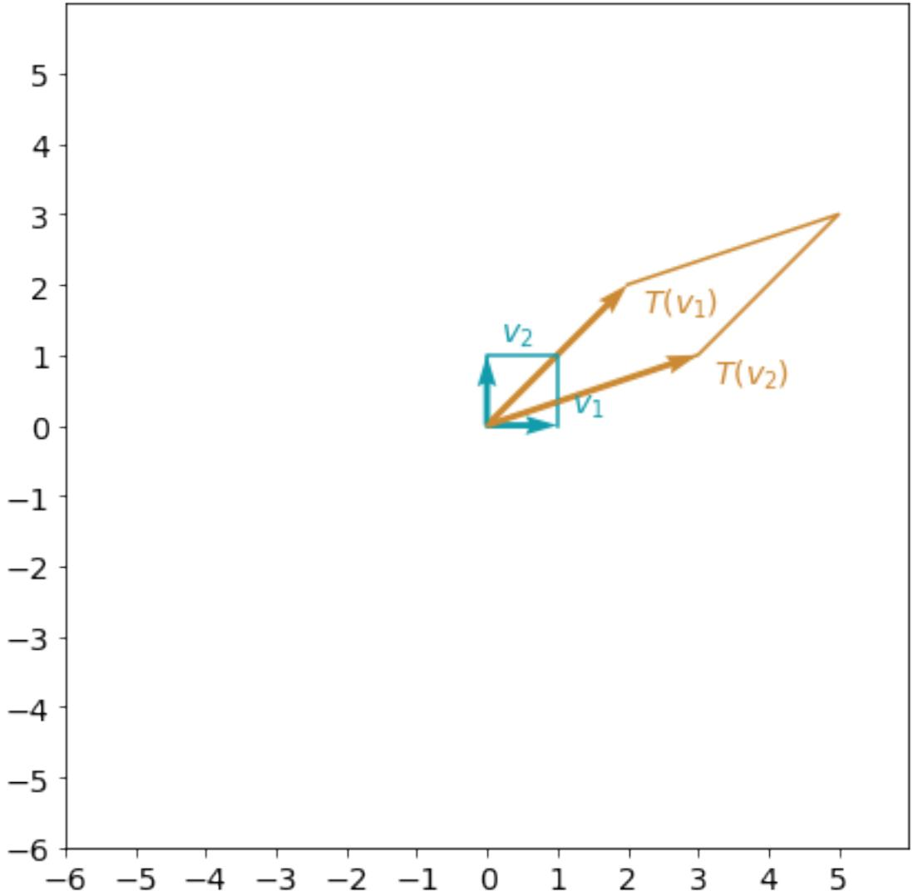
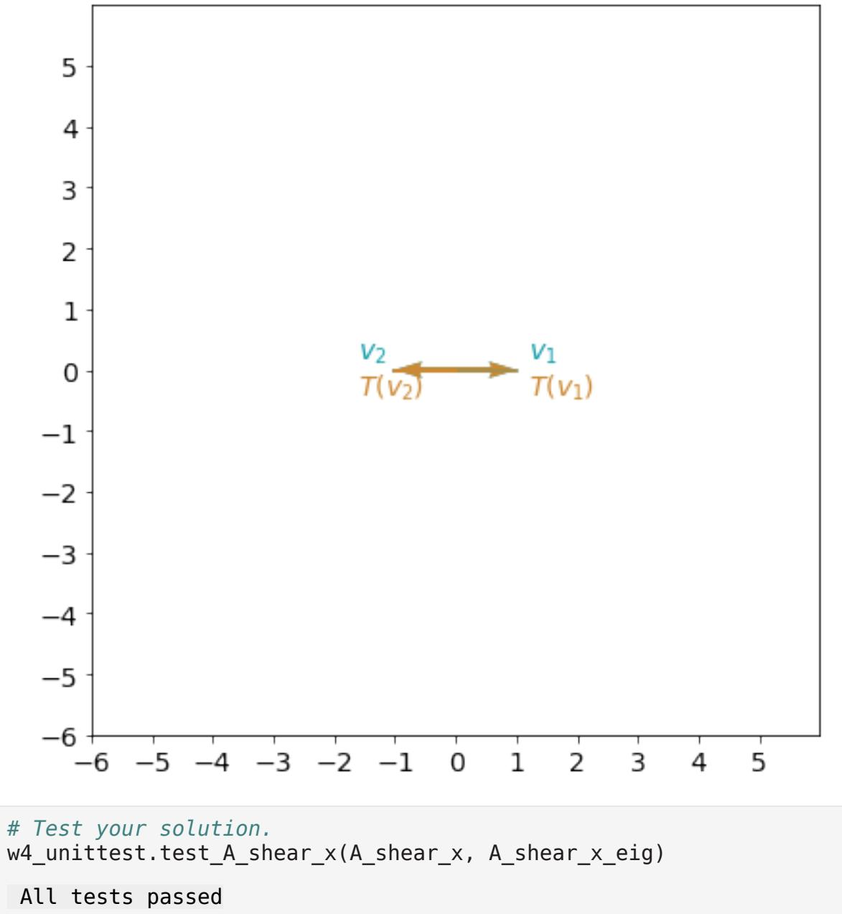

# Matrix Operations and Transformations

## Project Description
This module covers advanced matrix operations and linear transformations, with a focus on eigenvalues and eigenvectors. Students will learn to implement and visualize various matrix transformations and apply them to real-world problems like webpage navigation modeling.

## Learning Outcomes
- Master matrix operations and their properties
- Understand and implement linear transformations
- Calculate and interpret eigenvalues and eigenvectors
- Apply matrix concepts to webpage navigation problems
- Visualize matrix transformations in 2D space

## Implementation Guide

### Prerequisites
- NumPy for matrix operations
- Matplotlib for visualization
- Custom unittest modules for validation

### 1. Eigenvalues and Eigenvectors

#### Definition and Interpretation
For a linear transformation A, if Av = λv:
- v is called an **eigenvector**
- λ is called an **eigenvalue**
- For any k ≠ 0, if v is an eigenvector, kv is also an eigenvector with the same eigenvalue

Example transformation A = [[2, 3], [2, 1]]:



#### Finding Eigenvalues and Eigenvectors
```python
# Using NumPy's eig function
eigenvals, eigenvecs = np.linalg.eig(A)
```

### 2. Standard Transformations Study

#### 1. Reflection about y-axis
```python
A_reflection = np.array([[-1, 0],
                        [0, 1]])
```


#### 2. Shear Transformation
```python
A_shear = np.array([[1, 0.5],
                    [0, 1]])
```


#### 3. Special Cases
- **Rotation (90°)**: No real eigenvalues
  ```python
  A_rotation = np.array([[0, 1],
                        [-1, 0]])
  # Results in complex eigenvalues
  ```
- **Identity Matrix**: All vectors are eigenvectors
- **Scaling**: Multiple identical eigenvalues
- **Projection**: Can have zero eigenvalues

### 3. Application: Webpage Navigation Model

#### Markov Chain Implementation
A discrete dynamical system modeling web browsing patterns:
- State vector Xt: probabilities of being on each page
- Transition matrix P: navigation probabilities between pages
- Properties:
  - Main diagonal elements = 0
  - Column sums = 1 (Markov matrix)
  - Has eigenvalue = 1

```python
# Example 5-page navigation model
P = np.array([
    [0, 0.75, 0.35, 0.25, 0.85],
    [0.15, 0, 0.35, 0.25, 0.05],
    [0.15, 0.15, 0, 0.25, 0.05],
    [0.15, 0.05, 0.05, 0, 0.05],
    [0.55, 0.05, 0.25, 0.25, 0]
])
```

#### Long-term Behavior Analysis
1. Initial state: X0 (starting page)
2. State transitions: Xt = P × Xt-1
3. Steady state: eigenvector of eigenvalue 1
4. Interpretation: long-term probability distribution of page visits

This model forms the foundation of Google's PageRank algorithm.

## References
- [NumPy Linear Algebra Guide](https://numpy.org/doc/stable/reference/routines.linalg.html)
- [3Blue1Brown - Linear Transformations](https://www.youtube.com/watch?v=kYB8IZa5AuE)
- [MIT Linear Algebra Lecture on Eigenvalues](https://ocw.mit.edu/courses/18-06-linear-algebra-spring-2010/resources/lecture-21-eigenvalues-and-eigenvectors/)
- [The PageRank Algorithm](https://www.cs.princeton.edu/~chazelle/courses/BIB/pagerank.htm)