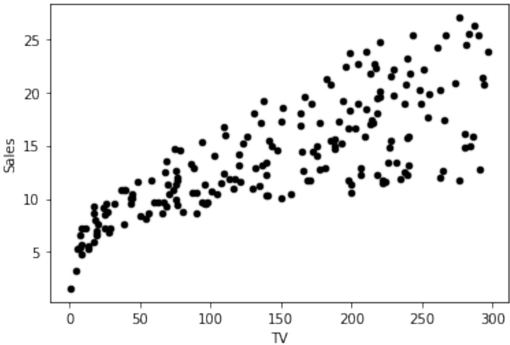
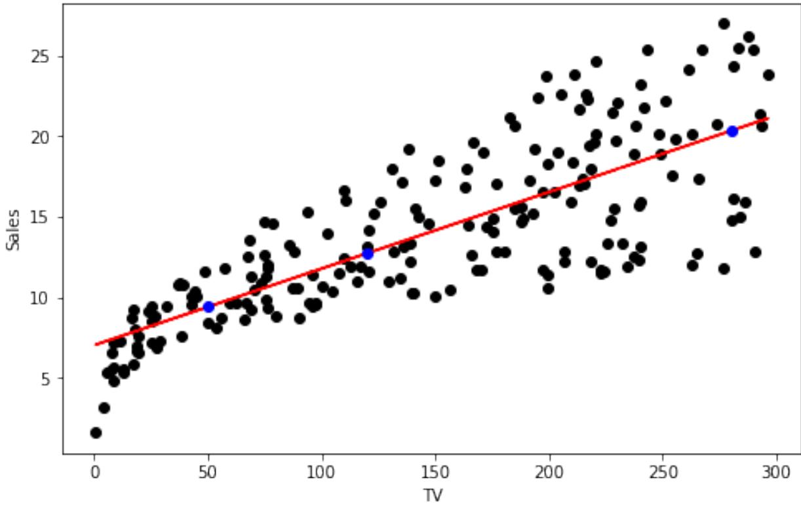

# Optimization Using Gradient Descent: Linear Regression

In this assignment, you will build a simple linear regression model to predict sales based on TV marketing expenses. You will investigate three different approaches to this problem. You will use NumPy and Scikit-Learn linear regression models, as well as construct and optimize the sum of squares cost function with gradient descent from scratch.

# Table of Contents

- 1 Open the Dataset and State the Problem – Exercise 1
- 2 Linear Regression in Python with NumPy and Scikit-Learn – 2.1 - Linear Regression with NumPy
	- Exercise 2
	- 2.2 Linear Regression with Scikit-Learn
		- Exercise 3
		- Exercise 4
- 3 Linear Regression using Gradient Descent
	- Exercise 5
	- Exercise 6

# Packages

Load the required packages:

```
import numpy as np
# A library for programmatic plot generation.
import matplotlib.pyplot as plt
# A library for data manipulation and analysis.
import pandas as pd
# LinearRegression from sklearn.
from sklearn.linear_model import LinearRegression
```
Import the unit tests defined for this notebook.

import w2_unittest

# 1 - Open the Dataset and State the Problem

In this lab, you will build a linear regression model for a simple Kaggle dataset, saved in a file data/tvmarketing.csv. The dataset has only two fields: TV marketing expenses (TV) and sales amount (Sales).

### Exercise 1

Use pandas function pd.read_csv to open the .csv file the from the path.

```
path = "data/tvmarketing.csv"
### START CODE HERE ### (~ 1 line of code)
adv = pd.read_csv(path)
### END CODE HERE ###
# Print some part of the dataset.
adv.head()
 TV Sales
0 230.1 22.1
1 44.5 10.4
2 17.2 9.3
3 151.5 18.5
4 180.8 12.9
```
#### **Expected Output**

| TV |  | Sales |
| --- | --- | --- |
| 0 | 230.1 | 22.1 |
| 1 | 44.5 | 10.4 |
| 2 | 17.2 | 9.3 |
| 3 | 151.5 | 18.5 |
| 4 | 180.8 | 12.9 |
| w2_unittest.test_load_data(adv) |  |  |
| All tests passed |  |  |

pandas has a function to make plots from the DataFrame fields. By default, matplotlib is used at the backend. Let's use it here:

adv.plot(x='TV', y='Sales', kind='scatter', c='black')

<AxesSubplot: xlabel='TV', ylabel='Sales'>



You can use this dataset to solve a simple problem with linear regression: given a TV marketing budget, predict sales.

# 2 - Linear Regression in Python with NumPy and Scikit-Learn

Save the required field of the DataFrame into variables X and Y:

X = adv['TV'] Y = adv['Sales']

# 2.1 - Linear Regression with NumPy

You can use the function np.polyfit(x, y, deg) to fit a polynomial of degree deg to points ( x , y ), minimising the sum of squared errors. You can read more in the documentation. Taking deg = 1 you can obtain the slope m and the intercept b of the linear regression line:

m_numpy, b_numpy = np.polyfit(X, Y, 1)

print(f"Linear regression with NumPy. Slope: {m_numpy}. Intercept: {b_numpy}")

Linear regression with NumPy. Slope: 0.04753664043301978. Intercept: 7.032593549127698

Note: NumPy documentation suggests the Polynomial.fit class method as recommended for new code as it is more stable numerically. But in this simple example, you can stick to the np.polyfit function for simplicity.

### Exercise 2

Make predictions substituting the obtained slope and intercept coefficients into the equation Y=m X+b, given an array of X values.

```
# This is organised as a function only for grading purposes.
def pred_numpy(m, b, X):
 ### START CODE HERE ### (~ 1 line of code)
 Y = m*X+b
 ### END CODE HERE ###
 
 return Y
X_pred = np.array([50, 120, 280])
Y_pred_numpy = pred_numpy(m_numpy, b_numpy, X_pred)
print(f"TV marketing expenses:\n{X_pred}")
print(f"Predictions of sales using NumPy linear regression:\
n{Y_pred_numpy}")
TV marketing expenses:
[ 50 120 280]
Predictions of sales using NumPy linear regression:
[ 9.40942557 12.7369904 20.34285287]
Expected Output
```
TV marketing expenses: [ 50 120 280] Predictions of sales using NumPy linear regression: [ 9.40942557 12.7369904 20.34285287]

w2_unittest.test_pred_numpy(pred_numpy)

All tests passed

# 2.2 - Linear Regression with Scikit-Learn

Scikit-Learn is an open-source machine learning library that supports supervised and unsupervised learning. It also provides various tools for model fitting, data preprocessing, model selection, model evaluation, and many other utilities. Scikit-learn provides dozens of builtin machine learning algorithms and models, called **estimators**. Each estimator can be fitted to some data using its fit method. Full documentation can be found here.

Create an estimator object for a linear regression model:

lr_sklearn = LinearRegression()

The estimator can learn from data calling the fit function. However, trying to run the following code you will get an error, as the data needs to be reshaped into 2D array:

```
print(f"Shape of X array: {X.shape}")
print(f"Shape of Y array: {Y.shape}")
try:
 lr_sklearn.fit(X, Y)
except ValueError as err:
 print(err)
Shape of X array: (200,)
Shape of Y array: (200,)
Expected 2D array, got 1D array instead:
array=[230.1 44.5 17.2 151.5 180.8 8.7 57.5 120.2 8.6 199.8 
66.1 214.7
 23.8 97.5 204.1 195.4 67.8 281.4 69.2 147.3 218.4 237.4 13.2 
228.3
 62.3 262.9 142.9 240.1 248.8 70.6 292.9 112.9 97.2 265.6 95.7 
290.7
 266.9 74.7 43.1 228. 202.5 177. 293.6 206.9 25.1 175.1 89.7 
239.9
 227.2 66.9 199.8 100.4 216.4 182.6 262.7 198.9 7.3 136.2 210.8 
210.7
 53.5 261.3 239.3 102.7 131.1 69. 31.5 139.3 237.4 216.8 199.1 
109.8
 26.8 129.4 213.4 16.9 27.5 120.5 5.4 116. 76.4 239.8 75.3 
68.4
 213.5 193.2 76.3 110.7 88.3 109.8 134.3 28.6 217.7 250.9 107.4 
163.3
 197.6 184.9 289.7 135.2 222.4 296.4 280.2 187.9 238.2 137.9 25. 
90.4
 13.1 255.4 225.8 241.7 175.7 209.6 78.2 75.1 139.2 76.4 125.7 
19.4
 141.3 18.8 224. 123.1 229.5 87.2 7.8 80.2 220.3 59.6 0.7 
265.2
 8.4 219.8 36.9 48.3 25.6 273.7 43. 184.9 73.4 193.7 220.5 
104.6
 96.2 140.3 240.1 243.2 38. 44.7 280.7 121. 197.6 171.3 187.8 
4.1
 93.9 149.8 11.7 131.7 172.5 85.7 188.4 163.5 117.2 234.5 17.9 
206.8
 215.4 284.3 50. 164.5 19.6 168.4 222.4 276.9 248.4 170.2 276.7 
165.6
 156.6 218.5 56.2 287.6 253.8 205. 139.5 191.1 286. 18.7 39.5
```
75.5 17.2 166.8 149.7 38.2 94.2 177. 283.6 232.1]. Reshape your data either using array.reshape(-1, 1) if your data has a single feature or array.reshape(1, -1) if it contains a single sample.

You can increase the dimension of the array by one with reshape function, or there is another another way to do it:

```
X_sklearn = X[:, np.newaxis]
Y_sklearn = Y[:, np.newaxis]
print(f"Shape of new X array: {X_sklearn.shape}")
print(f"Shape of new Y array: {Y_sklearn.shape}")
Shape of new X array: (200, 1)
Shape of new Y array: (200, 1)
```
## Exercise 3

Fit the linear regression model passing X_sklearn and Y_sklearn arrays into the function lr_sklearn.fit.

```
### START CODE HERE ### (~ 1 line of code)
lr_sklearn.fit(X_sklearn, Y_sklearn)
### END CODE HERE ###
LinearRegression(copy_X=True, fit_intercept=True, n_jobs=None, 
normalize=False)
m_sklearn = lr_sklearn.coef_
b_sklearn = lr_sklearn.intercept_
print(f"Linear regression using Scikit-Learn. Slope: {m_sklearn}. 
Intercept: {b_sklearn}")
Linear regression using Scikit-Learn. Slope: [[0.04753664]]. 
Intercept: [7.03259355]
```
### **Expected Output**

```
Linear regression using Scikit-Learn. Slope: [[0.04753664]]. 
Intercept: [7.03259355]
w2_unittest.test_sklearn_fit(lr_sklearn)
```
All tests passed

Note that you have got the same result as with the NumPy function polyfit. Now, to make predictions it is convenient to use Scikit-Learn function predict.

### Exercise 4

Increase the dimension of the X array using the function np.newaxis (see an example above) and pass the result to the lr_sklearn.predict function to make predictions.

```
# This is organised as a function only for grading purposes.
def pred_sklearn(X, lr_sklearn):
 ### START CODE HERE ### (~ 2 lines of code)
 X_2D = X[:, np.newaxis]
 Y = lr_sklearn.predict(X_2D)
 ### END CODE HERE ###
 
 return Y
Y_pred_sklearn = pred_sklearn(X_pred, lr_sklearn)
print(f"TV marketing expenses:\n{X_pred}")
print(f"Predictions of sales using Scikit_Learn linear regression:\
n{Y_pred_sklearn.T}")
TV marketing expenses:
[ 50 120 280]
Predictions of sales using Scikit_Learn linear regression:
[[ 9.40942557 12.7369904 20.34285287]]
```
#### **Expected Output**

```
TV marketing expenses:
[ 50 120 280]
Predictions of sales using Scikit_Learn linear regression:
[[ 9.40942557 12.7369904 20.34285287]]
w2_unittest.test_sklearn_predict(pred_sklearn, lr_sklearn)
 All tests passed
```
You can plot the linear regression line and the predictions by running the following code. The regression line is red and the predicted points are blue.

```
fig, ax = plt.subplots(1,1,figsize=(8,5))
ax.plot(X, Y, 'o', color='black')
ax.set_xlabel('TV')
ax.set_ylabel('Sales')
ax.plot(X, m_sklearn[0][0]*X+b_sklearn[0], color='red')
ax.plot(X_pred, Y_pred_sklearn, 'o', color='blue')
[<matplotlib.lines.Line2D at 0x7f99552d6190>]
```


# 3 - Linear Regression using Gradient Descent

Functions to fit the models automatically are convenient to use, but for an in-depth understanding of the model and the maths behind it is good to implement an algorithm by yourself. Let's try to find linear regression coefficients m and b, by minimising the difference

between original values y (i ) and predicted values ^y (i ) with the **loss function** L(w, b)= 1 2 ( ^y (i )− y ( i) ) 2

for each of the training examples. Division by 2 is taken just for scaling purposes, you will see the reason below, calculating partial derivatives.

To compare the resulting vector of the predictions Y^ with the vector Y of original values y (i ) , you can take an average of the loss function values for each of the training examples:

$$E\left(m,b\right)=\frac{1}{2n}\sum_{i=1}^{n}\left(\hat{y}^{\left[i\right]}-y^{\left[i\right]}\right)^{2}=\frac{1}{2n}\sum_{i=1}^{n}\left(m\,x^{\left[i\right]}+b-y^{\left[i\right]}\right)^{2},$$

where n is a number of data points. This function is called the sum of squares **cost function**. To use gradient descent algorithm, calculate partial derivatives as:

\begin{align} \frac{\partial E }{ \partial m } &= \frac{1}{n}\sum_{i=1}^{n} \left(mx^{(i)}+b - y^{(i)}\ right)x^{(i)},\ \frac{\partial E }{ \partial b } &= \frac{1}{n}\sum_{i=1}^{n} \left(mx^{(i)}+b - y^{(i)}\ right), \tag{2}\end{align}

and update the parameters iteratively using the expressions

\begin{align} m &= m - \alpha \frac{\partial E }{ \partial m },\ b &= b - \alpha \frac{\partial E }{ \ partial b }, \tag{3}\end{align}

where α is the learning rate.

Original arrays X and Y have different units. To make gradient descent algorithm efficient, you need to bring them to the same units. A common approach to it is called **normalization**: substract the mean value of the array from each of the elements in the array and divide them by standard deviation (a statistical measure of the amount of dispersion of a set of values). If you are not familiar with mean and standard deviation, do not worry about this for now - this is covered in the next Course of Specialization.

Normalization is not compulsory - gradient descent would work without it. But due to different units of X and Y, the cost function will be much steeper. Then you would need to take a significantly smaller learning rate α, and the algorithm will require thousands of iterations to converge instead of a few dozens. Normalization helps to increase the efficiency of the gradient descent algorithm.

Normalization is implemented in the following code:

X_norm = (X - np.mean(X))/np.std(X) Y_norm = (Y - np.mean(Y))/np.std(Y)

Define cost function according to the equation (1):

def E(m, b, X, Y): return 1/(2*len(Y))*np.sum((m*X + b - Y)**2)

# Exercise 5

Define functions dEdm and dEdb to calculate partial derivatives according to the equations (2). This can be done using vector form of the input data X and Y.

```
def dEdm(m, b, X, Y):
 ### START CODE HERE ### (~ 1 line of code)
 # Use the following line as a hint, replacing all None.
 res = 1/len(X)*np.dot(m*X + b - Y, X)
 ### END CODE HERE ###
 
 return res
 
def dEdb(m, b, X, Y):
 ### START CODE HERE ### (~ 1 line of code)
 # Replace None writing the required expression fully.
 res = 1/len(X)*np.sum((m*X + b - Y))
 ### END CODE HERE ###
```

```
 
 return res
print(dEdm(0, 0, X_norm, Y_norm))
print(dEdb(0, 0, X_norm, Y_norm))
print(dEdm(1, 5, X_norm, Y_norm))
print(dEdb(1, 5, X_norm, Y_norm))
-0.7822244248616067
5.151434834260726e-16
0.21777557513839355
5.000000000000001
```
#### **Expected Output**

```
-0.7822244248616067
5.098005351200641e-16
0.21777557513839355
5.000000000000002
w2_unittest.test_partial_derivatives(dEdm, dEdb, X_norm, Y_norm)
 All tests passed
```
# Exercise 6

Implement gradient descent using expressions (3): \begin{align} m &= m - \alpha \frac{\partial E }{ \partial m },\ b &= b - \alpha \frac{\partial E }{ \partial b }, \end{align}

where α is the learning_rate.

```
def gradient_descent(dEdm, dEdb, m, b, X, Y, learning_rate = 0.001, 
num_iterations = 1000, print_cost=False):
 for iteration in range(num_iterations):
 ### START CODE HERE ### (~ 2 lines of code)
 m_new = m - learning_rate*dEdm(m,b,X,Y)
 b_new = b - learning_rate*dEdb(m,b,X,Y)
 ### END CODE HERE ###
 m = m_new
 b = b_new
 if print_cost:
 print (f"Cost after iteration {iteration}: {E(m, b, X, 
Y)}")
 
 return m, b
print(gradient_descent(dEdm, dEdb, 0, 0, X_norm, Y_norm))
print(gradient_descent(dEdm, dEdb, 1, 5, X_norm, Y_norm, learning_rate
= 0.01, num_iterations = 10))
```

```
(0.49460408269589495, -3.4915181856831644e-16)
(0.9791767513915026, 4.521910375044022)
```
#### **Expected Output**

```
(0.49460408269589495, -3.489285249624889e-16)
(0.9791767513915026, 4.521910375044022)
```

```
w2_unittest.test_gradient_descent(gradient_descent, dEdm, dEdb, 
X_norm, Y_norm)
```
#### All tests passed

Now run the gradient descent method starting from the initial point (m0 ,b0 )=(0 , 0).

```
m_initial = 0; b_initial = 0; num_iterations = 30; learning_rate = 1.2
m_gd, b_gd = gradient_descent(dEdm, dEdb, m_initial, b_initial, 
 X_norm, Y_norm, learning_rate, 
num_iterations, print_cost=True)
print(f"Gradient descent result: m_min, b_min = {m_gd}, {b_gd}") 
Cost after iteration 0: 0.20629997559196597
Cost after iteration 1: 0.19455197461564464
Cost after iteration 2: 0.19408205457659178
Cost after iteration 3: 0.19406325777502967
Cost after iteration 4: 0.19406250590296714
Cost after iteration 5: 0.19406247582808467
Cost after iteration 6: 0.19406247462508938
Cost after iteration 7: 0.19406247457696957
Cost after iteration 8: 0.19406247457504477
Cost after iteration 9: 0.19406247457496775
Cost after iteration 10: 0.1940624745749647
Cost after iteration 11: 0.19406247457496456
Cost after iteration 12: 0.19406247457496456
Cost after iteration 13: 0.19406247457496456
Cost after iteration 14: 0.19406247457496456
Cost after iteration 15: 0.19406247457496456
Cost after iteration 16: 0.19406247457496456
Cost after iteration 17: 0.19406247457496456
Cost after iteration 18: 0.19406247457496456
Cost after iteration 19: 0.19406247457496456
Cost after iteration 20: 0.19406247457496456
Cost after iteration 21: 0.19406247457496456
Cost after iteration 22: 0.19406247457496456
Cost after iteration 23: 0.19406247457496456
Cost after iteration 24: 0.19406247457496456
Cost after iteration 25: 0.19406247457496456
Cost after iteration 26: 0.19406247457496456
Cost after iteration 27: 0.19406247457496456
```

```
Cost after iteration 28: 0.19406247457496456
Cost after iteration 29: 0.19406247457496456
Gradient descent result: m_min, b_min = 0.7822244248616068, -
6.075140390748858e-16
```
Remember, that the initial datasets were normalized. To make the predictions, you need to normalize X_pred array, calculate Y_pred with the linear regression coefficients m_gd, b_gd and then **denormalize** the result (perform the reverse process of normalization):

```
X_pred = np.array([50, 120, 280])
# Use the same mean and standard deviation of the original training 
array X
X_pred_norm = (X_pred - np.mean(X))/np.std(X)
Y_pred_gd_norm = m_gd * X_pred_norm + b_gd
# Use the same mean and standard deviation of the original training 
array Y
Y_pred_gd = Y_pred_gd_norm * np.std(Y) + np.mean(Y)
print(f"TV marketing expenses:\n{X_pred}")
print(f"Predictions of sales using Scikit_Learn linear regression:\
n{Y_pred_sklearn.T}")
print(f"Predictions of sales using Gradient Descent:\n{Y_pred_gd}")
TV marketing expenses:
[ 50 120 280]
Predictions of sales using Scikit_Learn linear regression:
[[ 9.40942557 12.7369904 20.34285287]]
Predictions of sales using Gradient Descent:
[ 9.40942557 12.7369904 20.34285287]
```
You should have gotten similar results as in the previous sections.

Well done! Now you know how gradient descent algorithm can be applied to train a real model. Re-producing results manually for a simple case should give you extra confidence that you understand what happends under the hood of commonly used functions.

