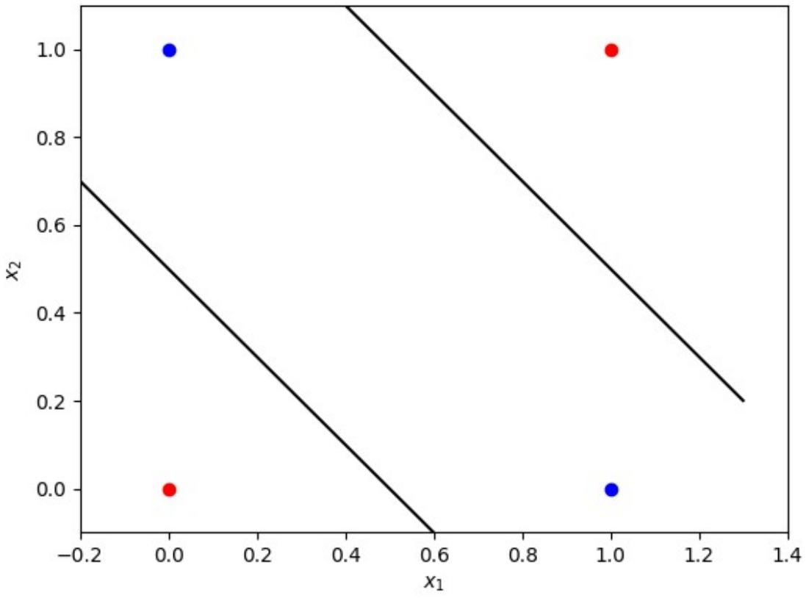
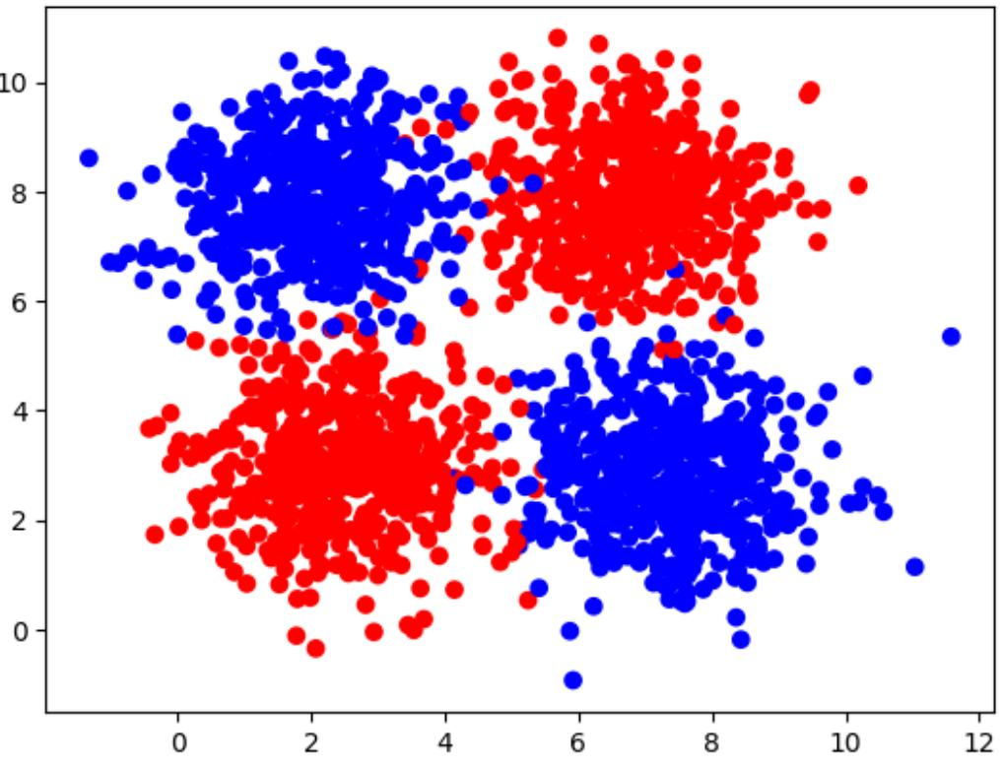
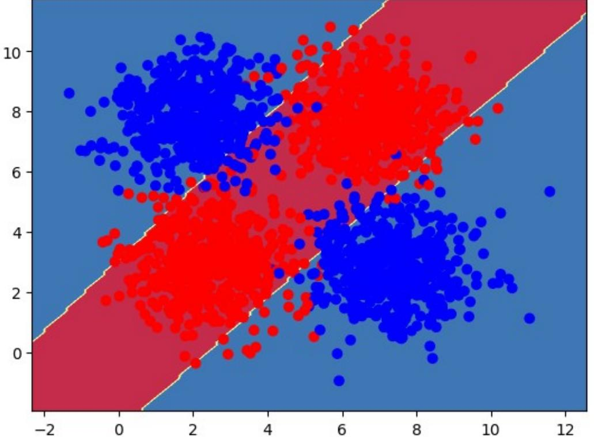

# Neural Network with Two Layers

Welcome to your week three programming assignment. You are ready to build a neural network with two layers and train it to solve a classification problem.

#### **After this assignment, you will be able to:**

- Implement a neural network with two layers to a classification problem
- Implement forward propagation using matrix multiplication
- Perform backward propagation

# Table of Contents

- 1 Classification Problem
- 2 Neural Network Model with Two Layers
	- 2.1 Neural Network Model with Two Layers for a Single Training Example
	- 2.2 Neural Network Model with Two Layers for Multiple Training Examples
	- 2.3 Cost Function and Training
	- 2.4 Dataset
	- 2.5 Define Activation Function
		- Exercise 1
- 3 Implementation of the Neural Network Model with Two Layers
	- 3.1 Defining the Neural Network Structure
		- Exercise 2
	- 3.2 Initialize the Model's Parameters
		- Exercise 3
	- 3.3 The Loop
		- Exercise 4
		- Exercise 5
		- Exercise 6
	- 3.4 Integrate parts 3.1, 3.2 and 3.3 in nn_model()
		- Exercise 7
		- Exercise 8
- 4 Optional: Other Dataset

# Packages

First, import all the packages you will need during this assignment.

```
import numpy as np
import matplotlib.pyplot as plt
from matplotlib import colors
```

```
# A function to create a dataset.
from sklearn.datasets import make_blobs
# Output of plotting commands is displayed inline within the Jupyter 
notebook.
%matplotlib inline 
# Set a seed so that the results are consistent.
np.random.seed(3)
```
Load the unit tests defined for this notebook.

import w3_unittest

# 1 - Classification Problem

In one of the labs this week, you trained a neural network with a single perceptron, performing forward and backward propagation. That simple structure was enough to solve a "linear" classification problem - finding a straight line in a plane that would serve as a decision boundary to separate two classes.

Imagine that now you have a more complicated problem: you still have two classes, but one line will not be enough to separate them.

```
fig, ax = plt.subplots()
xmin, xmax = -0.2, 1.4
x_line = np.arange(xmin, xmax, 0.1)
# Data points (observations) from two classes.
ax.scatter(0, 0, color="r")
ax.scatter(0, 1, color="b")
ax.scatter(1, 0, color="b")
ax.scatter(1, 1, color="r")
ax.set_xlim([xmin, xmax])
ax.set_ylim([-0.1, 1.1])
ax.set_xlabel('$x_1$')
ax.set_ylabel('$x_2$')
# Example of the lines which can be used as a decision boundary to 
separate two classes.
ax.plot(x_line, -1 * x_line + 1.5, color="black")
ax.plot(x_line, -1 * x_line + 0.5, color="black")
plt.plot()
[]
```


This logic can appear in many applications. For example, if you train a model to predict whether you should buy a house knowing its size and the year it was built. A big new house will not be affordable, while a small old house will not be worth buying. So, you might be interested in either a big old house, or a small new house.

The one perceptron neural network is not enough to solve such classification problem. Let's look at how you can adjust that model to find the solution.

In the plot above, two lines can serve as a decision boundary. Your intuition might tell you that you should also increase the number of perceptrons. And that is absolutely right! You need to feed your data points (coordinates x1, x2) into two nodes separately and then unify them somehow with another one to make a decision.

Now let's figure out the details, build and train your first multi-layer neural network!

# 2 - Neural Network Model with Two Layers

2.1 - Neural Network Model with Two Layers for a Single Training Example

The input and output layers of the neural network are the same as for one perceptron model, but

there is a **hidden layer** now in between them. The training examples x (i )= [ x1 (i ) x2 (i )) from the input

layer of size nx=2 are first fed into the hidden layer of size nh=2. They are simultaneously fed into the first perceptron with weights W1 [ 1)=[ w1 ,1 [1) w2 , 1 [1 ) ), bias b1 [1) ; and into the second perceptron with weights W2 [ 1)=[ w1 ,2 [1) w2 , 2 [1 ) ), bias b2 [1) . The integer in the square brackets ❑ [1) denotes the layer number, because there are two layers now with their own parameters and outputs, which need to be distinguished.

\begin{align} z_1^{1} &= w_{1,1}^{[1]} x_1^{(i)} + w_{2,1}^{[1]} x_2^{(i)} + b_1^{[1]} = W_1^{[1]}x^{(i)} + b_1^{[1]},\ z_2^{1} &= w_{1,2}^{[1]} x_1^{(i)} + w_{2,2}^{[1]} x_2^{(i)} + b_2^{[1]} = W_2^{[1]}x^{(i)} + b_2^{[1]}.\tag{1} \end{align}

These expressions for one training example x (i ) can be rewritten in a matrix form :

$$z^{^{[1|i|}}{=}W^{^{[1|}}x^{^{[i]}}{+}b^{^{[1]}},$$

where

$$\begin{split}\mathbb{Z}^{1|1|i|}&=\begin{bmatrix}\mathbb{Z}_{1}^{1|1|i|}\\ \mathbb{Z}_{2}^{1|1|i|}\end{bmatrix}\text{is vector of size}\left|n_{h}\times1\right|=\left|2\times1\right|;\\ \end{split}$$

$$\begin{split}W^{1|1}&=\begin{bmatrix}W_{1}^{1|1}\\ W_{2}^{1|2}\end{bmatrix}=\begin{bmatrix}W_{1,1}^{1|1}&W_{2,1}^{1|1}\\ W_{1,2}^{1|1}&W_{2,2}^{1|1}\end{bmatrix}\text{is matrix of size}\left|n_{h}\times n_{x}\right|=\left|2\times2\right|;\\ b^{1|1}&=\begin{bmatrix}b_{1}^{1|1}\\ b_{2}^{1|1}\end{bmatrix}\text{is vector of size}\left|n_{h}\times1\right|=\left|2\times1\right|.\end{split}$$

Next, the hidden layer activation function needs to be applied for each of the elements in the vector z [1) (i ) . Various activation functions can be used here and in this model you will take the sigmoid function σ ( x )= 1 1+e −x . Remember that its derivative is d σ d x =σ ( x )( 1−σ ( x )). The output of the hidden layer is a vector of size (nh×1 )=(2×1):

$$a^{|1||i|}{=}\sigma{\left(z^{|1||i|}\right)}{=}\left[\begin{array}{l}{{\sigma\left(z_{1}^{|1||i|}\right)}}\\ {{\sigma\left(z_{2}^{|1||i|}\right)}}\end{array}\right].$$

Then the hidden layer output gets fed into the output layer of size n y=1. This was covered in the previous lab, the only difference are: a [1) (i ) is taken instead of x (i ) and layer notation ❑ [2) appears to identify all parameters and outputs:

$$\begin{array}{l}\mbox{$\frac{|2^{|1|i|}}{|i|}$}=w_{1}^{|2|}a_{1}^{|1|i|}+w_{2}^{|2|}a_{2}^{|1|i|}+b^{|2|}=W^{|2|}a^{|1|i|}+b^{|2|}\end{array}$$

    z [2)( i) and b [2) are scalars for this model, as (ny ×1)=(1×1);

$W^{|2|}=\left[\begin{array}{cc}W_{1}^{|2|}&W_{2}^{|2|}\end{array}\right]$ is vector of size $|n_{y}\times n_{h}|=|1\times2|$.

Finally, the same sigmoid function is used as the output layer activation function:

$$a^{|2||i|}{=}\sigma{\left(z^{|2||i|}\right)}.$$

Mathematically the two layer neural network model for each training example x (i ) can be written with the expressions (2) −(5). Let's rewrite them next to each other for convenience:

\begin{align} z^{1} &= W^{[1]} x^{(i)} + b^{[1]},\ a^{1} &= \sigma\left(z^{1}\right),\ z^{2} &= W^{[2]} a^{1} + b^{[2]},\ a^{2} &= \sigma\left(z^{2}\right).\ \tag{6} \end{align}

Note, that all of the parameters to be trained in the model are without ❑ (i ) index - they are independent on the input data.

Finally, the predictions for some example x (i ) can be made taking the output a [2) (i ) and calculating 1 if a [2) (i )>0.5 ,

^y as: ^y={ 0 otherwise . ).

# 2.2 - Neural Network Model with Two Layers for Multiple Training Examples

Similarly to the single perceptron model, m training examples can be organised in a matrix X of a shape (2×m), putting x (i ) into columns. Then the model (6) can be rewritten in terms of matrix multiplications:

\begin{align} Z^{[1]} &= W^{[1]} X + b^{[1]},\ A^{[1]} &= \sigma\left(Z^{[1]}\right),\ Z^{[2]} &= W^{[2]} A^{[1]} + b^{[2]},\ A^{[2]} &= \sigma\left(Z^{[2]}\right),\ \tag{7} \end{align}

where b [1) is broadcasted to the matrix of size (nh×m)=(2×m) and b [2) to the vector of size (ny ×m)=(1×m). It would be a good exercise for you to have a look at the expressions (7) and check that sizes of the matrices will actually match to perform required multiplications.

You have derived expressions to perform forward propagation. Time to evaluate your model and train it.

# 2.3 - Cost Function and Training

For the evaluation of this simple neural network you can use the same cost function as for the single perceptron case - log loss function. Originally initialized weights were just some random values, now you need to perform training of the model: find such set of parameters W [ 1) , b [1) , W [ 2) , b [2) , that will minimize the cost function.

Like in the previous example of a single perceptron neural network, the cost function can be written as:

$$\mathcal{L}\left(W^{[1]}, b^{[1]}, W^{[2]}, b^{[2]}\right) = \frac{1}{m}\sum_{i=1}^{m} L\ left(W^{[1]}, b^{[1]}, W^{[2]}, b^{[2]}\right) = \frac{1}{m}\sum_{i=1}^{m} \large\left(\small y^{(i)}\log\left(a^{[2](i)}\right) - (1-y^{(i)})\log\left(1- a^{[2](i)}\right) \large \right), \small\ tag{8}$$

where y (i )∈{0,1 } are the original labels and a [2) (i ) are the continuous output values of the forward propagation step (elements of array A [ 2) ).

To minimize it, you can use gradient descent, updating the parameters with the following expressions:

\begin{align} W^{[1]} &= W^{[1]} - \alpha \frac{\partial \mathcal{L} }{ \partial W^{[1]} },\ b^{[1]} &= b^{[1]} - \alpha \frac{\partial \mathcal{L} }{ \partial b^{[1]} },\ W^{[2]} &= W^{[2]} - \alpha \ frac{\partial \mathcal{L} }{ \partial W^{[2]} },\ b^{[2]} &= b^{[2]} - \alpha \frac{\partial \ mathcal{L} }{ \partial b^{[2]} },\ \tag{9} \end{align}

where α is the learning rate.

To perform training of the model you need to calculate now ∂ L ∂W [1 ) , ∂ L ∂ b [1 ) , ∂ L ∂W [2 ) , ∂ L ∂ b [2 ) .

Let's start from the end of the neural network. You can rewrite here the corresponding expressions for ∂L ∂W and ∂ L ∂b from the single perceptron neural network:

\begin{align} \frac{\partial \mathcal{L} }{ \partial W } &= \frac{1}{m}\left(A-Y\right)X^T,\ \frac{\ partial \mathcal{L} }{ \partial b } &= \frac{1}{m}\left(A-Y\right)\mathbf{1},\ \end{align}

where 1 is just a (m ×1) vector of ones. Your one perceptron is in the second layer now, so W will be exchanged with W [ 2) , b with b [2) , A with A [ 2) , X with A [ 1) :

\begin{align} \frac{\partial \mathcal{L} }{ \partial W^{[2]} } &= \frac{1}{m}\left(A^{[2]}-Y\right)\ left(A^{[1]}\right)^T,\ \frac{\partial \mathcal{L} }{ \partial b^{[2]} } &= \frac{1}{m}\left(A^{[2]}-Y\ right)\mathbf{1}.\ \tag{10} \end{align}

Let's now find ∂ L ∂W [1 )= [ ∂ L ∂w1,1 [1) ∂L ∂w2 ,1 [1 ) ∂ L ∂w1,2 [1) ∂L ∂w2 ,2 [1 ) ) . It was shown in the videos that

$$\frac{\partial L}{\partial w_{1,1}^{|1|}}=\frac{1}{m}\sum_{i=1}^{m}\left(|a^{|2^{|i|}}-y^{(i)}|w_{1}^{|2}|\left(a_{1}^{|1|i|}\left(1-a_{1}^{|1|i|}\right)\right)x_{1}^{(i)}\right)$$

If you do this accurately for each of the elements ∂ L ∂W [1 ) , you will get the following matrix:

∂ L ∂W [1 )= [ ∂ L ∂w1,1 [1) ∂L ∂w2 ,1 [1 ) ∂ L ∂w1,2 [1) ∂L ∂w2 ,2 [1 ) ) ¿ 1 m [ ∑ i=1 m ((a [2) (i )− y (i) )w1 [2) (a1 [1)( i) ( 1−a1 [ 1) (i) )) x1 (i) ) ∑ i=1 m (( a [2)( i) − y (i ) )w1 [2 ) (a1 [ 1) (i) (1−a1 [1) (i ) )) x2 (i )) ∑ i=1 m ((a [2) (i )− y (i) )w2 [2) (a2 [1)( i) ( 1−a2 [ 1) (i) )) x1 (i) ) ∑ i=1 m (( a [2)( i) − y (i ) )w2 [2 ) (a2 [ 1) (i) (1−a2 [1) (i ) )) x2 (i ) ))

Looking at this, you can notice that all terms and indices somehow are very consistent, so it all can be unified into a matrix form. And that's true! (W [2) ) T = [ w1 [2 ) w2 [2 )) of size (nh×ny )=(2×1) can be multiplied with the vector A [ 2)−Y of size (ny ×m)=(1×m), resulting in a matrix of size (nh×m)=(2×m):

(W [2) ) T ( A [2) −Y )= [ w1 [2) w2 [2) ) [ (a [ 2) (1) − y (1 ) ) ⋯ (a [2) (m)− y (m)) )= [ (a [2) (1)− y ( 1) )w1 [ 2) ⋯ (a [ 2) (m)− y (m)) w1 [2 ) (a [2) (1)− y ( 1) )w2 [ 2) ⋯ (a [ 2) (m)− y (m)) w2 [2 ))

Now taking matrix A [ 1) of the same size (nh×m)=(2×m),

$$A^{[1]}{=}{\left[\begin{matrix}a_{1}^{[1]\,[1]}&\cdots&a_{1}^{[1]\,[m]}\\ a_{2}^{[1]\,[1]}&\cdots&a_{2}^{[1]\,[m]}\end{matrix}\right]},$$

you can calculate:

.

$$A^{[1]}\cdot\left(1-A^{[1]}\right)=\begin{vmatrix}a_{1}^{[1](1)}\left(1-a_{1}^{[1](1)}\right)&...&a_{1}^{[1]\left|m\right|}\left(1-a_{1}^{[1]\left|m\right|}\right)\\ a_{2}^{[1](1)}\left(1-a_{2}^{[1](1)}\right)&...&a_{2}^{[1]\left|m\right|}\left(1-a_{2}^{[1]\left|m\right|}\right)\end{vmatrix},$$

where "⋅" denotes **element by element** multiplication.

With the element by element multiplication,

(W [2) ) T ( A [2) −Y )⋅( A [1) ⋅(1− A [1) ))= [ (a [2) (1 )− y ( 1) )w1 [ 2) (a1 [1) (1) (1−a1 [1)( 1) )) ⋯ (a [ 2) (m)− y (m))w1 [2) (a1 [1)( m) (1−a1 [1) (m) )) (a [2) (1 )− y ( 1) )w2 [ 2) (a2 [1) (1) (1−a2 [1)( 1) )) ⋯ (a [ 2) (m)− y (m))w2 [2) (a2 [1)( m) (1−a2 [1) (m) ))) .

If you perform matrix multiplication with X T of size (m ×nx )=(m ×2), you will get matrix of size (nh×nx )=(2×2):

((W [ 2) ) T ( A [ 2)−Y )⋅( A [1) ⋅( 1− A [1 )))) X T= [ ( a [2) (1) − y (1 ) )w1 [2 ) (a1 [ 1) (1) (1−a1 [1) (1 ) )) ⋯ ( a [2)( m)− y ( m) )w1 [2) ( a1 [1) ( m) ( 1−a1 [1) (m) )) ( a [2) (1) − y (1 ) )w2 [2 ) (a2 [ 1) (1) (1−a2 [1) (1 ) )) ⋯ ( a [2)( m)− y ( m) )w2 [2) ( a2 [1) ( m) ( 1−a2 [1) (m) )))[ x1 (1) x2 ⋯ ⋯ x1 (m) x2

(1)

(m))

¿ [ ∑ i=1 m (( a [2 )( i)− y (i )) w1 [2 ) (a1 [1 ) (i) (1−a1 [1) (i ) )) x1 (i )) ∑ i=1 m ((a [ 2) (i )− y ( i) )w1 [2) (a1 [1) (i ) (1−a1 [1 )( i) )) x2 ( i) ) ∑ i=1 m (( a [2 )( i)− y (i )) w2 [2 ) (a2 [1 ) (i) (1−a2 [1) (i ) )) x1 (i ) ) ∑ i=1 m ((a [ 2) (i )− y ( i) )w2 [2) (a2 [1) (i ) (1−a2 [1 )( i) )) x2 ( i) ))

This is exactly like in the expression (12)! So, ∂ L ∂W [1 ) can be written as a mixture of multiplications:

$${\frac{\partial\,L}{\partial\,W^{[1]}}}\mathbf{=}{\frac{1}{m}}{\Big(}{\big[}W^{[2]}{\big]}^{T}{\big[}A^{[2]}\mathbf{-}Y{\big]}\mathbf{\cdot}{\Big[}A^{[1]}\mathbf{\cdot}{\big[}1\mathbf{-}A^{[1]}{\big]}{\Big)}{\Big)}\,X^{T},$$

where "⋅" denotes element by element multiplications.

Vector ∂ L ∂ b [1 ) can be found very similarly, but the last terms in the chain rule will be equal to 1, i.e. ∂ z1 [ 1) (i ) ∂ b1 [1 ) =1. Thus,

$$\frac{\partial L}{\partial b^{[1]}}{=}\frac{1}{m}\Big{(}|W^{[2]}|^{T}\big{(}A^{[2]}-Y\big{)}\cdot\big{(}A^{[1]}\cdot\big{(}1-A^{[1]}\big{)}\big{)}\Big{)}1\,,$$

where 1 is a (m ×1) vector of ones.

Expressions (10), (13) and (14 ) can be used for the parameters update (9) performing backward propagation:

\begin{align} \frac{\partial \mathcal{L} }{ \partial W^{[2]} } &= \frac{1}{m}\left(A^{[2]}-Y\right)\ left(A^{[1]}\right)^T,\ \frac{\partial \mathcal{L} }{ \partial b^{[2]} } &= \frac{1}{m}\left(A^{[2]}-Y\ right)\mathbf{1},\ \frac{\partial \mathcal{L} }{ \partial W^{[1]}} &= \frac{1}{m}\left(\left(W^{[2]}\ right)^T \left(A^{[2]} - Y\right)\cdot \left(A^{[1]}\cdot\left(1-A^{[1]}\right)\right)\right)X^T,\ \ frac{\partial \mathcal{L} }{ \partial b^{[1]}} &= \frac{1}{m}\left(\left(W^{[2]}\right)^T \left(A^{[2]} - Y\right)\cdot \left(A^{[1]}\cdot\left(1-A^{[1]}\right)\right)\right)\mathbf{1},\ \tag{15} \end{align}

where 1 is a (m ×1) vector of ones.

So, to understand deeply and properly how neural networks perform and get trained, **you do need knowledge of linear algebra and calculus joined together**! But do not worry! All together it is not that scary if you do it step by step accurately with understanding of maths.

Time to implement this all in the code!

# 2.2 - Dataset

First, let's get the dataset you will work on. The following code will create m=2000 data points ( x1 , x2) and save them in the NumPy array X of a shape (2×m) (in the columns of the array). The labels (0: blue, 1: red) will be saved in the NumPy array Y of a shape (1×m).

```
m = 2000
samples, labels = make_blobs(n_samples=m, 
 centers=([2.5, 3], [6.7, 7.9], [2.1, 
7.9], [7.4, 2.8]), 
 cluster_std=1.1,
 random_state=0)
labels[(labels == 0) | (labels == 1)] = 1
labels[(labels == 2) | (labels == 3)] = 0
X = np.transpose(samples)
Y = labels.reshape((1, m))
plt.scatter(X[0, :], X[1, :], c=Y, cmap=colors.ListedColormap(['blue',
'red']));
print ('The shape of X is: ' + str(X.shape))
print ('The shape of Y is: ' + str(Y.shape))
print ('I have m = %d training examples!' % (m))
The shape of X is: (2, 2000)
The shape of Y is: (1, 2000)
I have m = 2000 training examples!
```


## 2.3 - Define Activation Function

# Exercise 1

Define sigmoid activation function $\sigma\left(z\right) =\frac{1}{1+e^{-z}} $.

```
def sigmoid(z):
 ### START CODE HERE ### (~ 1 line of code)
 res = 1/(1 + np.exp(-z))
 ### END CODE HERE ###
 
 return res
print("sigmoid(-2) = " + str(sigmoid(-2)))
print("sigmoid(0) = " + str(sigmoid(0)))
print("sigmoid(3.5) = " + str(sigmoid(3.5)))
sigmoid(-2) = 0.11920292202211755
sigmoid(0) = 0.5
sigmoid(3.5) = 0.9706877692486436
```
#### **Expected Output**

Note: the values may vary in the last decimal places.

```
sigmoid(-2) = 0.11920292202211755
sigmoid(0) = 0.5
sigmoid(3.5) = 0.9706877692486436
w3_unittest.test_sigmoid(sigmoid)
 All tests passed
```
# 3 - Implementation of the Neural Network Model with Two Layers

# 3.1 - Defining the Neural Network Structure

# Exercise 2

Define three variables:

- n_x: the size of the input layer
- n_h: the size of the hidden layer (set it equal to 2 for now)
- n_y: the size of the output layer

```
# GRADED FUNCTION: layer_sizes
```

```
def layer_sizes(X, Y):
 """
 Arguments:
 X -- input dataset of shape (input size, number of examples)
 Y -- labels of shape (output size, number of examples)
 
 Returns:
 n_x -- the size of the input layer
 n_h -- the size of the hidden layer
 n_y -- the size of the output layer
 """
 ### START CODE HERE ### (~ 3 lines of code)
 # Size of input layer.
 n_x = X.shape[0]
 # Size of hidden layer.
 n_h = 2
 # Size of output layer.
```
 n_y = Y.shape[0] *###* END *CODE HERE* ### return (n_x, n_h, n_y)

(n_x, n_h, n_y) = layer_sizes(X, Y) print("The size of the input layer is: n_x = " + str(n_x)) print("The size of the hidden layer is: n_h = " + str(n_h)) print("The size of the output layer is: n_y = " + str(n_y))

The size of the input layer is: n_x = 2 The size of the hidden layer is: n_h = 2 The size of the output layer is: n_y = 1

#### **Expected Output**

The size of the input layer is: n_x = 2 The size of the hidden layer is: n_h = 2 The size of the output layer is: n_y = 1 w3_unittest.test_layer_sizes(layer_sizes) All tests passed

### 3.2 - Initialize the Model's Parameters

## Exercise 3

Implement the function initialize_parameters().

#### **Instructions**:

- Make sure your parameters' sizes are right. Refer to the neural network figure above if needed.
- You will initialize the weights matrix with random values.
	- Use: np.random.randn(a,b) * 0.01 to randomly initialize a matrix of shape (a,b).
- You will initialize the bias vector as zeros.
	- Use: np.zeros((a,b)) to initialize a matrix of shape (a,b) with zeros.

*# GRADED FUNCTION: initialize_parameters*

def initialize_parameters(n_x, n_h, n_y):

 *Argument:*

*"""*

 *n_x -- size of the input layer n_h -- size of the hidden layer n_y -- size of the output layer*

```
 Returns:
 params -- python dictionary containing your parameters:
 W1 -- weight matrix of shape (n_h, n_x)
 b1 -- bias vector of shape (n_h, 1)
 W2 -- weight matrix of shape (n_y, n_h)
 b2 -- bias vector of shape (n_y, 1)
 """
 ### START CODE HERE ### (~ 4 lines of code)
 W1 = np.random.randn(n_h, n_x) * 0.01
 b1 = np.zeros((n_h, 1))
 W2 = np.random.randn(n_y, n_h) * 0.01
 b2 = np.zeros((n_y, 1))
 ### END CODE HERE ###
 assert (W1.shape == (n_h, n_x))
 assert (b1.shape == (n_h, 1))
 assert (W2.shape == (n_y, n_h))
 assert (b2.shape == (n_y, 1))
 parameters = {"W1": W1,
 "b1": b1,
                "W2": W2,
                "b2": b2}
 return parameters
parameters = initialize_parameters(n_x, n_h, n_y)
print("W1 = " + str(parameters["W1"]))
print("b1 = " + str(parameters["b1"]))
print("W2 = " + str(parameters["W2"]))
print("b2 = " + str(parameters["b2"]))
W1 = [[ 0.01788628 0.0043651 ]
 [ 0.00096497 -0.01863493]]
b1 = [[0.]
 [0.]]
W2 = [[-0.00277388 -0.00354759]]
b2 = [[0.]]
```
#### **Expected Output**

Note: the elements of the arrays W1 and W2 maybe be different due to random initialization. You can try to restart the kernel to get the same values.

```
W1 = [[ 0.01788628 0.0043651 ]
 [ 0.00096497 -0.01863493]]
b1 = [[0.]
```

```
 [0.]]
W2 = [[-0.00277388 -0.00354759]]
b2 = [[0.]]
# Note: 
# Actual values are not checked here in the unit tests (due to random 
initialization).
w3_unittest.test_initialize_parameters(initialize_parameters)
 All tests passed
```
## 3.3 - The Loop

### Exercise 4

Implement forward_propagation().

#### **Instructions**:

- Look above at the mathematical representation (7) of your classifier (section 2.2): \ begin{align} Z^{[1]} &= W^{[1]} X + b^{[1]},\ A^{[1]} &= \sigma\left(Z^{[1]}\right),\ Z^{[2]} &= W^{[2]} A^{[1]} + b^{[2]},\ A^{[2]} &= \sigma\left(Z^{[2]}\right).\ \end{align}
- The steps you have to implement are:
	- a. Retrieve each parameter from the dictionary "parameters" (which is the output of initialize_parameters()) by using parameters[".."].
	- b. Implement Forward Propagation. Compute Z1 multiplying matrices W1, X and adding vector b1. Then find A1 using the sigmoid activation function. Perform similar computations for Z2 and A2.

*# GRADED FUNCTION: forward_propagation*

```
def forward_propagation(X, parameters):
 """
 Argument:
 X -- input data of size (n_x, m)
 parameters -- python dictionary containing your parameters (output
of initialization function)
 
 Returns:
 A2 -- the sigmoid output of the second activation
 cache -- python dictionary containing Z1, A1, Z2, A2 
 (that simplifies the calculations in the back propagation step)
 """
 # Retrieve each parameter from the dictionary "parameters".
 ### START CODE HERE ### (~ 4 lines of code)
 W1 = parameters["W1"]
```

```
 b1 = parameters["b1"]
 W2 = parameters["W2"]
 b2 = parameters["b2"]
 ### END CODE HERE ###
 # Implement forward propagation to calculate A2.
 ### START CODE HERE ### (~ 4 lines of code)
 Z1 = np.matmul(W1, X) + b1
 A1 = sigmoid(Z1)
 Z2 = np.matmul(W2, A1) + b2
 A2 = sigmoid(Z2)
 ### END CODE HERE ###
 assert(A2.shape == (n_y, X.shape[1]))
 cache = {"Z1": Z1,
 "A1": A1,
 "Z2": Z2,
 "A2": A2}
 return A2, cache
A2, cache = forward_propagation(X, parameters)
print(A2)
[[0.49920157 0.49922234 0.49921223 ... 0.49921215 0.49921043 
0.49920665]]
```
#### **Expected Output**

Note: the elements of the array A2 maybe be different depending on the initial parameters. If you would like to get exactly the same output, try to restart the Kernel and rerun the notebook.

```
[[0.49920157 0.49922234 0.49921223 ... 0.49921215 0.49921043
0.49920665]]
# Note: 
# Actual values are not checked here in the unit tests (due to random 
initialization).
w3_unittest.test_forward_propagation(forward_propagation)
 All tests passed
```
Remember, that your weights were just initialized with some random values, so the model has not been trained yet.

# Exercise 5

Define a cost function (8) which will be used to train the model:

$$\mathcal{L}\left(W, b\right) = \frac{1}{m}\sum_{i=1}^{m} \large\left(\small - y^{(i)}\log\ left(a^{(i)}\right) - (1-y^{(i)})\log\left(1- a^{(i)}\right) \large \right) \small.$$

```
def compute_cost(A2, Y):
 """
 Computes the cost function as a log loss
 
 Arguments:
 A2 -- The output of the neural network of shape (1, number of 
examples)
 Y -- "true" labels vector of shape (1, number of examples)
 
 Returns:
 cost -- log loss
 
 """
 # Number of examples.
 m = Y.shape[1]
 
 ### START CODE HERE ### (~ 2 lines of code)
 logloss = - np.multiply(np.log(A2), Y) - np.multiply(np.log(1 -
A2), 1 - Y)
 cost = 1/m * np.sum(logloss)
 ### END CODE HERE ###
 assert(isinstance(cost, float))
 
 return cost
print("cost = " + str(compute_cost(A2, Y)))
cost = 0.6931477703826823
```
#### **Expected Output**

Note: the elements of the arrays W1 and W2 maybe be different!

```
cost = 0.6931477703826823
# Note: 
# Actual values are not checked here in the unit tests (due to random 
initialization).
w3_unittest.test_compute_cost(compute_cost, A2)
 All tests passed
```
Calculate partial derivatives as shown in (15):

\begin{align} \frac{\partial \mathcal{L} }{ \partial W^{[2]} } &= \frac{1}{m}\left(A^{[2]}-Y\right)\ left(A^{[1]}\right)^T,\ \frac{\partial \mathcal{L} }{ \partial b^{[2]} } &= \frac{1}{m}\left(A^{[2]}-Y\ right)\mathbf{1},\ \frac{\partial \mathcal{L} }{ \partial W^{[1]}} &= \frac{1}{m}\left(\left(W^{[2]}\ right)^T \left(A^{[2]} - Y\right)\cdot \left(A^{[1]}\cdot\left(1-A^{[1]}\right)\right)\right)X^T,\ \ frac{\partial \mathcal{L} }{ \partial b^{[1]}} &= \frac{1}{m}\left(\left(W^{[2]}\right)^T \left(A^{[2]} - Y\right)\cdot \left(A^{[1]}\cdot\left(1-A^{[1]}\right)\right)\right)\mathbf{1}.\ \end{align}

```
def backward_propagation(parameters, cache, X, Y):
 """
 Implements the backward propagation, calculating gradients
 
 Arguments:
 parameters -- python dictionary containing our parameters 
 cache -- python dictionary containing Z1, A1, Z2, A2
 X -- input data of shape (n_x, number of examples)
 Y -- "true" labels vector of shape (n_y, number of examples)
 
 Returns:
 grads -- python dictionary containing gradients with respect to 
different parameters
 """
 m = X.shape[1]
 
 # First, retrieve W from the dictionary "parameters".
 W1 = parameters["W1"]
 W2 = parameters["W2"]
 
 # Retrieve also A1 and A2 from dictionary "cache".
 A1 = cache["A1"]
 A2 = cache["A2"]
 
 # Backward propagation: calculate partial derivatives denoted as 
dW1, db1, dW2, db2 for simplicity. 
 dZ2 = A2 - Y
 dW2 = 1/m * np.dot(dZ2, A1.T)
 db2 = 1/m * np.sum(dZ2, axis = 1, keepdims = True)
 dZ1 = np.dot(W2.T, dZ2) * A1 * (1 - A1)
 dW1 = 1/m * np.dot(dZ1, X.T)
 db1 = 1/m * np.sum(dZ1, axis = 1, keepdims = True)
 
 grads = {"dW1": dW1,
 "db1": db1,
 "dW2": dW2,
 "db2": db2}
 
 return grads
grads = backward_propagation(parameters, cache, X, Y)
print("dW1 = " + str(grads["dW1"]))
```

```
print("db1 = " + str(grads["db1"]))
print("dW2 = " + str(grads["dW2"]))
print("db2 = " + str(grads["db2"]))
dW1 = [[-1.49856632e-05 1.67791519e-05]
 [-2.12394543e-05 2.43895135e-05]]
db1 = [[5.11207671e-07]
 [7.06236219e-07]]
dW2 = [[-0.00032641 -0.0002606 ]]
db2 = [[-0.00078732]]
```
### Exercise 6

Implement update_parameters().

#### **Instructions**:

- Update parameters as shown in (9) (section 2.3): \begin{align} W^{[1]} &= W^{[1]} \ alpha \frac{\partial \mathcal{L} }{ \partial W^{[1]} },\ b^{[1]} &= b^{[1]} - \alpha \frac{\ partial \mathcal{L} }{ \partial b^{[1]} },\ W^{[2]} &= W^{[2]} - \alpha \frac{\partial \ mathcal{L} }{ \partial W^{[2]} },\ b^{[2]} &= b^{[2]} - \alpha \frac{\partial \mathcal{L} }{ \ partial b^{[2]} }.\ \end{align}
- The steps you have to implement are:
	- a. Retrieve each parameter from the dictionary "parameters" (which is the output of initialize_parameters()) by using parameters[".."].
	- b. Retrieve each derivative from the dictionary "grads" (which is the output of backward_propagation()) by using grads[".."].
	- c. Update parameters.

```
def update_parameters(parameters, grads, learning_rate=1.2):
 """
 Updates parameters using the gradient descent update rule
 
 Arguments:
 parameters -- python dictionary containing parameters 
 grads -- python dictionary containing gradients
 learning_rate -- learning rate for gradient descent
 
 Returns:
 parameters -- python dictionary containing updated parameters 
 """
 # Retrieve each parameter from the dictionary "parameters".
 ### START CODE HERE ### (~ 4 lines of code)
 W1 = parameters["W1"]
 b1 = parameters["b1"]
 W2 = parameters["W2"]
 b2 = parameters["b2"]
```
 *###* END *CODE HERE* ### *# Retrieve each gradient from the dictionary "grads". ### START CODE HERE* ### *(~ 4 lines of code)* dW1 = grads["dW1"] db1 = grads["db1"] dW2 = grads["dW2"] db2 = grads["db2"] *###* END *CODE HERE* ### *# Update rule for each parameter. ### START CODE HERE* ### *(~ 4 lines of code)* W1 = W1 - learning_rate * dW1 b1 = b1 - learning_rate * db1 W2 = W2 - learning_rate * dW2 b2 = b2 - learning_rate * db2 *###* END *CODE HERE* ### parameters = {"W1": W1, "b1": b1, "W2": W2, "b2": b2} return parameters parameters_updated = update_parameters(parameters, grads) print("W1 updated = " + str(parameters_updated["W1"])) print("b1 updated = " + str(parameters_updated["b1"])) print("W2 updated = " + str(parameters_updated["W2"])) print("b2 updated = " + str(parameters_updated["b2"])) W1 updated = [[ 0.01790427 0.00434496] [ 0.00099046 -0.01866419]] b1 updated = [[-6.13449205e-07] [-8.47483463e-07]] W2 updated = [[-0.00238219 -0.00323487]] b2 updated = [[0.00094478]]

#### **Expected Output**

Note: the actual values can be different!

```
W1 updated = [[ 0.01790427 0.00434496]
 [ 0.00099046 -0.01866419]]
b1 updated = [[-6.13449205e-07]
 [-8.47483463e-07]]
W2 updated = [[-0.00238219 -0.00323487]]
b2 updated = [[0.00094478]]
```
w3_unittest.test_update_parameters(update_parameters) All tests passed

# 3.4 - Integrate parts 3.1, 3.2 and 3.3 in nn_model()

## Exercise 7

Build your neural network model in nn_model().

**Instructions**: The neural network model has to use the previous functions in the right order.

```
# GRADED FUNCTION: nn_model
def nn_model(X, Y, n_h, num_iterations=10, learning_rate=1.2, 
print_cost=False):
 """
 Arguments:
 X -- dataset of shape (n_x, number of examples)
 Y -- labels of shape (n_y, number of examples)
 num_iterations -- number of iterations in the loop
 learning_rate -- learning rate parameter for gradient descent
 print_cost -- if True, print the cost every iteration
 
 Returns:
 parameters -- parameters learnt by the model. They can then be 
used to predict.
 """
 
 n_x = layer_sizes(X, Y)[0]
 n_y = layer_sizes(X, Y)[2]
 
 # Initialize parameters.
 ### START CODE HERE ### (~ 1 line of code)
 parameters = initialize_parameters(n_x, n_h, n_y)
 ### END CODE HERE ###
 
 # Loop.
 for i in range(0, num_iterations):
 
 ### START CODE HERE ### (~ 4 lines of code)
 # Forward propagation. Inputs: "X, parameters". Outputs: "A2, 
cache".
 A2, cache = forward_propagation(X, parameters)
 
 # Cost function. Inputs: "A2, Y". Outputs: "cost".
```
 cost = compute_cost(A2, Y) *# Backpropagation. Inputs: "parameters, cache, X, Y". Outputs: "grads".* grads = backward_propagation(parameters, cache, X, Y) *# Gradient descent parameter update. Inputs: "parameters, grads, learning_rate". Outputs: "parameters".* parameters = update_parameters(parameters, grads, learning_rate) *###* END *CODE HERE* ### *# Print the cost every iteration.* if print_cost: print ("Cost after iteration %i: %f" %(i, cost)) return parameters parameters = nn_model(X, Y, n_h=2, num_iterations=3000, learning_rate=1.2, print_cost=True) print("W1 = " + str(parameters["W1"])) print("b1 = " + str(parameters["b1"])) print("W2 = " + str(parameters["W2"])) print("b2 = " + str(parameters["b2"])) W1 = parameters["W1"] b1 = parameters["b1"] W2 = parameters["W2"] b2 = parameters["b2"] Cost after iteration 0: 0.693166 Cost after iteration 1: 0.693153 Cost after iteration 2: 0.693149 Cost after iteration 3: 0.693148 Cost after iteration 4: 0.693147 Cost after iteration 5: 0.693147 Cost after iteration 6: 0.693147 Cost after iteration 7: 0.693147 Cost after iteration 8: 0.693147 Cost after iteration 9: 0.693147 Cost after iteration 10: 0.693147 Cost after iteration 11: 0.693147 Cost after iteration 12: 0.693147 Cost after iteration 13: 0.693147 Cost after iteration 14: 0.693147 Cost after iteration 15: 0.693147 Cost after iteration 16: 0.693147 Cost after iteration 17: 0.693147 Cost after iteration 18: 0.693147 Cost after iteration 19: 0.693147

| Cost after iteration 20: 0.693146 |
| --- |
| Cost after iteration 21: 0.693146 |
| Cost after iteration 22: 0.693146 |
| Cost after iteration 23: 0.693146 |
| Cost after iteration 24: 0.693146 |
| Cost after iteration 25: 0.693146 |
| Cost after iteration 26: 0.693146 |
| Cost after iteration 27: 0.693146 |
| Cost after iteration 28: 0.693146 |
| Cost after iteration 29: 0.693146 |
| Cost after iteration 30: 0.693146 |
| Cost after iteration 31: 0.693146 |
| Cost after iteration 32: 0.693146 |
| Cost after iteration 33: 0.693146 |
| Cost after iteration 34: 0.693146 |
| Cost after iteration 35: 0.693146 |
| Cost after iteration 36: 0.693146 |
| Cost after iteration 37: 0.693146 |
| Cost after iteration 38: 0.693146 |
| Cost after iteration 39: 0.693146 |
| Cost after iteration 40: 0.693146 |
| Cost after iteration 41: 0.693146 |
| Cost after iteration 42: 0.693146 |
| Cost after iteration 43: 0.693145 |
| Cost after iteration 44: 0.693145 |
| Cost after iteration 45: 0.693145 |
| Cost after iteration 46: 0.693145 |
| Cost after iteration 47: 0.693145 |
| Cost after iteration 48: 0.693145 |
| Cost after iteration 49: 0.693145 |
| Cost after iteration 50: 0.693145 |
| Cost after iteration 51: 0.693145 |
| Cost after iteration 52: 0.693145 |
| Cost after iteration 53: 0.693145 |
| Cost after iteration 54: 0.693145 |
| Cost after iteration 55: 0.693145 |
| Cost after iteration 56: 0.693145 |
| Cost after iteration 57: 0.693145 |
| Cost after iteration 58: 0.693145 |
| Cost after iteration 59: 0.693145 |
| Cost after iteration 60: 0.693145 |
| Cost after iteration 61: 0.693144 |
| Cost after iteration 62: 0.693144 |
| Cost after iteration 63: 0.693144 |
| Cost after iteration 64: 0.693144 |
| Cost after iteration 65: 0.693144 |
| Cost after iteration 66: 0.693144 |
| Cost after iteration 67: 0.693144 |
| Cost after iteration 68: 0.693144 |

| Cost after iteration 69: 0.693144 |
| --- |
| Cost after iteration 70: 0.693144 |
| Cost after iteration 71: 0.693144 |
| Cost after iteration 72: 0.693144 |
| Cost after iteration 73: 0.693144 |
| Cost after iteration 74: 0.693143 |
| Cost after iteration 75: 0.693143 |
| Cost after iteration 76: 0.693143 |
| Cost after iteration 77: 0.693143 |
| Cost after iteration 78: 0.693143 |
| Cost after iteration 79: 0.693143 |
| Cost after iteration 80: 0.693143 |
| Cost after iteration 81: 0.693143 |
| Cost after iteration 82: 0.693143 |
| Cost after iteration 83: 0.693143 |
| Cost after iteration 84: 0.693143 |
| Cost after iteration 85: 0.693142 |
| Cost after iteration 86: 0.693142 |
| Cost after iteration 87: 0.693142 |
| Cost after iteration 88: 0.693142 |
| Cost after iteration 89: 0.693142 |
| Cost after iteration 90: 0.693142 |
| Cost after iteration 91: 0.693142 |
| Cost after iteration 92: 0.693142 |
| Cost after iteration 93: 0.693142 |
| Cost after iteration 94: 0.693141 |
| Cost after iteration 95: 0.693141 |
| Cost after iteration 96: 0.693141 |
| Cost after iteration 97: 0.693141 |
| Cost after iteration 98: 0.693141 |
| Cost after iteration 99: 0.693141 |
| Cost after iteration 100: 0.693141 |
| Cost after iteration 101: 0.693140 |
| Cost after iteration 102: 0.693140 |
| Cost after iteration 103: 0.693140 |
| Cost after iteration 104: 0.693140 |
| Cost after iteration 105: 0.693140 |
| Cost after iteration 106: 0.693140 |
| Cost after iteration 107: 0.693139 |
| Cost after iteration 108: 0.693139 |
| Cost after iteration 109: 0.693139 |
| Cost after iteration 110: 0.693139 |
| Cost after iteration 111: 0.693139 |
| Cost after iteration 112: 0.693139 |
| Cost after iteration 113: 0.693138 |
| Cost after iteration 114: 0.693138 |
| Cost after iteration 115: 0.693138 |
| Cost after iteration 116: 0.693138 |
| Cost after iteration 117: 0.693138 |

| Cost after iteration 118: 0.693137 |
| --- |
| Cost after iteration 119: 0.693137 |
| Cost after iteration 120: 0.693137 |
| Cost after iteration 121: 0.693137 |
| Cost after iteration 122: 0.693137 |
| Cost after iteration 123: 0.693136 |
| Cost after iteration 124: 0.693136 |
| Cost after iteration 125: 0.693136 |
| Cost after iteration 126: 0.693136 |
| Cost after iteration 127: 0.693135 |
| Cost after iteration 128: 0.693135 |
| Cost after iteration 129: 0.693135 |
| Cost after iteration 130: 0.693135 |
| Cost after iteration 131: 0.693134 |
| Cost after iteration 132: 0.693134 |
| Cost after iteration 133: 0.693134 |
| Cost after iteration 134: 0.693133 |
| Cost after iteration 135: 0.693133 |
| Cost after iteration 136: 0.693133 |
| Cost after iteration 137: 0.693132 |
| Cost after iteration 138: 0.693132 |
| Cost after iteration 139: 0.693132 |
| Cost after iteration 140: 0.693131 |
| Cost after iteration 141: 0.693131 |
| Cost after iteration 142: 0.693131 |
| Cost after iteration 143: 0.693130 |
| Cost after iteration 144: 0.693130 |
| Cost after iteration 145: 0.693130 |
| Cost after iteration 146: 0.693129 |
| Cost after iteration 147: 0.693129 |
| Cost after iteration 148: 0.693128 |
| Cost after iteration 149: 0.693128 |
| Cost after iteration 150: 0.693128 |
| Cost after iteration 151: 0.693127 |
| Cost after iteration 152: 0.693127 |
| Cost after iteration 153: 0.693126 |
| Cost after iteration 154: 0.693126 |
| Cost after iteration 155: 0.693125 |
| Cost after iteration 156: 0.693125 |
| Cost after iteration 157: 0.693124 |
| Cost after iteration 158: 0.693124 |
| Cost after iteration 159: 0.693123 |
| Cost after iteration 160: 0.693123 |
| Cost after iteration 161: 0.693122 |
| Cost after iteration 162: 0.693121 |
| Cost after iteration 163: 0.693121 |
| Cost after iteration 164: 0.693120 |
| Cost after iteration 165: 0.693119 |
| Cost after iteration 166: 0.693119 |

| Cost after iteration 167: 0.693118 |
| --- |
| Cost after iteration 168: 0.693117 |
| Cost after iteration 169: 0.693117 |
| Cost after iteration 170: 0.693116 |
| Cost after iteration 171: 0.693115 |
| Cost after iteration 172: 0.693114 |
| Cost after iteration 173: 0.693113 |
| Cost after iteration 174: 0.693113 |
| Cost after iteration 175: 0.693112 |
| Cost after iteration 176: 0.693111 |
| Cost after iteration 177: 0.693110 |
| Cost after iteration 178: 0.693109 |
| Cost after iteration 179: 0.693108 |
| Cost after iteration 180: 0.693107 |
| Cost after iteration 181: 0.693106 |
| Cost after iteration 182: 0.693105 |
| Cost after iteration 183: 0.693103 |
| Cost after iteration 184: 0.693102 |
| Cost after iteration 185: 0.693101 |
| Cost after iteration 186: 0.693100 |
| Cost after iteration 187: 0.693098 |
| Cost after iteration 188: 0.693097 |
| Cost after iteration 189: 0.693095 |
| Cost after iteration 190: 0.693094 |
| Cost after iteration 191: 0.693092 |
| Cost after iteration 192: 0.693091 |
| Cost after iteration 193: 0.693089 |
| Cost after iteration 194: 0.693087 |
| Cost after iteration 195: 0.693085 |
| Cost after iteration 196: 0.693083 |
| Cost after iteration 197: 0.693081 |
| Cost after iteration 198: 0.693079 |
| Cost after iteration 199: 0.693077 |
| Cost after iteration 200: 0.693075 |
| Cost after iteration 201: 0.693072 |
| Cost after iteration 202: 0.693069 |
| Cost after iteration 203: 0.693067 |
| Cost after iteration 204: 0.693064 |
| Cost after iteration 205: 0.693061 |
| Cost after iteration 206: 0.693057 |
| Cost after iteration 207: 0.693054 |
| Cost after iteration 208: 0.693050 |
| Cost after iteration 209: 0.693047 |
| Cost after iteration 210: 0.693043 |
| Cost after iteration 211: 0.693038 |
| Cost after iteration 212: 0.693034 |
| Cost after iteration 213: 0.693029 |
| Cost after iteration 214: 0.693023 |
| Cost after iteration 215: 0.693018 |

| Cost after iteration 216: 0.693012 |
| --- |
| Cost after iteration 217: 0.693005 |
| Cost after iteration 218: 0.692998 |
| Cost after iteration 219: 0.692991 |
| Cost after iteration 220: 0.692983 |
| Cost after iteration 221: 0.692974 |
| Cost after iteration 222: 0.692965 |
| Cost after iteration 223: 0.692955 |
| Cost after iteration 224: 0.692943 |
| Cost after iteration 225: 0.692931 |
| Cost after iteration 226: 0.692918 |
| Cost after iteration 227: 0.692904 |
| Cost after iteration 228: 0.692888 |
| Cost after iteration 229: 0.692870 |
| Cost after iteration 230: 0.692851 |
| Cost after iteration 231: 0.692829 |
| Cost after iteration 232: 0.692805 |
| Cost after iteration 233: 0.692778 |
| Cost after iteration 234: 0.692749 |
| Cost after iteration 235: 0.692715 |
| Cost after iteration 236: 0.692677 |
| Cost after iteration 237: 0.692635 |
| Cost after iteration 238: 0.692587 |
| Cost after iteration 239: 0.692532 |
| Cost after iteration 240: 0.692470 |
| Cost after iteration 241: 0.692398 |
| Cost after iteration 242: 0.692316 |
| Cost after iteration 243: 0.692221 |
| Cost after iteration 244: 0.692112 |
| Cost after iteration 245: 0.691985 |
| Cost after iteration 246: 0.691837 |
| Cost after iteration 247: 0.691665 |
| Cost after iteration 248: 0.691463 |
| Cost after iteration 249: 0.691227 |
| Cost after iteration 250: 0.690949 |
| Cost after iteration 251: 0.690623 |
| Cost after iteration 252: 0.690240 |
| Cost after iteration 253: 0.689791 |
| Cost after iteration 254: 0.689264 |
| Cost after iteration 255: 0.688648 |
| Cost after iteration 256: 0.687929 |
| Cost after iteration 257: 0.687096 |
| Cost after iteration 258: 0.686136 |
| Cost after iteration 259: 0.685036 |
| Cost after iteration 260: 0.683786 |
| Cost after iteration 261: 0.682379 |
| Cost after iteration 262: 0.680809 |
| Cost after iteration 263: 0.679075 |
| Cost after iteration 264: 0.677181 |

| Cost after iteration 265: 0.675134 |
| --- |
| Cost after iteration 266: 0.672943 |
| Cost after iteration 267: 0.670625 |
| Cost after iteration 268: 0.668194 |
| Cost after iteration 269: 0.665670 |
| Cost after iteration 270: 0.663073 |
| Cost after iteration 271: 0.660421 |
| Cost after iteration 272: 0.657733 |
| Cost after iteration 273: 0.655027 |
| Cost after iteration 274: 0.652318 |
| Cost after iteration 275: 0.649621 |
| Cost after iteration 276: 0.646947 |
| Cost after iteration 277: 0.644307 |
| Cost after iteration 278: 0.641710 |
| Cost after iteration 279: 0.639161 |
| Cost after iteration 280: 0.636665 |
| Cost after iteration 281: 0.634225 |
| Cost after iteration 282: 0.631842 |
| Cost after iteration 283: 0.629517 |
| Cost after iteration 284: 0.627249 |
| Cost after iteration 285: 0.625036 |
| Cost after iteration 286: 0.622874 |
| Cost after iteration 287: 0.620759 |
| Cost after iteration 288: 0.618687 |
| Cost after iteration 289: 0.616652 |
| Cost after iteration 290: 0.614645 |
| Cost after iteration 291: 0.612659 |
| Cost after iteration 292: 0.610684 |
| Cost after iteration 293: 0.608708 |
| Cost after iteration 294: 0.606716 |
| Cost after iteration 295: 0.604689 |
| Cost after iteration 296: 0.602606 |
| Cost after iteration 297: 0.600438 |
| Cost after iteration 298: 0.598153 |
| Cost after iteration 299: 0.595716 |
| Cost after iteration 300: 0.593086 |
| Cost after iteration 301: 0.590224 |
| Cost after iteration 302: 0.587092 |
| Cost after iteration 303: 0.583654 |
| Cost after iteration 304: 0.579882 |
| Cost after iteration 305: 0.575759 |
| Cost after iteration 306: 0.571277 |
| Cost after iteration 307: 0.566444 |
| Cost after iteration 308: 0.561279 |
| Cost after iteration 309: 0.555812 |
| Cost after iteration 310: 0.550082 |
| Cost after iteration 311: 0.544130 |
| Cost after iteration 312: 0.538003 |
| Cost after iteration 313: 0.531746 |

| Cost after iteration 314: 0.525401 |
| --- |
| Cost after iteration 315: 0.519007 |
| Cost after iteration 316: 0.512599 |
| Cost after iteration 317: 0.506208 |
| Cost after iteration 318: 0.499859 |
| Cost after iteration 319: 0.493576 |
| Cost after iteration 320: 0.487375 |
| Cost after iteration 321: 0.481273 |
| Cost after iteration 322: 0.475281 |
| Cost after iteration 323: 0.469408 |
| Cost after iteration 324: 0.463661 |
| Cost after iteration 325: 0.458046 |
| Cost after iteration 326: 0.452567 |
| Cost after iteration 327: 0.447224 |
| Cost after iteration 328: 0.442021 |
| Cost after iteration 329: 0.436956 |
| Cost after iteration 330: 0.432028 |
| Cost after iteration 331: 0.427238 |
| Cost after iteration 332: 0.422582 |
| Cost after iteration 333: 0.418059 |
| Cost after iteration 334: 0.413665 |
| Cost after iteration 335: 0.409398 |
| Cost after iteration 336: 0.405255 |
| Cost after iteration 337: 0.401232 |
| Cost after iteration 338: 0.397327 |
| Cost after iteration 339: 0.393536 |
| Cost after iteration 340: 0.389855 |
| Cost after iteration 341: 0.386281 |
| Cost after iteration 342: 0.382810 |
| Cost after iteration 343: 0.379439 |
| Cost after iteration 344: 0.376166 |
| Cost after iteration 345: 0.372986 |
| Cost after iteration 346: 0.369896 |
| Cost after iteration 347: 0.366893 |
| Cost after iteration 348: 0.363974 |
| Cost after iteration 349: 0.361137 |
| Cost after iteration 350: 0.358377 |
| Cost after iteration 351: 0.355694 |
| Cost after iteration 352: 0.353082 |
| Cost after iteration 353: 0.350541 |
| Cost after iteration 354: 0.348068 |
| Cost after iteration 355: 0.345659 |
| Cost after iteration 356: 0.343314 |
| Cost after iteration 357: 0.341029 |
| Cost after iteration 358: 0.338802 |
| Cost after iteration 359: 0.336631 |
| Cost after iteration 360: 0.334515 |
| Cost after iteration 361: 0.332450 |
| Cost after iteration 362: 0.330437 |

| Cost after iteration 363: 0.328471 |
| --- |
| Cost after iteration 364: 0.326552 |
| Cost after iteration 365: 0.324679 |
| Cost after iteration 366: 0.322849 |
| Cost after iteration 367: 0.321060 |
| Cost after iteration 368: 0.319313 |
| Cost after iteration 369: 0.317604 |
| Cost after iteration 370: 0.315933 |
| Cost after iteration 371: 0.314298 |
| Cost after iteration 372: 0.312699 |
| Cost after iteration 373: 0.311133 |
| Cost after iteration 374: 0.309600 |
| Cost after iteration 375: 0.308098 |
| Cost after iteration 376: 0.306627 |
| Cost after iteration 377: 0.305186 |
| Cost after iteration 378: 0.303772 |
| Cost after iteration 379: 0.302387 |
| Cost after iteration 380: 0.301027 |
| Cost after iteration 381: 0.299694 |
| Cost after iteration 382: 0.298385 |
| Cost after iteration 383: 0.297100 |
| Cost after iteration 384: 0.295839 |
| Cost after iteration 385: 0.294600 |
| Cost after iteration 386: 0.293382 |
| Cost after iteration 387: 0.292186 |
| Cost after iteration 388: 0.291009 |
| Cost after iteration 389: 0.289853 |
| Cost after iteration 390: 0.288716 |
| Cost after iteration 391: 0.287596 |
| Cost after iteration 392: 0.286495 |
| Cost after iteration 393: 0.285411 |
| Cost after iteration 394: 0.284344 |
| Cost after iteration 395: 0.283293 |
| Cost after iteration 396: 0.282258 |
| Cost after iteration 397: 0.281238 |
| Cost after iteration 398: 0.280233 |
| Cost after iteration 399: 0.279242 |
| Cost after iteration 400: 0.278265 |
| Cost after iteration 401: 0.277302 |
| Cost after iteration 402: 0.276352 |
| Cost after iteration 403: 0.275414 |
| Cost after iteration 404: 0.274489 |
| Cost after iteration 405: 0.273575 |
| Cost after iteration 406: 0.272674 |
| Cost after iteration 407: 0.271784 |
| Cost after iteration 408: 0.270904 |
| Cost after iteration 409: 0.270036 |
| Cost after iteration 410: 0.269177 |
| Cost after iteration 411: 0.268329 |

| Cost after iteration 412: 0.267491 |
| --- |
| Cost after iteration 413: 0.266662 |
| Cost after iteration 414: 0.265843 |
| Cost after iteration 415: 0.265033 |
| Cost after iteration 416: 0.264231 |
| Cost after iteration 417: 0.263439 |
| Cost after iteration 418: 0.262654 |
| Cost after iteration 419: 0.261878 |
| Cost after iteration 420: 0.261110 |
| Cost after iteration 421: 0.260350 |
| Cost after iteration 422: 0.259597 |
| Cost after iteration 423: 0.258852 |
| Cost after iteration 424: 0.258114 |
| Cost after iteration 425: 0.257383 |
| Cost after iteration 426: 0.256659 |
| Cost after iteration 427: 0.255942 |
| Cost after iteration 428: 0.255232 |
| Cost after iteration 429: 0.254528 |
| Cost after iteration 430: 0.253831 |
| Cost after iteration 431: 0.253139 |
| Cost after iteration 432: 0.252455 |
| Cost after iteration 433: 0.251776 |
| Cost after iteration 434: 0.251103 |
| Cost after iteration 435: 0.250436 |
| Cost after iteration 436: 0.249774 |
| Cost after iteration 437: 0.249119 |
| Cost after iteration 438: 0.248469 |
| Cost after iteration 439: 0.247824 |
| Cost after iteration 440: 0.247185 |
| Cost after iteration 441: 0.246551 |
| Cost after iteration 442: 0.245922 |
| Cost after iteration 443: 0.245299 |
| Cost after iteration 444: 0.244681 |
| Cost after iteration 445: 0.244067 |
| Cost after iteration 446: 0.243459 |
| Cost after iteration 447: 0.242856 |
| Cost after iteration 448: 0.242257 |
| Cost after iteration 449: 0.241664 |
| Cost after iteration 450: 0.241075 |
| Cost after iteration 451: 0.240491 |
| Cost after iteration 452: 0.239912 |
| Cost after iteration 453: 0.239337 |
| Cost after iteration 454: 0.238767 |
| Cost after iteration 455: 0.238202 |
| Cost after iteration 456: 0.237641 |
| Cost after iteration 457: 0.237085 |
| Cost after iteration 458: 0.236533 |
| Cost after iteration 459: 0.235986 |
| Cost after iteration 460: 0.235443 |

| Cost after iteration 461: 0.234905 |
| --- |
| Cost after iteration 462: 0.234371 |
| Cost after iteration 463: 0.233842 |
| Cost after iteration 464: 0.233317 |
| Cost after iteration 465: 0.232796 |
| Cost after iteration 466: 0.232280 |
| Cost after iteration 467: 0.231768 |
| Cost after iteration 468: 0.231260 |
| Cost after iteration 469: 0.230757 |
| Cost after iteration 470: 0.230258 |
| Cost after iteration 471: 0.229763 |
| Cost after iteration 472: 0.229273 |
| Cost after iteration 473: 0.228787 |
| Cost after iteration 474: 0.228305 |
| Cost after iteration 475: 0.227827 |
| Cost after iteration 476: 0.227354 |
| Cost after iteration 477: 0.226885 |
| Cost after iteration 478: 0.226420 |
| Cost after iteration 479: 0.225959 |
| Cost after iteration 480: 0.225502 |
| Cost after iteration 481: 0.225050 |
| Cost after iteration 482: 0.224602 |
| Cost after iteration 483: 0.224158 |
| Cost after iteration 484: 0.223718 |
| Cost after iteration 485: 0.223282 |
| Cost after iteration 486: 0.222850 |
| Cost after iteration 487: 0.222422 |
| Cost after iteration 488: 0.221999 |
| Cost after iteration 489: 0.221579 |
| Cost after iteration 490: 0.221164 |
| Cost after iteration 491: 0.220753 |
| Cost after iteration 492: 0.220345 |
| Cost after iteration 493: 0.219942 |
| Cost after iteration 494: 0.219542 |
| Cost after iteration 495: 0.219147 |
| Cost after iteration 496: 0.218755 |
| Cost after iteration 497: 0.218367 |
| Cost after iteration 498: 0.217984 |
| Cost after iteration 499: 0.217604 |
| Cost after iteration 500: 0.217228 |
| Cost after iteration 501: 0.216856 |
| Cost after iteration 502: 0.216487 |
| Cost after iteration 503: 0.216123 |
| Cost after iteration 504: 0.215762 |
| Cost after iteration 505: 0.215405 |
| Cost after iteration 506: 0.215051 |
| Cost after iteration 507: 0.214701 |
| Cost after iteration 508: 0.214355 |
| Cost after iteration 509: 0.214013 |
| Cost after iteration 510: 0.213674 |

| Cost after iteration 511: 0.213338 |
| --- |
| Cost after iteration 512: 0.213007 |
| Cost after iteration 513: 0.212678 |
| Cost after iteration 514: 0.212353 |
| Cost after iteration 515: 0.212032 |
| Cost after iteration 516: 0.211714 |
| Cost after iteration 517: 0.211400 |
| Cost after iteration 518: 0.211088 |
| Cost after iteration 519: 0.210780 |
| Cost after iteration 520: 0.210476 |
| Cost after iteration 521: 0.210175 |
| Cost after iteration 522: 0.209877 |
| Cost after iteration 523: 0.209584 |
| Cost after iteration 524: 0.209301 |
| Cost after iteration 525: 0.209047 |
| Cost after iteration 526: 0.208904 |
| Cost after iteration 527: 0.209223 |
| Cost after iteration 528: 0.211509 |
| Cost after iteration 529: 0.222599 |
| Cost after iteration 530: 0.276923 |
| Cost after iteration 531: 0.544826 |
| Cost after iteration 532: 0.813378 |
| Cost after iteration 533: 1.350587 |
| Cost after iteration 534: 0.233226 |
| Cost after iteration 535: 0.229575 |
| Cost after iteration 536: 0.227303 |
| Cost after iteration 537: 0.225588 |
| Cost after iteration 538: 0.224099 |
| Cost after iteration 539: 0.222793 |
| Cost after iteration 540: 0.221618 |
| Cost after iteration 541: 0.220560 |
| Cost after iteration 542: 0.219595 |
| Cost after iteration 543: 0.218714 |
| Cost after iteration 544: 0.217901 |
| Cost after iteration 545: 0.217149 |
| Cost after iteration 546: 0.216448 |
| Cost after iteration 547: 0.215792 |
| Cost after iteration 548: 0.215175 |
| Cost after iteration 549: 0.214594 |
| Cost after iteration 550: 0.214041 |
| Cost after iteration 551: 0.213518 |
| Cost after iteration 552: 0.213017 |
| Cost after iteration 553: 0.212542 |
| Cost after iteration 554: 0.212087 |
| Cost after iteration 555: 0.211656 |
| Cost after iteration 556: 0.211245 |
| Cost after iteration 557: 0.210864 |
| Cost after iteration 558: 0.210506 |
| Cost after iteration 559: 0.210198 |

| Cost after iteration 560: 0.209922 |
| --- |
| Cost after iteration 561: 0.209746 |
| Cost after iteration 562: 0.209625 |
| Cost after iteration 563: 0.209739 |
| Cost after iteration 564: 0.209953 |
| Cost after iteration 565: 0.210792 |
| Cost after iteration 566: 0.211774 |
| Cost after iteration 567: 0.214601 |
| Cost after iteration 568: 0.217277 |
| Cost after iteration 569: 0.225712 |
| Cost after iteration 570: 0.230394 |
| Cost after iteration 571: 0.251461 |
| Cost after iteration 572: 0.249485 |
| Cost after iteration 573: 0.284327 |
| Cost after iteration 574: 0.261340 |
| Cost after iteration 575: 0.292942 |
| Cost after iteration 576: 0.260804 |
| Cost after iteration 577: 0.281966 |
| Cost after iteration 578: 0.277206 |
| Cost after iteration 579: 0.316482 |
| Cost after iteration 580: 0.345965 |
| Cost after iteration 581: 0.412882 |
| Cost after iteration 582: 0.382526 |
| Cost after iteration 583: 0.361773 |
| Cost after iteration 584: 0.288284 |
| Cost after iteration 585: 0.250980 |
| Cost after iteration 586: 0.230284 |
| Cost after iteration 587: 0.221691 |
| Cost after iteration 588: 0.216954 |
| Cost after iteration 589: 0.215185 |
| Cost after iteration 590: 0.213366 |
| Cost after iteration 591: 0.212398 |
| Cost after iteration 592: 0.211415 |
| Cost after iteration 593: 0.210743 |
| Cost after iteration 594: 0.210085 |
| Cost after iteration 595: 0.209554 |
| Cost after iteration 596: 0.209037 |
| Cost after iteration 597: 0.208579 |
| Cost after iteration 598: 0.208131 |
| Cost after iteration 599: 0.207714 |
| Cost after iteration 600: 0.207304 |
| Cost after iteration 601: 0.206914 |
| Cost after iteration 602: 0.206529 |
| Cost after iteration 603: 0.206157 |
| Cost after iteration 604: 0.205791 |
| Cost after iteration 605: 0.205435 |
| Cost after iteration 606: 0.205083 |
| Cost after iteration 607: 0.204742 |
| Cost after iteration 608: 0.204405 |

| Cost after iteration 609: 0.204078 |
| --- |
| Cost after iteration 610: 0.203755 |
| Cost after iteration 611: 0.203443 |
| Cost after iteration 612: 0.203136 |
| Cost after iteration 613: 0.202842 |
| Cost after iteration 614: 0.202554 |
| Cost after iteration 615: 0.202285 |
| Cost after iteration 616: 0.202023 |
| Cost after iteration 617: 0.201790 |
| Cost after iteration 618: 0.201568 |
| Cost after iteration 619: 0.201398 |
| Cost after iteration 620: 0.201247 |
| Cost after iteration 621: 0.201201 |
| Cost after iteration 622: 0.201189 |
| Cost after iteration 623: 0.201413 |
| Cost after iteration 624: 0.201700 |
| Cost after iteration 625: 0.202580 |
| Cost after iteration 626: 0.203559 |
| Cost after iteration 627: 0.206196 |
| Cost after iteration 628: 0.208818 |
| Cost after iteration 629: 0.216452 |
| Cost after iteration 630: 0.222304 |
| Cost after iteration 631: 0.242895 |
| Cost after iteration 632: 0.249521 |
| Cost after iteration 633: 0.295589 |
| Cost after iteration 634: 0.303329 |
| Cost after iteration 635: 0.416171 |
| Cost after iteration 636: 0.467718 |
| Cost after iteration 637: 0.664723 |
| Cost after iteration 638: 0.364939 |
| Cost after iteration 639: 0.332104 |
| Cost after iteration 640: 0.251638 |
| Cost after iteration 641: 0.225930 |
| Cost after iteration 642: 0.215132 |
| Cost after iteration 643: 0.211271 |
| Cost after iteration 644: 0.209008 |
| Cost after iteration 645: 0.207871 |
| Cost after iteration 646: 0.207000 |
| Cost after iteration 647: 0.206368 |
| Cost after iteration 648: 0.205821 |
| Cost after iteration 649: 0.205341 |
| Cost after iteration 650: 0.204894 |
| Cost after iteration 651: 0.204473 |
| Cost after iteration 652: 0.204069 |
| Cost after iteration 653: 0.203679 |
| Cost after iteration 654: 0.203301 |
| Cost after iteration 655: 0.202933 |
| Cost after iteration 656: 0.202574 |
| Cost after iteration 657: 0.202223 |

| Cost after iteration 658: 0.201880 |
| --- |
| Cost after iteration 659: 0.201544 |
| Cost after iteration 660: 0.201215 |
| Cost after iteration 661: 0.200893 |
| Cost after iteration 662: 0.200577 |
| Cost after iteration 663: 0.200268 |
| Cost after iteration 664: 0.199965 |
| Cost after iteration 665: 0.199668 |
| Cost after iteration 666: 0.199377 |
| Cost after iteration 667: 0.199091 |
| Cost after iteration 668: 0.198812 |
| Cost after iteration 669: 0.198537 |
| Cost after iteration 670: 0.198269 |
| Cost after iteration 671: 0.198005 |
| Cost after iteration 672: 0.197747 |
| Cost after iteration 673: 0.197494 |
| Cost after iteration 674: 0.197246 |
| Cost after iteration 675: 0.197004 |
| Cost after iteration 676: 0.196766 |
| Cost after iteration 677: 0.196533 |
| Cost after iteration 678: 0.196305 |
| Cost after iteration 679: 0.196082 |
| Cost after iteration 680: 0.195864 |
| Cost after iteration 681: 0.195650 |
| Cost after iteration 682: 0.195441 |
| Cost after iteration 683: 0.195237 |
| Cost after iteration 684: 0.195037 |
| Cost after iteration 685: 0.194842 |
| Cost after iteration 686: 0.194652 |
| Cost after iteration 687: 0.194468 |
| Cost after iteration 688: 0.194289 |
| Cost after iteration 689: 0.194118 |
| Cost after iteration 690: 0.193956 |
| Cost after iteration 691: 0.193808 |
| Cost after iteration 692: 0.193679 |
| Cost after iteration 693: 0.193586 |
| Cost after iteration 694: 0.193548 |
| Cost after iteration 695: 0.193623 |
| Cost after iteration 696: 0.193888 |
| Cost after iteration 697: 0.194581 |
| Cost after iteration 698: 0.195994 |
| Cost after iteration 699: 0.199265 |
| Cost after iteration 700: 0.205704 |
| Cost after iteration 701: 0.222046 |
| Cost after iteration 702: 0.257552 |
| Cost after iteration 703: 0.372036 |
| Cost after iteration 704: 0.549190 |
| Cost after iteration 705: 1.146287 |
| Cost after iteration 706: 0.342378 |

| Cost after iteration 707: 0.376645 |
| --- |
| Cost after iteration 708: 0.215812 |
| Cost after iteration 709: 0.210265 |
| Cost after iteration 710: 0.207333 |
| Cost after iteration 711: 0.205969 |
| Cost after iteration 712: 0.205022 |
| Cost after iteration 713: 0.204266 |
| Cost after iteration 714: 0.203597 |
| Cost after iteration 715: 0.202982 |
| Cost after iteration 716: 0.202407 |
| Cost after iteration 717: 0.201867 |
| Cost after iteration 718: 0.201355 |
| Cost after iteration 719: 0.200871 |
| Cost after iteration 720: 0.200411 |
| Cost after iteration 721: 0.199973 |
| Cost after iteration 722: 0.199555 |
| Cost after iteration 723: 0.199157 |
| Cost after iteration 724: 0.198776 |
| Cost after iteration 725: 0.198411 |
| Cost after iteration 726: 0.198061 |
| Cost after iteration 727: 0.197726 |
| Cost after iteration 728: 0.197403 |
| Cost after iteration 729: 0.197093 |
| Cost after iteration 730: 0.196794 |
| Cost after iteration 731: 0.196505 |
| Cost after iteration 732: 0.196227 |
| Cost after iteration 733: 0.195959 |
| Cost after iteration 734: 0.195699 |
| Cost after iteration 735: 0.195448 |
| Cost after iteration 736: 0.195204 |
| Cost after iteration 737: 0.194969 |
| Cost after iteration 738: 0.194741 |
| Cost after iteration 739: 0.194519 |
| Cost after iteration 740: 0.194304 |
| Cost after iteration 741: 0.194096 |
| Cost after iteration 742: 0.193893 |
| Cost after iteration 743: 0.193696 |
| Cost after iteration 744: 0.193505 |
| Cost after iteration 745: 0.193319 |
| Cost after iteration 746: 0.193138 |
| Cost after iteration 747: 0.192961 |
| Cost after iteration 748: 0.192790 |
| Cost after iteration 749: 0.192623 |
| Cost after iteration 750: 0.192460 |
| Cost after iteration 751: 0.192302 |
| Cost after iteration 752: 0.192147 |
| Cost after iteration 753: 0.191997 |
| Cost after iteration 754: 0.191850 |
| Cost after iteration 755: 0.191707 |

| Cost after iteration 756: 0.191568 |
| --- |
| Cost after iteration 757: 0.191431 |
| Cost after iteration 758: 0.191298 |
| Cost after iteration 759: 0.191169 |
| Cost after iteration 760: 0.191042 |
| Cost after iteration 761: 0.190919 |
| Cost after iteration 762: 0.190798 |
| Cost after iteration 763: 0.190680 |
| Cost after iteration 764: 0.190566 |
| Cost after iteration 765: 0.190455 |
| Cost after iteration 766: 0.190347 |
| Cost after iteration 767: 0.190246 |
| Cost after iteration 768: 0.190154 |
| Cost after iteration 769: 0.190078 |
| Cost after iteration 770: 0.190036 |
| Cost after iteration 771: 0.190067 |
| Cost after iteration 772: 0.190253 |
| Cost after iteration 773: 0.190807 |
| Cost after iteration 774: 0.192154 |
| Cost after iteration 775: 0.195618 |
| Cost after iteration 776: 0.203744 |
| Cost after iteration 777: 0.227671 |
| Cost after iteration 778: 0.291121 |
| Cost after iteration 779: 0.490895 |
| Cost after iteration 780: 0.544962 |
| Cost after iteration 781: 0.680301 |
| Cost after iteration 782: 0.328559 |
| Cost after iteration 783: 0.410514 |
| Cost after iteration 784: 0.270860 |
| Cost after iteration 785: 0.280541 |
| Cost after iteration 786: 0.218667 |
| Cost after iteration 787: 0.215118 |
| Cost after iteration 788: 0.206518 |
| Cost after iteration 789: 0.204167 |
| Cost after iteration 790: 0.201559 |
| Cost after iteration 791: 0.200314 |
| Cost after iteration 792: 0.199230 |
| Cost after iteration 793: 0.198526 |
| Cost after iteration 794: 0.197920 |
| Cost after iteration 795: 0.197436 |
| Cost after iteration 796: 0.197001 |
| Cost after iteration 797: 0.196614 |
| Cost after iteration 798: 0.196253 |
| Cost after iteration 799: 0.195916 |
| Cost after iteration 800: 0.195597 |
| Cost after iteration 801: 0.195293 |
| Cost after iteration 802: 0.195002 |
| Cost after iteration 803: 0.194723 |
| Cost after iteration 804: 0.194454 |

| Cost after iteration 805: 0.194196 |
| --- |
| Cost after iteration 806: 0.193946 |
| Cost after iteration 807: 0.193705 |
| Cost after iteration 808: 0.193472 |
| Cost after iteration 809: 0.193246 |
| Cost after iteration 810: 0.193028 |
| Cost after iteration 811: 0.192816 |
| Cost after iteration 812: 0.192612 |
| Cost after iteration 813: 0.192413 |
| Cost after iteration 814: 0.192221 |
| Cost after iteration 815: 0.192035 |
| Cost after iteration 816: 0.191854 |
| Cost after iteration 817: 0.191679 |
| Cost after iteration 818: 0.191509 |
| Cost after iteration 819: 0.191344 |
| Cost after iteration 820: 0.191184 |
| Cost after iteration 821: 0.191028 |
| Cost after iteration 822: 0.190878 |
| Cost after iteration 823: 0.190732 |
| Cost after iteration 824: 0.190590 |
| Cost after iteration 825: 0.190454 |
| Cost after iteration 826: 0.190321 |
| Cost after iteration 827: 0.190194 |
| Cost after iteration 828: 0.190072 |
| Cost after iteration 829: 0.189955 |
| Cost after iteration 830: 0.189845 |
| Cost after iteration 831: 0.189744 |
| Cost after iteration 832: 0.189652 |
| Cost after iteration 833: 0.189576 |
| Cost after iteration 834: 0.189517 |
| Cost after iteration 835: 0.189494 |
| Cost after iteration 836: 0.189508 |
| Cost after iteration 837: 0.189614 |
| Cost after iteration 838: 0.189807 |
| Cost after iteration 839: 0.190265 |
| Cost after iteration 840: 0.190946 |
| Cost after iteration 841: 0.192475 |
| Cost after iteration 842: 0.194604 |
| Cost after iteration 843: 0.199792 |
| Cost after iteration 844: 0.206609 |
| Cost after iteration 845: 0.225598 |
| Cost after iteration 846: 0.246202 |
| Cost after iteration 847: 0.319083 |
| Cost after iteration 848: 0.373238 |
| Cost after iteration 849: 0.673669 |
| Cost after iteration 850: 0.547436 |
| Cost after iteration 851: 0.757178 |
| Cost after iteration 852: 0.285885 |
| Cost after iteration 853: 0.239398 |

| Cost after iteration 854: 0.211292 |
| --- |
| Cost after iteration 855: 0.204282 |
| Cost after iteration 856: 0.201738 |
| Cost after iteration 857: 0.200646 |
| Cost after iteration 858: 0.199945 |
| Cost after iteration 859: 0.199397 |
| Cost after iteration 860: 0.198912 |
| Cost after iteration 861: 0.198463 |
| Cost after iteration 862: 0.198038 |
| Cost after iteration 863: 0.197634 |
| Cost after iteration 864: 0.197248 |
| Cost after iteration 865: 0.196879 |
| Cost after iteration 866: 0.196525 |
| Cost after iteration 867: 0.196185 |
| Cost after iteration 868: 0.195859 |
| Cost after iteration 869: 0.195546 |
| Cost after iteration 870: 0.195245 |
| Cost after iteration 871: 0.194955 |
| Cost after iteration 872: 0.194676 |
| Cost after iteration 873: 0.194407 |
| Cost after iteration 874: 0.194148 |
| Cost after iteration 875: 0.193898 |
| Cost after iteration 876: 0.193657 |
| Cost after iteration 877: 0.193424 |
| Cost after iteration 878: 0.193199 |
| Cost after iteration 879: 0.192981 |
| Cost after iteration 880: 0.192771 |
| Cost after iteration 881: 0.192567 |
| Cost after iteration 882: 0.192370 |
| Cost after iteration 883: 0.192180 |
| Cost after iteration 884: 0.191995 |
| Cost after iteration 885: 0.191816 |
| Cost after iteration 886: 0.191642 |
| Cost after iteration 887: 0.191474 |
| Cost after iteration 888: 0.191311 |
| Cost after iteration 889: 0.191153 |
| Cost after iteration 890: 0.191000 |
| Cost after iteration 891: 0.190851 |
| Cost after iteration 892: 0.190706 |
| Cost after iteration 893: 0.190566 |
| Cost after iteration 894: 0.190429 |
| Cost after iteration 895: 0.190297 |
| Cost after iteration 896: 0.190168 |
| Cost after iteration 897: 0.190043 |
| Cost after iteration 898: 0.189921 |
| Cost after iteration 899: 0.189803 |
| Cost after iteration 900: 0.189688 |
| Cost after iteration 901: 0.189576 |
| Cost after iteration 902: 0.189467 |

| Cost after iteration 903: 0.189361 |
| --- |
| Cost after iteration 904: 0.189258 |
| Cost after iteration 905: 0.189158 |
| Cost after iteration 906: 0.189060 |
| Cost after iteration 907: 0.188965 |
| Cost after iteration 908: 0.188872 |
| Cost after iteration 909: 0.188782 |
| Cost after iteration 910: 0.188694 |
| Cost after iteration 911: 0.188608 |
| Cost after iteration 912: 0.188524 |
| Cost after iteration 913: 0.188442 |
| Cost after iteration 914: 0.188363 |
| Cost after iteration 915: 0.188285 |
| Cost after iteration 916: 0.188209 |
| Cost after iteration 917: 0.188135 |
| Cost after iteration 918: 0.188062 |
| Cost after iteration 919: 0.187992 |
| Cost after iteration 920: 0.187923 |
| Cost after iteration 921: 0.187855 |
| Cost after iteration 922: 0.187789 |
| Cost after iteration 923: 0.187725 |
| Cost after iteration 924: 0.187661 |
| Cost after iteration 925: 0.187600 |
| Cost after iteration 926: 0.187539 |
| Cost after iteration 927: 0.187480 |
| Cost after iteration 928: 0.187422 |
| Cost after iteration 929: 0.187366 |
| Cost after iteration 930: 0.187310 |
| Cost after iteration 931: 0.187256 |
| Cost after iteration 932: 0.187202 |
| Cost after iteration 933: 0.187150 |
| Cost after iteration 934: 0.187099 |
| Cost after iteration 935: 0.187049 |
| Cost after iteration 936: 0.187000 |
| Cost after iteration 937: 0.186952 |
| Cost after iteration 938: 0.186905 |
| Cost after iteration 939: 0.186860 |
| Cost after iteration 940: 0.186816 |
| Cost after iteration 941: 0.186777 |
| Cost after iteration 942: 0.186743 |
| Cost after iteration 943: 0.186722 |
| Cost after iteration 944: 0.186724 |
| Cost after iteration 945: 0.186775 |
| Cost after iteration 946: 0.186926 |
| Cost after iteration 947: 0.187301 |
| Cost after iteration 948: 0.188119 |
| Cost after iteration 949: 0.190031 |
| Cost after iteration 950: 0.194018 |
| Cost after iteration 951: 0.204175 |

| Cost after iteration 952: 0.226098 |
| --- |
| Cost after iteration 953: 0.300687 |
| Cost after iteration 954: 0.446805 |
| Cost after iteration 955: 0.895187 |
| Cost after iteration 956: 0.464465 |
| Cost after iteration 957: 0.715489 |
| Cost after iteration 958: 0.257962 |
| Cost after iteration 959: 0.230311 |
| Cost after iteration 960: 0.211772 |
| Cost after iteration 961: 0.203147 |
| Cost after iteration 962: 0.199885 |
| Cost after iteration 963: 0.198312 |
| Cost after iteration 964: 0.197462 |
| Cost after iteration 965: 0.196847 |
| Cost after iteration 966: 0.196330 |
| Cost after iteration 967: 0.195862 |
| Cost after iteration 968: 0.195428 |
| Cost after iteration 969: 0.195021 |
| Cost after iteration 970: 0.194638 |
| Cost after iteration 971: 0.194275 |
| Cost after iteration 972: 0.193932 |
| Cost after iteration 973: 0.193607 |
| Cost after iteration 974: 0.193299 |
| Cost after iteration 975: 0.193007 |
| Cost after iteration 976: 0.192729 |
| Cost after iteration 977: 0.192465 |
| Cost after iteration 978: 0.192214 |
| Cost after iteration 979: 0.191974 |
| Cost after iteration 980: 0.191747 |
| Cost after iteration 981: 0.191529 |
| Cost after iteration 982: 0.191322 |
| Cost after iteration 983: 0.191124 |
| Cost after iteration 984: 0.190935 |
| Cost after iteration 985: 0.190754 |
| Cost after iteration 986: 0.190581 |
| Cost after iteration 987: 0.190415 |
| Cost after iteration 988: 0.190256 |
| Cost after iteration 989: 0.190104 |
| Cost after iteration 990: 0.189958 |
| Cost after iteration 991: 0.189817 |
| Cost after iteration 992: 0.189682 |
| Cost after iteration 993: 0.189553 |
| Cost after iteration 994: 0.189428 |
| Cost after iteration 995: 0.189308 |
| Cost after iteration 996: 0.189192 |
| Cost after iteration 997: 0.189080 |
| Cost after iteration 998: 0.188972 |
| Cost after iteration 999: 0.188868 |
| Cost after iteration 1000: 0.188768 |

| Cost after iteration 1001: 0.188670 |
| --- |
| Cost after iteration 1002: 0.188577 |
| Cost after iteration 1003: 0.188486 |
| Cost after iteration 1004: 0.188398 |
| Cost after iteration 1005: 0.188312 |
| Cost after iteration 1006: 0.188230 |
| Cost after iteration 1007: 0.188150 |
| Cost after iteration 1008: 0.188072 |
| Cost after iteration 1009: 0.187996 |
| Cost after iteration 1010: 0.187923 |
| Cost after iteration 1011: 0.187852 |
| Cost after iteration 1012: 0.187782 |
| Cost after iteration 1013: 0.187715 |
| Cost after iteration 1014: 0.187650 |
| Cost after iteration 1015: 0.187586 |
| Cost after iteration 1016: 0.187523 |
| Cost after iteration 1017: 0.187463 |
| Cost after iteration 1018: 0.187404 |
| Cost after iteration 1019: 0.187346 |
| Cost after iteration 1020: 0.187290 |
| Cost after iteration 1021: 0.187235 |
| Cost after iteration 1022: 0.187181 |
| Cost after iteration 1023: 0.187129 |
| Cost after iteration 1024: 0.187078 |
| Cost after iteration 1025: 0.187028 |
| Cost after iteration 1026: 0.186979 |
| Cost after iteration 1027: 0.186931 |
| Cost after iteration 1028: 0.186884 |
| Cost after iteration 1029: 0.186839 |
| Cost after iteration 1030: 0.186794 |
| Cost after iteration 1031: 0.186751 |
| Cost after iteration 1032: 0.186709 |
| Cost after iteration 1033: 0.186669 |
| Cost after iteration 1034: 0.186632 |
| Cost after iteration 1035: 0.186599 |
| Cost after iteration 1036: 0.186574 |
| Cost after iteration 1037: 0.186562 |
| Cost after iteration 1038: 0.186574 |
| Cost after iteration 1039: 0.186632 |
| Cost after iteration 1040: 0.186773 |
| Cost after iteration 1041: 0.187086 |
| Cost after iteration 1042: 0.187700 |
| Cost after iteration 1043: 0.189002 |
| Cost after iteration 1044: 0.191454 |
| Cost after iteration 1045: 0.197002 |
| Cost after iteration 1046: 0.207567 |
| Cost after iteration 1047: 0.237559 |
| Cost after iteration 1048: 0.298774 |
| Cost after iteration 1049: 0.492242 |
| Cost after iteration 1050: 0.516488 |

| Cost after iteration 1051: 0.792485 |
| --- |
| Cost after iteration 1052: 0.387529 |
| Cost after iteration 1053: 0.491179 |
| Cost after iteration 1054: 0.231826 |
| Cost after iteration 1055: 0.216220 |
| Cost after iteration 1056: 0.203005 |
| Cost after iteration 1057: 0.199571 |
| Cost after iteration 1058: 0.197733 |
| Cost after iteration 1059: 0.196822 |
| Cost after iteration 1060: 0.196198 |
| Cost after iteration 1061: 0.195709 |
| Cost after iteration 1062: 0.195281 |
| Cost after iteration 1063: 0.194889 |
| Cost after iteration 1064: 0.194522 |
| Cost after iteration 1065: 0.194176 |
| Cost after iteration 1066: 0.193847 |
| Cost after iteration 1067: 0.193535 |
| Cost after iteration 1068: 0.193238 |
| Cost after iteration 1069: 0.192955 |
| Cost after iteration 1070: 0.192685 |
| Cost after iteration 1071: 0.192428 |
| Cost after iteration 1072: 0.192182 |
| Cost after iteration 1073: 0.191947 |
| Cost after iteration 1074: 0.191723 |
| Cost after iteration 1075: 0.191508 |
| Cost after iteration 1076: 0.191303 |
| Cost after iteration 1077: 0.191106 |
| Cost after iteration 1078: 0.190918 |
| Cost after iteration 1079: 0.190738 |
| Cost after iteration 1080: 0.190565 |
| Cost after iteration 1081: 0.190399 |
| Cost after iteration 1082: 0.190240 |
| Cost after iteration 1083: 0.190087 |
| Cost after iteration 1084: 0.189940 |
| Cost after iteration 1085: 0.189798 |
| Cost after iteration 1086: 0.189662 |
| Cost after iteration 1087: 0.189531 |
| Cost after iteration 1088: 0.189405 |
| Cost after iteration 1089: 0.189284 |
| Cost after iteration 1090: 0.189167 |
| Cost after iteration 1091: 0.189054 |
| Cost after iteration 1092: 0.188946 |
| Cost after iteration 1093: 0.188841 |
| Cost after iteration 1094: 0.188739 |
| Cost after iteration 1095: 0.188641 |
| Cost after iteration 1096: 0.188547 |
| Cost after iteration 1097: 0.188455 |
| Cost after iteration 1098: 0.188367 |
| Cost after iteration 1099: 0.188281 |

| Cost after iteration 1100: 0.188198 |
| --- |
| Cost after iteration 1101: 0.188118 |
| Cost after iteration 1102: 0.188040 |
| Cost after iteration 1103: 0.187965 |
| Cost after iteration 1104: 0.187891 |
| Cost after iteration 1105: 0.187820 |
| Cost after iteration 1106: 0.187752 |
| Cost after iteration 1107: 0.187685 |
| Cost after iteration 1108: 0.187620 |
| Cost after iteration 1109: 0.187556 |
| Cost after iteration 1110: 0.187495 |
| Cost after iteration 1111: 0.187435 |
| Cost after iteration 1112: 0.187377 |
| Cost after iteration 1113: 0.187321 |
| Cost after iteration 1114: 0.187265 |
| Cost after iteration 1115: 0.187212 |
| Cost after iteration 1116: 0.187159 |
| Cost after iteration 1117: 0.187108 |
| Cost after iteration 1118: 0.187059 |
| Cost after iteration 1119: 0.187010 |
| Cost after iteration 1120: 0.186963 |
| Cost after iteration 1121: 0.186917 |
| Cost after iteration 1122: 0.186871 |
| Cost after iteration 1123: 0.186827 |
| Cost after iteration 1124: 0.186784 |
| Cost after iteration 1125: 0.186742 |
| Cost after iteration 1126: 0.186701 |
| Cost after iteration 1127: 0.186660 |
| Cost after iteration 1128: 0.186621 |
| Cost after iteration 1129: 0.186582 |
| Cost after iteration 1130: 0.186544 |
| Cost after iteration 1131: 0.186507 |
| Cost after iteration 1132: 0.186471 |
| Cost after iteration 1133: 0.186435 |
| Cost after iteration 1134: 0.186400 |
| Cost after iteration 1135: 0.186366 |
| Cost after iteration 1136: 0.186332 |
| Cost after iteration 1137: 0.186299 |
| Cost after iteration 1138: 0.186267 |
| Cost after iteration 1139: 0.186235 |
| Cost after iteration 1140: 0.186205 |
| Cost after iteration 1141: 0.186175 |
| Cost after iteration 1142: 0.186147 |
| Cost after iteration 1143: 0.186121 |
| Cost after iteration 1144: 0.186099 |
| Cost after iteration 1145: 0.186083 |
| Cost after iteration 1146: 0.186079 |
| Cost after iteration 1147: 0.186097 |
| Cost after iteration 1148: 0.186155 |

| Cost after iteration 1149: 0.186298 |
| --- |
| Cost after iteration 1150: 0.186584 |
| Cost after iteration 1151: 0.187221 |
| Cost after iteration 1152: 0.188379 |
| Cost after iteration 1153: 0.191129 |
| Cost after iteration 1154: 0.195859 |
| Cost after iteration 1155: 0.208863 |
| Cost after iteration 1156: 0.229156 |
| Cost after iteration 1157: 0.296234 |
| Cost after iteration 1158: 0.350359 |
| Cost after iteration 1159: 0.693791 |
| Cost after iteration 1160: 0.645185 |
| Cost after iteration 1161: 1.194999 |
| Cost after iteration 1162: 0.222068 |
| Cost after iteration 1163: 0.207425 |
| Cost after iteration 1164: 0.203660 |
| Cost after iteration 1165: 0.202409 |
| Cost after iteration 1166: 0.201514 |
| Cost after iteration 1167: 0.200725 |
| Cost after iteration 1168: 0.199994 |
| Cost after iteration 1169: 0.199312 |
| Cost after iteration 1170: 0.198674 |
| Cost after iteration 1171: 0.198076 |
| Cost after iteration 1172: 0.197515 |
| Cost after iteration 1173: 0.196987 |
| Cost after iteration 1174: 0.196491 |
| Cost after iteration 1175: 0.196024 |
| Cost after iteration 1176: 0.195584 |
| Cost after iteration 1177: 0.195169 |
| Cost after iteration 1178: 0.194777 |
| Cost after iteration 1179: 0.194406 |
| Cost after iteration 1180: 0.194056 |
| Cost after iteration 1181: 0.193725 |
| Cost after iteration 1182: 0.193411 |
| Cost after iteration 1183: 0.193114 |
| Cost after iteration 1184: 0.192832 |
| Cost after iteration 1185: 0.192565 |
| Cost after iteration 1186: 0.192311 |
| Cost after iteration 1187: 0.192070 |
| Cost after iteration 1188: 0.191840 |
| Cost after iteration 1189: 0.191622 |
| Cost after iteration 1190: 0.191415 |
| Cost after iteration 1191: 0.191217 |
| Cost after iteration 1192: 0.191028 |
| Cost after iteration 1193: 0.190849 |
| Cost after iteration 1194: 0.190677 |
| Cost after iteration 1195: 0.190513 |
| Cost after iteration 1196: 0.190357 |
| Cost after iteration 1197: 0.190207 |

| Cost after iteration 1198: 0.190063 |
| --- |
| Cost after iteration 1199: 0.189926 |
| Cost after iteration 1200: 0.189795 |
| Cost after iteration 1201: 0.189669 |
| Cost after iteration 1202: 0.189548 |
| Cost after iteration 1203: 0.189431 |
| Cost after iteration 1204: 0.189320 |
| Cost after iteration 1205: 0.189212 |
| Cost after iteration 1206: 0.189109 |
| Cost after iteration 1207: 0.189010 |
| Cost after iteration 1208: 0.188914 |
| Cost after iteration 1209: 0.188822 |
| Cost after iteration 1210: 0.188733 |
| Cost after iteration 1211: 0.188647 |
| Cost after iteration 1212: 0.188564 |
| Cost after iteration 1213: 0.188484 |
| Cost after iteration 1214: 0.188406 |
| Cost after iteration 1215: 0.188331 |
| Cost after iteration 1216: 0.188259 |
| Cost after iteration 1217: 0.188188 |
| Cost after iteration 1218: 0.188120 |
| Cost after iteration 1219: 0.188054 |
| Cost after iteration 1220: 0.187990 |
| Cost after iteration 1221: 0.187928 |
| Cost after iteration 1222: 0.187867 |
| Cost after iteration 1223: 0.187808 |
| Cost after iteration 1224: 0.187751 |
| Cost after iteration 1225: 0.187696 |
| Cost after iteration 1226: 0.187641 |
| Cost after iteration 1227: 0.187589 |
| Cost after iteration 1228: 0.187537 |
| Cost after iteration 1229: 0.187487 |
| Cost after iteration 1230: 0.187438 |
| Cost after iteration 1231: 0.187390 |
| Cost after iteration 1232: 0.187344 |
| Cost after iteration 1233: 0.187298 |
| Cost after iteration 1234: 0.187254 |
| Cost after iteration 1235: 0.187211 |
| Cost after iteration 1236: 0.187168 |
| Cost after iteration 1237: 0.187126 |
| Cost after iteration 1238: 0.187086 |
| Cost after iteration 1239: 0.187046 |
| Cost after iteration 1240: 0.187007 |
| Cost after iteration 1241: 0.186969 |
| Cost after iteration 1242: 0.186931 |
| Cost after iteration 1243: 0.186894 |
| Cost after iteration 1244: 0.186858 |
| Cost after iteration 1245: 0.186823 |
| Cost after iteration 1246: 0.186788 |

| Cost after iteration 1247: 0.186754 |
| --- |
| Cost after iteration 1248: 0.186721 |
| Cost after iteration 1249: 0.186688 |
| Cost after iteration 1250: 0.186656 |
| Cost after iteration 1251: 0.186624 |
| Cost after iteration 1252: 0.186593 |
| Cost after iteration 1253: 0.186562 |
| Cost after iteration 1254: 0.186532 |
| Cost after iteration 1255: 0.186502 |
| Cost after iteration 1256: 0.186473 |
| Cost after iteration 1257: 0.186444 |
| Cost after iteration 1258: 0.186415 |
| Cost after iteration 1259: 0.186388 |
| Cost after iteration 1260: 0.186360 |
| Cost after iteration 1261: 0.186333 |
| Cost after iteration 1262: 0.186306 |
| Cost after iteration 1263: 0.186280 |
| Cost after iteration 1264: 0.186254 |
| Cost after iteration 1265: 0.186228 |
| Cost after iteration 1266: 0.186203 |
| Cost after iteration 1267: 0.186178 |
| Cost after iteration 1268: 0.186153 |
| Cost after iteration 1269: 0.186129 |
| Cost after iteration 1270: 0.186105 |
| Cost after iteration 1271: 0.186081 |
| Cost after iteration 1272: 0.186058 |
| Cost after iteration 1273: 0.186034 |
| Cost after iteration 1274: 0.186012 |
| Cost after iteration 1275: 0.185989 |
| Cost after iteration 1276: 0.185967 |
| Cost after iteration 1277: 0.185945 |
| Cost after iteration 1278: 0.185923 |
| Cost after iteration 1279: 0.185901 |
| Cost after iteration 1280: 0.185880 |
| Cost after iteration 1281: 0.185859 |
| Cost after iteration 1282: 0.185838 |
| Cost after iteration 1283: 0.185817 |
| Cost after iteration 1284: 0.185797 |
| Cost after iteration 1285: 0.185777 |
| Cost after iteration 1286: 0.185757 |
| Cost after iteration 1287: 0.185737 |
| Cost after iteration 1288: 0.185717 |
| Cost after iteration 1289: 0.185698 |
| Cost after iteration 1290: 0.185679 |
| Cost after iteration 1291: 0.185660 |
| Cost after iteration 1292: 0.185641 |
| Cost after iteration 1293: 0.185622 |
| Cost after iteration 1294: 0.185604 |
| Cost after iteration 1295: 0.185585 |

| Cost after iteration 1296: 0.185567 |
| --- |
| Cost after iteration 1297: 0.185549 |
| Cost after iteration 1298: 0.185531 |
| Cost after iteration 1299: 0.185514 |
| Cost after iteration 1300: 0.185497 |
| Cost after iteration 1301: 0.185480 |
| Cost after iteration 1302: 0.185465 |
| Cost after iteration 1303: 0.185451 |
| Cost after iteration 1304: 0.185443 |
| Cost after iteration 1305: 0.185445 |
| Cost after iteration 1306: 0.185470 |
| Cost after iteration 1307: 0.185547 |
| Cost after iteration 1308: 0.185748 |
| Cost after iteration 1309: 0.186209 |
| Cost after iteration 1310: 0.187378 |
| Cost after iteration 1311: 0.189879 |
| Cost after iteration 1312: 0.196918 |
| Cost after iteration 1313: 0.211194 |
| Cost after iteration 1314: 0.258430 |
| Cost after iteration 1315: 0.319802 |
| Cost after iteration 1316: 0.634904 |
| Cost after iteration 1317: 0.652085 |
| Cost after iteration 1318: 1.505023 |
| Cost after iteration 1319: 0.415242 |
| Cost after iteration 1320: 0.228158 |
| Cost after iteration 1321: 0.213070 |
| Cost after iteration 1322: 0.208571 |
| Cost after iteration 1323: 0.206342 |
| Cost after iteration 1324: 0.204869 |
| Cost after iteration 1325: 0.203631 |
| Cost after iteration 1326: 0.202525 |
| Cost after iteration 1327: 0.201518 |
| Cost after iteration 1328: 0.200594 |
| Cost after iteration 1329: 0.199743 |
| Cost after iteration 1330: 0.198957 |
| Cost after iteration 1331: 0.198229 |
| Cost after iteration 1332: 0.197554 |
| Cost after iteration 1333: 0.196927 |
| Cost after iteration 1334: 0.196344 |
| Cost after iteration 1335: 0.195800 |
| Cost after iteration 1336: 0.195293 |
| Cost after iteration 1337: 0.194819 |
| Cost after iteration 1338: 0.194376 |
| Cost after iteration 1339: 0.193961 |
| Cost after iteration 1340: 0.193573 |
| Cost after iteration 1341: 0.193208 |
| Cost after iteration 1342: 0.192866 |
| Cost after iteration 1343: 0.192545 |
| Cost after iteration 1344: 0.192243 |

| Cost after iteration 1345: 0.191959 |
| --- |
| Cost after iteration 1346: 0.191691 |
| Cost after iteration 1347: 0.191439 |
| Cost after iteration 1348: 0.191202 |
| Cost after iteration 1349: 0.190977 |
| Cost after iteration 1350: 0.190766 |
| Cost after iteration 1351: 0.190566 |
| Cost after iteration 1352: 0.190377 |
| Cost after iteration 1353: 0.190198 |
| Cost after iteration 1354: 0.190028 |
| Cost after iteration 1355: 0.189868 |
| Cost after iteration 1356: 0.189716 |
| Cost after iteration 1357: 0.189571 |
| Cost after iteration 1358: 0.189434 |
| Cost after iteration 1359: 0.189304 |
| Cost after iteration 1360: 0.189180 |
| Cost after iteration 1361: 0.189062 |
| Cost after iteration 1362: 0.188950 |
| Cost after iteration 1363: 0.188842 |
| Cost after iteration 1364: 0.188740 |
| Cost after iteration 1365: 0.188643 |
| Cost after iteration 1366: 0.188549 |
| Cost after iteration 1367: 0.188460 |
| Cost after iteration 1368: 0.188375 |
| Cost after iteration 1369: 0.188293 |
| Cost after iteration 1370: 0.188214 |
| Cost after iteration 1371: 0.188139 |
| Cost after iteration 1372: 0.188067 |
| Cost after iteration 1373: 0.187997 |
| Cost after iteration 1374: 0.187930 |
| Cost after iteration 1375: 0.187866 |
| Cost after iteration 1376: 0.187803 |
| Cost after iteration 1377: 0.187744 |
| Cost after iteration 1378: 0.187686 |
| Cost after iteration 1379: 0.187630 |
| Cost after iteration 1380: 0.187576 |
| Cost after iteration 1381: 0.187523 |
| Cost after iteration 1382: 0.187472 |
| Cost after iteration 1383: 0.187423 |
| Cost after iteration 1384: 0.187376 |
| Cost after iteration 1385: 0.187329 |
| Cost after iteration 1386: 0.187284 |
| Cost after iteration 1387: 0.187241 |
| Cost after iteration 1388: 0.187198 |
| Cost after iteration 1389: 0.187157 |
| Cost after iteration 1390: 0.187116 |
| Cost after iteration 1391: 0.187077 |
| Cost after iteration 1392: 0.187039 |
| Cost after iteration 1393: 0.187001 |

| Cost after iteration 1394: 0.186964 |
| --- |
| Cost after iteration 1395: 0.186929 |
| Cost after iteration 1396: 0.186894 |
| Cost after iteration 1397: 0.186860 |
| Cost after iteration 1398: 0.186826 |
| Cost after iteration 1399: 0.186793 |
| Cost after iteration 1400: 0.186761 |
| Cost after iteration 1401: 0.186730 |
| Cost after iteration 1402: 0.186699 |
| Cost after iteration 1403: 0.186668 |
| Cost after iteration 1404: 0.186639 |
| Cost after iteration 1405: 0.186610 |
| Cost after iteration 1406: 0.186581 |
| Cost after iteration 1407: 0.186553 |
| Cost after iteration 1408: 0.186525 |
| Cost after iteration 1409: 0.186498 |
| Cost after iteration 1410: 0.186471 |
| Cost after iteration 1411: 0.186444 |
| Cost after iteration 1412: 0.186418 |
| Cost after iteration 1413: 0.186393 |
| Cost after iteration 1414: 0.186367 |
| Cost after iteration 1415: 0.186343 |
| Cost after iteration 1416: 0.186318 |
| Cost after iteration 1417: 0.186294 |
| Cost after iteration 1418: 0.186270 |
| Cost after iteration 1419: 0.186247 |
| Cost after iteration 1420: 0.186223 |
| Cost after iteration 1421: 0.186201 |
| Cost after iteration 1422: 0.186178 |
| Cost after iteration 1423: 0.186156 |
| Cost after iteration 1424: 0.186134 |
| Cost after iteration 1425: 0.186112 |
| Cost after iteration 1426: 0.186090 |
| Cost after iteration 1427: 0.186069 |
| Cost after iteration 1428: 0.186048 |
| Cost after iteration 1429: 0.186027 |
| Cost after iteration 1430: 0.186007 |
| Cost after iteration 1431: 0.185987 |
| Cost after iteration 1432: 0.185967 |
| Cost after iteration 1433: 0.185947 |
| Cost after iteration 1434: 0.185928 |
| Cost after iteration 1435: 0.185909 |
| Cost after iteration 1436: 0.185891 |
| Cost after iteration 1437: 0.185874 |
| Cost after iteration 1438: 0.185859 |
| Cost after iteration 1439: 0.185848 |
| Cost after iteration 1440: 0.185844 |
| Cost after iteration 1441: 0.185855 |
| Cost after iteration 1442: 0.185890 |

| Cost after iteration 1443: 0.185977 |
| --- |
| Cost after iteration 1444: 0.186160 |
| Cost after iteration 1445: 0.186541 |
| Cost after iteration 1446: 0.187281 |
| Cost after iteration 1447: 0.188833 |
| Cost after iteration 1448: 0.191761 |
| Cost after iteration 1449: 0.198368 |
| Cost after iteration 1450: 0.210736 |
| Cost after iteration 1451: 0.246549 |
| Cost after iteration 1452: 0.316176 |
| Cost after iteration 1453: 0.557842 |
| Cost after iteration 1454: 0.546646 |
| Cost after iteration 1455: 1.050335 |
| Cost after iteration 1456: 0.279799 |
| Cost after iteration 1457: 0.258693 |
| Cost after iteration 1458: 0.206603 |
| Cost after iteration 1459: 0.200956 |
| Cost after iteration 1460: 0.198129 |
| Cost after iteration 1461: 0.196844 |
| Cost after iteration 1462: 0.196030 |
| Cost after iteration 1463: 0.195438 |
| Cost after iteration 1464: 0.194941 |
| Cost after iteration 1465: 0.194499 |
| Cost after iteration 1466: 0.194092 |
| Cost after iteration 1467: 0.193712 |
| Cost after iteration 1468: 0.193355 |
| Cost after iteration 1469: 0.193018 |
| Cost after iteration 1470: 0.192700 |
| Cost after iteration 1471: 0.192399 |
| Cost after iteration 1472: 0.192114 |
| Cost after iteration 1473: 0.191844 |
| Cost after iteration 1474: 0.191588 |
| Cost after iteration 1475: 0.191345 |
| Cost after iteration 1476: 0.191115 |
| Cost after iteration 1477: 0.190896 |
| Cost after iteration 1478: 0.190688 |
| Cost after iteration 1479: 0.190491 |
| Cost after iteration 1480: 0.190303 |
| Cost after iteration 1481: 0.190124 |
| Cost after iteration 1482: 0.189954 |
| Cost after iteration 1483: 0.189792 |
| Cost after iteration 1484: 0.189637 |
| Cost after iteration 1485: 0.189490 |
| Cost after iteration 1486: 0.189350 |
| Cost after iteration 1487: 0.189216 |
| Cost after iteration 1488: 0.189088 |
| Cost after iteration 1489: 0.188966 |
| Cost after iteration 1490: 0.188849 |
| Cost after iteration 1491: 0.188737 |

| Cost after iteration 1492: 0.188631 |
| --- |
| Cost after iteration 1493: 0.188528 |
| Cost after iteration 1494: 0.188430 |
| Cost after iteration 1495: 0.188336 |
| Cost after iteration 1496: 0.188246 |
| Cost after iteration 1497: 0.188160 |
| Cost after iteration 1498: 0.188077 |
| Cost after iteration 1499: 0.187998 |
| Cost after iteration 1500: 0.187921 |
| Cost after iteration 1501: 0.187848 |
| Cost after iteration 1502: 0.187777 |
| Cost after iteration 1503: 0.187709 |
| Cost after iteration 1504: 0.187643 |
| Cost after iteration 1505: 0.187580 |
| Cost after iteration 1506: 0.187519 |
| Cost after iteration 1507: 0.187460 |
| Cost after iteration 1508: 0.187403 |
| Cost after iteration 1509: 0.187348 |
| Cost after iteration 1510: 0.187295 |
| Cost after iteration 1511: 0.187244 |
| Cost after iteration 1512: 0.187195 |
| Cost after iteration 1513: 0.187147 |
| Cost after iteration 1514: 0.187100 |
| Cost after iteration 1515: 0.187055 |
| Cost after iteration 1516: 0.187011 |
| Cost after iteration 1517: 0.186969 |
| Cost after iteration 1518: 0.186928 |
| Cost after iteration 1519: 0.186888 |
| Cost after iteration 1520: 0.186849 |
| Cost after iteration 1521: 0.186811 |
| Cost after iteration 1522: 0.186774 |
| Cost after iteration 1523: 0.186738 |
| Cost after iteration 1524: 0.186704 |
| Cost after iteration 1525: 0.186670 |
| Cost after iteration 1526: 0.186637 |
| Cost after iteration 1527: 0.186604 |
| Cost after iteration 1528: 0.186573 |
| Cost after iteration 1529: 0.186542 |
| Cost after iteration 1530: 0.186512 |
| Cost after iteration 1531: 0.186483 |
| Cost after iteration 1532: 0.186454 |
| Cost after iteration 1533: 0.186426 |
| Cost after iteration 1534: 0.186398 |
| Cost after iteration 1535: 0.186371 |
| Cost after iteration 1536: 0.186345 |
| Cost after iteration 1537: 0.186319 |
| Cost after iteration 1538: 0.186294 |
| Cost after iteration 1539: 0.186269 |
| Cost after iteration 1540: 0.186245 |

| Cost after iteration 1541: 0.186221 |
| --- |
| Cost after iteration 1542: 0.186198 |
| Cost after iteration 1543: 0.186175 |
| Cost after iteration 1544: 0.186153 |
| Cost after iteration 1545: 0.186132 |
| Cost after iteration 1546: 0.186112 |
| Cost after iteration 1547: 0.186095 |
| Cost after iteration 1548: 0.186080 |
| Cost after iteration 1549: 0.186072 |
| Cost after iteration 1550: 0.186072 |
| Cost after iteration 1551: 0.186093 |
| Cost after iteration 1552: 0.186143 |
| Cost after iteration 1553: 0.186263 |
| Cost after iteration 1554: 0.186480 |
| Cost after iteration 1555: 0.186967 |
| Cost after iteration 1556: 0.187772 |
| Cost after iteration 1557: 0.189731 |
| Cost after iteration 1558: 0.192738 |
| Cost after iteration 1559: 0.201318 |
| Cost after iteration 1560: 0.213145 |
| Cost after iteration 1561: 0.252435 |
| Cost after iteration 1562: 0.270698 |
| Cost after iteration 1563: 0.401733 |
| Cost after iteration 1564: 0.325291 |
| Cost after iteration 1565: 0.469959 |
| Cost after iteration 1566: 0.389328 |
| Cost after iteration 1567: 0.555441 |
| Cost after iteration 1568: 0.333014 |
| Cost after iteration 1569: 0.351028 |
| Cost after iteration 1570: 0.253918 |
| Cost after iteration 1571: 0.229664 |
| Cost after iteration 1572: 0.208035 |
| Cost after iteration 1573: 0.199153 |
| Cost after iteration 1574: 0.195457 |
| Cost after iteration 1575: 0.194011 |
| Cost after iteration 1576: 0.193314 |
| Cost after iteration 1577: 0.192889 |
| Cost after iteration 1578: 0.192560 |
| Cost after iteration 1579: 0.192276 |
| Cost after iteration 1580: 0.192017 |
| Cost after iteration 1581: 0.191774 |
| Cost after iteration 1582: 0.191545 |
| Cost after iteration 1583: 0.191328 |
| Cost after iteration 1584: 0.191121 |
| Cost after iteration 1585: 0.190925 |
| Cost after iteration 1586: 0.190737 |
| Cost after iteration 1587: 0.190558 |
| Cost after iteration 1588: 0.190388 |
| Cost after iteration 1589: 0.190225 |
| Cost after iteration 1590: 0.190070 |

| Cost after iteration 1591: 0.189921 |
| --- |
| Cost after iteration 1592: 0.189779 |
| Cost after iteration 1593: 0.189643 |
| Cost after iteration 1594: 0.189514 |
| Cost after iteration 1595: 0.189389 |
| Cost after iteration 1596: 0.189270 |
| Cost after iteration 1597: 0.189156 |
| Cost after iteration 1598: 0.189046 |
| Cost after iteration 1599: 0.188941 |
| Cost after iteration 1600: 0.188840 |
| Cost after iteration 1601: 0.188743 |
| Cost after iteration 1602: 0.188650 |
| Cost after iteration 1603: 0.188561 |
| Cost after iteration 1604: 0.188475 |
| Cost after iteration 1605: 0.188392 |
| Cost after iteration 1606: 0.188312 |
| Cost after iteration 1607: 0.188236 |
| Cost after iteration 1608: 0.188162 |
| Cost after iteration 1609: 0.188090 |
| Cost after iteration 1610: 0.188021 |
| Cost after iteration 1611: 0.187955 |
| Cost after iteration 1612: 0.187891 |
| Cost after iteration 1613: 0.187828 |
| Cost after iteration 1614: 0.187768 |
| Cost after iteration 1615: 0.187710 |
| Cost after iteration 1616: 0.187654 |
| Cost after iteration 1617: 0.187600 |
| Cost after iteration 1618: 0.187547 |
| Cost after iteration 1619: 0.187496 |
| Cost after iteration 1620: 0.187446 |
| Cost after iteration 1621: 0.187398 |
| Cost after iteration 1622: 0.187351 |
| Cost after iteration 1623: 0.187306 |
| Cost after iteration 1624: 0.187261 |
| Cost after iteration 1625: 0.187218 |
| Cost after iteration 1626: 0.187177 |
| Cost after iteration 1627: 0.187136 |
| Cost after iteration 1628: 0.187096 |
| Cost after iteration 1629: 0.187058 |
| Cost after iteration 1630: 0.187020 |
| Cost after iteration 1631: 0.186984 |
| Cost after iteration 1632: 0.186948 |
| Cost after iteration 1633: 0.186913 |
| Cost after iteration 1634: 0.186879 |
| Cost after iteration 1635: 0.186845 |
| Cost after iteration 1636: 0.186813 |
| Cost after iteration 1637: 0.186781 |
| Cost after iteration 1638: 0.186750 |
| Cost after iteration 1639: 0.186719 |

| Cost after iteration 1640: 0.186689 |
| --- |
| Cost after iteration 1641: 0.186660 |
| Cost after iteration 1642: 0.186632 |
| Cost after iteration 1643: 0.186603 |
| Cost after iteration 1644: 0.186576 |
| Cost after iteration 1645: 0.186549 |
| Cost after iteration 1646: 0.186522 |
| Cost after iteration 1647: 0.186496 |
| Cost after iteration 1648: 0.186471 |
| Cost after iteration 1649: 0.186446 |
| Cost after iteration 1650: 0.186421 |
| Cost after iteration 1651: 0.186397 |
| Cost after iteration 1652: 0.186373 |
| Cost after iteration 1653: 0.186350 |
| Cost after iteration 1654: 0.186327 |
| Cost after iteration 1655: 0.186304 |
| Cost after iteration 1656: 0.186282 |
| Cost after iteration 1657: 0.186261 |
| Cost after iteration 1658: 0.186240 |
| Cost after iteration 1659: 0.186220 |
| Cost after iteration 1660: 0.186201 |
| Cost after iteration 1661: 0.186183 |
| Cost after iteration 1662: 0.186169 |
| Cost after iteration 1663: 0.186159 |
| Cost after iteration 1664: 0.186157 |
| Cost after iteration 1665: 0.186171 |
| Cost after iteration 1666: 0.186208 |
| Cost after iteration 1667: 0.186300 |
| Cost after iteration 1668: 0.186467 |
| Cost after iteration 1669: 0.186834 |
| Cost after iteration 1670: 0.187438 |
| Cost after iteration 1671: 0.188864 |
| Cost after iteration 1672: 0.191033 |
| Cost after iteration 1673: 0.196987 |
| Cost after iteration 1674: 0.205341 |
| Cost after iteration 1675: 0.232050 |
| Cost after iteration 1676: 0.251492 |
| Cost after iteration 1677: 0.352629 |
| Cost after iteration 1678: 0.312912 |
| Cost after iteration 1679: 0.452288 |
| Cost after iteration 1680: 0.322346 |
| Cost after iteration 1681: 0.453834 |
| Cost after iteration 1682: 0.414140 |
| Cost after iteration 1683: 0.473850 |
| Cost after iteration 1684: 0.280472 |
| Cost after iteration 1685: 0.259887 |
| Cost after iteration 1686: 0.218325 |
| Cost after iteration 1687: 0.203710 |
| Cost after iteration 1688: 0.197041 |

| Cost after iteration 1689: 0.194558 |
| --- |
| Cost after iteration 1690: 0.193504 |
| Cost after iteration 1691: 0.192973 |
| Cost after iteration 1692: 0.192607 |
| Cost after iteration 1693: 0.192314 |
| Cost after iteration 1694: 0.192053 |
| Cost after iteration 1695: 0.191814 |
| Cost after iteration 1696: 0.191589 |
| Cost after iteration 1697: 0.191376 |
| Cost after iteration 1698: 0.191173 |
| Cost after iteration 1699: 0.190981 |
| Cost after iteration 1700: 0.190797 |
| Cost after iteration 1701: 0.190622 |
| Cost after iteration 1702: 0.190455 |
| Cost after iteration 1703: 0.190295 |
| Cost after iteration 1704: 0.190142 |
| Cost after iteration 1705: 0.189996 |
| Cost after iteration 1706: 0.189857 |
| Cost after iteration 1707: 0.189723 |
| Cost after iteration 1708: 0.189595 |
| Cost after iteration 1709: 0.189472 |
| Cost after iteration 1710: 0.189354 |
| Cost after iteration 1711: 0.189242 |
| Cost after iteration 1712: 0.189133 |
| Cost after iteration 1713: 0.189029 |
| Cost after iteration 1714: 0.188929 |
| Cost after iteration 1715: 0.188834 |
| Cost after iteration 1716: 0.188741 |
| Cost after iteration 1717: 0.188653 |
| Cost after iteration 1718: 0.188567 |
| Cost after iteration 1719: 0.188485 |
| Cost after iteration 1720: 0.188406 |
| Cost after iteration 1721: 0.188329 |
| Cost after iteration 1722: 0.188256 |
| Cost after iteration 1723: 0.188185 |
| Cost after iteration 1724: 0.188116 |
| Cost after iteration 1725: 0.188050 |
| Cost after iteration 1726: 0.187986 |
| Cost after iteration 1727: 0.187924 |
| Cost after iteration 1728: 0.187864 |
| Cost after iteration 1729: 0.187806 |
| Cost after iteration 1730: 0.187749 |
| Cost after iteration 1731: 0.187695 |
| Cost after iteration 1732: 0.187642 |
| Cost after iteration 1733: 0.187591 |
| Cost after iteration 1734: 0.187541 |
| Cost after iteration 1735: 0.187493 |
| Cost after iteration 1736: 0.187446 |
| Cost after iteration 1737: 0.187401 |

| Cost after iteration 1738: 0.187357 |
| --- |
| Cost after iteration 1739: 0.187314 |
| Cost after iteration 1740: 0.187272 |
| Cost after iteration 1741: 0.187231 |
| Cost after iteration 1742: 0.187191 |
| Cost after iteration 1743: 0.187153 |
| Cost after iteration 1744: 0.187115 |
| Cost after iteration 1745: 0.187078 |
| Cost after iteration 1746: 0.187042 |
| Cost after iteration 1747: 0.187007 |
| Cost after iteration 1748: 0.186973 |
| Cost after iteration 1749: 0.186940 |
| Cost after iteration 1750: 0.186907 |
| Cost after iteration 1751: 0.186875 |
| Cost after iteration 1752: 0.186844 |
| Cost after iteration 1753: 0.186813 |
| Cost after iteration 1754: 0.186783 |
| Cost after iteration 1755: 0.186754 |
| Cost after iteration 1756: 0.186725 |
| Cost after iteration 1757: 0.186697 |
| Cost after iteration 1758: 0.186669 |
| Cost after iteration 1759: 0.186642 |
| Cost after iteration 1760: 0.186616 |
| Cost after iteration 1761: 0.186590 |
| Cost after iteration 1762: 0.186564 |
| Cost after iteration 1763: 0.186539 |
| Cost after iteration 1764: 0.186514 |
| Cost after iteration 1765: 0.186490 |
| Cost after iteration 1766: 0.186466 |
| Cost after iteration 1767: 0.186443 |
| Cost after iteration 1768: 0.186420 |
| Cost after iteration 1769: 0.186398 |
| Cost after iteration 1770: 0.186376 |
| Cost after iteration 1771: 0.186355 |
| Cost after iteration 1772: 0.186335 |
| Cost after iteration 1773: 0.186316 |
| Cost after iteration 1774: 0.186299 |
| Cost after iteration 1775: 0.186286 |
| Cost after iteration 1776: 0.186278 |
| Cost after iteration 1777: 0.186281 |
| Cost after iteration 1778: 0.186300 |
| Cost after iteration 1779: 0.186355 |
| Cost after iteration 1780: 0.186460 |
| Cost after iteration 1781: 0.186692 |
| Cost after iteration 1782: 0.187079 |
| Cost after iteration 1783: 0.187968 |
| Cost after iteration 1784: 0.189328 |
| Cost after iteration 1785: 0.192889 |
| Cost after iteration 1786: 0.197960 |

| Cost after iteration 1787: 0.213608 |
| --- |
| Cost after iteration 1788: 0.230229 |
| Cost after iteration 1789: 0.296097 |
| Cost after iteration 1790: 0.290911 |
| Cost after iteration 1791: 0.426852 |
| Cost after iteration 1792: 0.285298 |
| Cost after iteration 1793: 0.337574 |
| Cost after iteration 1794: 0.296505 |
| Cost after iteration 1795: 0.403276 |
| Cost after iteration 1796: 0.376783 |
| Cost after iteration 1797: 0.430272 |
| Cost after iteration 1798: 0.284064 |
| Cost after iteration 1799: 0.267367 |
| Cost after iteration 1800: 0.219959 |
| Cost after iteration 1801: 0.204246 |
| Cost after iteration 1802: 0.196927 |
| Cost after iteration 1803: 0.194273 |
| Cost after iteration 1804: 0.193177 |
| Cost after iteration 1805: 0.192647 |
| Cost after iteration 1806: 0.192293 |
| Cost after iteration 1807: 0.192014 |
| Cost after iteration 1808: 0.191771 |
| Cost after iteration 1809: 0.191548 |
| Cost after iteration 1810: 0.191339 |
| Cost after iteration 1811: 0.191143 |
| Cost after iteration 1812: 0.190956 |
| Cost after iteration 1813: 0.190778 |
| Cost after iteration 1814: 0.190608 |
| Cost after iteration 1815: 0.190446 |
| Cost after iteration 1816: 0.190291 |
| Cost after iteration 1817: 0.190142 |
| Cost after iteration 1818: 0.190001 |
| Cost after iteration 1819: 0.189865 |
| Cost after iteration 1820: 0.189735 |
| Cost after iteration 1821: 0.189610 |
| Cost after iteration 1822: 0.189491 |
| Cost after iteration 1823: 0.189376 |
| Cost after iteration 1824: 0.189266 |
| Cost after iteration 1825: 0.189160 |
| Cost after iteration 1826: 0.189059 |
| Cost after iteration 1827: 0.188961 |
| Cost after iteration 1828: 0.188867 |
| Cost after iteration 1829: 0.188777 |
| Cost after iteration 1830: 0.188690 |
| Cost after iteration 1831: 0.188607 |
| Cost after iteration 1832: 0.188526 |
| Cost after iteration 1833: 0.188448 |
| Cost after iteration 1834: 0.188373 |
| Cost after iteration 1835: 0.188301 |

| Cost after iteration 1836: 0.188231 |
| --- |
| Cost after iteration 1837: 0.188164 |
| Cost after iteration 1838: 0.188099 |
| Cost after iteration 1839: 0.188036 |
| Cost after iteration 1840: 0.187975 |
| Cost after iteration 1841: 0.187916 |
| Cost after iteration 1842: 0.187858 |
| Cost after iteration 1843: 0.187803 |
| Cost after iteration 1844: 0.187749 |
| Cost after iteration 1845: 0.187697 |
| Cost after iteration 1846: 0.187647 |
| Cost after iteration 1847: 0.187598 |
| Cost after iteration 1848: 0.187550 |
| Cost after iteration 1849: 0.187504 |
| Cost after iteration 1850: 0.187459 |
| Cost after iteration 1851: 0.187415 |
| Cost after iteration 1852: 0.187373 |
| Cost after iteration 1853: 0.187332 |
| Cost after iteration 1854: 0.187291 |
| Cost after iteration 1855: 0.187252 |
| Cost after iteration 1856: 0.187214 |
| Cost after iteration 1857: 0.187176 |
| Cost after iteration 1858: 0.187140 |
| Cost after iteration 1859: 0.187104 |
| Cost after iteration 1860: 0.187070 |
| Cost after iteration 1861: 0.187036 |
| Cost after iteration 1862: 0.187003 |
| Cost after iteration 1863: 0.186970 |
| Cost after iteration 1864: 0.186939 |
| Cost after iteration 1865: 0.186908 |
| Cost after iteration 1866: 0.186878 |
| Cost after iteration 1867: 0.186848 |
| Cost after iteration 1868: 0.186819 |
| Cost after iteration 1869: 0.186791 |
| Cost after iteration 1870: 0.186763 |
| Cost after iteration 1871: 0.186735 |
| Cost after iteration 1872: 0.186709 |
| Cost after iteration 1873: 0.186682 |
| Cost after iteration 1874: 0.186657 |
| Cost after iteration 1875: 0.186632 |
| Cost after iteration 1876: 0.186607 |
| Cost after iteration 1877: 0.186583 |
| Cost after iteration 1878: 0.186560 |
| Cost after iteration 1879: 0.186538 |
| Cost after iteration 1880: 0.186517 |
| Cost after iteration 1881: 0.186497 |
| Cost after iteration 1882: 0.186481 |
| Cost after iteration 1883: 0.186469 |
| Cost after iteration 1884: 0.186463 |

| Cost after iteration 1885: 0.186472 |
| --- |
| Cost after iteration 1886: 0.186499 |
| Cost after iteration 1887: 0.186568 |
| Cost after iteration 1888: 0.186692 |
| Cost after iteration 1889: 0.186963 |
| Cost after iteration 1890: 0.187390 |
| Cost after iteration 1891: 0.188374 |
| Cost after iteration 1892: 0.189800 |
| Cost after iteration 1893: 0.193573 |
| Cost after iteration 1894: 0.198653 |
| Cost after iteration 1895: 0.214460 |
| Cost after iteration 1896: 0.229680 |
| Cost after iteration 1897: 0.291834 |
| Cost after iteration 1898: 0.282692 |
| Cost after iteration 1899: 0.401925 |
| Cost after iteration 1900: 0.272057 |
| Cost after iteration 1901: 0.307912 |
| Cost after iteration 1902: 0.250121 |
| Cost after iteration 1903: 0.286740 |
| Cost after iteration 1904: 0.299703 |
| Cost after iteration 1905: 0.389568 |
| Cost after iteration 1906: 0.333911 |
| Cost after iteration 1907: 0.363672 |
| Cost after iteration 1908: 0.262326 |
| Cost after iteration 1909: 0.242693 |
| Cost after iteration 1910: 0.211910 |
| Cost after iteration 1911: 0.200243 |
| Cost after iteration 1912: 0.195055 |
| Cost after iteration 1913: 0.193208 |
| Cost after iteration 1914: 0.192393 |
| Cost after iteration 1915: 0.191969 |
| Cost after iteration 1916: 0.191670 |
| Cost after iteration 1917: 0.191430 |
| Cost after iteration 1918: 0.191219 |
| Cost after iteration 1919: 0.191026 |
| Cost after iteration 1920: 0.190845 |
| Cost after iteration 1921: 0.190675 |
| Cost after iteration 1922: 0.190513 |
| Cost after iteration 1923: 0.190359 |
| Cost after iteration 1924: 0.190211 |
| Cost after iteration 1925: 0.190070 |
| Cost after iteration 1926: 0.189935 |
| Cost after iteration 1927: 0.189806 |
| Cost after iteration 1928: 0.189683 |
| Cost after iteration 1929: 0.189564 |
| Cost after iteration 1930: 0.189450 |
| Cost after iteration 1931: 0.189341 |
| Cost after iteration 1932: 0.189236 |
| Cost after iteration 1933: 0.189135 |

| Cost after iteration 1934: 0.189038 |
| --- |
| Cost after iteration 1935: 0.188945 |
| Cost after iteration 1936: 0.188855 |
| Cost after iteration 1937: 0.188768 |
| Cost after iteration 1938: 0.188685 |
| Cost after iteration 1939: 0.188605 |
| Cost after iteration 1940: 0.188528 |
| Cost after iteration 1941: 0.188453 |
| Cost after iteration 1942: 0.188381 |
| Cost after iteration 1943: 0.188311 |
| Cost after iteration 1944: 0.188244 |
| Cost after iteration 1945: 0.188179 |
| Cost after iteration 1946: 0.188116 |
| Cost after iteration 1947: 0.188056 |
| Cost after iteration 1948: 0.187997 |
| Cost after iteration 1949: 0.187940 |
| Cost after iteration 1950: 0.187884 |
| Cost after iteration 1951: 0.187831 |
| Cost after iteration 1952: 0.187779 |
| Cost after iteration 1953: 0.187729 |
| Cost after iteration 1954: 0.187680 |
| Cost after iteration 1955: 0.187632 |
| Cost after iteration 1956: 0.187586 |
| Cost after iteration 1957: 0.187541 |
| Cost after iteration 1958: 0.187497 |
| Cost after iteration 1959: 0.187455 |
| Cost after iteration 1960: 0.187413 |
| Cost after iteration 1961: 0.187373 |
| Cost after iteration 1962: 0.187334 |
| Cost after iteration 1963: 0.187296 |
| Cost after iteration 1964: 0.187258 |
| Cost after iteration 1965: 0.187222 |
| Cost after iteration 1966: 0.187187 |
| Cost after iteration 1967: 0.187152 |
| Cost after iteration 1968: 0.187118 |
| Cost after iteration 1969: 0.187085 |
| Cost after iteration 1970: 0.187053 |
| Cost after iteration 1971: 0.187021 |
| Cost after iteration 1972: 0.186990 |
| Cost after iteration 1973: 0.186960 |
| Cost after iteration 1974: 0.186930 |
| Cost after iteration 1975: 0.186902 |
| Cost after iteration 1976: 0.186873 |
| Cost after iteration 1977: 0.186846 |
| Cost after iteration 1978: 0.186819 |
| Cost after iteration 1979: 0.186793 |
| Cost after iteration 1980: 0.186768 |
| Cost after iteration 1981: 0.186744 |
| Cost after iteration 1982: 0.186721 |

| Cost after iteration 1983: 0.186701 |
| --- |
| Cost after iteration 1984: 0.186683 |
| Cost after iteration 1985: 0.186671 |
| Cost after iteration 1986: 0.186666 |
| Cost after iteration 1987: 0.186674 |
| Cost after iteration 1988: 0.186700 |
| Cost after iteration 1989: 0.186766 |
| Cost after iteration 1990: 0.186878 |
| Cost after iteration 1991: 0.187122 |
| Cost after iteration 1992: 0.187485 |
| Cost after iteration 1993: 0.188307 |
| Cost after iteration 1994: 0.189435 |
| Cost after iteration 1995: 0.192342 |
| Cost after iteration 1996: 0.196047 |
| Cost after iteration 1997: 0.207292 |
| Cost after iteration 1998: 0.218876 |
| Cost after iteration 1999: 0.261419 |
| Cost after iteration 2000: 0.262678 |
| Cost after iteration 2001: 0.360249 |
| Cost after iteration 2002: 0.273468 |
| Cost after iteration 2003: 0.326402 |
| Cost after iteration 2004: 0.238628 |
| Cost after iteration 2005: 0.249038 |
| Cost after iteration 2006: 0.238699 |
| Cost after iteration 2007: 0.265228 |
| Cost after iteration 2008: 0.272905 |
| Cost after iteration 2009: 0.334248 |
| Cost after iteration 2010: 0.304056 |
| Cost after iteration 2011: 0.340634 |
| Cost after iteration 2012: 0.263585 |
| Cost after iteration 2013: 0.253105 |
| Cost after iteration 2014: 0.217542 |
| Cost after iteration 2015: 0.203890 |
| Cost after iteration 2016: 0.196234 |
| Cost after iteration 2017: 0.193323 |
| Cost after iteration 2018: 0.192061 |
| Cost after iteration 2019: 0.191504 |
| Cost after iteration 2020: 0.191161 |
| Cost after iteration 2021: 0.190919 |
| Cost after iteration 2022: 0.190719 |
| Cost after iteration 2023: 0.190544 |
| Cost after iteration 2024: 0.190383 |
| Cost after iteration 2025: 0.190233 |
| Cost after iteration 2026: 0.190092 |
| Cost after iteration 2027: 0.189958 |
| Cost after iteration 2028: 0.189830 |
| Cost after iteration 2029: 0.189708 |
| Cost after iteration 2030: 0.189591 |
| Cost after iteration 2031: 0.189478 |

| Cost after iteration 2032: 0.189371 |
| --- |
| Cost after iteration 2033: 0.189268 |
| Cost after iteration 2034: 0.189169 |
| Cost after iteration 2035: 0.189073 |
| Cost after iteration 2036: 0.188982 |
| Cost after iteration 2037: 0.188893 |
| Cost after iteration 2038: 0.188808 |
| Cost after iteration 2039: 0.188727 |
| Cost after iteration 2040: 0.188648 |
| Cost after iteration 2041: 0.188572 |
| Cost after iteration 2042: 0.188498 |
| Cost after iteration 2043: 0.188427 |
| Cost after iteration 2044: 0.188359 |
| Cost after iteration 2045: 0.188293 |
| Cost after iteration 2046: 0.188229 |
| Cost after iteration 2047: 0.188167 |
| Cost after iteration 2048: 0.188107 |
| Cost after iteration 2049: 0.188049 |
| Cost after iteration 2050: 0.187993 |
| Cost after iteration 2051: 0.187939 |
| Cost after iteration 2052: 0.187886 |
| Cost after iteration 2053: 0.187835 |
| Cost after iteration 2054: 0.187785 |
| Cost after iteration 2055: 0.187737 |
| Cost after iteration 2056: 0.187690 |
| Cost after iteration 2057: 0.187644 |
| Cost after iteration 2058: 0.187600 |
| Cost after iteration 2059: 0.187557 |
| Cost after iteration 2060: 0.187515 |
| Cost after iteration 2061: 0.187474 |
| Cost after iteration 2062: 0.187434 |
| Cost after iteration 2063: 0.187395 |
| Cost after iteration 2064: 0.187358 |
| Cost after iteration 2065: 0.187321 |
| Cost after iteration 2066: 0.187285 |
| Cost after iteration 2067: 0.187250 |
| Cost after iteration 2068: 0.187215 |
| Cost after iteration 2069: 0.187182 |
| Cost after iteration 2070: 0.187149 |
| Cost after iteration 2071: 0.187118 |
| Cost after iteration 2072: 0.187087 |
| Cost after iteration 2073: 0.187056 |
| Cost after iteration 2074: 0.187027 |
| Cost after iteration 2075: 0.186998 |
| Cost after iteration 2076: 0.186971 |
| Cost after iteration 2077: 0.186944 |
| Cost after iteration 2078: 0.186920 |
| Cost after iteration 2079: 0.186897 |
| Cost after iteration 2080: 0.186876 |

| Cost after iteration 2081: 0.186860 |
| --- |
| Cost after iteration 2082: 0.186849 |
| Cost after iteration 2083: 0.186847 |
| Cost after iteration 2084: 0.186858 |
| Cost after iteration 2085: 0.186894 |
| Cost after iteration 2086: 0.186958 |
| Cost after iteration 2087: 0.187098 |
| Cost after iteration 2088: 0.187302 |
| Cost after iteration 2089: 0.187743 |
| Cost after iteration 2090: 0.188329 |
| Cost after iteration 2091: 0.189726 |
| Cost after iteration 2092: 0.191440 |
| Cost after iteration 2093: 0.196195 |
| Cost after iteration 2094: 0.201579 |
| Cost after iteration 2095: 0.218902 |
| Cost after iteration 2096: 0.230399 |
| Cost after iteration 2097: 0.285613 |
| Cost after iteration 2098: 0.267197 |
| Cost after iteration 2099: 0.351648 |
| Cost after iteration 2100: 0.255303 |
| Cost after iteration 2101: 0.279515 |
| Cost after iteration 2102: 0.226021 |
| Cost after iteration 2103: 0.231968 |
| Cost after iteration 2104: 0.225564 |
| Cost after iteration 2105: 0.238038 |
| Cost after iteration 2106: 0.240736 |
| Cost after iteration 2107: 0.270224 |
| Cost after iteration 2108: 0.267857 |
| Cost after iteration 2109: 0.309453 |
| Cost after iteration 2110: 0.272275 |
| Cost after iteration 2111: 0.287382 |
| Cost after iteration 2112: 0.239461 |
| Cost after iteration 2113: 0.227175 |
| Cost after iteration 2114: 0.207787 |
| Cost after iteration 2115: 0.199021 |
| Cost after iteration 2116: 0.194110 |
| Cost after iteration 2117: 0.192160 |
| Cost after iteration 2118: 0.191206 |
| Cost after iteration 2119: 0.190746 |
| Cost after iteration 2120: 0.190446 |
| Cost after iteration 2121: 0.190236 |
| Cost after iteration 2122: 0.190062 |
| Cost after iteration 2123: 0.189913 |
| Cost after iteration 2124: 0.189777 |
| Cost after iteration 2125: 0.189653 |
| Cost after iteration 2126: 0.189535 |
| Cost after iteration 2127: 0.189424 |
| Cost after iteration 2128: 0.189319 |
| Cost after iteration 2129: 0.189218 |
| Cost after iteration 2130: 0.189122 |

| Cost after iteration 2131: 0.189029 |
| --- |
| Cost after iteration 2132: 0.188941 |
| Cost after iteration 2133: 0.188855 |
| Cost after iteration 2134: 0.188773 |
| Cost after iteration 2135: 0.188694 |
| Cost after iteration 2136: 0.188618 |
| Cost after iteration 2137: 0.188545 |
| Cost after iteration 2138: 0.188474 |
| Cost after iteration 2139: 0.188406 |
| Cost after iteration 2140: 0.188339 |
| Cost after iteration 2141: 0.188276 |
| Cost after iteration 2142: 0.188214 |
| Cost after iteration 2143: 0.188154 |
| Cost after iteration 2144: 0.188096 |
| Cost after iteration 2145: 0.188040 |
| Cost after iteration 2146: 0.187986 |
| Cost after iteration 2147: 0.187933 |
| Cost after iteration 2148: 0.187882 |
| Cost after iteration 2149: 0.187833 |
| Cost after iteration 2150: 0.187785 |
| Cost after iteration 2151: 0.187738 |
| Cost after iteration 2152: 0.187692 |
| Cost after iteration 2153: 0.187648 |
| Cost after iteration 2154: 0.187605 |
| Cost after iteration 2155: 0.187564 |
| Cost after iteration 2156: 0.187523 |
| Cost after iteration 2157: 0.187483 |
| Cost after iteration 2158: 0.187445 |
| Cost after iteration 2159: 0.187407 |
| Cost after iteration 2160: 0.187371 |
| Cost after iteration 2161: 0.187336 |
| Cost after iteration 2162: 0.187301 |
| Cost after iteration 2163: 0.187268 |
| Cost after iteration 2164: 0.187235 |
| Cost after iteration 2165: 0.187204 |
| Cost after iteration 2166: 0.187174 |
| Cost after iteration 2167: 0.187146 |
| Cost after iteration 2168: 0.187119 |
| Cost after iteration 2169: 0.187095 |
| Cost after iteration 2170: 0.187074 |
| Cost after iteration 2171: 0.187058 |
| Cost after iteration 2172: 0.187047 |
| Cost after iteration 2173: 0.187046 |
| Cost after iteration 2174: 0.187055 |
| Cost after iteration 2175: 0.187091 |
| Cost after iteration 2176: 0.187146 |
| Cost after iteration 2177: 0.187269 |
| Cost after iteration 2178: 0.187432 |
| Cost after iteration 2179: 0.187785 |

| Cost after iteration 2180: 0.188213 |
| --- |
| Cost after iteration 2181: 0.189213 |
| Cost after iteration 2182: 0.190340 |
| Cost after iteration 2183: 0.193353 |
| Cost after iteration 2184: 0.196514 |
| Cost after iteration 2185: 0.206353 |
| Cost after iteration 2186: 0.214558 |
| Cost after iteration 2187: 0.245570 |
| Cost after iteration 2188: 0.245156 |
| Cost after iteration 2189: 0.309089 |
| Cost after iteration 2190: 0.258523 |
| Cost after iteration 2191: 0.305484 |
| Cost after iteration 2192: 0.233892 |
| Cost after iteration 2193: 0.241681 |
| Cost after iteration 2194: 0.218602 |
| Cost after iteration 2195: 0.222489 |
| Cost after iteration 2196: 0.217962 |
| Cost after iteration 2197: 0.224655 |
| Cost after iteration 2198: 0.224431 |
| Cost after iteration 2199: 0.237259 |
| Cost after iteration 2200: 0.237129 |
| Cost after iteration 2201: 0.257777 |
| Cost after iteration 2202: 0.249213 |
| Cost after iteration 2203: 0.268917 |
| Cost after iteration 2204: 0.245074 |
| Cost after iteration 2205: 0.248383 |
| Cost after iteration 2206: 0.224429 |
| Cost after iteration 2207: 0.215402 |
| Cost after iteration 2208: 0.203189 |
| Cost after iteration 2209: 0.197166 |
| Cost after iteration 2210: 0.193309 |
| Cost after iteration 2211: 0.191607 |
| Cost after iteration 2212: 0.190649 |
| Cost after iteration 2213: 0.190169 |
| Cost after iteration 2214: 0.189848 |
| Cost after iteration 2215: 0.189640 |
| Cost after iteration 2216: 0.189470 |
| Cost after iteration 2217: 0.189335 |
| Cost after iteration 2218: 0.189214 |
| Cost after iteration 2219: 0.189107 |
| Cost after iteration 2220: 0.189008 |
| Cost after iteration 2221: 0.188916 |
| Cost after iteration 2222: 0.188828 |
| Cost after iteration 2223: 0.188746 |
| Cost after iteration 2224: 0.188667 |
| Cost after iteration 2225: 0.188592 |
| Cost after iteration 2226: 0.188519 |
| Cost after iteration 2227: 0.188450 |
| Cost after iteration 2228: 0.188383 |

| Cost after iteration 2229: 0.188319 |
| --- |
| Cost after iteration 2230: 0.188256 |
| Cost after iteration 2231: 0.188196 |
| Cost after iteration 2232: 0.188138 |
| Cost after iteration 2233: 0.188082 |
| Cost after iteration 2234: 0.188028 |
| Cost after iteration 2235: 0.187975 |
| Cost after iteration 2236: 0.187924 |
| Cost after iteration 2237: 0.187875 |
| Cost after iteration 2238: 0.187827 |
| Cost after iteration 2239: 0.187781 |
| Cost after iteration 2240: 0.187736 |
| Cost after iteration 2241: 0.187692 |
| Cost after iteration 2242: 0.187650 |
| Cost after iteration 2243: 0.187609 |
| Cost after iteration 2244: 0.187569 |
| Cost after iteration 2245: 0.187530 |
| Cost after iteration 2246: 0.187493 |
| Cost after iteration 2247: 0.187458 |
| Cost after iteration 2248: 0.187423 |
| Cost after iteration 2249: 0.187391 |
| Cost after iteration 2250: 0.187360 |
| Cost after iteration 2251: 0.187331 |
| Cost after iteration 2252: 0.187305 |
| Cost after iteration 2253: 0.187283 |
| Cost after iteration 2254: 0.187263 |
| Cost after iteration 2255: 0.187252 |
| Cost after iteration 2256: 0.187244 |
| Cost after iteration 2257: 0.187252 |
| Cost after iteration 2258: 0.187267 |
| Cost after iteration 2259: 0.187316 |
| Cost after iteration 2260: 0.187376 |
| Cost after iteration 2261: 0.187512 |
| Cost after iteration 2262: 0.187667 |
| Cost after iteration 2263: 0.188012 |
| Cost after iteration 2264: 0.188375 |
| Cost after iteration 2265: 0.189245 |
| Cost after iteration 2266: 0.190099 |
| Cost after iteration 2267: 0.192413 |
| Cost after iteration 2268: 0.194541 |
| Cost after iteration 2269: 0.201184 |
| Cost after iteration 2270: 0.206487 |
| Cost after iteration 2271: 0.225731 |
| Cost after iteration 2272: 0.230056 |
| Cost after iteration 2273: 0.273383 |
| Cost after iteration 2274: 0.248198 |
| Cost after iteration 2275: 0.294963 |
| Cost after iteration 2276: 0.238042 |
| Cost after iteration 2277: 0.253873 |

| Cost after iteration 2278: 0.219742 |
| --- |
| Cost after iteration 2279: 0.223726 |
| Cost after iteration 2280: 0.214462 |
| Cost after iteration 2281: 0.217819 |
| Cost after iteration 2282: 0.214599 |
| Cost after iteration 2283: 0.219572 |
| Cost after iteration 2284: 0.218518 |
| Cost after iteration 2285: 0.226388 |
| Cost after iteration 2286: 0.225208 |
| Cost after iteration 2287: 0.236101 |
| Cost after iteration 2288: 0.231726 |
| Cost after iteration 2289: 0.242600 |
| Cost after iteration 2290: 0.232101 |
| Cost after iteration 2291: 0.236569 |
| Cost after iteration 2292: 0.222478 |
| Cost after iteration 2293: 0.218481 |
| Cost after iteration 2294: 0.207408 |
| Cost after iteration 2295: 0.201652 |
| Cost after iteration 2296: 0.196189 |
| Cost after iteration 2297: 0.193434 |
| Cost after iteration 2298: 0.191536 |
| Cost after iteration 2299: 0.190589 |
| Cost after iteration 2300: 0.189944 |
| Cost after iteration 2301: 0.189583 |
| Cost after iteration 2302: 0.189306 |
| Cost after iteration 2303: 0.189123 |
| Cost after iteration 2304: 0.188965 |
| Cost after iteration 2305: 0.188845 |
| Cost after iteration 2306: 0.188734 |
| Cost after iteration 2307: 0.188642 |
| Cost after iteration 2308: 0.188554 |
| Cost after iteration 2309: 0.188476 |
| Cost after iteration 2310: 0.188401 |
| Cost after iteration 2311: 0.188333 |
| Cost after iteration 2312: 0.188266 |
| Cost after iteration 2313: 0.188205 |
| Cost after iteration 2314: 0.188145 |
| Cost after iteration 2315: 0.188088 |
| Cost after iteration 2316: 0.188033 |
| Cost after iteration 2317: 0.187982 |
| Cost after iteration 2318: 0.187931 |
| Cost after iteration 2319: 0.187883 |
| Cost after iteration 2320: 0.187836 |
| Cost after iteration 2321: 0.187792 |
| Cost after iteration 2322: 0.187749 |
| Cost after iteration 2323: 0.187709 |
| Cost after iteration 2324: 0.187669 |
| Cost after iteration 2325: 0.187633 |
| Cost after iteration 2326: 0.187598 |

| Cost after iteration 2327: 0.187566 |
| --- |
| Cost after iteration 2328: 0.187535 |
| Cost after iteration 2329: 0.187510 |
| Cost after iteration 2330: 0.187485 |
| Cost after iteration 2331: 0.187469 |
| Cost after iteration 2332: 0.187453 |
| Cost after iteration 2333: 0.187451 |
| Cost after iteration 2334: 0.187450 |
| Cost after iteration 2335: 0.187473 |
| Cost after iteration 2336: 0.187496 |
| Cost after iteration 2337: 0.187567 |
| Cost after iteration 2338: 0.187634 |
| Cost after iteration 2339: 0.187798 |
| Cost after iteration 2340: 0.187949 |
| Cost after iteration 2341: 0.188313 |
| Cost after iteration 2342: 0.188629 |
| Cost after iteration 2343: 0.189445 |
| Cost after iteration 2344: 0.190116 |
| Cost after iteration 2345: 0.192040 |
| Cost after iteration 2346: 0.193536 |
| Cost after iteration 2347: 0.198395 |
| Cost after iteration 2348: 0.201806 |
| Cost after iteration 2349: 0.214464 |
| Cost after iteration 2350: 0.218979 |
| Cost after iteration 2351: 0.247400 |
| Cost after iteration 2352: 0.236114 |
| Cost after iteration 2353: 0.273771 |
| Cost after iteration 2354: 0.236465 |
| Cost after iteration 2355: 0.258242 |
| Cost after iteration 2356: 0.223194 |
| Cost after iteration 2357: 0.230212 |
| Cost after iteration 2358: 0.216108 |
| Cost after iteration 2359: 0.220046 |
| Cost after iteration 2360: 0.214413 |
| Cost after iteration 2361: 0.218571 |
| Cost after iteration 2362: 0.216175 |
| Cost after iteration 2363: 0.222119 |
| Cost after iteration 2364: 0.220891 |
| Cost after iteration 2365: 0.229554 |
| Cost after iteration 2366: 0.227335 |
| Cost after iteration 2367: 0.238014 |
| Cost after iteration 2368: 0.231762 |
| Cost after iteration 2369: 0.240269 |
| Cost after iteration 2370: 0.228583 |
| Cost after iteration 2371: 0.229555 |
| Cost after iteration 2372: 0.216675 |
| Cost after iteration 2373: 0.211378 |
| Cost after iteration 2374: 0.202640 |
| Cost after iteration 2375: 0.198043 |

| Cost after iteration 2376: 0.194183 |
| --- |
| Cost after iteration 2377: 0.192277 |
| Cost after iteration 2378: 0.190931 |
| Cost after iteration 2379: 0.190249 |
| Cost after iteration 2380: 0.189736 |
| Cost after iteration 2381: 0.189445 |
| Cost after iteration 2382: 0.189195 |
| Cost after iteration 2383: 0.189033 |
| Cost after iteration 2384: 0.188880 |
| Cost after iteration 2385: 0.188768 |
| Cost after iteration 2386: 0.188658 |
| Cost after iteration 2387: 0.188570 |
| Cost after iteration 2388: 0.188482 |
| Cost after iteration 2389: 0.188408 |
| Cost after iteration 2390: 0.188334 |
| Cost after iteration 2391: 0.188269 |
| Cost after iteration 2392: 0.188204 |
| Cost after iteration 2393: 0.188146 |
| Cost after iteration 2394: 0.188088 |
| Cost after iteration 2395: 0.188035 |
| Cost after iteration 2396: 0.187983 |
| Cost after iteration 2397: 0.187935 |
| Cost after iteration 2398: 0.187887 |
| Cost after iteration 2399: 0.187844 |
| Cost after iteration 2400: 0.187801 |
| Cost after iteration 2401: 0.187763 |
| Cost after iteration 2402: 0.187724 |
| Cost after iteration 2403: 0.187692 |
| Cost after iteration 2404: 0.187658 |
| Cost after iteration 2405: 0.187632 |
| Cost after iteration 2406: 0.187606 |
| Cost after iteration 2407: 0.187590 |
| Cost after iteration 2408: 0.187572 |
| Cost after iteration 2409: 0.187571 |
| Cost after iteration 2410: 0.187566 |
| Cost after iteration 2411: 0.187590 |
| Cost after iteration 2412: 0.187607 |
| Cost after iteration 2413: 0.187675 |
| Cost after iteration 2414: 0.187730 |
| Cost after iteration 2415: 0.187881 |
| Cost after iteration 2416: 0.188004 |
| Cost after iteration 2417: 0.188322 |
| Cost after iteration 2418: 0.188575 |
| Cost after iteration 2419: 0.189251 |
| Cost after iteration 2420: 0.189765 |
| Cost after iteration 2421: 0.191267 |
| Cost after iteration 2422: 0.192353 |
| Cost after iteration 2423: 0.195906 |
| Cost after iteration 2424: 0.198304 |

| Cost after iteration 2425: 0.207138 |
| --- |
| Cost after iteration 2426: 0.211340 |
| Cost after iteration 2427: 0.231816 |
| Cost after iteration 2428: 0.228764 |
| Cost after iteration 2429: 0.261810 |
| Cost after iteration 2430: 0.235451 |
| Cost after iteration 2431: 0.261879 |
| Cost after iteration 2432: 0.226197 |
| Cost after iteration 2433: 0.236497 |
| Cost after iteration 2434: 0.216992 |
| Cost after iteration 2435: 0.221381 |
| Cost after iteration 2436: 0.213299 |
| Cost after iteration 2437: 0.216587 |
| Cost after iteration 2438: 0.212767 |
| Cost after iteration 2439: 0.216564 |
| Cost after iteration 2440: 0.214644 |
| Cost after iteration 2441: 0.219798 |
| Cost after iteration 2442: 0.218270 |
| Cost after iteration 2443: 0.224888 |
| Cost after iteration 2444: 0.222148 |
| Cost after iteration 2445: 0.228987 |
| Cost after iteration 2446: 0.223452 |
| Cost after iteration 2447: 0.227619 |
| Cost after iteration 2448: 0.219245 |
| Cost after iteration 2449: 0.218416 |
| Cost after iteration 2450: 0.209785 |
| Cost after iteration 2451: 0.205773 |
| Cost after iteration 2452: 0.199767 |
| Cost after iteration 2453: 0.196535 |
| Cost after iteration 2454: 0.193592 |
| Cost after iteration 2455: 0.192047 |
| Cost after iteration 2456: 0.190829 |
| Cost after iteration 2457: 0.190174 |
| Cost after iteration 2458: 0.189645 |
| Cost after iteration 2459: 0.189339 |
| Cost after iteration 2460: 0.189069 |
| Cost after iteration 2461: 0.188898 |
| Cost after iteration 2462: 0.188734 |
| Cost after iteration 2463: 0.188621 |
| Cost after iteration 2464: 0.188507 |
| Cost after iteration 2465: 0.188422 |
| Cost after iteration 2466: 0.188334 |
| Cost after iteration 2467: 0.188265 |
| Cost after iteration 2468: 0.188193 |
| Cost after iteration 2469: 0.188134 |
| Cost after iteration 2470: 0.188072 |
| Cost after iteration 2471: 0.188022 |
| Cost after iteration 2472: 0.187968 |
| Cost after iteration 2473: 0.187924 |

| Cost after iteration 2474: 0.187876 |
| --- |
| Cost after iteration 2475: 0.187838 |
| Cost after iteration 2476: 0.187797 |
| Cost after iteration 2477: 0.187766 |
| Cost after iteration 2478: 0.187731 |
| Cost after iteration 2479: 0.187708 |
| Cost after iteration 2480: 0.187679 |
| Cost after iteration 2481: 0.187667 |
| Cost after iteration 2482: 0.187648 |
| Cost after iteration 2483: 0.187652 |
| Cost after iteration 2484: 0.187646 |
| Cost after iteration 2485: 0.187674 |
| Cost after iteration 2486: 0.187689 |
| Cost after iteration 2487: 0.187759 |
| Cost after iteration 2488: 0.187806 |
| Cost after iteration 2489: 0.187953 |
| Cost after iteration 2490: 0.188057 |
| Cost after iteration 2491: 0.188349 |
| Cost after iteration 2492: 0.188554 |
| Cost after iteration 2493: 0.189139 |
| Cost after iteration 2494: 0.189540 |
| Cost after iteration 2495: 0.190757 |
| Cost after iteration 2496: 0.191559 |
| Cost after iteration 2497: 0.194243 |
| Cost after iteration 2498: 0.195927 |
| Cost after iteration 2499: 0.202188 |
| Cost after iteration 2500: 0.205431 |
| Cost after iteration 2501: 0.219824 |
| Cost after iteration 2502: 0.221127 |
| Cost after iteration 2503: 0.247605 |
| Cost after iteration 2504: 0.232168 |
| Cost after iteration 2505: 0.260123 |
| Cost after iteration 2506: 0.229305 |
| Cost after iteration 2507: 0.244390 |
| Cost after iteration 2508: 0.220905 |
| Cost after iteration 2509: 0.227714 |
| Cost after iteration 2510: 0.217225 |
| Cost after iteration 2511: 0.222301 |
| Cost after iteration 2512: 0.217600 |
| Cost after iteration 2513: 0.223679 |
| Cost after iteration 2514: 0.221705 |
| Cost after iteration 2515: 0.230873 |
| Cost after iteration 2516: 0.229563 |
| Cost after iteration 2517: 0.243212 |
| Cost after iteration 2518: 0.238688 |
| Cost after iteration 2519: 0.254023 |
| Cost after iteration 2520: 0.240826 |
| Cost after iteration 2521: 0.248459 |
| Cost after iteration 2522: 0.229515 |

| Cost after iteration 2523: 0.225209 |
| --- |
| Cost after iteration 2524: 0.210897 |
| Cost after iteration 2525: 0.203805 |
| Cost after iteration 2526: 0.197195 |
| Cost after iteration 2527: 0.194068 |
| Cost after iteration 2528: 0.191936 |
| Cost after iteration 2529: 0.190961 |
| Cost after iteration 2530: 0.190252 |
| Cost after iteration 2531: 0.189885 |
| Cost after iteration 2532: 0.189570 |
| Cost after iteration 2533: 0.189376 |
| Cost after iteration 2534: 0.189192 |
| Cost after iteration 2535: 0.189061 |
| Cost after iteration 2536: 0.188933 |
| Cost after iteration 2537: 0.188832 |
| Cost after iteration 2538: 0.188731 |
| Cost after iteration 2539: 0.188646 |
| Cost after iteration 2540: 0.188562 |
| Cost after iteration 2541: 0.188488 |
| Cost after iteration 2542: 0.188415 |
| Cost after iteration 2543: 0.188349 |
| Cost after iteration 2544: 0.188283 |
| Cost after iteration 2545: 0.188223 |
| Cost after iteration 2546: 0.188163 |
| Cost after iteration 2547: 0.188108 |
| Cost after iteration 2548: 0.188054 |
| Cost after iteration 2549: 0.188003 |
| Cost after iteration 2550: 0.187953 |
| Cost after iteration 2551: 0.187907 |
| Cost after iteration 2552: 0.187861 |
| Cost after iteration 2553: 0.187819 |
| Cost after iteration 2554: 0.187777 |
| Cost after iteration 2555: 0.187740 |
| Cost after iteration 2556: 0.187702 |
| Cost after iteration 2557: 0.187671 |
| Cost after iteration 2558: 0.187639 |
| Cost after iteration 2559: 0.187614 |
| Cost after iteration 2560: 0.187590 |
| Cost after iteration 2561: 0.187576 |
| Cost after iteration 2562: 0.187561 |
| Cost after iteration 2563: 0.187565 |
| Cost after iteration 2564: 0.187566 |
| Cost after iteration 2565: 0.187599 |
| Cost after iteration 2566: 0.187627 |
| Cost after iteration 2567: 0.187715 |
| Cost after iteration 2568: 0.187792 |
| Cost after iteration 2569: 0.187988 |
| Cost after iteration 2570: 0.188155 |
| Cost after iteration 2571: 0.188578 |

| Cost after iteration 2572: 0.188922 |
| --- |
| Cost after iteration 2573: 0.189854 |
| Cost after iteration 2574: 0.190572 |
| Cost after iteration 2575: 0.192734 |
| Cost after iteration 2576: 0.194312 |
| Cost after iteration 2577: 0.199667 |
| Cost after iteration 2578: 0.203120 |
| Cost after iteration 2579: 0.216591 |
| Cost after iteration 2580: 0.220105 |
| Cost after iteration 2581: 0.248485 |
| Cost after iteration 2582: 0.234919 |
| Cost after iteration 2583: 0.269240 |
| Cost after iteration 2584: 0.232956 |
| Cost after iteration 2585: 0.251333 |
| Cost after iteration 2586: 0.220232 |
| Cost after iteration 2587: 0.226082 |
| Cost after iteration 2588: 0.213106 |
| Cost after iteration 2589: 0.215874 |
| Cost after iteration 2590: 0.210016 |
| Cost after iteration 2591: 0.212208 |
| Cost after iteration 2592: 0.209255 |
| Cost after iteration 2593: 0.211784 |
| Cost after iteration 2594: 0.210080 |
| Cost after iteration 2595: 0.213207 |
| Cost after iteration 2596: 0.211626 |
| Cost after iteration 2597: 0.215017 |
| Cost after iteration 2598: 0.212696 |
| Cost after iteration 2599: 0.215473 |
| Cost after iteration 2600: 0.211936 |
| Cost after iteration 2601: 0.213012 |
| Cost after iteration 2602: 0.208495 |
| Cost after iteration 2603: 0.207484 |
| Cost after iteration 2604: 0.202988 |
| Cost after iteration 2605: 0.200864 |
| Cost after iteration 2606: 0.197440 |
| Cost after iteration 2607: 0.195552 |
| Cost after iteration 2608: 0.193466 |
| Cost after iteration 2609: 0.192273 |
| Cost after iteration 2610: 0.191145 |
| Cost after iteration 2611: 0.190481 |
| Cost after iteration 2612: 0.189878 |
| Cost after iteration 2613: 0.189510 |
| Cost after iteration 2614: 0.189170 |
| Cost after iteration 2615: 0.188955 |
| Cost after iteration 2616: 0.188745 |
| Cost after iteration 2617: 0.188609 |
| Cost after iteration 2618: 0.188468 |
| Cost after iteration 2619: 0.188374 |
| Cost after iteration 2620: 0.188272 |

| Cost after iteration 2621: 0.188203 |
| --- |
| Cost after iteration 2622: 0.188125 |
| Cost after iteration 2623: 0.188073 |
| Cost after iteration 2624: 0.188010 |
| Cost after iteration 2625: 0.187971 |
| Cost after iteration 2626: 0.187920 |
| Cost after iteration 2627: 0.187892 |
| Cost after iteration 2628: 0.187851 |
| Cost after iteration 2629: 0.187835 |
| Cost after iteration 2630: 0.187805 |
| Cost after iteration 2631: 0.187804 |
| Cost after iteration 2632: 0.187785 |
| Cost after iteration 2633: 0.187805 |
| Cost after iteration 2634: 0.187802 |
| Cost after iteration 2635: 0.187853 |
| Cost after iteration 2636: 0.187871 |
| Cost after iteration 2637: 0.187972 |
| Cost after iteration 2638: 0.188024 |
| Cost after iteration 2639: 0.188211 |
| Cost after iteration 2640: 0.188319 |
| Cost after iteration 2641: 0.188661 |
| Cost after iteration 2642: 0.188863 |
| Cost after iteration 2643: 0.189502 |
| Cost after iteration 2644: 0.189878 |
| Cost after iteration 2645: 0.191120 |
| Cost after iteration 2646: 0.191833 |
| Cost after iteration 2647: 0.194385 |
| Cost after iteration 2648: 0.195791 |
| Cost after iteration 2649: 0.201316 |
| Cost after iteration 2650: 0.203891 |
| Cost after iteration 2651: 0.215809 |
| Cost after iteration 2652: 0.217458 |
| Cost after iteration 2653: 0.239131 |
| Cost after iteration 2654: 0.229062 |
| Cost after iteration 2655: 0.254307 |
| Cost after iteration 2656: 0.230375 |
| Cost after iteration 2657: 0.247463 |
| Cost after iteration 2658: 0.226258 |
| Cost after iteration 2659: 0.236624 |
| Cost after iteration 2660: 0.226356 |
| Cost after iteration 2661: 0.236968 |
| Cost after iteration 2662: 0.233452 |
| Cost after iteration 2663: 0.250719 |
| Cost after iteration 2664: 0.249774 |
| Cost after iteration 2665: 0.279533 |
| Cost after iteration 2666: 0.267245 |
| Cost after iteration 2667: 0.296147 |
| Cost after iteration 2668: 0.259031 |
| Cost after iteration 2669: 0.262515 |
| Cost after iteration 2670: 0.229491 |

| Cost after iteration 2671: 0.217700 |
| --- |
| Cost after iteration 2672: 0.203901 |
| Cost after iteration 2673: 0.197802 |
| Cost after iteration 2674: 0.193870 |
| Cost after iteration 2675: 0.192322 |
| Cost after iteration 2676: 0.191242 |
| Cost after iteration 2677: 0.190737 |
| Cost after iteration 2678: 0.190312 |
| Cost after iteration 2679: 0.190059 |
| Cost after iteration 2680: 0.189832 |
| Cost after iteration 2681: 0.189667 |
| Cost after iteration 2682: 0.189515 |
| Cost after iteration 2683: 0.189390 |
| Cost after iteration 2684: 0.189272 |
| Cost after iteration 2685: 0.189168 |
| Cost after iteration 2686: 0.189069 |
| Cost after iteration 2687: 0.188978 |
| Cost after iteration 2688: 0.188891 |
| Cost after iteration 2689: 0.188809 |
| Cost after iteration 2690: 0.188730 |
| Cost after iteration 2691: 0.188654 |
| Cost after iteration 2692: 0.188582 |
| Cost after iteration 2693: 0.188512 |
| Cost after iteration 2694: 0.188445 |
| Cost after iteration 2695: 0.188381 |
| Cost after iteration 2696: 0.188318 |
| Cost after iteration 2697: 0.188258 |
| Cost after iteration 2698: 0.188200 |
| Cost after iteration 2699: 0.188144 |
| Cost after iteration 2700: 0.188089 |
| Cost after iteration 2701: 0.188036 |
| Cost after iteration 2702: 0.187985 |
| Cost after iteration 2703: 0.187935 |
| Cost after iteration 2704: 0.187887 |
| Cost after iteration 2705: 0.187841 |
| Cost after iteration 2706: 0.187796 |
| Cost after iteration 2707: 0.187752 |
| Cost after iteration 2708: 0.187710 |
| Cost after iteration 2709: 0.187669 |
| Cost after iteration 2710: 0.187630 |
| Cost after iteration 2711: 0.187592 |
| Cost after iteration 2712: 0.187556 |
| Cost after iteration 2713: 0.187522 |
| Cost after iteration 2714: 0.187489 |
| Cost after iteration 2715: 0.187459 |
| Cost after iteration 2716: 0.187431 |
| Cost after iteration 2717: 0.187408 |
| Cost after iteration 2718: 0.187387 |
| Cost after iteration 2719: 0.187373 |

| Cost after iteration 2720: 0.187364 |
| --- |
| Cost after iteration 2721: 0.187369 |
| Cost after iteration 2722: 0.187379 |
| Cost after iteration 2723: 0.187421 |
| Cost after iteration 2724: 0.187470 |
| Cost after iteration 2725: 0.187587 |
| Cost after iteration 2726: 0.187715 |
| Cost after iteration 2727: 0.188003 |
| Cost after iteration 2728: 0.188294 |
| Cost after iteration 2729: 0.188991 |
| Cost after iteration 2730: 0.189648 |
| Cost after iteration 2731: 0.191406 |
| Cost after iteration 2732: 0.192956 |
| Cost after iteration 2733: 0.197712 |
| Cost after iteration 2734: 0.201532 |
| Cost after iteration 2735: 0.214934 |
| Cost after iteration 2736: 0.220819 |
| Cost after iteration 2737: 0.253604 |
| Cost after iteration 2738: 0.241154 |
| Cost after iteration 2739: 0.286561 |
| Cost after iteration 2740: 0.240521 |
| Cost after iteration 2741: 0.264157 |
| Cost after iteration 2742: 0.222245 |
| Cost after iteration 2743: 0.227477 |
| Cost after iteration 2744: 0.213015 |
| Cost after iteration 2745: 0.215152 |
| Cost after iteration 2746: 0.209608 |
| Cost after iteration 2747: 0.211529 |
| Cost after iteration 2748: 0.209019 |
| Cost after iteration 2749: 0.211571 |
| Cost after iteration 2750: 0.210147 |
| Cost after iteration 2751: 0.213397 |
| Cost after iteration 2752: 0.211833 |
| Cost after iteration 2753: 0.215231 |
| Cost after iteration 2754: 0.212693 |
| Cost after iteration 2755: 0.215203 |
| Cost after iteration 2756: 0.211365 |
| Cost after iteration 2757: 0.211930 |
| Cost after iteration 2758: 0.207268 |
| Cost after iteration 2759: 0.205814 |
| Cost after iteration 2760: 0.201473 |
| Cost after iteration 2761: 0.199258 |
| Cost after iteration 2762: 0.196172 |
| Cost after iteration 2763: 0.194422 |
| Cost after iteration 2764: 0.192636 |
| Cost after iteration 2765: 0.191589 |
| Cost after iteration 2766: 0.190648 |
| Cost after iteration 2767: 0.190075 |
| Cost after iteration 2768: 0.189576 |

| Cost after iteration 2769: 0.189257 |
| --- |
| Cost after iteration 2770: 0.188974 |
| Cost after iteration 2771: 0.188783 |
| Cost after iteration 2772: 0.188607 |
| Cost after iteration 2773: 0.188482 |
| Cost after iteration 2774: 0.188362 |
| Cost after iteration 2775: 0.188273 |
| Cost after iteration 2776: 0.188184 |
| Cost after iteration 2777: 0.188116 |
| Cost after iteration 2778: 0.188046 |
| Cost after iteration 2779: 0.187992 |
| Cost after iteration 2780: 0.187934 |
| Cost after iteration 2781: 0.187890 |
| Cost after iteration 2782: 0.187842 |
| Cost after iteration 2783: 0.187807 |
| Cost after iteration 2784: 0.187766 |
| Cost after iteration 2785: 0.187739 |
| Cost after iteration 2786: 0.187706 |
| Cost after iteration 2787: 0.187688 |
| Cost after iteration 2788: 0.187663 |
| Cost after iteration 2789: 0.187657 |
| Cost after iteration 2790: 0.187642 |
| Cost after iteration 2791: 0.187654 |
| Cost after iteration 2792: 0.187653 |
| Cost after iteration 2793: 0.187691 |
| Cost after iteration 2794: 0.187711 |
| Cost after iteration 2795: 0.187794 |
| Cost after iteration 2796: 0.187847 |
| Cost after iteration 2797: 0.188007 |
| Cost after iteration 2798: 0.188116 |
| Cost after iteration 2799: 0.188420 |
| Cost after iteration 2800: 0.188626 |
| Cost after iteration 2801: 0.189211 |
| Cost after iteration 2802: 0.189597 |
| Cost after iteration 2803: 0.190768 |
| Cost after iteration 2804: 0.191513 |
| Cost after iteration 2805: 0.193991 |
| Cost after iteration 2806: 0.195497 |
| Cost after iteration 2807: 0.201051 |
| Cost after iteration 2808: 0.203947 |
| Cost after iteration 2809: 0.216424 |
| Cost after iteration 2810: 0.218654 |
| Cost after iteration 2811: 0.242258 |
| Cost after iteration 2812: 0.231476 |
| Cost after iteration 2813: 0.259376 |
| Cost after iteration 2814: 0.232923 |
| Cost after iteration 2815: 0.251417 |
| Cost after iteration 2816: 0.228534 |
| Cost after iteration 2817: 0.239981 |

| Cost after iteration 2818: 0.230144 |
| --- |
| Cost after iteration 2819: 0.243688 |
| Cost after iteration 2820: 0.241514 |
| Cost after iteration 2821: 0.266314 |
| Cost after iteration 2822: 0.263893 |
| Cost after iteration 2823: 0.302326 |
| Cost after iteration 2824: 0.275130 |
| Cost after iteration 2825: 0.297308 |
| Cost after iteration 2826: 0.250193 |
| Cost after iteration 2827: 0.242551 |
| Cost after iteration 2828: 0.216895 |
| Cost after iteration 2829: 0.205897 |
| Cost after iteration 2830: 0.197640 |
| Cost after iteration 2831: 0.194360 |
| Cost after iteration 2832: 0.192310 |
| Cost after iteration 2833: 0.191461 |
| Cost after iteration 2834: 0.190810 |
| Cost after iteration 2835: 0.190463 |
| Cost after iteration 2836: 0.190163 |
| Cost after iteration 2837: 0.189962 |
| Cost after iteration 2838: 0.189781 |
| Cost after iteration 2839: 0.189637 |
| Cost after iteration 2840: 0.189504 |
| Cost after iteration 2841: 0.189389 |
| Cost after iteration 2842: 0.189280 |
| Cost after iteration 2843: 0.189180 |
| Cost after iteration 2844: 0.189085 |
| Cost after iteration 2845: 0.188996 |
| Cost after iteration 2846: 0.188911 |
| Cost after iteration 2847: 0.188829 |
| Cost after iteration 2848: 0.188751 |
| Cost after iteration 2849: 0.188676 |
| Cost after iteration 2850: 0.188604 |
| Cost after iteration 2851: 0.188535 |
| Cost after iteration 2852: 0.188467 |
| Cost after iteration 2853: 0.188403 |
| Cost after iteration 2854: 0.188340 |
| Cost after iteration 2855: 0.188280 |
| Cost after iteration 2856: 0.188221 |
| Cost after iteration 2857: 0.188165 |
| Cost after iteration 2858: 0.188110 |
| Cost after iteration 2859: 0.188057 |
| Cost after iteration 2860: 0.188005 |
| Cost after iteration 2861: 0.187955 |
| Cost after iteration 2862: 0.187907 |
| Cost after iteration 2863: 0.187860 |
| Cost after iteration 2864: 0.187814 |
| Cost after iteration 2865: 0.187770 |
| Cost after iteration 2866: 0.187727 |

| Cost after iteration 2867: 0.187685 |
| --- |
| Cost after iteration 2868: 0.187645 |
| Cost after iteration 2869: 0.187606 |
| Cost after iteration 2870: 0.187569 |
| Cost after iteration 2871: 0.187533 |
| Cost after iteration 2872: 0.187498 |
| Cost after iteration 2873: 0.187465 |
| Cost after iteration 2874: 0.187433 |
| Cost after iteration 2875: 0.187404 |
| Cost after iteration 2876: 0.187377 |
| Cost after iteration 2877: 0.187355 |
| Cost after iteration 2878: 0.187335 |
| Cost after iteration 2879: 0.187322 |
| Cost after iteration 2880: 0.187313 |
| Cost after iteration 2881: 0.187320 |
| Cost after iteration 2882: 0.187333 |
| Cost after iteration 2883: 0.187378 |
| Cost after iteration 2884: 0.187434 |
| Cost after iteration 2885: 0.187563 |
| Cost after iteration 2886: 0.187708 |
| Cost after iteration 2887: 0.188032 |
| Cost after iteration 2888: 0.188371 |
| Cost after iteration 2889: 0.189181 |
| Cost after iteration 2890: 0.189970 |
| Cost after iteration 2891: 0.192095 |
| Cost after iteration 2892: 0.194027 |
| Cost after iteration 2893: 0.200025 |
| Cost after iteration 2894: 0.204845 |
| Cost after iteration 2895: 0.222120 |
| Cost after iteration 2896: 0.227231 |
| Cost after iteration 2897: 0.267403 |
| Cost after iteration 2898: 0.246165 |
| Cost after iteration 2899: 0.292916 |
| Cost after iteration 2900: 0.238356 |
| Cost after iteration 2901: 0.255903 |
| Cost after iteration 2902: 0.219000 |
| Cost after iteration 2903: 0.222495 |
| Cost after iteration 2904: 0.211668 |
| Cost after iteration 2905: 0.213473 |
| Cost after iteration 2906: 0.209191 |
| Cost after iteration 2907: 0.211238 |
| Cost after iteration 2908: 0.209303 |
| Cost after iteration 2909: 0.212151 |
| Cost after iteration 2910: 0.210833 |
| Cost after iteration 2911: 0.214292 |
| Cost after iteration 2912: 0.212464 |
| Cost after iteration 2913: 0.215756 |
| Cost after iteration 2914: 0.212719 |
| Cost after iteration 2915: 0.214673 |

| Cost after iteration 2916: 0.210365 |
| --- |
| Cost after iteration 2917: 0.210124 |
| Cost after iteration 2918: 0.205353 |
| Cost after iteration 2919: 0.203393 |
| Cost after iteration 2920: 0.199390 |
| Cost after iteration 2921: 0.197216 |
| Cost after iteration 2922: 0.194625 |
| Cost after iteration 2923: 0.193131 |
| Cost after iteration 2924: 0.191716 |
| Cost after iteration 2925: 0.190872 |
| Cost after iteration 2926: 0.190138 |
| Cost after iteration 2927: 0.189681 |
| Cost after iteration 2928: 0.189287 |
| Cost after iteration 2929: 0.189028 |
| Cost after iteration 2930: 0.188799 |
| Cost after iteration 2931: 0.188639 |
| Cost after iteration 2932: 0.188492 |
| Cost after iteration 2933: 0.188384 |
| Cost after iteration 2934: 0.188280 |
| Cost after iteration 2935: 0.188200 |
| Cost after iteration 2936: 0.188120 |
| Cost after iteration 2937: 0.188058 |
| Cost after iteration 2938: 0.187994 |
| Cost after iteration 2939: 0.187943 |
| Cost after iteration 2940: 0.187889 |
| Cost after iteration 2941: 0.187847 |
| Cost after iteration 2942: 0.187801 |
| Cost after iteration 2943: 0.187766 |
| Cost after iteration 2944: 0.187727 |
| Cost after iteration 2945: 0.187699 |
| Cost after iteration 2946: 0.187667 |
| Cost after iteration 2947: 0.187647 |
| Cost after iteration 2948: 0.187622 |
| Cost after iteration 2949: 0.187613 |
| Cost after iteration 2950: 0.187597 |
| Cost after iteration 2951: 0.187604 |
| Cost after iteration 2952: 0.187601 |
| Cost after iteration 2953: 0.187630 |
| Cost after iteration 2954: 0.187646 |
| Cost after iteration 2955: 0.187715 |
| Cost after iteration 2956: 0.187762 |
| Cost after iteration 2957: 0.187899 |
| Cost after iteration 2958: 0.187997 |
| Cost after iteration 2959: 0.188261 |
| Cost after iteration 2960: 0.188448 |
| Cost after iteration 2961: 0.188960 |
| Cost after iteration 2962: 0.189314 |
| Cost after iteration 2963: 0.190344 |
| Cost after iteration 2964: 0.191027 |

| Cost after iteration 2965: 0.193213 |
| --- |
| Cost after iteration 2966: 0.194598 |
| Cost after iteration 2967: 0.199528 |
| Cost after iteration 2968: 0.202304 |
| Cost after iteration 2969: 0.213628 |
| Cost after iteration 2970: 0.216672 |
| Cost after iteration 2971: 0.239332 |
| Cost after iteration 2972: 0.231035 |
| Cost after iteration 2973: 0.260351 |
| Cost after iteration 2974: 0.234250 |
| Cost after iteration 2975: 0.254920 |
| Cost after iteration 2976: 0.229474 |
| Cost after iteration 2977: 0.241511 |
| Cost after iteration 2978: 0.230092 |
| Cost after iteration 2979: 0.243380 |
| Cost after iteration 2980: 0.240714 |
| Cost after iteration 2981: 0.264879 |
| Cost after iteration 2982: 0.263183 |
| Cost after iteration 2983: 0.302354 |
| Cost after iteration 2984: 0.276760 |
| Cost after iteration 2985: 0.301451 |
| Cost after iteration 2986: 0.252882 |
| Cost after iteration 2987: 0.246337 |
| Cost after iteration 2988: 0.218725 |
| Cost after iteration 2989: 0.207140 |
| Cost after iteration 2990: 0.198208 |
| Cost after iteration 2991: 0.194639 |
| Cost after iteration 2992: 0.192443 |
| Cost after iteration 2993: 0.191543 |
| Cost after iteration 2994: 0.190866 |
| Cost after iteration 2995: 0.190508 |
| Cost after iteration 2996: 0.190202 |
| Cost after iteration 2997: 0.189997 |
| Cost after iteration 2998: 0.189814 |
| Cost after iteration 2999: 0.189669 |
| W1 = [[ 2.08801776 -1.89503493] |
| [ 2.46515642 -2.07480543]] |
| b1 = [[-4.84976773] |
| [ 6.30623075]] |
| W2 = [[-7.20236323 7.07357254]] |
| b2 = [[-3.45260284]] |

#### **Expected Output**

Note: the actual values can be different!

| Cost after iteration 0: 0.693148 |
| --- |
| Cost after iteration 1: 0.693147 |
| Cost after iteration 2: 0.693147 |

```
Cost after iteration 3: 0.693147
Cost after iteration 4: 0.693147
Cost after iteration 5: 0.693147
...
Cost after iteration 2995: 0.209524
Cost after iteration 2996: 0.208025
Cost after iteration 2997: 0.210427
Cost after iteration 2998: 0.208929
Cost after iteration 2999: 0.211306
W1 = [[ 2.14274251 -1.93155541]
 [ 2.20268789 -2.1131799 ]]
b1 = [[-4.83079243]
 [ 6.2845223 ]]
W2 = [[-7.21370685 7.0898022 ]]
b2 = [[-3.48755239]]
# Note: 
# Actual values are not checked here in the unit tests (due to random 
initialization).
w3_unittest.test_nn_model(nn_model)
 All tests passed
```
The final model parameters can be used to find the boundary line and for making predictions.

# Exercise 8

Computes probabilities using forward propagation, and make classification to 0/1 using 0.5 as the threshold.

```
# GRADED FUNCTION: predict
def predict(X, parameters):
 """
 Using the learned parameters, predicts a class for each example in
X
 
 Arguments:
 parameters -- python dictionary containing your parameters 
 X -- input data of size (n_x, m)
 
 Returns
 predictions -- vector of predictions of our model (blue: 0 / red: 
1)
 """
 
 ### START CODE HERE ### (≈ 2 lines of code)
 A2, cache = forward_propagation(X, parameters)
```

```
 predictions = A2 > 0.5
 ### END CODE HERE ###
 
 return predictions
X_pred = np.array([[2, 8, 2, 8], [2, 8, 8, 2]])
Y_pred = predict(X_pred, parameters)
print(f"Coordinates (in the columns):\n{X_pred}")
print(f"Predictions:\n{Y_pred}")
Coordinates (in the columns):
[[2 8 2 8]
 [2 8 8 2]]
Predictions:
[[ True True False False]]
Expected Output
Coordinates (in the columns):
[[2 8 2 8]
 [2 8 8 2]]
Predictions:
[[ True True False False]]
w3_unittest.test_predict(predict)
 All tests passed
```
Let's visualize the boundary line. Do not worry if you don't understand the function plot_decision_boundary line by line - it simply makes prediction for some points on the plane and plots them as a contour plot (just two colors - blue and red).

```
def plot_decision_boundary(predict, parameters, X, Y):
 # Define bounds of the domain.
 min1, max1 = X[0, :].min()-1, X[0, :].max()+1
 min2, max2 = X[1, :].min()-1, X[1, :].max()+1
 # Define the x and y scale.
 x1grid = np.arange(min1, max1, 0.1)
 x2grid = np.arange(min2, max2, 0.1)
 # Create all of the lines and rows of the grid.
 xx, yy = np.meshgrid(x1grid, x2grid)
 # Flatten each grid to a vector.
 r1, r2 = xx.flatten(), yy.flatten()
 r1, r2 = r1.reshape((1, len(r1))), r2.reshape((1, len(r2)))
 # Vertical stack vectors to create x1,x2 input for the model.
 grid = np.vstack((r1,r2))
 # Make predictions for the grid.
 predictions = predict(grid, parameters)
 # Reshape the predictions back into a grid.
```

```
 zz = predictions.reshape(xx.shape)
 # Plot the grid of x, y and z values as a surface.
 plt.contourf(xx, yy, zz, cmap=plt.cm.Spectral.reversed())
 plt.scatter(X[0, :], X[1, :], c=Y, 
cmap=colors.ListedColormap(['blue', 'red']));
```
*# Plot the decision boundary.* plot_decision_boundary(predict, parameters, X, Y) plt.title("Decision Boundary for hidden layer size " + str(n_h))

Text(0.5, 1.0, 'Decision Boundary for hidden layer size 2')



That's great, you can see that more complicated classification problems can be solved with two layer neural network!

# 4 - Optional: Other Dataset

Build a slightly different dataset:

```
n_samples = 2000
samples, labels = make_blobs(n_samples=n_samples, 
 centers=([2.5, 3], [6.7, 7.9], [2.1,
```

```
7.9], [7.4, 2.8]), 
 cluster_std=1.1,
 random_state=0)
labels[(labels == 0)] = 0
labels[(labels == 1)] = 1
labels[(labels == 2) | (labels == 3)] = 1
X_2 = np.transpose(samples)
Y_2 = labels.reshape((1,n_samples))
plt.scatter(X_2[0, :], X_2[1, :], c=Y_2, 
cmap=colors.ListedColormap(['blue', 'red']));
```
Notice that when building your neural network, a number of the nodes in the hidden layer could be taken as a parameter. Try to change this parameter and investigate the results:

```
# parameters_2 = nn_model(X_2, Y_2, n_h=1, num_iterations=3000, 
learning_rate=1.2, print_cost=False)
parameters_2 = nn_model(X_2, Y_2, n_h=2, num_iterations=3000, 
learning_rate=1.2, print_cost=False)
# parameters_2 = nn_model(X_2, Y_2, n_h=15, num_iterations=3000, 
learning_rate=1.2, print_cost=False)
```

```
# This function will call predict function 
plot_decision_boundary(predict, parameters_2, X_2, Y_2)
plt.title("Decision Boundary")
```
You can see that there are some misclassified points - real-world datasets are usually linearly inseparable, and there will be a small percentage of errors. More than that, you do not want to build a model that fits too closely, almost exactly to a particular set of data - it may fail to predict future observations. This problem is known as **overfitting**.

Congrats on finishing this programming assignment!

