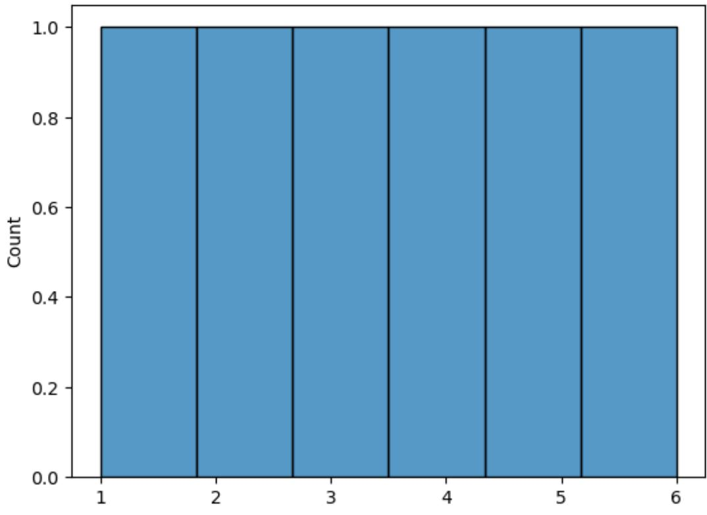
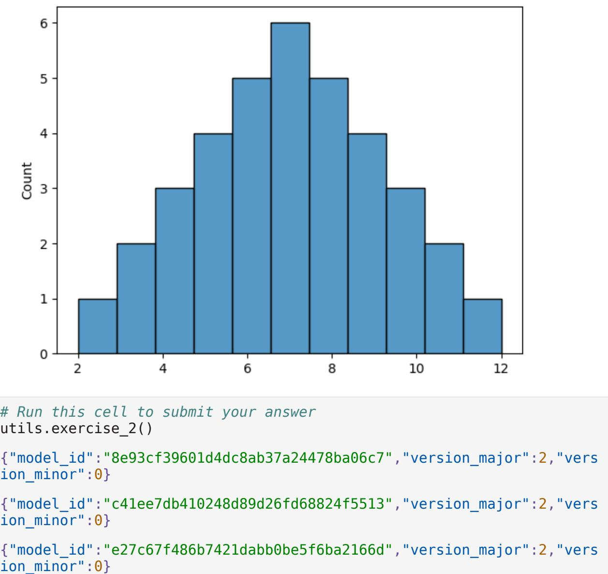
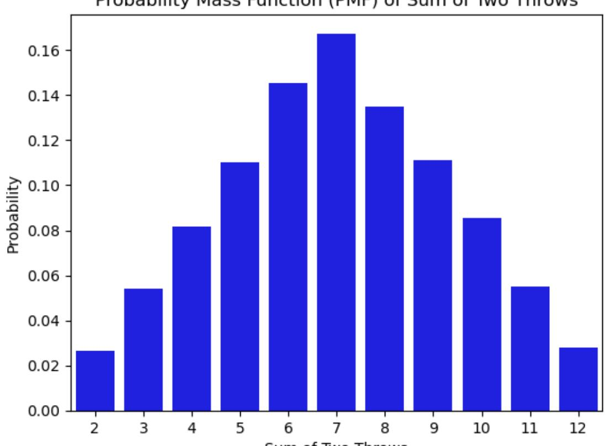

# Probability 2: Loaded dice

In this assignment you will be reinforcening your intuition about the concepts covered in the lectures by taking the example with the dice to the next level.

This assignment will not evaluate your coding skills but rather your intuition and analytical skills. You can answer any of the exercise questions by any means necessary, you can take the analytical route and compute the exact values or you can alternatively create some code that simulates the situations at hand and provide approximate values (grading will have some tolerance to allow approximate solutions). It is up to you which route you want to take!

This graded notebook is different from what you might seen in other assignments of this specialization since only your answers are graded and not the code you used to get that answer. For every exercise there is a blank cell that you can use to make your calculations, this cell has just been placed there for you convenience but **will not be graded** so you can leave empty if you want to.

However **you need to submit the answer for that exercise by running the cell that contains the utils.exercise_x() function**. By running this cell a widget will appear in which you can place your answers. Don't forget to click the Save your answer! button.

```
import numpy as np
import pandas as pd
import seaborn as sns
import matplotlib.pyplot as plt
import utils
```
## Some concept clarifications

During this assignment you will be presented with various scenarios that involve dice. Usually dice can have different numbers of sides and can be either fair or loaded.

- A fair dice has equal probability of landing on every side.
- A loaded dice does not have equal probability of landing on every side. Usually one (or more) sides have a greater probability of showing up than the rest.

Let's get started!

# Exercise 1:

Given a 6-sided fair dice (all of the sides have equal probability of showing up), compute the mean and variance for the probability distribution that models said dice. The next figure shows you a visual represenatation of said distribution:

### **Submission considerations:**

- Submit your answers as floating point numbers with three digits after the decimal point
- Example: To submit the value of 1/4 enter 0.250

### Hints:

- You can use np.random.choice to simulate a fair dice.
- You can use np.mean and np.var to compute the mean and variance of a numpy array.

*# You can use this cell for your calculations (not graded)* x = [1,2,3,4,5,6]

sns.histplot(x, bins=6) mean = np.mean(x) var = np.var(x) print(mean,var)

3.5 2.9166666666666665



*# Run this cell to submit your answer* utils.exercise_1()

```
{"model_id":"23b6ddeb6454448aad606ad483cce3af","version_major":2,"vers
ion_minor":0}
```
{"model_id":"7595e6303d2d4ca6bb1ea02f81b815f5","version_major":2,"vers ion_minor":0}

```
{"model_id":"5ea10f854e9344ee9b135a22828fb2a4","version_major":2,"vers
ion_minor":0}
```
{"model_id":"96f5a6ba392842578d05abfc12e2187a","version_major":2,"vers ion_minor":0}

# Exercise 2:

Now suppose you are throwing the dice (same dice as in the previous exercise) two times and recording the sum of each throw. Which of the following probability mass functions will be the one you should get?

- You can use numpy arrays to hold the results of many throws.
- You can sum to numpy arrays by using the + operator like this: sum = first_throw + second_throw
- To simulate multiple throws of a dice you can use list comprehension or a for loop

```
# You can use this cell for your calculations (not graded)
ans_arr = []
for i in x:
 for j in x:
 ans_arr.append(i+j)
sns.histplot(x=ans_arr,bins=11)
<Axes: ylabel='Count'>
```


### Exercise 3:

Given a fair 4-sided dice, you throw it two times and record the sum. The figure on the left shows the probabilities of the dice landing on each side and the right figure the histogram of the sum. Fill out the probabilities of each sum (notice that the distribution of the sum is symmetrical so you only need to input 4 values in total):

#### **Submission considerations:**

- Submit your answers as floating point numbers with three digits after the decimal point
- Example: To submit the value of 1/4 enter 0.250

*# You can use this cell for your calculations (not graded)*

def plot_pmf_fair_dice(): *# Define the probabilities of each side of the die* probabilities = [1/6, 1/6, 1/6, 1/6, 1/6, 1/6]

 *# Perform the two throws and calculate the sum* throws = np.random.choice([1, 2, 3, 4, 5, 6], size=(10000, 2), p=probabilities) sums = np.sum(throws, axis=1)

 *# Calculate the PMF for each possible sum* unique_sums, counts = np.unique(sums, return_counts=True) pmf = counts / len(sums)

 *# Plot the PMF using seaborn* sns.barplot(x=unique_sums, y=pmf, color='blue') plt.xlabel('Sum of Two Throws') plt.ylabel('Probability') plt.title('Probability Mass Function (PMF) of Sum of Two Throws') plt.show() plot_pmf_fair_dice()



```
# Run this cell to submit your answer
utils.exercise_3()
{"model_id":"7a492595c5bb48ffba3dd5ba664adb7b","version_major":2,"vers
ion_minor":0}
{"model_id":"3e073bc6246d49a19c3f037c47cc0ea8","version_major":2,"vers
ion_minor":0}
{"model_id":"f00c15dd81894801a5db633d865d3627","version_major":2,"vers
ion_minor":0}
{"model_id":"750910c7a5f843d080b0a7748c1d6cbb","version_major":2,"vers
ion_minor":0}
{"model_id":"c489e0cf50fd4689b51eda57a3283845","version_major":2,"vers
ion_minor":0}
{"model_id":"4fd5bed437724d89b27e78e1c229a34f","version_major":2,"vers
ion_minor":0}
```
### Exercise 4:

Using the same scenario as in the previous exercise. Compute the mean and variance of the sum of the two throws and the covariance between the first and the second throw:

- You can use np.cov to compute the covariance of two numpy arrays (this may not be needed for this particular exercise).

```
# You can use this cell for your calculations (not graded)
print(np.mean(sum_throws))
print(np.var(sum_throws))
print(np.cov(throws[:, 0], throws[:, 1]))
----------------------------------------------------------------------
-----
NameError Traceback (most recent call 
last)
Cell In[8], line 3
 1 # You can use this cell for your calculations (not graded)
----> 3 print(np.mean(sum_throws))
 4 print(np.var(sum_throws))
 5 print(np.cov(throws[:, 0], throws[:, 1]))
NameError: name 'sum_throws' is not defined
```

```
# Run this cell to submit your answer
utils.exercise_4()
{"model_id":"10c51162f80f4668856940776e9d0cff","version_major":2,"vers
ion_minor":0}
{"model_id":"479c7f61cda74299832ec48cf448a700","version_major":2,"vers
ion_minor":0}
{"model_id":"0abcc8f00302494e963deb2c2067243b","version_major":2,"vers
ion_minor":0}
{"model_id":"8e36aa70e9044abba76790bd1e0a5740","version_major":2,"vers
ion_minor":0}
{"model_id":"4e55a5de31e8493190fd932a353b8c46","version_major":2,"vers
ion_minor":0}
```
## Exercise 5:

Now suppose you are have a loaded 4-sided dice (it is loaded so that it lands twice as often on side 2 compared to the other sides):

You are throwing it two times and recording the sum of each throw. Which of the following probability mass functions will be the one you should get?

```
• You can use the p parameter of np.random.choice to simulate a loaded dice.
# You can use this cell for your calculations (not graded)
import numpy as np
import seaborn as sns
import matplotlib.pyplot as plt
def plot_pmf_loaded_dice():
 # Define the probabilities of each side of the dice
 probabilities = [1/5, 2/5, 1/5, 1/5]
 # Normalize the probabilities to sum up to 1
 probabilities = np.array(probabilities) / sum(probabilities)
 # Perform the two throws and calculate the sum
 throws = np.random.choice([1, 2, 3, 4], size=(10000, 2), 
p=probabilities)
 sums = np.sum(throws, axis=1)
```

```
 # Calculate the PMF for each possible sum
 unique_sums, counts = np.unique(sums, return_counts=True)
 pmf = counts / len(sums)
```

```
 # Plot the PMF using seaborn
 sns.barplot(x=unique_sums, y=pmf, color='blue')
 plt.xlabel('Sum of Two Throws')
 plt.ylabel('Probability')
 plt.title('Probability Mass Function (PMF) of Sum of Two Throws')
 plt.show()
plot_pmf_loaded_dice()
# Run this cell to submit your answer
utils.exercise_5()
{"model_id":"ef75002c417b4fb28b4bb5af1aaf9a77","version_major":2,"vers
ion_minor":0}
{"model_id":"d48845e3fe4d47d9b24cb561654fa58f","version_major":2,"vers
ion_minor":0}
{"model_id":"2ddb6df270b74e7a91ff158c9de19cd5","version_major":2,"vers
ion_minor":0}
```
### Exercise 6:

You have a 6-sided dice that is loaded so that it lands twice as often on side 3 compared to the other sides:

You record the sum of throwing it twice. What is the highest value (of the sum) that will yield a cumulative probability lower or equal to 0.5?

```
• The probability of side 3 is equal to 2
                                7
# You can use this cell for your calculations (not graded)
import numpy as np
probabilities = [0.143, 0.143, 0.286, 0.143, 0.143, 0.143]
sum_values = [2, 3, 4, 5, 6, 7, 8, 9, 10, 11, 12]
cumulative_prob = np.cumsum(probabilities) # Calculate cumulative 
probabilities
highest_sum = None
for i, prob in enumerate(cumulative_prob):
 if prob <= 0.5:
 highest_sum = sum_values[i]
```

```
 else:
 break
print("Highest sum with cumulative probability <= 0.5:", highest_sum)
# Run this cell to submit your answer
utils.exercise_6()
{"model_id":"d59c881472f14db6a8aa0459a718d1eb","version_major":2,"vers
ion_minor":0}
{"model_id":"4a73621894574ab4914a1eef690964ab","version_major":2,"vers
ion_minor":0}
{"model_id":"c2b6e46c13374268af4e39d7eaaf3023","version_major":2,"vers
```

```
ion_minor":0}
```
# Exercise 7:

Given a 6-sided fair dice you try a new game. You only throw the dice a second time if the result of the first throw is **lower** or equal to 3. Which of the following probability mass functions will be the one you should get given this new constraint?

- You can simulate the second throws as a numpy array and then make the values that met a certain criteria equal to 0 by using np.where

```
# You can use this cell for your calculations (not graded)
import numpy as np
import matplotlib.pyplot as plt
def plot_pmf_dice():
 num_sides = 6
 outcomes = range(2, 2 * num_sides + 1) # Possible outcomes of the
sum of two dice throws
 probabilities = np.zeros(len(outcomes)) # Initialize 
probabilities array
 for i in range(1, num_sides + 1):
 for j in range(1, num_sides + 1):
 if i <= 3:
 probabilities[i + j - 2] += 1 / num_sides # Increment
probability if the first throw is <= 3
 else:
 probabilities[i + j - 2] += 1 / (num_sides - 3) # 
Increment probability if the first throw is > 3
 probabilities /= np.sum(probabilities) # Normalize probabilities
 plt.bar(outcomes, probabilities)
```

```
 plt.xlabel('Sum of Dice')
 plt.ylabel('Probability')
 plt.title('Probability Mass Function of Sum of Dice')
 plt.show()
# Call the function to plot the PMF
plot_pmf_dice()
# Run this cell to submit your answer
utils.exercise_7()
{"model_id":"fcb4715788a54d9dae35b45bb5643f2f","version_major":2,"vers
ion_minor":0}
{"model_id":"fd9c654fd9624c01a4e24a3db3031a4f","version_major":2,"vers
ion_minor":0}
{"model_id":"b29d3cd06a05494e986fcc0e46d6dcd4","version_major":2,"vers
ion_minor":0}
```
### Exercise 8:

Given the same scenario as in the previous exercise but with the twist that you only throw the dice a second time if the result of the first throw is **greater** or equal to 3. Which of the following probability mass functions will be the one you should get given this new constraint?

```
# You can use this cell for your calculations (not graded)
dice_throws = np.random.choice(dice, size=(10000, 2))
filtered_l3 = np.sum(dice_throws[dice_throws[:, 0] >= 3], axis=1) # 
less than or equal to 3
probs = np.zeros(len(range(2, 13)))
for i in range(len(probs)):
 probs[i] = filtered_l3[i] / 6
 
probs /= np.sum(probs)
sns.barplot(x=[2,3,4,5,6,7,8,9,10,11,12], y=probs)
# Run this cell to submit your answer
utils.exercise_8()
{"model_id":"9facb0badc4c4521ba3b82bc7503c649","version_major":2,"vers
ion_minor":0}
{"model_id":"5e5bd759d2b8405f86e71508ae5fda26","version_major":2,"vers
ion_minor":0}
{"model_id":"de538f61871c4c2dbe6871c9439744e3","version_major":2,"vers
ion_minor":0}
```
## Exercise 9:

Given a n-sided fair dice. You throw it twice and record the sum. How does increasing the number of sides n of the dice impact the mean and variance of the sum and the covariance of the joint distribution?

```
# You can use this cell for your calculations (not graded)
for i in range(2,11):
 t = np.arange(1,i)
 print(np.mean(t), np.var(t), np.cov(t))
# Run this cell to submit your answer
utils.exercise_9()
As the number of sides in the die increases:
{"model_id":"6f41647cc0f14bfdb7a65595ea10a5f0","version_major":2,"vers
ion_minor":0}
{"model_id":"d8690397bdd8439ea9b0aa612ad5c942","version_major":2,"vers
ion_minor":0}
{"model_id":"0f39a1eaa94b48a98bc35cd2d8cae47c","version_major":2,"vers
ion_minor":0}
{"model_id":"c160521c1c3141cda1c9decf23eb5056","version_major":2,"vers
ion_minor":0}
{"model_id":"92f9b583358b446492d8ddd60d09b58e","version_major":2,"vers
ion_minor":0}
```
## Exercise 10:

Given a 6-sided loaded dice. You throw it twice and record the sum. Which of the following statements is true?

```
# You can use this cell for your calculations (not graded)
# Run this cell to submit your answer
utils.exercise_10()
{"model_id":"d53f090a43f34068b37363b0dadbba6b","version_major":2,"vers
ion_minor":0}
{"model_id":"5da87cf808bc47dbaaaf22b62fa1ebac","version_major":2,"vers
ion_minor":0}
{"model_id":"76a255ef440e48888a6a3d0e16d23ad8","version_major":2,"vers
ion_minor":0}
```
## Exercise 11:

Given a fair n-sided dice. You throw it twice and record the sum but the second throw depends on the result of the first one such as in exercises 7 and 8. Which of the following statements is true?

```
# You can use this cell for your calculations (not graded)
t = np.random.choice(6, (10000, 2), p=[0.143, 0.143, 0.286, 0.143, 
0.143, 0.142])
sums = np.sum(t, axis=1)
print(np.mean(sums), np.var(sums), np.cov(sums))
# Run this cell to submit your answer
utils.exercise_11()
{"model_id":"ff235702f71d49c4a42388452bd11757","version_major":2,"vers
ion_minor":0}
{"model_id":"05aecbb780d14d9998f34aa174f9a69b","version_major":2,"vers
ion_minor":0}
{"model_id":"81b71dc28e5849e092f14bcabaefa5f1","version_major":2,"vers
ion_minor":0}
```
## Exercise 12:

Given a n-sided dice (could be fair or not). You throw it twice and record the sum (there is no dependance between the throws). If you are only given the histogram of the sums can you use it to know which are the probabilities of the dice landing on each side?

In other words, if you are provided with only the histogram of the sums like this one:

Could you use it to know the probabilities of the dice landing on each side? Which will be equivalent to finding this histogram:

```
# You can use this cell for your calculations (not graded)
# Run this cell to submit your answer
utils.exercise_12()
{"model_id":"d54d6701be7a4e29ba712639cca7d979","version_major":2,"vers
ion_minor":0}
{"model_id":"17e35bf410b04985ad8ff023700d0fe1","version_major":2,"vers
ion_minor":0}
{"model_id":"e1bc44b748c54704aad688ac8a280d82","version_major":2,"vers
ion_minor":0}
```
# Before Submitting Your Assignment

Run the next cell to check that you have answered all of the exercises

utils.check_submissions()

All answers saved, you can submit the assignment for grading!

#### **Congratulations on finishing this assignment!**

During this assignment you tested your knowledge on probability distributions, descriptive statistics and visual interpretation of these concepts. You had the choice to compute everything analytically or create simulations to assist you get the right answer. You probably also realized that some exercises could be answered without any computations just by looking at certain hidden queues that the visualizations revealed.

#### **Keep up the good work!**

