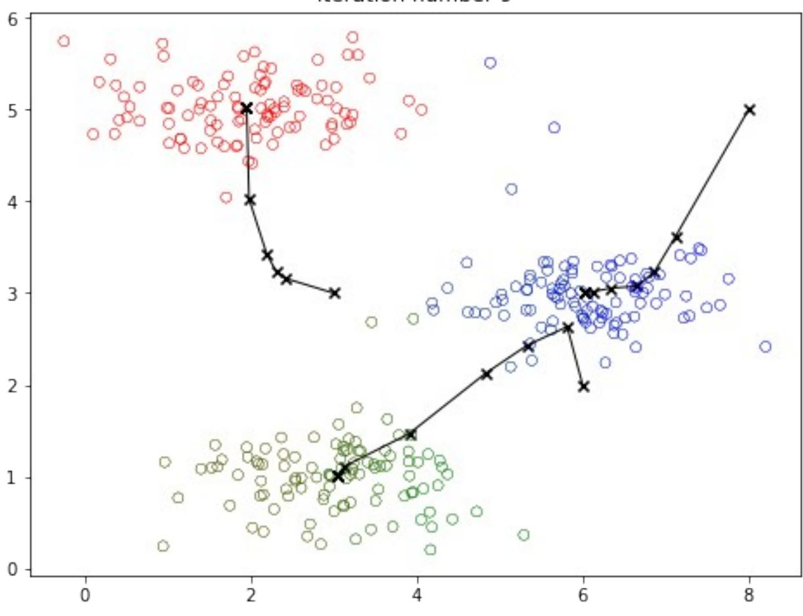
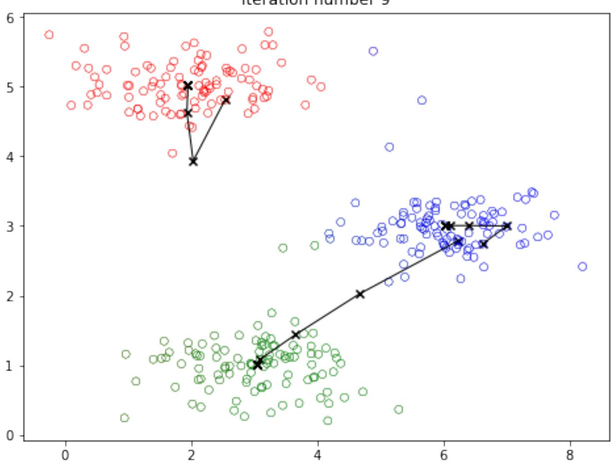
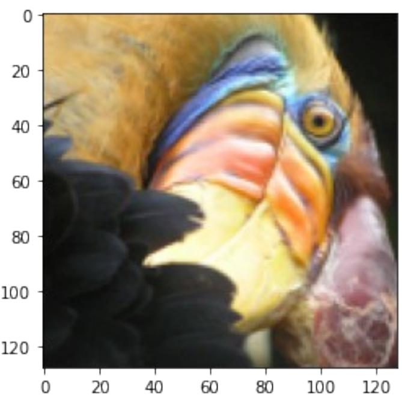
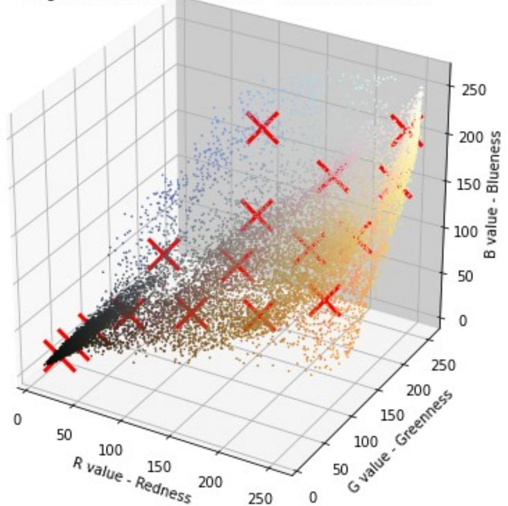
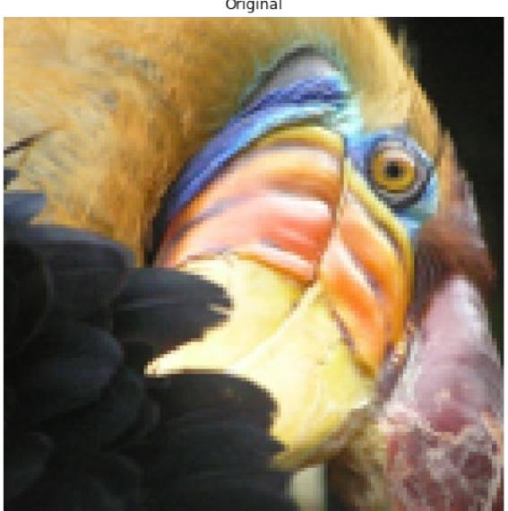
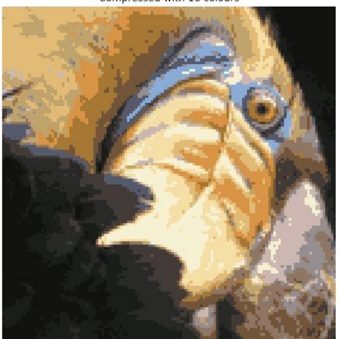

# K-means Clustering

In this exercise, you will implement the K-means algorithm and use it for image compression.

- You will start with a sample dataset that will help you gain an intuition of how the Kmeans algorithm works.
- After that, you will use the K-means algorithm for image compression by reducing the number of colors that occur in an image to only those that are most common in that image.

# Outline

- 1 Implementing K-means
	- 1.1 Finding closest centroids
		- Exercise 1
	- 1.2 Computing centroid means
		- Exercise 2
- 2 K-means on a sample dataset
- 3 Random initialization
- 4 Image compression with K-means
	- 4.1 Dataset
	- 4.2 K-Means on image pixels
	- 4.3 Compress the image

**NOTE:** To prevent errors from the autograder, you are not allowed to edit or delete non-graded cells in this lab. Please also refrain from adding any new cells. **Once you have passed this assignment** and want to experiment with any of the non-graded code, you may follow the instructions at the bottom of this notebook.

First, run the cell below to import the packages needed in this assignment:

- numpy is the fundamental package for scientific computing with Python.
- matplotlib is a popular library to plot graphs in Python.
- utils.py contains helper functions for this assignment. You do not need to modify code in this file.

import numpy as np import matplotlib.pyplot as plt from utils import *

%matplotlib inline

# 1 - Implementing K-means

The K-means algorithm is a method to automatically cluster similar data points together.

- Concretely, you are given a training set {x ( 1) *,...,* x (m) }, and you want to group the data into a few cohesive "clusters".
- K-means is an iterative procedure that
	- Starts by guessing the initial centroids, and then
	- Refines this guess by
		- Repeatedly assigning examples to their closest centroids, and then
		- Recomputing the centroids based on the assignments.
- In pseudocode, the K-means algorithm is as follows:

```
# Initialize centroids
# K is the number of clusters
centroids = kMeans_init_centroids(X, K)
for iter in range(iterations):
 # Cluster assignment step: 
 # Assign each data point to the closest centroid. 
 # idx[i] corresponds to the index of the centroid 
 # assigned to example i
 idx = find_closest_centroids(X, centroids)
 # Move centroid step: 
 # Compute means based on centroid assignments
 centroids = compute_centroids(X, idx, K)
```
- The inner-loop of the algorithm repeatedly carries out two steps:
	- a. Assigning each training example x (i ) to its closest centroid, and
	- b. Recomputing the mean of each centroid using the points assigned to it.
- The K-means algorithm will always converge to some final set of means for the centroids.
- However, the converged solution may not always be ideal and depends on the initial setting of the centroids.
	- Therefore, in practice the K-means algorithm is usually run a few times with different random initializations.
	- One way to choose between these different solutions from different random initializations is to choose the one with the lowest cost function value (distortion).

You will implement the two phases of the K-means algorithm separately in the next sections.

- You will start by completing find_closest_centroid and then proceed to complete compute_centroids.
### 1.1 Finding closest centroids

In the "cluster assignment" phase of the K-means algorithm, the algorithm assigns every training example x (i ) to its closest centroid, given the current positions of centroids.

### Exercise 1

Your task is to complete the code in find_closest_centroids.

- This function takes the data matrix X and the locations of all centroids inside centroids
- It should output a one-dimensional array idx (which has the same number of elements as X) that holds the index of the closest centroid (a value in {0 ,. . .,K −1 }, where K is total number of centroids) to every training example . (Note: The index range 0 to K-1 varies slightly from what is shown in the lectures (i.e. 1 to K) because Python list indices start at 0 instead of 1)
- Specifically, for every example x (i ) we set

$$c^{^{[i]}}:=j\,t h\,a t\,m i\,n i\,m i\,z e s|\rangle\,x^{^{[i]}}-\mu_{j]}\rangle^{2}\,,$$

where

- c (i ) is the index of the centroid that is closest to x (i ) (corresponds to idx[i] in the starter code), and
- μ j is the position (value) of the j'th centroid. (stored in centroids in the starter code)
- |)x ( i)− μj|) is the L2-norm

If you get stuck, you can check out the hints presented after the cell below to help you with the implementation.

```
# UNQ_C1
# GRADED FUNCTION: find_closest_centroids
def find_closest_centroids(X, centroids):
 """
 Computes the centroid memberships for every example
 
 Args:
 X (ndarray): (m, n) Input values 
 centroids (ndarray): (K, n) centroids
 
 Returns:
 idx (array_like): (m,) closest centroids
 
 """
 # Set K
 K = centroids.shape[0]
```

```
 # You need to return the following variables correctly
 idx = np.zeros(X.shape[0], dtype=int)
 ### START CODE HERE ###
 for i in range(X.shape[0]):
 # Array to hold distance between X[i] and each centroids[j]
 distance = [] 
 for j in range(centroids.shape[0]):
 norm_ij = np.linalg.norm(X[i] - centroids[j])
 distance.append(norm_ij)
 idx[i] = np.argmin(distance)
 ### END CODE HERE ###
 return idx
```
Now let's check your implementation using an example dataset

*# Load an example dataset that we will be using* X = load_data()

The code below prints the first five elements in the variable X and the dimensions of the variable

```
print("First five elements of X are:\n", X[:5]) 
print('The shape of X is:', X.shape)
First five elements of X are:
 [[1.84207953 4.6075716 ]
 [5.65858312 4.79996405]
 [6.35257892 3.2908545 ]
 [2.90401653 4.61220411]
 [3.23197916 4.93989405]]
The shape of X is: (300, 2)
# Select an initial set of centroids (3 Centroids)
initial_centroids = np.array([[3,3], [6,2], [8,5]])
# Find closest centroids using initial_centroids
idx = find_closest_centroids(X, initial_centroids)
# Print closest centroids for the first three elements
print("First three elements in idx are:", idx[:3])
# UNIT TEST
from public_tests import *
find_closest_centroids_test(find_closest_centroids)
```
First three elements in idx are: [0 2 1] All tests passed!

**Expected Output**: First three elements in idx are [0 2 1]

### 1.2 Computing centroid means

Given assignments of every point to a centroid, the second phase of the algorithm recomputes, for each centroid, the mean of the points that were assigned to it.

#### Exercise 2

Please complete the compute_centroids below to recompute the value for each centroid

- Specifically, for every centroid μk we set

$$\mu_{k}{=}{\frac{1}{\left|C_{k}\right|}}\sum_{i\in C_{k}}\,x^{\left|i\right|}$$

where

- Ck is the set of examples that are assigned to centroid k
- |Ck ) is the number of examples in the set Ck
- Concretely, if two examples say x (3 ) and x (5 ) are assigned to centroid k=2, then you should update μ2= 1 2 ( x ( 3)+x (5) ).

If you get stuck, you can check out the hints presented after the cell below to help you with the implementation.

```
# UNQ_C2
# GRADED FUNCTION: compute_centroids
def compute_centroids(X, idx, K):
 """
 Returns the new centroids by computing the means of the 
 data points assigned to each centroid.
 
 Args:
 X (ndarray): (m, n) Data points
 idx (ndarray): (m,) Array containing index of closest centroid
for each 
 example in X. Concretely, idx[i] contains the 
index of 
 the centroid closest to example i
```

```
 K (int): number of centroids
 Returns:
 centroids (ndarray): (K, n) New centroids computed
 """
 # Useful variables
 m, n = X.shape
 # You need to return the following variables correctly
 centroids = np.zeros((K, n))
 ### START CODE HERE ###
 for k in range(K): 
 points = X[idx == k] 
 centroids[k] = np.mean(points, axis = 0)
 ### END CODE HERE ## 
 return centroids
```
Now check your implementation by running the cell below

```
K = 3
centroids = compute_centroids(X, idx, K)
print("The centroids are:", centroids)
# UNIT TEST
compute_centroids_test(compute_centroids)
The centroids are: [[2.42830111 3.15792418]
 [5.81350331 2.63365645]
 [7.11938687 3.6166844 ]]
All tests passed!
```
#### **Expected Output**:

2.42830111 3.15792418

5.81350331 2.63365645

7.11938687 3.6166844

## 2 - K-means on a sample dataset

After you have completed the two functions (find_closest_centroids and compute_centroids) above, the next step is to run the K-means algorithm on a toy 2D dataset to help you understand how K-means works.

- We encourage you to take a look at the function (run_kMeans) below to understand how it works.
- Notice that the code calls the two functions you implemented in a loop.

When you run the code below, it will produce a visualization that steps through the progress of the algorithm at each iteration.

- At the end, your figure should look like the one displayed in Figure 1.
- The final centroids are the black X-marks in the middle of the colored clusters.
- You can see how these centroids got to their final location by looking at the other Xmarks connected to it.

**Note**: You do not need to implement anything for this part. Simply run the code provided below

```
# You do not need to implement anything for this part
def run_kMeans(X, initial_centroids, max_iters=10, 
plot_progress=False):
 """
 Runs the K-Means algorithm on data matrix X, where each row of X
 is a single example
 """
 
 # Initialize values
 m, n = X.shape
 K = initial_centroids.shape[0]
 centroids = initial_centroids
 previous_centroids = centroids 
 idx = np.zeros(m)
 plt.figure(figsize=(8, 6))
 # Run K-Means
 for i in range(max_iters):
 
 #Output progress
 print("K-Means iteration %d/%d" % (i, max_iters-1))
 
 # For each example in X, assign it to the closest centroid
 idx = find_closest_centroids(X, centroids)
 
 # Optionally plot progress
 if plot_progress:
 plot_progress_kMeans(X, centroids, previous_centroids, 
idx, K, i)
 previous_centroids = centroids
 
 # Given the memberships, compute new centroids
 centroids = compute_centroids(X, idx, K)
```
 plt.show() return centroids, idx

```
# Load an example dataset
X = load_data()
```

```
# Set initial centroids
initial_centroids = np.array([[3,3],[6,2],[8,5]])
```
*# Number of iterations* max_iters = 10

```
# Run K-Means
centroids, idx = run_kMeans(X, initial_centroids, max_iters, 
plot_progress=True)
```

| K-Means iteration 0/9 |
| --- |
| K-Means iteration 1/9 |
| K-Means iteration 2/9 |
| K-Means iteration 3/9 |
| K-Means iteration 4/9 |
| K-Means iteration 5/9 |
| K-Means iteration 6/9 |
| K-Means iteration 7/9 |
| K-Means iteration 8/9 |
| K-Means iteration 9/9 |



# 3 - Random initialization

The initial assignments of centroids for the example dataset was designed so that you will see the same figure as in Figure 1. In practice, a good strategy for initializing the centroids is to select random examples from the training set.

In this part of the exercise, you should understand how the function kMeans_init_centroids is implemented.

- The code first randomly shuffles the indices of the examples (using np.random.permutation()).
- Then, it selects the first K examples based on the random permutation of the indices.
- This allows the examples to be selected at random without the risk of selecting the same example twice.

**Note**: You do not need to implement anything for this part of the exercise.

```
# You do not need to modify this part
def kMeans_init_centroids(X, K):
 """
 This function initializes K centroids that are to be 
 used in K-Means on the dataset X
 
 Args:
 X (ndarray): Data points 
 K (int): number of centroids/clusters
 
 Returns:
 centroids (ndarray): Initialized centroids
 """
 
 # Randomly reorder the indices of examples
 randidx = np.random.permutation(X.shape[0])
 
 # Take the first K examples as centroids
 centroids = X[randidx[:K]]
 
 return centroids
```
You can run K-Means again but this time with random initial centroids. Run the cell below several times and observe how different clusters are created based on the initial points chosen.

```
# Run this cell repeatedly to see different outcomes.
# Set number of centroids and max number of iterations
K = 3
max_iters = 10
# Set initial centroids by picking random examples from the dataset
initial_centroids = kMeans_init_centroids(X, K)
# Run K-Means
centroids, idx = run_kMeans(X, initial_centroids, max_iters, 
plot_progress=True)
K-Means iteration 0/9
K-Means iteration 1/9
K-Means iteration 2/9
K-Means iteration 3/9
K-Means iteration 4/9
K-Means iteration 5/9
K-Means iteration 6/9
K-Means iteration 7/9
K-Means iteration 8/9
K-Means iteration 9/9
```


# 4 - Image compression with K-means

In this exercise, you will apply K-means to image compression.

- In a straightforward 24-bit color representation of an image❑ 2 , each pixel is represented as three 8-bit unsigned integers (ranging from 0 to 255) that specify the red, green and blue intensity values. This encoding is often refered to as the RGB encoding.
- Our image contains thousands of colors, and in this part of the exercise, you will reduce the number of colors to 16 colors.
- By making this reduction, it is possible to represent (compress) the photo in an efficient way.
- Specifically, you only need to store the RGB values of the 16 selected colors, and for each pixel in the image you now need to only store the index of the color at that location (where only 4 bits are necessary to represent 16 possibilities).

In this part, you will use the K-means algorithm to select the 16 colors that will be used to represent the compressed image.

- Concretely, you will treat every pixel in the original image as a data example and use the K-means algorithm to find the 16 colors that best group (cluster) the pixels in the 3 dimensional RGB space.
- Once you have computed the cluster centroids on the image, you will then use the 16 colors to replace the pixels in the original image.

❑ 2The provided photo used in this exercise belongs to Frank Wouters and is used with his permission.

### 4.1 Dataset

#### **Load image**

First, you will use matplotlib to read in the original image, as shown below.

```
# Load an image of a bird
original_img = plt.imread('bird_small.png')
```
#### **Visualize image**

You can visualize the image that was just loaded using the code below.

```
# Visualizing the image
plt.imshow(original_img)
```
<matplotlib.image.AxesImage at 0x7f77d58ee710>



#### **Check the dimension of the variable**

As always, you will print out the shape of your variable to get more familiar with the data.

print("Shape of original_img is:", original_img.shape) Shape of original_img is: (128, 128, 3)

As you can see, this creates a three-dimensional matrix original_img where

- the first two indices identify a pixel position, and
- the third index represents red, green, or blue.

For example, original_img[50, 33, 2] gives the blue intensity of the pixel at row 50 and column 33.

#### Processing data

To call the run_kMeans, you need to first transform the matrix original_img into a twodimensional matrix.

- The code below reshapes the matrix original_img to create an m ×3 matrix of pixel colors (where m=16384=128×128)
Note: If you'll try this exercise later on a JPG file, you first need to divide the pixel values by 255 so it will be in the range 0 to 1. This is not necessary for PNG files (e.g. *bird_small.png*) because it is already loaded in the required range (as mentioned in the plt.imread() documentation). We commented a line below for this so you can just uncomment it later in case you want to try a different file.

```
# Divide by 255 so that all values are in the range 0 - 1 (not needed 
for PNG files)
# original_img = original_img / 255
# Reshape the image into an m x 3 matrix where m = number of pixels
# (in this case m = 128 x 128 = 16384)
# Each row will contain the Red, Green and Blue pixel values
# This gives us our dataset matrix X_img that we will use K-Means on.
X_img = np.reshape(original_img, (original_img.shape[0] *
original_img.shape[1], 3))
```
### 4.2 K-Means on image pixels

Now, run the cell below to run K-Means on the pre-processed image.

```
# Run your K-Means algorithm on this data
# You should try different values of K and max_iters here
K = 16
```
max_iters = 10 *# Using the function you have implemented above.*  initial_centroids = kMeans_init_centroids(X_img, K) *# Run K-Means - this can take a couple of minutes depending on K and max_iters* centroids, idx = run_kMeans(X_img, initial_centroids, max_iters) K-Means iteration 0/9 K-Means iteration 1/9 K-Means iteration 2/9 K-Means iteration 3/9 K-Means iteration 4/9 K-Means iteration 5/9 K-Means iteration 6/9 K-Means iteration 7/9 K-Means iteration 8/9 K-Means iteration 9/9 <Figure size 576x432 with 0 Axes> print("Shape of idx:", idx.shape) print("Closest centroid for the first five elements:", idx[:5]) Shape of idx: (16384,) Closest centroid for the first five elements: [1 1 1 1 1]

The code below will plot all the colors found in the original image. As mentioned earlier, the color of each pixel is represented by RGB values so the plot should have 3 axes -- R, G, and B. You'll notice a lot of dots below representing thousands of colors in the original image. The red markers represent the centroids after running K-means. These will be the 16 colors that you will use to compress the image.

*# Plot the colors of the image and mark the centroids* plot_kMeans_RGB(X_img, centroids, idx, K)



You can visualize the colors at each of the red markers (i.e. the centroids) above with the function below. You will only see these colors when you generate the new image in the next section. The number below each color is its index and these are the numbers you see in the idx array.


## 4.3 Compress the image

After finding the top K=16 colors to represent the image, you can now assign each pixel position to its closest centroid using the find_closest_centroids function.

- This allows you to represent the original image using the centroid assignments of each pixel.
- Notice that you have significantly reduced the number of bits that are required to describe the image.
	- The original image required 24 bits (i.e. 8 bits x 3 channels in RGB encoding) for each one of the 128×128 pixel locations, resulting in total size of 128×128×24=393 ,216 bits.
	- The new representation requires some overhead storage in form of a dictionary of 16 colors, each of which require 24 bits, but the image itself then only requires 4 bits per pixel location.
	- The final number of bits used is therefore 16×24+128×128×4=65 , 920 bits, which corresponds to compressing the original image by about a factor of 6.

```
# Find the closest centroid of each pixel
idx = find_closest_centroids(X_img, centroids)
# Replace each pixel with the color of the closest centroid
X_recovered = centroids[idx, :] 
# Reshape image into proper dimensions
X_recovered = np.reshape(X_recovered, original_img.shape)
```
Finally, you can view the effects of the compression by reconstructing the image based only on the centroid assignments.

- Specifically, you replaced each pixel with the value of the centroid assigned to it.
- Figure 3 shows a sample reconstruction. Even though the resulting image retains most of the characteristics of the original, you will also see some compression artifacts because of the fewer colors used.
- Run the code below to see how the image is reconstructed using the 16 colors selected earlier.

```
# Display original image
fig, ax = plt.subplots(1,2, figsize=(16,16))
plt.axis('off')
ax[0].imshow(original_img)
ax[0].set_title('Original')
ax[0].set_axis_off()
# Display compressed image
```
ax[1].imshow(X_recovered) ax[1].set_title('Compressed with %d colours'%K) ax[1].set_axis_off()





**Congratulations on completing this lab on K-means clustering! In the next lesson, you will learn about another use case of unsupervised learning: anomaly detection. See you there!**

