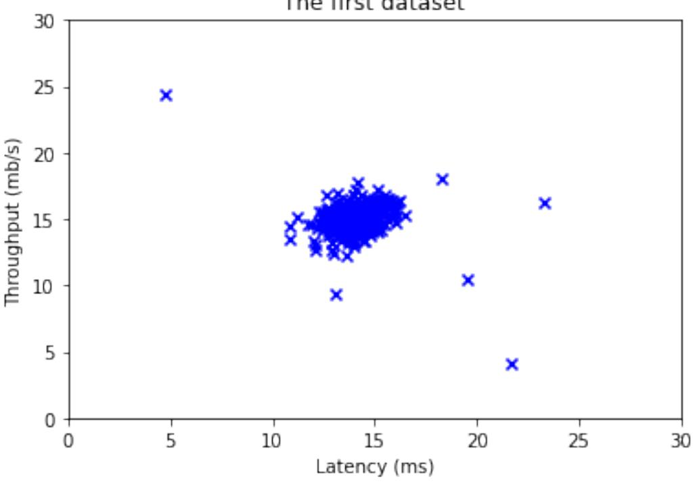
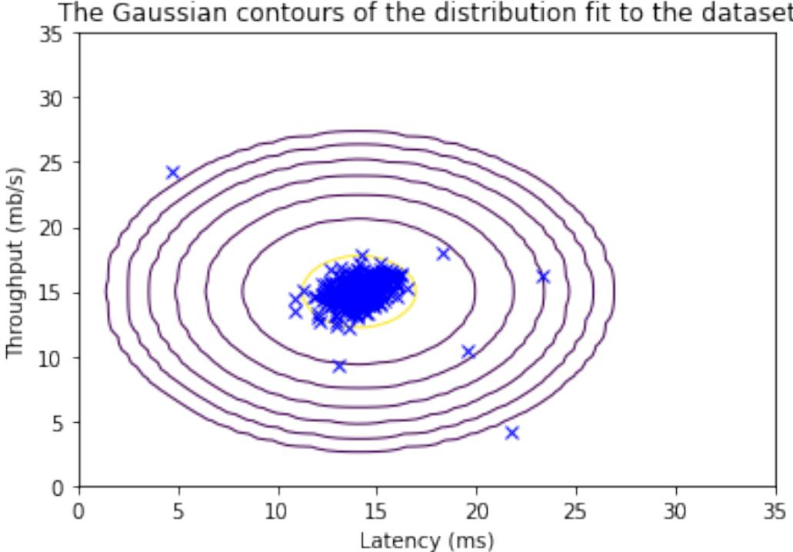
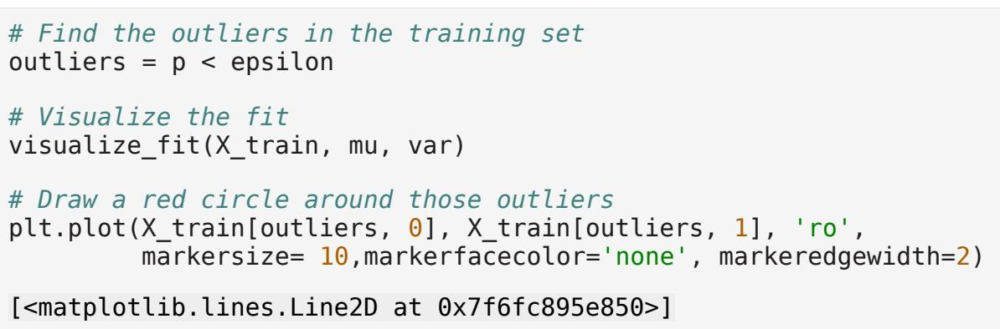
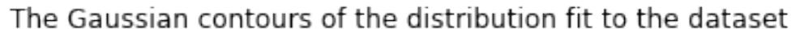
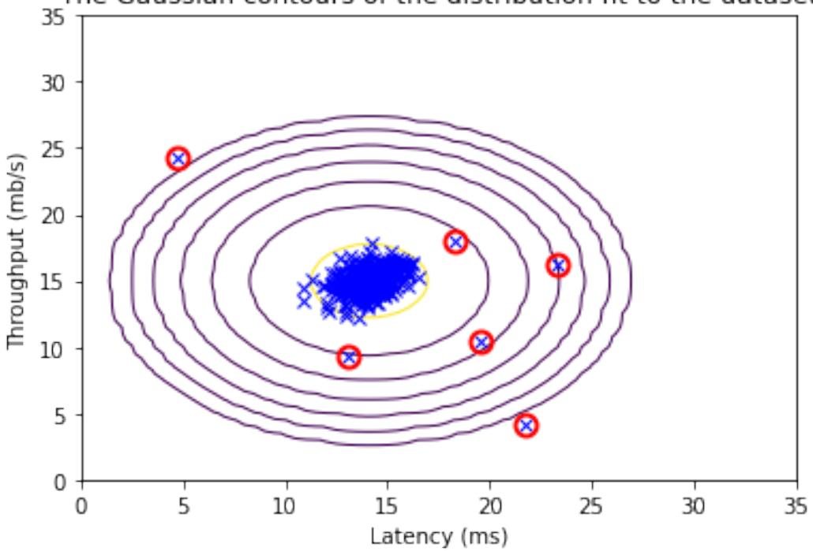

# Anomaly Detection

In this exercise, you will implement the anomaly detection algorithm and apply it to detect failing servers on a network.

# Outline

- 1 Packages
- 2 Anomaly detection
	- 2.1 Problem Statement
	- 2.2 Dataset
	- 2.3 Gaussian distribution
		- Exercise 1
		- Exercise 2
	- 2.4 High dimensional dataset

**NOTE:** To prevent errors from the autograder, you are not allowed to edit or delete non-graded cells in this lab. Please also refrain from adding any new cells. **Once you have passed this assignment** and want to experiment with any of the non-graded code, you may follow the instructions at the bottom of this notebook.

# 1 - Packages

First, let's run the cell below to import all the packages that you will need during this assignment.

- numpy is the fundamental package for working with matrices in Python.
- matplotlib is a famous library to plot graphs in Python.
- utils.py contains helper functions for this assignment. You do not need to modify code in this file.

import numpy as np import matplotlib.pyplot as plt from utils import * %matplotlib inline

# 2 - Anomaly detection

### 2.1 Problem Statement

In this exercise, you will implement an anomaly detection algorithm to detect anomalous behavior in server computers.

The dataset contains two features -

- throughput (mb/s) and
- latency (ms) of response of each server.

While your servers were operating, you collected m=307 examples of how they were behaving, and thus have an unlabeled dataset {x ( 1) ,…, x (m) }.

- You suspect that the vast majority of these examples are "normal" (non-anomalous) examples of the servers operating normally, but there might also be some examples of servers acting anomalously within this dataset.
You will use a Gaussian model to detect anomalous examples in your dataset.

- You will first start on a 2D dataset that will allow you to visualize what the algorithm is doing.
- On that dataset you will fit a Gaussian distribution and then find values that have very low probability and hence can be considered anomalies.
- After that, you will apply the anomaly detection algorithm to a larger dataset with many dimensions.

## 2.2 Dataset

You will start by loading the dataset for this task.

- The load_data() function shown below loads the data into the variables X_train, X_val and y_val
	- You will use X_train to fit a Gaussian distribution
	- You will use X_val and y_val as a cross validation set to select a threshold and determine anomalous vs normal examples

*# Load the dataset* X_train, X_val, y_val = load_data()

View the variables

Let's get more familiar with your dataset.

- A good place to start is to just print out each variable and see what it contains.
The code below prints the first five elements of each of the variables

*# Display the first five elements of X_train* print("The first 5 elements of X_train are:\n", X_train[:5])

```
The first 5 elements of X_train are:
 [[13.04681517 14.74115241]
 [13.40852019 13.7632696 ]
 [14.19591481 15.85318113]
 [14.91470077 16.17425987]
 [13.57669961 14.04284944]]
# Display the first five elements of X_val
print("The first 5 elements of X_val are\n", X_val[:5]) 
The first 5 elements of X_val are
 [[15.79025979 14.9210243 ]
 [13.63961877 15.32995521]
 [14.86589943 16.47386514]
 [13.58467605 13.98930611]
 [13.46404167 15.63533011]]
# Display the first five elements of y_val
print("The first 5 elements of y_val are\n", y_val[:5]) 
The first 5 elements of y_val are
 [0 0 0 0 0]
```
Check the dimensions of your variables

Another useful way to get familiar with your data is to view its dimensions.

The code below prints the shape of X_train, X_val and y_val.

```
print ('The shape of X_train is:', X_train.shape)
print ('The shape of X_val is:', X_val.shape)
print ('The shape of y_val is: ', y_val.shape)
The shape of X_train is: (307, 2)
The shape of X_val is: (307, 2)
The shape of y_val is: (307,)
```
Visualize your data

Before starting on any task, it is often useful to understand the data by visualizing it.

- For this dataset, you can use a scatter plot to visualize the data (X_train), since it has only two properties to plot (throughput and latency)
- Your plot should look similar to the one below

```
# Create a scatter plot of the data. To change the markers to blue 
"x",
# we used the 'marker' and 'c' parameters
plt.scatter(X_train[:, 0], X_train[:, 1], marker='x', c='b')
```

```
# Set the title
plt.title("The first dataset")
# Set the y-axis label
plt.ylabel('Throughput (mb/s)')
# Set the x-axis label
plt.xlabel('Latency (ms)')
# Set axis range
plt.axis([0, 30, 0, 30])
plt.show()
```


#### 2.3 Gaussian distribution

To perform anomaly detection, you will first need to fit a model to the data's distribution.

- Given a training set {x ( 1) ,.. . , x (m) } you want to estimate the Gaussian distribution for each of the features xi .
- Recall that the Gaussian distribution is given by

$$p^{\left[x;\mu,\sigma^{2}\right]}={\frac{1}{\sqrt{2\pi\,\sigma^{2}}}}\exp^{-{\frac{\left[x-\mu\right]^{2}}{2\sigma^{2}}}}$$

where μ is the mean and σ 2 is the variance.

- For each feature i=1…n, you need to find parameters μi and σ i 2 that fit the data in the i-th dimension {xi ( 1) ,.. . , xi (m) } (the i-th dimension of each example).
### 2.3.1 Estimating parameters for a Gaussian distribution

#### **Implementation**:

Your task is to complete the code in estimate_gaussian below.

#### Exercise 1

Please complete the estimate_gaussian function below to calculate mu (mean for each feature in X) and var (variance for each feature in X).

You can estimate the parameters, (μi , σ i 2 ), of the i-th feature by using the following equations. To estimate the mean, you will use:

$$\mu_{i}{=}\frac{1}{m}\sum_{j=1}^{m}x_{i}^{[j]}$$

and for the variance you will use:

$$\sigma_{i}^{2}{=}\frac{1}{m}\sum_{j=1}^{m}\left(x_{i}^{\left[j\right]}-\mu_{i}\right)^{2}$$

If you get stuck, you can check out the hints presented after the cell below to help you with the implementation.

```
# UNQ_C1
# GRADED FUNCTION: estimate_gaussian
def estimate_gaussian(X): 
 """
 Calculates mean and variance of all features 
 in the dataset
 
 Args:
 X (ndarray): (m, n) Data matrix
 
 Returns:
 mu (ndarray): (n,) Mean of all features
 var (ndarray): (n,) Variance of all features
 """
 m, n = X.shape
 
 ### START CODE HERE ###
 mu = 1/m*np.sum(X,axis=0)
```

```
 var = 1/m*np.sum((X-mu)**2,axis=0)
 ### END CODE HERE ###
```
return mu, var

You can check if your implementation is correct by running the following test code:

```
# Estimate mean and variance of each feature
mu, var = estimate_gaussian(X_train) 
print("Mean of each feature:", mu)
print("Variance of each feature:", var)
 
# UNIT TEST
from public_tests import *
estimate_gaussian_test(estimate_gaussian)
Mean of each feature: [14.11222578 14.99771051]
Variance of each feature: [1.83263141 1.70974533]
All tests passed!
```
**Expected Output**: Mean of each feature: [14.11222578 14.99771051] Variance of each feature: [1.83263141 1.70974533]

Now that you have completed the code in estimate_gaussian, we will visualize the contours of the fitted Gaussian distribution.

You should get a plot similar to the figure below.

From your plot you can see that most of the examples are in the region with the highest probability, while the anomalous examples are in the regions with lower probabilities.

```
# Returns the density of the multivariate normal
# at each data point (row) of X_train
p = multivariate_gaussian(X_train, mu, var)
#Plotting code 
visualize_fit(X_train, mu, var)
```


#### 2.3.2 Selecting the threshold ϵ

Now that you have estimated the Gaussian parameters, you can investigate which examples have a very high probability given this distribution and which examples have a very low probability.

- The low probability examples are more likely to be the anomalies in our dataset.
- One way to determine which examples are anomalies is to select a threshold based on a cross validation set.

In this section, you will complete the code in select_threshold to select the threshold ε using the F1 score on a cross validation set.

- For this, we will use a cross validation set $\{(x_{\rm cv}^{(1)}, y_{\rm cv}^{(1)}),\ldots, (x_{\rm cv}^{(m_{\rm cv})}, y_{\rm cv}^{(m_{\rm cv})})\}$, where the label y=1 corresponds to an anomalous example, and y=0 corresponds to a normal example.
- For each cross validation example, we will compute $p(x_{\rm cv}^{(i)})$. The vector of all of these probabilities $p(x_{\rm cv}^{(1)}), \ldots, p(x_{\rm cv}^{(m_{\rm cv})})$ is passed to select_threshold in the vector p_val.
- The corresponding labels $y_{\rm cv}^{(1)}, \ldots, y_{\rm cv}^{(m_{\rm cv})}$ are passed to the same function in the vector y_val.

#### Exercise 2

Please complete the select_threshold function below to find the best threshold to use for selecting outliers based on the results from the validation set (p_val) and the ground truth (y_val).

- In the provided code select_threshold, there is already a loop that will try many different values of ε and select the best ε based on the F1 score.
- You need to implement code to calculate the F1 score from choosing epsilon as the threshold and place the value in F1.
	- Recall that if an example x has a low probability p ( x )<ε, then it is classified as an anomaly.
	- Then, you can compute precision and recall by:

$$\begin{array}{r l}{p r e c}&{{}i}&{{}{\frac{t\,p}{t\,p+f\,p}}}\\ {r e c}&{{}i}&{{}{\frac{t\,p}{t\,p+f\,n}},}\end{array}$$

where

- t p is the number of true positives: the ground truth label says it's an anomaly and our algorithm correctly classified it as an anomaly.
- f p is the number of false positives: the ground truth label says it's not an anomaly, but our algorithm incorrectly classified it as an anomaly.
- f n is the number of false negatives: the ground truth label says it's an anomaly, but our algorithm incorrectly classified it as not being anomalous.
- The F1 score is computed using precision (p r e c) and recall (r e c) as follows:

$$F_{1}=\frac{2\cdot p r\,e c\cdot r\,e c}{p r\,e c+r\,e c}$$

**Implementation Note:** In order to compute t p, f p and f n, you may be able to use a vectorized implementation rather than loop over all the examples.

If you get stuck, you can check out the hints presented after the cell below to help you with the implementation.

```
# UNQ_C2
# GRADED FUNCTION: select_threshold
def select_threshold(y_val, p_val): 
 """
 Finds the best threshold to use for selecting outliers 
 based on the results from a validation set (p_val)
```

```
 and the ground truth (y_val)
 Args:
 y_val (ndarray): Ground truth on validation set
 p_val (ndarray): Results on validation set
 Returns:
 epsilon (float): Threshold chosen 
 F1 (float): F1 score by choosing epsilon as threshold
 """
 best_epsilon = 0
 best_F1 = 0
 F1 = 0
 step_size = (max(p_val) - min(p_val)) / 1000
 for epsilon in np.arange(min(p_val), max(p_val), step_size):
 ### START CODE HERE ###
 predictions = (p_val < epsilon)
 tp = np.sum((predictions == 1) & (y_val == 1))
 fp = sum((predictions == 1) & (y_val == 0))
 fn = np.sum((predictions == 0) & (y_val == 1))
 prec = tp/(tp+fp)
 rec = tp/(tp+fn)
 F1 = 2*prec*rec/(prec+rec)
 ### END CODE HERE ###
 if F1 > best_F1:
 best_F1 = F1
 best_epsilon = epsilon
 return best_epsilon, best_F1
```
You can check your implementation using the code below

```
p_val = multivariate_gaussian(X_val, mu, var)
epsilon, F1 = select_threshold(y_val, p_val)
print('Best epsilon found using cross-validation: %e' % epsilon)
print('Best F1 on Cross Validation Set: %f' % F1)
 
# UNIT TEST
select_threshold_test(select_threshold)
```
Best epsilon found using cross-validation: 8.990853e-05 Best F1 on Cross Validation Set: 0.875000 All tests passed!

**Expected Output**: Best epsilon found using cross-validation: 8.99e-05 Best F1 on Cross Validation Set: 0.875

Now we will run your anomaly detection code and circle the anomalies in the plot (Figure 3 below).







#### 2.4 High dimensional dataset

Now, we will run the anomaly detection algorithm that you implemented on a more realistic and much harder dataset.

In this dataset, each example is described by 11 features, capturing many more properties of your compute servers.

Let's start by loading the dataset.

- The load_data() function shown below loads the data into variables X_train_high, X_val_high and y_val_high
	- _high is meant to distinguish these variables from the ones used in the previous part
	- We will use X_train_high to fit Gaussian distribution
	- We will use X_val_high and y_val_high as a cross validation set to select a threshold and determine anomalous vs normal examples

*# load the dataset* X_train_high, X_val_high, y_val_high = load_data_multi()

Check the dimensions of your variables

Let's check the dimensions of these new variables to become familiar with the data

print ('The shape of X_train_high is:', X_train_high.shape) print ('The shape of X_val_high is:', X_val_high.shape) print ('The shape of y_val_high is: ', y_val_high.shape) The shape of X_train_high is: (1000, 11) The shape of X_val_high is: (100, 11) The shape of y_val_high is: (100,)

Anomaly detection

Now, let's run the anomaly detection algorithm on this new dataset.

The code below will use your code to

- Estimate the Gaussian parameters (μi and σ i 2 )
- Evaluate the probabilities for both the training data X_train_high from which you estimated the Gaussian parameters, as well as for the the cross-validation set X_val_high.
- Finally, it will use select_threshold to find the best threshold ε.

*# Apply the same steps to the larger dataset*

*# Estimate the Gaussian parameters* mu_high, var_high = estimate_gaussian(X_train_high) *# Evaluate the probabilites for the training set* p_high = multivariate_gaussian(X_train_high, mu_high, var_high) *# Evaluate the probabilites for the cross validation set* p_val_high = multivariate_gaussian(X_val_high, mu_high, var_high)

*# Find the best threshold* epsilon_high, F1_high = select_threshold(y_val_high, p_val_high)

print('Best epsilon found using cross-validation: %e'% epsilon_high) print('Best F1 on Cross Validation Set: %f'% F1_high) print('# Anomalies found: %d'% sum(p_high < epsilon_high))

Best epsilon found using cross-validation: 1.377229e-18 Best F1 on Cross Validation Set: 0.615385 # Anomalies found: 117

**Expected Output**: Best epsilon found using cross-validation: 1.38e-18 Best F1 on Cross Validation Set: 0.615385 # anomalies found: 117

