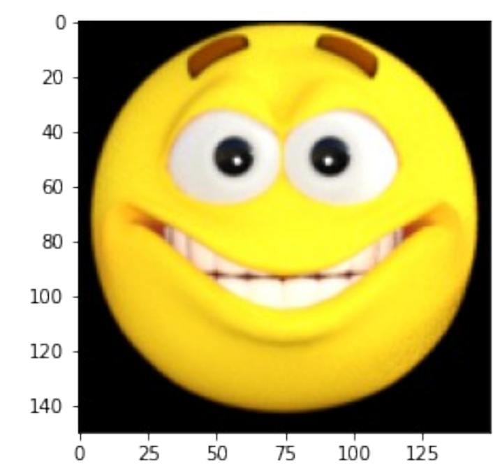
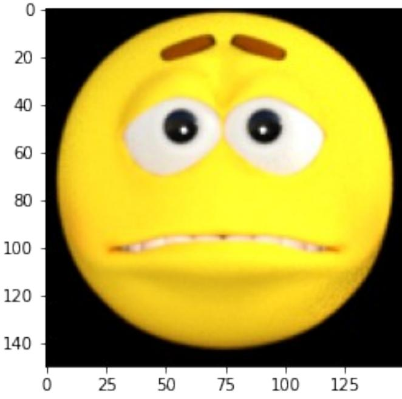

# Week 4: Handling Complex Images - Happy or Sad Dataset

In this assignment you will be using the happy or sad dataset, which contains 80 images of emoji-like faces, 40 happy and 40 sad.

Create a convolutional neural network that trains to 99.9% accuracy on these images, which cancels training upon hitting this training accuracy threshold.

*# IMPORTANT: This will check your notebook's metadata for grading. # Please do not continue the lab unless the output of this cell tells you to proceed.*  !python add_metadata.py --filename C1W4_Assignment.ipynb

Grader metadata detected! You can proceed with the lab!

**NOTE:** To prevent errors from the autograder, you are not allowed to edit or delete non-graded cells in this notebook . Please only put your solutions in between the *### START CODE HERE* and *### END CODE HERE* code comments, and also refrain from adding any new cells. **Once you have passed this assignment** and want to experiment with any of the non-graded code, you may follow the instructions at the bottom of this notebook.

*# grader-required-cell*

import matplotlib.pyplot as plt import tensorflow as tf import numpy as np import os

### Load and explore the data

Begin by taking a look at some images of the dataset.

Notice that all the images are contained within the ./data/ directory.

This directory contains two subdirectories happy/ and sad/ and each image is saved under the subdirectory related to the class it belongs to.

*# grader-required-cell*

from tensorflow.keras.preprocessing.image import load_img

base_dir = "./data/" happy_dir = os.path.join(base_dir, "happy/") sad_dir = os.path.join(base_dir, "sad/")

print("Sample happy image:") plt.imshow(load_img(f"{os.path.join(happy_dir, os.listdir(happy_dir) [0])}")) plt.show()

print("\nSample sad image:") plt.imshow(load_img(f"{os.path.join(sad_dir, os.listdir(sad_dir) [0])}")) plt.show()



Sample happy image:

Sample sad image:



It is cool to be able to see examples of the images to better understand the problem-space you are dealing with.

However there is still some relevant information that is missing such as the resolution of the image (although matplotlib renders the images in a grid providing a good idea of these values) and the maximum pixel value (this is important for normalizing these values). For this you can use Keras as shown in the next cell:

```
# grader-required-cell
from tensorflow.keras.preprocessing.image import img_to_array
# Load the first example of a happy face
sample_image = load_img(f"{os.path.join(happy_dir, 
os.listdir(happy_dir)[0])}")
# Convert the image into its numpy array representation
sample_array = img_to_array(sample_image)
print(f"Each image has shape: {sample_array.shape}")
print(f"The maximum pixel value used is: {np.max(sample_array)}")
Each image has shape: (150, 150, 3)
The maximum pixel value used is: 255.0
```
Looks like the images have a resolution of 150x150. **This is very important because this will be the input size of the first layer in your network.**

**The last dimension refers to each one of the 3 RGB channels that are used to represent colored images.**

# Defining the callback

Since you already have coded the callback responsible for stopping training (once a desired level of accuracy is reached) in the previous two assignments this time it is already provided so you can focus on the other steps:

```
# grader-required-cell
class myCallback(tf.keras.callbacks.Callback):
 def on_epoch_end(self, epoch, logs={}):
 if logs.get('accuracy') is not None and logs.get('accuracy') >
0.999:
 print("\nReached 99.9% accuracy so cancelling training!")
 self.model.stop_training = True
```
A quick note on callbacks:

So far you have used only the on_epoch_end callback but there are many more. For example you might want to check out the EarlyStopping callback, which allows you to save the best weights for your model.

# Pre-processing the data

Keras provides great support for preprocessing image data. A lot can be accomplished by using the ImageDataGenerator class. Be sure to check out the docs if you get stuck in the next exercise. In particular you might want to pay attention to the rescale argument when instantiating the ImageDataGenerator and to the flow_from_directory method.

```
# grader-required-cell
from tensorflow.keras.preprocessing.image import ImageDataGenerator
# GRADED FUNCTION: image_generator
def image_generator():
 ### START CODE HERE
 # Instantiate the ImageDataGenerator class.
 # Remember to set the rescale argument.
 train_datagen = ImageDataGenerator(rescale=1/255)
 # Specify the method to load images from a directory and pass in 
the appropriate arguments:
 # - directory: should be a relative path to the directory 
containing the data
 # - targe_size: set this equal to the resolution of each image 
(excluding the color dimension)
```

```
 # - batch_size: number of images the generator yields when asked 
for a next batch. Set this to 10.
 # - class_mode: How the labels are represented. Should be one of 
"binary", "categorical" or "sparse".
 # Pick the one that better suits here given that the
labels are going to be 1D binary labels.
 train_generator =
train_datagen.flow_from_directory(directory='./data/',
 
target_size=(150, 150),
 batch_size=10,
 
class_mode='binary')
 ### END CODE HERE
 return train_generator
 
# grader-required-cell
# Save your generator in a variable
gen = image_generator()
Found 80 images belonging to 2 classes.
```
#### **Expected Output:**

Found 80 images belonging to 2 classes.

### Creating and training your model

Finally, complete the train_happy_sad_model function below. This function should return your neural network.

#### **Your model should achieve an accuracy of 99.9% or more before 15 epochs to pass this assignment.**

**Hints:**

- You can try any architecture for the network but keep in mind that the model will work best with 3 convolutional layers.
- In case you need extra help you can check out some tips at the end of this notebook.

*# grader-required-cell*

from tensorflow.keras import optimizers, losses

*# GRADED FUNCTION: train_happy_sad_model*

```
def train_happy_sad_model(train_generator):
 # Instantiate the callback
 callbacks = myCallback()
 ### START CODE HERE
 # Define the model
 model = tf.keras.models.Sequential([ 
 # First convolution
 tf.keras.layers.Conv2D(16, (3,3), activation='relu', 
input_shape=(150, 150, 3)),
 tf.keras.layers.MaxPooling2D(2, 2),
 # Second convolution
 tf.keras.layers.Conv2D(16, (3,3), activation='relu'),
 tf.keras.layers.MaxPooling2D(2, 2),
 # Third convolution
 tf.keras.layers.Conv2D(16, (3,3), activation='relu'),
 tf.keras.layers.MaxPooling2D(2, 2),
 # Flatten
 tf.keras.layers.Flatten(),
 # Dense layers
 tf.keras.layers.Dense(512, activation='relu'),
 tf.keras.layers.Dense(1, activation='sigmoid')
 ])
 # Compile the model
 # Select a loss function compatible with the last layer of your 
network
 model.compile(loss='binary_crossentropy',
 optimizer=optimizers.RMSprop(learning_rate=0.001),
 metrics=['accuracy']) 
 # Train the model
 # Your model should achieve the desired accuracy in less than 15 
epochs.
 # You can hardcode up to 20 epochs in the function below but the 
callback should trigger before 15.
 history = model.fit(train_generator,
 epochs=20,
 callbacks=[callbacks]
 ) 
 
 ### END CODE HERE
 return history
```
*# grader-required-cell*

hist = train_happy_sad_model(gen)

| Epoch 1/20 |
| --- |
| 8/8 [==============================] - 2s 200ms/step - loss: 0.7832 - |
| accuracy: 0.5500 |
| Epoch 2/20 |
| 8/8 [==============================] - 1s 186ms/step - loss: 0.3717 - |
| accuracy: 0.8750 |
| Epoch 3/20 |
| 8/8 [==============================] - 1s 199ms/step - loss: 0.1934 - |
| accuracy: 0.9375 |
| Epoch 4/20 |
| 8/8 [==============================] - 1s 186ms/step - loss: 0.1219 - |
| accuracy: 0.9625 |
| Epoch 5/20 |
| 8/8 [==============================] - 1s 185ms/step - loss: 0.0476 - |
| accuracy: 0.9875 |
| Epoch 6/20 |
| 8/8 [==============================] - ETA: 0s - loss: 0.0216 - |
| accuracy: 1.0000 |
| Reached 99.9% accuracy so cancelling training! |
| 8/8 [==============================] - 1s 173ms/step - loss: 0.0216 - |
| accuracy: 1.0000 |

If you see the message that was defined in the callback printed out after less than 15 epochs it means your callback worked as expected and training was successful. You can also double check by running the following cell:

```
# grader-required-cell
print(f"Your model reached the desired accuracy after 
{len(hist.epoch)} epochs")
Your model reached the desired accuracy after 6 epochs
```
If your callback didn't stop training, one cause might be that you compiled your model using a metric other than accuracy (such as acc). Make sure you set the metric to accuracy. You can check by running the following cell:

```
if not "accuracy" in hist.model.metrics_names:
 print("Use 'accuracy' as metric when compiling your model.")
else:
 print("The metric was correctly defined.")
The metric was correctly defined.
```
### Need more help?

Run the following cell to see some extra tips for the model's architecture.

import base64

encoded_answer = "ClNvbWUgaGVscGZ1bCB0aXBzIGluIGNhc2UgeW91IGFyZSBzdHVjazoKCiAgICAtIEEgZ 29vZCBmaXJzdCBsYXllciB3b3VsZCBiZSBhIENvbnYyRCBsYXllciB3aXRoIGFuIGlucHV 0IHNoYXBlIHRoYXQgbWF0Y2hlcyAKICAgIHRoYXQgb2YgZXZlcnkgaW1hZ2UgaW4gdGhlI HRyYWluaW5nIHNldCAoaW5jbHVkaW5nIHRoZSBjb2xvciBkaW1lbnNpb24pCiAgICAKICA gIC0gVGhlIG1vZGVsIHdpbGwgd29yayBiZXN0IHdpdGggMyBjb252b2x1dGlvbmFsIGxhe WVycwogICAgCiAgICAtIFRoZXJlIHNob3VsZCBiZSBhIEZsYXR0ZW4gbGF5ZXIgaW4gYmV 0d2VlbiBjb252b2x1dGlvbmFsIGFuZCBkZW5zZSBsYXllcnMKICAgIAogICAgLSBUaGUgZ mluYWwgbGF5ZXIgc2hvdWxkIGJlIGEgRGVuc2UgbGF5ZXIgd2l0aCB0aGUgbnVtYmVyIG9 mIHVuaXRzIGFuZCAKICAgIGFjdGl2YXRpb24gZnVuY3Rpb24gdGhhdCBzdXBwb3J0cyBia W5hcnkgY2xhc3NpZmljYXRpb24uCg==" encoded_answer = encoded_answer.encode('ascii') answer = base64.b64decode(encoded_answer) answer = answer.decode('ascii')

print(answer)

Some helpful tips in case you are stuck:

 - A good first layer would be a Conv2D layer with an input shape that matches

 that of every image in the training set (including the color dimension)

- The model will work best with 3 convolutional layers

 - There should be a Flatten layer in between convolutional and dense layers

 - The final layer should be a Dense layer with the number of units and

activation function that supports binary classification.

#### **Congratulations on finishing the last assignment of this course!**

You have successfully implemented a CNN to assist you in the classification task for complex images. Nice job!

**Keep it up!**

