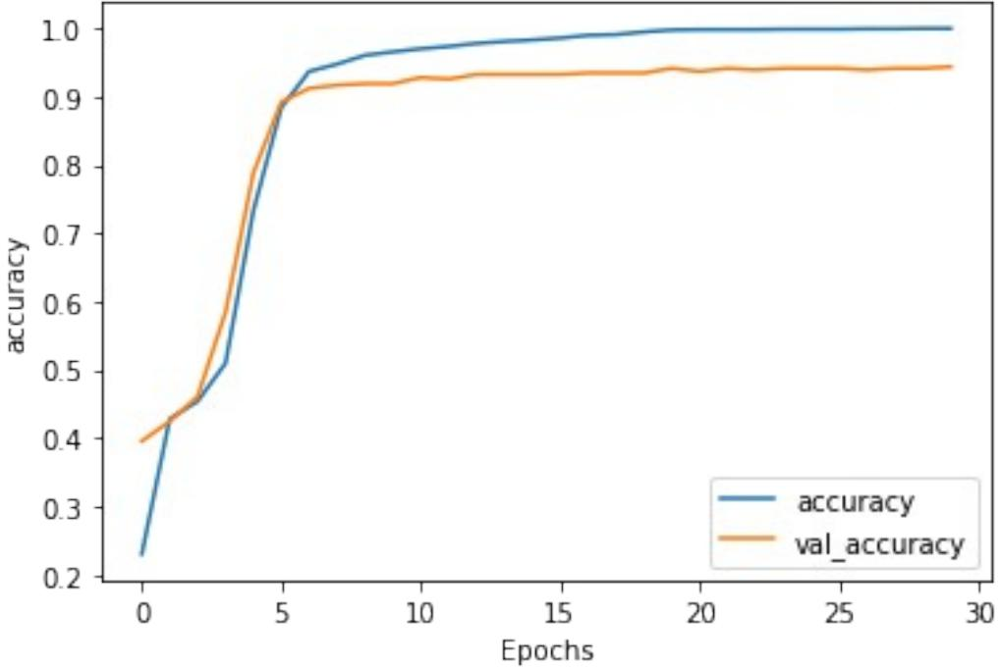
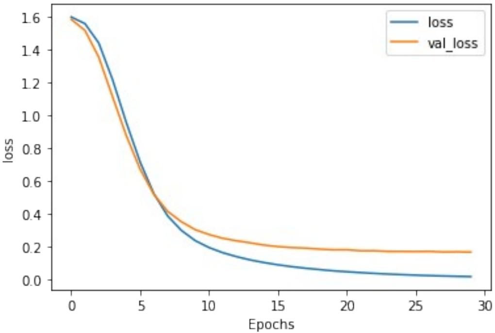

# Week 2: Diving deeper into the BBC News archive

Welcome! In this assignment you will be revisiting the BBC News Classification Dataset, which contains 2225 examples of news articles with their respective labels.

This time you will not only work with the tokenization process but you will also create a classifier using specialized layers for text data such as Embedding and GlobalAveragePooling1D.

Let's get started!

*# IMPORTANT: This will check your notebook's metadata for grading. # Please do not continue the lab unless the output of this cell tells you to proceed.*  !python add_metadata.py --filename C3W2_Assignment.ipynb

Grader metadata detected! You can proceed with the lab!

**NOTE:** To prevent errors from the autograder, you are not allowed to edit or delete non-graded cells in this notebook . Please only put your solutions in between the *### START CODE HERE* and *### END CODE HERE* code comments, and also refrain from adding any new cells. **Once you have passed this assignment** and want to experiment with any of the non-graded code, you may follow the instructions at the bottom of this notebook.

*# grader-required-cell*

import io import csv import tensorflow as tf import numpy as np from tensorflow.keras.preprocessing.text import Tokenizer from tensorflow.keras.preprocessing.sequence import pad_sequences import matplotlib.pyplot as plt

You probably remember structure of the csv that contains the data from last week, but in case you need a reminder run the next cell:

*# grader-required-cell*

with open("./bbc-text.csv", 'r') as csvfile: print(f"First line (header) looks like this:\n\ n{csvfile.readline()}") print(f"Each data point looks like this:\n\n{csvfile.readline()}")

First line (header) looks like this:

### category,text

### Each data point looks like this:

tech,tv future in the hands of viewers with home theatre systems plasma high-definition tvs and digital video recorders moving into the living room the way people watch tv will be radically different in five years time. that is according to an expert panel which gathered at the annual consumer electronics show in las vegas to discuss how these new technologies will impact one of our favourite pastimes. with the us leading the trend programmes and other content will be delivered to viewers via home networks through cable satellite telecoms companies and broadband service providers to front rooms and portable devices. one of the most talked-about technologies of ces has been digital and personal video recorders (dvr and pvr). these set-top boxes like the us s tivo and the uk s sky+ system allow people to record store play pause and forward wind tv programmes when they want. essentially the technology allows for much more personalised tv. they are also being built-in to highdefinition tv sets which are big business in japan and the us but slower to take off in europe because of the lack of high-definition programming. not only can people forward wind through adverts they can also forget about abiding by network and channel schedules putting together their own a-la-carte entertainment. but some us networks and cable and satellite companies are worried about what it means for them in terms of advertising revenues as well as brand identity and viewer loyalty to channels. although the us leads in this technology at the moment it is also a concern that is being raised in europe particularly with the growing uptake of services like sky+. what happens here today we will see in nine months to a years time in the uk adam hume the bbc broadcast s futurologist told the bbc news website. for the likes of the bbc there are no issues of lost advertising revenue yet. it is a more pressing issue at the moment for commercial uk broadcasters but brand loyalty is important for everyone. we will be talking more about content brands rather than network brands said tim hanlon from brand communications firm starcom mediavest. the reality is that with broadband connections anybody can be the producer of content. he added: the challenge now is that it is hard to promote a programme with so much choice. what this means said stacey jolna senior vice president of tv guide tv group is that the way people find the content they want to watch has to be simplified for tv viewers. it means that networks in us terms or channels could take a leaf out of google s book and be the search engine of the future instead of the scheduler to help people find what they want to watch. this kind of channel model might work for the younger ipod generation which is used to taking control of their gadgets and what they play on them. but it might not suit everyone the panel recognised. older generations are more comfortable with familiar schedules and channel brands because

they know what they are getting. they perhaps do not want so much of the choice put into their hands mr hanlon suggested. on the other end you have the kids just out of diapers who are pushing buttons already - everything is possible and available to them said mr hanlon. ultimately the consumer will tell the market they want. of the 50 000 new gadgets and technologies being showcased at ces many of them are about enhancing the tv-watching experience. highdefinition tv sets are everywhere and many new models of lcd (liquid crystal display) tvs have been launched with dvr capability built into them instead of being external boxes. one such example launched at the show is humax s 26-inch lcd tv with an 80-hour tivo dvr and dvd recorder. one of the us s biggest satellite tv companies directtv has even launched its own branded dvr at the show with 100-hours of recording capability instant replay and a search function. the set can pause and rewind tv for up to 90 hours. and microsoft chief bill gates announced in his pre-show keynote speech a partnership with tivo called tivotogo which means people can play recorded programmes on windows pcs and mobile devices. all these reflect the increasing trend of freeing up multimedia so that people can watch what they want when they want.

As you can see, each data point is composed of the category of the news article followed by a comma and then the actual text of the article.

## Defining useful global variables

Next, you will define some global variables that will be used in the unit tests after your solutions. **Please do not use these in the function body of the graded functions.**

- NUM_WORDS: The maximum number of words to keep, based on word frequency. Defaults to 1000.
- EMBEDDING_DIM: Dimensionality of the dense embedding, will be used in the embedding layer of the model. Defaults to 16.
- MAXLEN: Maximum length of all sequences. Defaults to 120.
- PADDING: Padding strategy (pad either before or after each sequence.). Defaults to 'post'.
- OOV_TOKEN: Token to replace out-of-vocabulary words during text_to_sequence calls. Defaults to "<OOV>".
- TRAINING_SPLIT: Proportion of data used for training. Defaults to 0.8

**For now leave them unchanged but after submitting your assignment for grading you are encouraged to come back here and play with these parameters to see the impact they have in the classification process**

*# grader-required-cell* NUM_WORDS = 1000 EMBEDDING_DIM = 16 MAXLEN = 120 PADDING = 'post' OOV_TOKEN = "<OOV>" TRAINING_SPLIT = .8

## Loading and pre-processing the data

Now you should code the functions to remove stopwords from text and to load the data from a csv file.

Since you already coded these functions for the previous week, these are provided for you.

```
# grader-required-cell
def remove_stopwords(sentence):
 """
 Removes a list of stopwords
 
 Args:
 sentence (string): sentence to remove the stopwords from
 
 Returns:
 sentence (string): lowercase sentence without the stopwords
 """
 # List of stopwords
 stopwords = ["a", "about", "above", "after", "again", "against", 
"all", "am", "an", "and", "any", "are", "as", "at", "be", "because", 
"been", "before", "being", "below", "between", "both", "but", "by", 
"could", "did", "do", "does", "doing", "down", "during", "each", 
"few", "for", "from", "further", "had", "has", "have", "having", "he",
"he'd", "he'll", "he's", "her", "here", "here's", "hers", "herself", 
"him", "himself", "his", "how", "how's", "i", "i'd", "i'll", "i'm", 
"i've", "if", "in", "into", "is", "it", "it's", "its", "itself", 
"let's", "me", "more", "most", "my", "myself", "nor", "of", "on", 
"once", "only", "or", "other", "ought", "our", "ours", "ourselves", 
"out", "over", "own", "same", "she", "she'd", "she'll", "she's", 
"should", "so", "some", "such", "than", "that", "that's", "the", 
"their", "theirs", "them", "themselves", "then", "there", "there's", 
"these", "they", "they'd", "they'll", "they're", "they've", "this", 
"those", "through", "to", "too", "under", "until", "up", "very", 
"was", "we", "we'd", "we'll", "we're", "we've", "were", "what", 
"what's", "when", "when's", "where", "where's", "which", "while", 
"who", "who's", "whom", "why", "why's", "with", "would", "you", 
"you'd", "you'll", "you're", "you've", "your", "yours", "yourself", 
"yourselves" ]
```

```
 
 # Sentence converted to lowercase-only
 sentence = sentence.lower()
 words = sentence.split()
 no_words = [w for w in words if w not in stopwords]
 sentence = " ".join(no_words)
 return sentence
def parse_data_from_file(filename):
 """
 Extracts sentences and labels from a CSV file
 
 Args:
 filename (string): path to the CSV file
 
 Returns:
 sentences, labels (list of string, list of string): tuple 
containing lists of sentences and labels
 """
 sentences = []
 labels = []
 with open(filename, 'r') as csvfile:
 reader = csv.reader(csvfile, delimiter=',')
 next(reader)
 for row in reader:
 labels.append(row[0])
 sentence = row[1]
 sentence = remove_stopwords(sentence)
 sentences.append(sentence)
 return sentences, labels
# grader-required-cell
# Test the functions
sentences, labels = parse_data_from_file("./bbc-text.csv")
print(f"There are {len(sentences)} sentences in the dataset.\n")
print(f"First sentence has {len(sentences[0].split())} words (after 
removing stopwords).\n")
print(f"There are {len(labels)} labels in the dataset.\n")
print(f"The first 5 labels are {labels[:5]}")
There are 2225 sentences in the dataset.
First sentence has 436 words (after removing stopwords).
There are 2225 labels in the dataset.
```
The first 5 labels are ['tech', 'business', 'sport', 'sport', 'entertainment']

**Expected Output:**

```
There are 2225 sentences in the dataset.
First sentence has 436 words (after removing stopwords).
There are 2225 labels in the dataset.
The first 5 labels are ['tech', 'business', 'sport', 'sport', 
'entertainment']
```
## Training - Validation Split

Now you will code the train_val_split() function. Given the training split size, this function will split the full lists of sentences and labels into training and validation sentences and labels.

**IMPORTANT NOTE: For all graded functions in this assignment, please do not use the global variables (e.g. TRAINING_SPLIT) in your solution. Instead, you should use the function parameters defined in the function header (e.g. training_split**).

```
# grader-required-cell
# GRADED FUNCTIONS: train_val_split
def train_val_split(sentences, labels, training_split):
 """
 Splits the dataset into training and validation sets
 
 Args:
 sentences (list of string): lower-cased sentences without 
stopwords
 labels (list of string): list of labels
 training split (float): proportion of the dataset to convert 
to include in the train set
 
 Returns:
 train_sentences, validation_sentences, train_labels, 
validation_labels - lists containing the data splits
 """
 
 ### START CODE HERE
 
 # Compute the number of sentences that will be used for training 
(should be an integer)
 train_size = int(len(sentences)*training_split)
```

```
 # Split the sentences and labels into train/validation splits
 train_sentences = sentences[:train_size]
 train_labels = labels[:train_size]
 validation_sentences = sentences[train_size:]
 validation_labels = labels[train_size:]
 
 ### END CODE HERE
 
 return train_sentences, validation_sentences, train_labels, 
validation_labels
# grader-required-cell
# Test your function
train_sentences, val_sentences, train_labels, val_labels =
train_val_split(sentences, labels, TRAINING_SPLIT)
print(f"There are {len(train_sentences)} sentences for training.\n")
print(f"There are {len(train_labels)} labels for training.\n")
print(f"There are {len(val_sentences)} sentences for validation.\n")
print(f"There are {len(val_labels)} labels for validation.")
There are 1780 sentences for training.
There are 1780 labels for training.
There are 445 sentences for validation.
There are 445 labels for validation.
```
#### **Expected Output:**

There are 1780 sentences for training.

There are 1780 labels for training.

There are 445 sentences for validation.

There are 445 labels for validation.

### Tokenization - Sequences and padding

Now that you have sets for training and validation it is time for you to begin the tokenization process.

Begin by completing the fit_tokenizer function below. This function should return a Tokenizer that has been fitted to the training sentences.

```
# grader-required-cell
# GRADED FUNCTION: fit_tokenizer
def fit_tokenizer(train_sentences, num_words, oov_token):
 """
 Instantiates the Tokenizer class on the training sentences
 
 Args:
 train_sentences (list of string): lower-cased sentences 
without stopwords to be used for training
 num_words (int) - number of words to keep when tokenizing
 oov_token (string) - symbol for the out-of-vocabulary token
 
 Returns:
 tokenizer (object): an instance of the Tokenizer class 
containing the word-index dictionary
 """
 
 ### START CODE HERE
 
 # Instantiate the Tokenizer class, passing in the correct values 
for num_words and oov_token
 tokenizer = Tokenizer(num_words=num_words, oov_token=oov_token)
 
 # Fit the tokenizer to the training sentences
 tokenizer.fit_on_texts(train_sentences)
 
 ### END CODE HERE
 
 return tokenizer
# grader-required-cell
# Test your function
tokenizer = fit_tokenizer(train_sentences, NUM_WORDS, OOV_TOKEN)
word_index = tokenizer.word_index
print(f"Vocabulary contains {len(word_index)} words\n")
print("<OOV> token included in vocabulary" if "<OOV>" in word_index 
else "<OOV> token NOT included in vocabulary")
Vocabulary contains 27285 words
<OOV> token included in vocabulary
```
#### **Expected Output:**

Vocabulary contains 27285 words

- <OOV> token included in vocabulary
Now that the tokenizer has been fitted to the training data, you need a function that will convert each text data point into its padded sequence representation, for this complete the seq_and_pad function below:

```
# grader-required-cell
# GRADED FUNCTION: seq_and_pad
def seq_and_pad(sentences, tokenizer, padding, maxlen):
 """
 Generates an array of token sequences and pads them to the same 
length
 
 Args:
 sentences (list of string): list of sentences to tokenize and 
pad
 tokenizer (object): Tokenizer instance containing the word-
index dictionary
 padding (string): type of padding to use
 maxlen (int): maximum length of the token sequence
 
 Returns:
 padded_sequences (array of int): tokenized sentences padded to
the same length
 """
 
 ### START CODE HERE
 
 # Convert sentences to sequences
 sequences = tokenizer.texts_to_sequences(sentences)
 
 # Pad the sequences using the correct padding and maxlen
 padded_sequences = pad_sequences(sequences, maxlen=maxlen, 
padding=padding)
 
 ### END CODE HERE
 
 return padded_sequences
# grader-required-cell
# Test your function
train_padded_seq = seq_and_pad(train_sentences, tokenizer, PADDING, 
MAXLEN)
val_padded_seq = seq_and_pad(val_sentences, tokenizer, PADDING, 
MAXLEN)
print(f"Padded training sequences have shape: 
{train_padded_seq.shape}\n")
print(f"Padded validation sequences have shape: 
{val_padded_seq.shape}")
```

```
Padded training sequences have shape: (1780, 120)
Padded validation sequences have shape: (445, 120)
```
#### **Expected Output:**

```
Padded training sequences have shape: (1780, 120)
Padded validation sequences have shape: (445, 120)
```
Finally you need to tokenize the labels. For this complete the tokenize_labels function below.

A couple of things to note:

- You should fit the tokenizer to all the labels to avoid the case of a particular label not being present in the validation set. Since you are dealing with labels there should never be an OOV label.
- In the previous function you used the pad_sequences function which returns numpy arrays. Here you will not be using it since you don't need to pad the labels so you need to make the conversion to numpy arrays yourself.
- The argument split_labels refers to the labels of a particular split (train or validation). This is because the function should work independently of the split being used.
- Using Keras' Tokenizer yields values that start at 1 rather than at 0. This will present a problem when training since Keras usually expects the labels to start at 0. To work around this issue you could use an extra neuron in the last layer of your model. However this approach is rather hacky and not very clear. Instead you will substract 1 from every value of the labels that the function returns. Remember that when using numpy arrays you can simply do something like np.array - 1 to accomplish this since numpy allows for vectorized operations.

```
# grader-required-cell
# GRADED FUNCTION: tokenize_labels
def tokenize_labels(all_labels, split_labels):
 """
 Tokenizes the labels
 
 Args:
 all_labels (list of string): labels to generate the word-index
from
 split_labels (list of string): labels to tokenize
 
 Returns:
```

```
 label_seq_np (array of int): tokenized labels
 """
 
 ### START CODE HERE
 
 # Instantiate the Tokenizer (no additional arguments needed)
 label_tokenizer = Tokenizer()
 
 # Fit the tokenizer on all the labels
 label_tokenizer.fit_on_texts(all_labels)
 
 # Convert labels to sequences
 label_seq = label_tokenizer.texts_to_sequences(split_labels)
 
 # Convert sequences to a numpy array. Don't forget to substact 1 
from every entry in the array!
 label_seq_np = np.array(label_seq)-1
 
 ### END CODE HERE
 
 return label_seq_np
# grader-required-cell
# Test your function
train_label_seq = tokenize_labels(labels, train_labels)
val_label_seq = tokenize_labels(labels, val_labels)
print(f"First 5 labels of the training set should look like this:\
n{train_label_seq[:5]}\n")
print(f"First 5 labels of the validation set should look like this:\
n{val_label_seq[:5]}\n")
print(f"Tokenized labels of the training set have shape: 
{train_label_seq.shape}\n")
print(f"Tokenized labels of the validation set have shape: 
{val_label_seq.shape}\n")
First 5 labels of the training set should look like this:
[[3]
 [1]
 [0]
 [0]
 [4]]
First 5 labels of the validation set should look like this:
[[4]
 [3]
 [2]
 [0]
 [0]]
```
Tokenized labels of the training set have shape: (1780, 1) Tokenized labels of the validation set have shape: (445, 1)

#### **Expected Output:**

```
First 5 labels of the training set should look like this:
[[3]
 [1]
 [0]
 [0]
 [4]]
First 5 labels of the validation set should look like this:
[[4]
 [3]
 [2]
 [0]
 [0]]
Tokenized labels of the training set have shape: (1780, 1)
Tokenized labels of the validation set have shape: (445, 1)
```
## Selecting the model for text classification

Now that the data is ready to be fed a Neural Network it is time for you to define the model that will classify each text as being part of a certain category.

For this complete the create_model below.

A couple of things to keep in mind:

- Notice that this function has three parameters, all of which are meant to be passed to an Embedding layer, which is what you will probably use as a first layer for your model.
- The last layer should be a Dense layer with 5 units (since there are 5 categories) with a softmax activation.
- You should also compile your model using an appropiate loss function and optimizer. Please choose these without needing to edit the following code cell that contains model.fit()
- You can use any architecture you want but keep in mind that this problem doesn't need many layers to be solved successfully. You don't need any layers beside Embedding, GlobalAveragePooling1D and Dense layers but feel free to try out different architectures.

- **To pass this graded function your model should reach at least a 95% training accuracy and a 90% validation accuracy in under 30 epochs.**

```
# grader-required-cell
# GRADED FUNCTION: create_model
def create_model(num_words, embedding_dim, maxlen):
 """
 Creates a text classifier model
 
 Args:
 num_words (int): size of the vocabulary for the Embedding 
layer input
 embedding_dim (int): dimensionality of the Embedding layer 
output
 maxlen (int): length of the input sequences
 
 Returns:
 model (tf.keras Model): the text classifier model
 """
 
 tf.random.set_seed(123)
 
 ### START CODE HERE
 
 model = tf.keras.Sequential([ 
 tf.keras.layers.Embedding(num_words, embedding_dim, 
input_length=maxlen),
 tf.keras.layers.GlobalAveragePooling1D(),
 tf.keras.layers.Dense(35, activation='relu'),
 tf.keras.layers.Dense(5, activation='softmax')
 ])
 
 model.compile(loss='sparse_categorical_crossentropy',
 optimizer='adam',
 metrics=['accuracy']) 
 ### END CODE HERE
```

```
 return model
```
# **NOTE***: Please do not edit this cell*

model = create_model(NUM_WORDS, EMBEDDING_DIM, MAXLEN) history = model.fit(train_padded_seq, train_label_seq, epochs=30, validation_data=(val_padded_seq, val_label_seq)) Epoch 1/30 56/56 [==============================] - 1s 4ms/step - loss: 1.6008 - accuracy: 0.2303 - val_loss: 1.5865 - val_accuracy: 0.3955 Epoch 2/30 56/56 [==============================] - 0s 2ms/step - loss: 1.5600 accuracy: 0.4281 - val_loss: 1.5185 - val_accuracy: 0.4247 Epoch 3/30 56/56 [==============================] - 0s 2ms/step - loss: 1.4418 accuracy: 0.4539 - val_loss: 1.3555 - val_accuracy: 0.4607 Epoch 4/30 56/56 [==============================] - 0s 2ms/step - loss: 1.2191 accuracy: 0.5096 - val_loss: 1.1142 - val_accuracy: 0.5843 Epoch 5/30 56/56 [==============================] - 0s 2ms/step - loss: 0.9565 accuracy: 0.7331 - val_loss: 0.8773 - val_accuracy: 0.7888 Epoch 6/30 56/56 [==============================] - 0s 2ms/step - loss: 0.7167 accuracy: 0.8843 - val_loss: 0.6726 - val_accuracy: 0.8921 Epoch 7/30 56/56 [==============================] - 0s 2ms/step - loss: 0.5228 accuracy: 0.9371 - val_loss: 0.5185 - val_accuracy: 0.9124 Epoch 8/30 56/56 [==============================] - 0s 2ms/step - loss: 0.3874 accuracy: 0.9478 - val_loss: 0.4149 - val_accuracy: 0.9169 Epoch 9/30 56/56 [==============================] - 0s 2ms/step - loss: 0.2989 accuracy: 0.9607 - val_loss: 0.3519 - val_accuracy: 0.9191 Epoch 10/30 56/56 [==============================] - 0s 2ms/step - loss: 0.2369 accuracy: 0.9657 - val_loss: 0.3038 - val_accuracy: 0.9191 Epoch 11/30 56/56 [==============================] - 0s 2ms/step - loss: 0.1947 accuracy: 0.9702 - val_loss: 0.2739 - val_accuracy: 0.9281 Epoch 12/30 56/56 [==============================] - 0s 2ms/step - loss: 0.1632 accuracy: 0.9736 - val_loss: 0.2510 - val_accuracy: 0.9258 Epoch 13/30 56/56 [==============================] - 0s 2ms/step - loss: 0.1392 accuracy: 0.9781 - val_loss: 0.2358 - val_accuracy: 0.9326 Epoch 14/30 56/56 [==============================] - 0s 2ms/step - loss: 0.1191 accuracy: 0.9809 - val_loss: 0.2232 - val_accuracy: 0.9326 Epoch 15/30 56/56 [==============================] - 0s 2ms/step - loss: 0.1031 accuracy: 0.9831 - val_loss: 0.2095 - val_accuracy: 0.9326 Epoch 16/30 56/56 [==============================] - 0s 2ms/step - loss: 0.0895 accuracy: 0.9860 - val_loss: 0.2006 - val_accuracy: 0.9326 Epoch 17/30 56/56 [==============================] - 0s 2ms/step - loss: 0.0781 accuracy: 0.9899 - val_loss: 0.1945 - val_accuracy: 0.9348

| Epoch 18/30 |
| --- |
| 56/56 [==============================] - 0s 2ms/step - loss: 0.0686 - |
| accuracy: 0.9910 - val_loss: 0.1911 - val_accuracy: 0.9348 |
| Epoch 19/30 |
| 56/56 [==============================] - 0s 2ms/step - loss: 0.0606 - |
| accuracy: 0.9949 - val_loss: 0.1854 - val_accuracy: 0.9348 |
| Epoch 20/30 |
| 56/56 [==============================] - 0s 2ms/step - loss: 0.0528 - |
| accuracy: 0.9978 - val_loss: 0.1809 - val_accuracy: 0.9416 |
| Epoch 21/30 |
| 56/56 [==============================] - 0s 2ms/step - loss: 0.0472 - |
| accuracy: 0.9983 - val_loss: 0.1813 - val_accuracy: 0.9371 |
| Epoch 22/30 |
| 56/56 [==============================] - 0s 2ms/step - loss: 0.0418 - |
| accuracy: 0.9983 - val_loss: 0.1751 - val_accuracy: 0.9416 |
| Epoch 23/30 |
| 56/56 [==============================] - 0s 2ms/step - loss: 0.0371 - |
| accuracy: 0.9983 - val_loss: 0.1751 - val_accuracy: 0.9393 |
| Epoch 24/30 |
| 56/56 [==============================] - 0s 2ms/step - loss: 0.0330 - |
| accuracy: 0.9989 - val_loss: 0.1714 - val_accuracy: 0.9416 |
| Epoch 25/30 |
| 56/56 [==============================] - 0s 2ms/step - loss: 0.0295 - |
| accuracy: 0.9989 - val_loss: 0.1711 - val_accuracy: 0.9416 |
| Epoch 26/30 |
| 56/56 [==============================] - 0s 3ms/step - loss: 0.0264 - |
| accuracy: 0.9989 - val_loss: 0.1702 - val_accuracy: 0.9416 |
| Epoch 27/30 |
| 56/56 [==============================] - 0s 2ms/step - loss: 0.0237 - |
| accuracy: 0.9994 - val_loss: 0.1714 - val_accuracy: 0.9393 |
| Epoch 28/30 |
| 56/56 [==============================] - 0s 2ms/step - loss: 0.0214 - |
| accuracy: 0.9994 - val_loss: 0.1676 - val_accuracy: 0.9416 |
| Epoch 29/30 |
| 56/56 [==============================] - 0s 3ms/step - loss: 0.0192 - |
| accuracy: 1.0000 - val_loss: 0.1686 - val_accuracy: 0.9416 |
| Epoch 30/30 |
| 56/56 [==============================] - 0s 2ms/step - loss: 0.0174 - |
| accuracy: 1.0000 - val_loss: 0.1668 - val_accuracy: 0.9438 |

Once training has finished you can run the following cell to check the training and validation accuracy achieved at the end of each epoch.

**Remember that to pass this assignment your model should achieve a training accuracy of at least 95% and a validation accuracy of at least 90%. If your model didn't achieve these thresholds, try training again with a different model architecture.**

| def plot_graphs(history, metric): |
| --- |
| plt.plot(history.history[metric]) |

 plt.plot(history.history[f'val_{metric}']) plt.xlabel("Epochs") plt.ylabel(metric) plt.legend([metric, f'val_{metric}']) plt.show()

plot_graphs(history, "accuracy") plot_graphs(history, "loss")





**If your model passes the previously mentioned thresholds be sure to save your notebook and submit for grading before jumping onto the next section.**

### Optional Exercise - Visualizing 3D Vectors

As you saw on the lecture you can visualize the vectors associated with each word in the training set in a 3D space.

For this run the following cells and visit Tensorflow's Embedding Projector.

```
# Reverse word index
reverse_word_index = dict([(value, key) for (key, value) in
word_index.items()])
# Save the embedding layer
e = model.layers[0]
# Save the weights of the embedding layer
weights = e.get_weights()[0]
print(f"Weights of embedding layer have shape: {weights.shape}")
Weights of embedding layer have shape: (1000, 16)
```
#### **Expected Output:**

Weights of embedding layer have shape: (1000, 16)

```
The above is true if global variables are not modified. 
Notice that this shape will always be (NUM_WORDS, EMBEDDING_DIM).
```
Now run the following cell to generate the vecs.tsv and meta.tsv files that you will upload to the embedding projector.

```
# Generate files for embedding visualization
out_v = io.open('vecs.tsv', 'w', encoding='utf-8')
out_m = io.open('meta.tsv', 'w', encoding='utf-8')
for word_num in range(1, NUM_WORDS):
 word = reverse_word_index[word_num]
 embeddings = weights[word_num]
 out_m.write(word + "\n")
 out_v.write('\t'.join([str(x) for x in embeddings]) + "\n")
out_v.close()
out_m.close()
```
Before downloading these files be sure to having already submitted your assignment.

By running the previous cell, these files are placed within your filesystem. To download them, click on the Jupyter logo on the upper-left side of the screen. This will take you to the Jupyter filesystem and there you can download the files by selecting them and clicking on the Download button.

### **Congratulations on finishing this week's assignment!**

You have successfully implemented a neural network capable of classifying text and also learned about embeddings and tokenization along the way!

### **Keep it up!**

