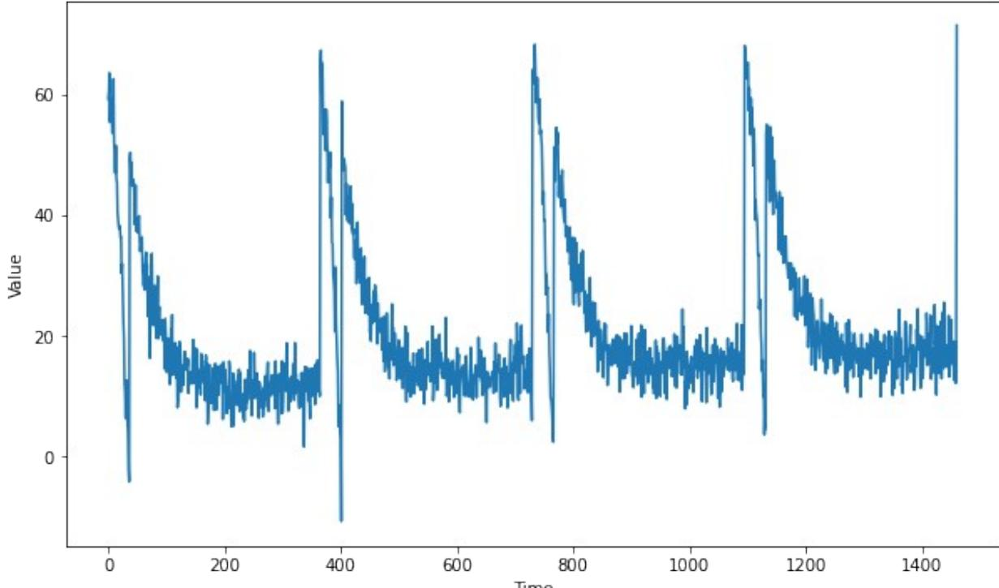

# Week 2: Predicting time series

Welcome! In the previous assignment you got some exposure to working with time series data, but you didn't use machine learning techniques for your forecasts. This week you will be using a deep neural network to create forecasts to see how this technique compares with the ones you already tried out. Once again all of the data is going to be generated.

Let's get started!

**NOTE:** To prevent errors from the autograder, you are not allowed to edit or delete some of the cells in this notebook . Please only put your solutions in between the *### START CODE HERE* and *### END CODE HERE* code comments, and also refrain from adding any new cells. **Once you have passed this assignment** and want to experiment with any of the locked cells, you may follow the instructions at the bottom of this notebook.

import numpy as np import tensorflow as tf import matplotlib.pyplot as plt from dataclasses import dataclass

# Generating the data

The next cell includes a bunch of helper functions to generate and plot the time series:

```
def plot_series(time, series, format="-", start=0, end=None):
 plt.plot(time[start:end], series[start:end], format)
 plt.xlabel("Time")
 plt.ylabel("Value")
 plt.grid(False)
def trend(time, slope=0):
 return slope * time
def seasonal_pattern(season_time):
 """An arbitrary pattern"""
 return np.where(season_time < 0.1,
 np.cos(season_time * 6 * np.pi), 
 2 / np.exp(9 * season_time))
def seasonality(time, period, amplitude=1, phase=0):
 """Repeats the same pattern at each period"""
 season_time = ((time + phase) % period) / period
 return amplitude * seasonal_pattern(season_time)
def noise(time, noise_level=1, seed=None):
 rnd = np.random.RandomState(seed)
 return rnd.randn(len(time)) * noise_level
```
You will be generating time series data that greatly resembles the one from last week but with some differences.

#### **Notice that this time all the generation is done within a function and global variables are saved within a dataclass. This is done to avoid using global scope as it was done in during the previous week.**

If you haven't used dataclasses before, they are just Python classes that provide a convenient syntax for storing data. You can read more about them in the docs.

```
def generate_time_series():
 # The time dimension or the x-coordinate of the time series
 time = np.arange(4 * 365 + 1, dtype="float32")
 # Initial series is just a straight line with a y-intercept
 y_intercept = 10
 slope = 0.005
 series = trend(time, slope) + y_intercept
 # Adding seasonality
 amplitude = 50
 series += seasonality(time, period=365, amplitude=amplitude)
 # Adding some noise
 noise_level = 3
 series += noise(time, noise_level, seed=51)
 
 return time, series
# Save all "global" variables within the G class (G stands for global)
@dataclass
class G:
 TIME, SERIES = generate_time_series()
 SPLIT_TIME = 1100
 WINDOW_SIZE = 20
 BATCH_SIZE = 32
 SHUFFLE_BUFFER_SIZE = 1000
 
# Plot the generated series
plt.figure(figsize=(10, 6))
plot_series(G.TIME, G.SERIES)
plt.show()
```


# Splitting the data

Since you already coded the train_val_split function during last week's assignment, this time it is provided for you:

```
def train_val_split(time, series, time_step=G.SPLIT_TIME):
 time_train = time[:time_step]
 series_train = series[:time_step]
 time_valid = time[time_step:]
 series_valid = series[time_step:]
 return time_train, series_train, time_valid, series_valid
# Split the dataset
time_train, series_train, time_valid, series_valid =
train_val_split(G.TIME, G.SERIES)
```
### Processing the data

As you saw on the lectures you can feed the data for training by creating a dataset with the appropiate processing steps such as windowing, flattening, batching and shuffling. To do so complete the windowed_dataset function below.

```
Notice that this function receives a series, window_size, batch_size and 
shuffle_buffer and the last three of these default to the "global" values defined earlier.
```
Be sure to check out the docs about TF Datasets if you need any help.

```
def windowed_dataset(series, window_size=G.WINDOW_SIZE, 
batch_size=G.BATCH_SIZE, shuffle_buffer=G.SHUFFLE_BUFFER_SIZE):
 
 ### START CODE HERE
 
 # Create dataset from the series
 dataset = tf.data.Dataset.from_tensor_slices(series)
 
 # Slice the dataset into the appropriate windows
 dataset = dataset.window(window_size + 1, shift=1, 
drop_remainder=True)
 
 # Flatten the dataset
 dataset = dataset.flat_map(lambda window: window.batch(window_size
+ 1))
 
 # Shuffle it
 dataset = dataset.shuffle(shuffle_buffer)
 
 # Split it into the features and labels
 dataset = dataset.map(lambda window: (window[:-1], window[-1]))
 
 # Batch it
 dataset = dataset.batch(batch_size).prefetch(1)
 
 ### END CODE HERE
 
 return dataset
```
To test your function you will be using a window_size of 1 which means that you will use each value to predict the next one. This for 5 elements since a batch_size of 5 is used and no shuffle since shuffle_buffer is set to 1.

```
Given this, the batch of features should be identical to the first 5 elements of the 
series_train and the batch of labels should be equal to elements 2 through 6 of the 
series_train.
# Test your function with windows size of 1 and no shuffling
test_dataset = windowed_dataset(series_train, window_size=1, 
batch_size=5, shuffle_buffer=1)
# Get the first batch of the test dataset
batch_of_features, batch_of_labels = next((iter(test_dataset)))
print(f"batch_of_features has type: {type(batch_of_features)}\n")
```
print(f"batch_of_labels has type: {type(batch_of_labels)}\n") print(f"batch_of_features has shape: {batch_of_features.shape}\n") print(f"batch_of_labels has shape: {batch_of_labels.shape}\n") print(f"batch_of_features is equal to first five elements in the series: {np.allclose(batch_of_features.numpy().flatten(), series_train[:5])}\n") print(f"batch_of_labels is equal to first five labels: {np.allclose(batch_of_labels.numpy(), series_train[1:6])}") batch_of_features has type: <class 'tensorflow.python.framework.ops.EagerTensor'> batch_of_labels has type: <class 'tensorflow.python.framework.ops.EagerTensor'> batch_of_features has shape: (5, 1) batch_of_labels has shape: (5,) batch_of_features is equal to first five elements in the series: True batch_of_labels is equal to first five labels: True

#### **Expected Output:**

batch_of_features has type: <class 'tensorflow.python.framework.ops.EagerTensor'> batch_of_labels has type: <class 'tensorflow.python.framework.ops.EagerTensor'> batch_of_features has shape: (5, 1) batch_of_labels has shape: (5,) batch_of_features is equal to first five elements in the series: True batch_of_labels is equal to first five labels: True

### Defining the model architecture

Now that you have a function that will process the data before it is fed into your neural network for training, it is time to define you layer architecture.

Complete the create_model function below. Notice that this function receives the window_size since this will be an important parameter for the first layer of your network.

Hint:

- You will only need Dense layers.
- Do not include Lambda layers. These are not required and are incompatible with the HDF5 format which will be used to save your model for grading.
- The training should be really quick so if you notice that each epoch is taking more than a few seconds, consider trying a different architecture.

def create_model(window_size=G.WINDOW_SIZE):

```
 ### START CODE HERE
```

```
 model = tf.keras.models.Sequential([ 
 tf.keras.layers.Dense(10,input_shape=[window_size], 
activation="relu"),
 tf.keras.layers.Dense(30, activation="relu"),
 tf.keras.layers.Dense(15, activation="relu"),
 tf.keras.layers.Dense(5, activation="relu"), 
 tf.keras.layers.Dense(1)
 ])
 
 lr_schedule = tf.keras.callbacks.LearningRateScheduler(
 lambda epoch: 1e-5 * 10**(epoch / 20))
 model.compile(loss="mse",
 optimizer=tf.keras.optimizers.SGD(lr=1e-5, 
momentum=0.9))
 
 ### END CODE HERE
 return model
# Apply the processing to the whole training series
dataset = windowed_dataset(series_train)
# Save an instance of the model
model = create_model()
# Train it
model.fit(dataset, epochs=100)
Epoch 1/100
34/34 [==============================] - 1s 9ms/step - loss: 242.2547
Epoch 2/100
34/34 [==============================] - 0s 892us/step - loss: 76.7907
Epoch 3/100
34/34 [==============================] - 0s 1ms/step - loss: 52.7299
Epoch 4/100
34/34 [==============================] - 0s 1ms/step - loss: 46.4451
Epoch 5/100
34/34 [==============================] - 0s 855us/step - loss: 43.2436
Epoch 6/100
34/34 [==============================] - 0s 832us/step - loss: 41.2536
Epoch 7/100
```

| 34/34 [==============================] - 0s 2ms/step - loss: 39.6960 |
| --- |
| Epoch 8/100 |
| 34/34 [==============================] - 0s 1ms/step - loss: 37.9905 |
| Epoch 9/100 |
| 34/34 [==============================] - 0s 859us/step - loss: 37.6853 |
| Epoch 10/100 |
| 34/34 [==============================] - 0s 1ms/step - loss: 35.4736 |
| Epoch 11/100 |
| 34/34 [==============================] - 0s 1ms/step - loss: 34.1327 |
| Epoch 12/100 |
| 34/34 [==============================] - 0s 947us/step - loss: 33.0367 |
| Epoch 13/100 |
| 34/34 [==============================] - 0s 1ms/step - loss: 32.2980 |
| Epoch 14/100 |
| 34/34 [==============================] - 0s 1ms/step - loss: 31.9324 |
| Epoch 15/100 |
| 34/34 [==============================] - 0s 1ms/step - loss: 31.5280 |
| Epoch 16/100 |
| 34/34 [==============================] - 0s 891us/step - loss: 31.2512 |
| Epoch 17/100 |
| 34/34 [==============================] - 0s 1ms/step - loss: 29.9280 |
| Epoch 18/100 |
| 34/34 [==============================] - 0s 1ms/step - loss: 30.7458 |
| Epoch 19/100 |
| 34/34 [==============================] - 0s 1ms/step - loss: 29.4186 |
| Epoch 20/100 |
| 34/34 [==============================] - 0s 906us/step - loss: 29.0030 |
| Epoch 21/100 |
| 34/34 [==============================] - 0s 862us/step - loss: 28.9786 |
| Epoch 22/100 |
| 34/34 [==============================] - 0s 998us/step - loss: 28.1940 |
| Epoch 23/100 |
| 34/34 [==============================] - 0s 1ms/step - loss: 28.2960 |
| Epoch 24/100 |
| 34/34 [==============================] - 0s 865us/step - loss: 27.6397 |
| Epoch 25/100 |
| 34/34 [==============================] - 0s 827us/step - loss: 27.4588 |
| Epoch 26/100 |
| 34/34 [==============================] - 0s 791us/step - loss: 27.0408 |
| Epoch 27/100 |
| 34/34 [==============================] - 0s 1ms/step - loss: 26.9104 |
| Epoch 28/100 |
| 34/34 [==============================] - 0s 1ms/step - loss: 26.7699 |
| Epoch 29/100 |
| 34/34 [==============================] - 0s 1ms/step - loss: 26.8669 |
| Epoch 30/100 |
| 34/34 [==============================] - 0s 835us/step - loss: 26.1324 |
| Epoch 31/100 |
| 34/34 [==============================] - 0s 849us/step - loss: 26.2956 |

| Epoch 32/100 |
| --- |
| 34/34 [==============================] - 0s 1ms/step - loss: 25.6753 |
| Epoch 33/100 |
| 34/34 [==============================] - 0s 1ms/step - loss: 25.6727 |
| Epoch 34/100 |
| 34/34 [==============================] - 0s 996us/step - loss: 25.5431 |
| Epoch 35/100 |
| 34/34 [==============================] - 0s 820us/step - loss: 24.9366 |
| Epoch 36/100 |
| 34/34 [==============================] - 0s 1ms/step - loss: 25.0606 |
| Epoch 37/100 |
| 34/34 [==============================] - 0s 1ms/step - loss: 24.6109 |
| Epoch 38/100 |
| 34/34 [==============================] - 0s 852us/step - loss: 24.7024 |
| Epoch 39/100 |
| 34/34 [==============================] - 0s 882us/step - loss: 24.2677 |
| Epoch 40/100 |
| 34/34 [==============================] - 0s 1ms/step - loss: 24.5185 |
| Epoch 41/100 |
| 34/34 [==============================] - 0s 1ms/step - loss: 23.6678 |
| Epoch 42/100 |
| 34/34 [==============================] - 0s 796us/step - loss: 23.7184 |
| Epoch 43/100 |
| 34/34 [==============================] - 0s 804us/step - loss: 24.0932 |
| Epoch 44/100 |
| 34/34 [==============================] - 0s 883us/step - loss: 23.6329 |
| Epoch 45/100 |
| 34/34 [==============================] - 0s 963us/step - loss: 23.3627 |
| Epoch 46/100 |
| 34/34 [==============================] - 0s 1ms/step - loss: 23.1507 |
| Epoch 47/100 |
| 34/34 [==============================] - 0s 849us/step - loss: 22.9230 |
| Epoch 48/100 |
| 34/34 [==============================] - 0s 840us/step - loss: 23.1648 |
| Epoch 49/100 |
| 34/34 [==============================] - 0s 1ms/step - loss: 22.8226 |
| Epoch 50/100 |
| 34/34 [==============================] - 0s 1ms/step - loss: 22.6037 |
| Epoch 51/100 |
| 34/34 [==============================] - 0s 889us/step - loss: 22.5609 |
| Epoch 52/100 |
| 34/34 [==============================] - 0s 844us/step - loss: 22.1362 |
| Epoch 53/100 |
| 34/34 [==============================] - 0s 1ms/step - loss: 22.7152 |
| Epoch 54/100 |
| 34/34 [==============================] - 0s 1ms/step - loss: 22.0940 |
| Epoch 55/100 |
| 34/34 [==============================] - 0s 866us/step - loss: 22.2330 |
| Epoch 56/100 |

| 34/34 [==============================] - 0s 827us/step - loss: 22.1173 |
| --- |
| Epoch 57/100 |
| 34/34 [==============================] - 0s 818us/step - loss: 21.6122 |
| Epoch 58/100 34/34 [==============================] - 0s 1ms/step - loss: 21.7746 |
| Epoch 59/100 |
| 34/34 [==============================] - 0s 1ms/step - loss: 21.6231 |
| Epoch 60/100 |
| 34/34 [==============================] - 0s 1ms/step - loss: 21.7472 |
| Epoch 61/100 |
| 34/34 [==============================] - 0s 850us/step - loss: 21.5719 |
| Epoch 62/100 |
| 34/34 [==============================] - 0s 857us/step - loss: 22.4009 |
| Epoch 63/100 |
| 34/34 [==============================] - 0s 1ms/step - loss: 21.9059 |
| Epoch 64/100 |
| 34/34 [==============================] - 0s 1ms/step - loss: 21.4833 |
| Epoch 65/100 |
| 34/34 [==============================] - 0s 1ms/step - loss: 22.9089 |
| Epoch 66/100 |
| 34/34 [==============================] - 0s 844us/step - loss: 21.4882 |
| Epoch 67/100 |
| 34/34 [==============================] - 0s 903us/step - loss: 21.5425 |
| Epoch 68/100 |
| 34/34 [==============================] - 0s 1ms/step - loss: 20.7567 |
| Epoch 69/100 |
| 34/34 [==============================] - 0s 1ms/step - loss: 20.8927 |
| Epoch 70/100 |
| 34/34 [==============================] - 0s 1ms/step - loss: 20.6009 |
| Epoch 71/100 |
| 34/34 [==============================] - 0s 1ms/step - loss: 20.7228 |
| Epoch 72/100 |
| 34/34 [==============================] - 0s 872us/step - loss: 20.3843 |
| Epoch 73/100 |
| 34/34 [==============================] - 0s 825us/step - loss: 20.6025 |
| Epoch 74/100 |
| 34/34 [==============================] - 0s 1ms/step - loss: 20.6045 |
| Epoch 75/100 |
| 34/34 [==============================] - 0s 1ms/step - loss: 22.0301 |
| Epoch 76/100 |
| 34/34 [==============================] - 0s 910us/step - loss: 21.3076 |
| Epoch 77/100 |
| 34/34 [==============================] - 0s 858us/step - loss: 21.1588 |
| Epoch 78/100 |
| 34/34 [==============================] - 0s 1ms/step - loss: 20.9613 |
| Epoch 79/100 |
| 34/34 [==============================] - 0s 1ms/step - loss: 21.2362 |
| Epoch 80/100 |
| 34/34 [==============================] - 0s 1ms/step - loss: 20.0292 |

| Epoch 81/100 |
| --- |
| 34/34 [==============================] - 0s 829us/step - loss: 20.4904 |
| Epoch 82/100 |
| 34/34 [==============================] - 0s 847us/step - loss: 20.6279 |
| Epoch 83/100 |
| 34/34 [==============================] - 0s 1ms/step - loss: 20.3991 |
| Epoch 84/100 |
| 34/34 [==============================] - 0s 1ms/step - loss: 19.7374 |
| Epoch 85/100 |
| 34/34 [==============================] - 0s 1ms/step - loss: 20.4584 |
| Epoch 86/100 |
| 34/34 [==============================] - 0s 854us/step - loss: 20.4089 |
| Epoch 87/100 |
| 34/34 [==============================] - 0s 801us/step - loss: 19.7493 |
| Epoch 88/100 |
| 34/34 [==============================] - 0s 1ms/step - loss: 20.8852 |
| Epoch 89/100 |
| 34/34 [==============================] - 0s 999us/step - loss: 21.1064 |
| Epoch 90/100 |
| 34/34 [==============================] - 0s 1ms/step - loss: 20.7245 |
| Epoch 91/100 |
| 34/34 [==============================] - 0s 805us/step - loss: 19.8996 |
| Epoch 92/100 |
| 34/34 [==============================] - 0s 1ms/step - loss: 20.1420 |
| Epoch 93/100 |
| 34/34 [==============================] - 0s 1ms/step - loss: 19.7755 |
| Epoch 94/100 |
| 34/34 [==============================] - 0s 1ms/step - loss: 19.4294 |
| Epoch 95/100 |
| 34/34 [==============================] - 0s 833us/step - loss: 20.7962 |
| Epoch 96/100 |
| 34/34 [==============================] - 0s 831us/step - loss: 21.9586 |
| Epoch 97/100 |
| 34/34 [==============================] - 0s 1ms/step - loss: 20.4837 |
| Epoch 98/100 |
| 34/34 [==============================] - 0s 1ms/step - loss: 19.6784 |
| Epoch 99/100 |
| 34/34 [==============================] - 0s 1ms/step - loss: 20.2837 |
| Epoch 100/100 |
| 34/34 [==============================] - 0s 1ms/step - loss: 20.8348 |
| <keras.callbacks.History at 0x7f89d8327be0> |

## Evaluating the forecast

Now it is time to evaluate the performance of the forecast. For this you can use the compute_metrics function that you coded in the previous assignment:

def compute_metrics(true_series, forecast): mse = tf.keras.metrics.mean_squared_error(true_series, forecast).numpy() mae = tf.keras.metrics.mean_absolute_error(true_series, forecast).numpy() return mse, mae

At this point only the model that will perform the forecast is ready but you still need to compute the actual forecast.

For this, run the cell below which uses the generate_forecast function to compute the forecast. This function generates the next value given a set of the previous window_size points for every point in the validation set.

```
def generate_forecast(series=G.SERIES, split_time=G.SPLIT_TIME, 
window_size=G.WINDOW_SIZE):
 forecast = []
 for time in range(len(series) - window_size):
 forecast.append(model.predict(series[time:time + window_size]
[np.newaxis]))
 forecast = forecast[split_time-window_size:]
 results = np.array(forecast)[:, 0, 0]
 return results
# Save the forecast
dnn_forecast = generate_forecast()
# Plot it
plt.figure(figsize=(10, 6))
plot_series(time_valid, series_valid)
plot_series(time_valid, dnn_forecast)
```


**Expected Output:**

A series similar to this one:

mse, mae = compute_metrics(series_valid, dnn_forecast)

print(f"mse: {mse:.2f}, mae: {mae:.2f} for forecast")

mse: 27.08, mae: 3.17 for forecast

**To pass this assignment your forecast should achieve an MSE of 30 or less.**

- If your forecast didn't achieve this threshold try re-training your model with a different architecture or tweaking the optimizer's parameters.
- If your forecast did achieve this threshold run the following cell to save your model in a HDF5 file file which will be used for grading and after doing so, submit your assigment for grading.
- Make sure you didn't use Lambda layers in your model since these are incompatible with the HDF5 format which will be used to save your model for grading.
- This environment includes a dummy my_model.h5 file which is just a dummy model trained for one epoch. **To replace this file with your actual model you need to run the next cell before submitting for grading.**

*# Save your model in HDF5 format* model.save('my_model.h5')

#### **Congratulations on finishing this week's assignment!**

You have successfully implemented a neural network capable of forecasting time series while also learning how to leverage Tensorflow's Dataset class to process time series data!

#### **Keep it up!**

