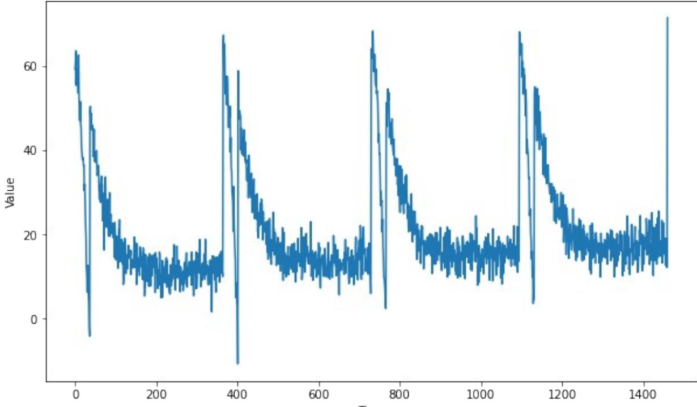
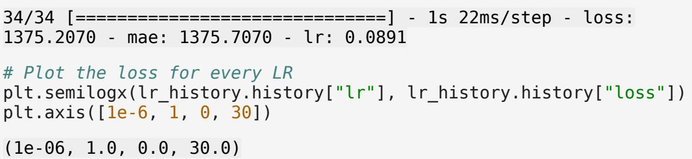
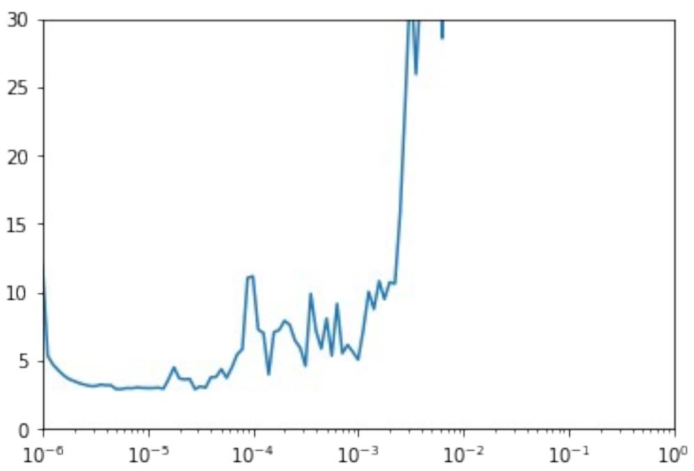
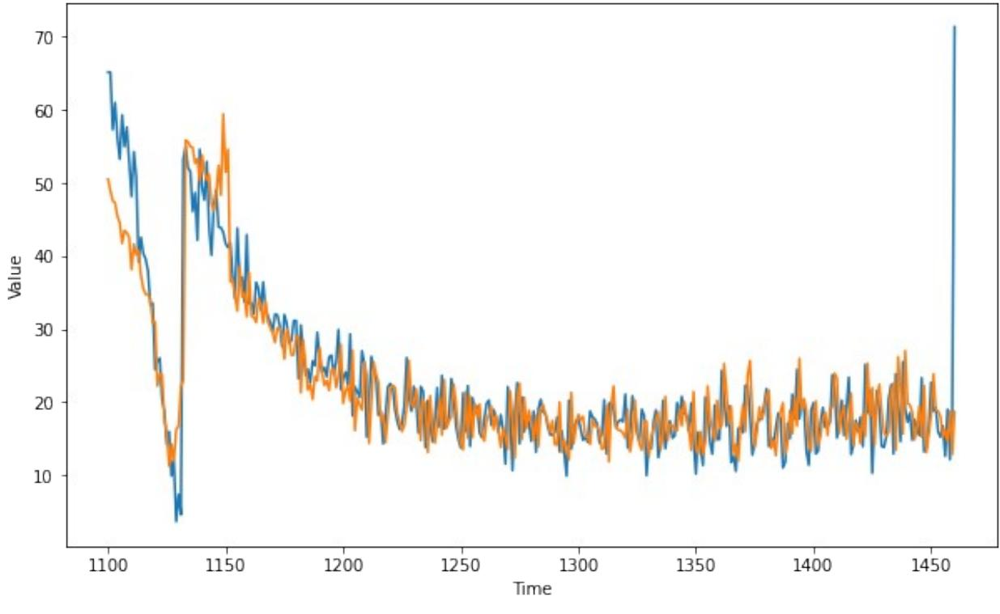

# Week 3: Using RNNs to predict time series

Welcome! In the previous assignment you used a vanilla deep neural network to create forecasts for generated time series. This time you will be using Tensorflow's layers for processing sequence data such as Recurrent layers or LSTMs to see how these two approaches compare.

Let's get started!

**NOTE:** To prevent errors from the autograder, you are not allowed to edit or delete some of the cells in this notebook . Please only put your solutions in between the *### START CODE HERE* and *### END CODE HERE* code comments, and also refrain from adding any new cells. **Once you have passed this assignment** and want to experiment with any of the locked cells, you may follow the instructions at the bottom of this notebook.

```
import tensorflow as tf
import numpy as np
import matplotlib.pyplot as plt
from dataclasses import dataclass
from absl import logging
logging.set_verbosity(logging.ERROR)
```
#### Generating the data

The next cell includes a bunch of helper functions to generate and plot the time series:

```
def plot_series(time, series, format="-", start=0, end=None):
 plt.plot(time[start:end], series[start:end], format)
 plt.xlabel("Time")
 plt.ylabel("Value")
 plt.grid(False)
def trend(time, slope=0):
 return slope * time
def seasonal_pattern(season_time):
 """An arbitrary pattern"""
 return np.where(season_time < 0.1,
 np.cos(season_time * 6 * np.pi),
 2 / np.exp(9 * season_time))
def seasonality(time, period, amplitude=1, phase=0):
 """Repeats the same pattern at each period"""
 season_time = ((time + phase) % period) / period
 return amplitude * seasonal_pattern(season_time)
def noise(time, noise_level=1, seed=None):
```

```
 rnd = np.random.RandomState(seed)
 return rnd.randn(len(time)) * noise_level
```
You will be generating the same time series data as in last week's assignment.

#### **Notice that this time all the generation is done within a function and global variables are saved within a dataclass. This is done to avoid using global scope as it was done in during the first week of the course.**

If you haven't used dataclasses before, they are just Python classes that provide a convenient syntax for storing data. You can read more about them in the docs.

```
def generate_time_series():
 # The time dimension or the x-coordinate of the time series
 time = np.arange(4 * 365 + 1, dtype="float32")
 # Initial series is just a straight line with a y-intercept
 y_intercept = 10
 slope = 0.005
 series = trend(time, slope) + y_intercept
 # Adding seasonality
 amplitude = 50
 series += seasonality(time, period=365, amplitude=amplitude)
 # Adding some noise
 noise_level = 3
 series += noise(time, noise_level, seed=51)
 
 return time, series
# Save all "global" variables within the G class (G stands for global)
@dataclass
class G:
 TIME, SERIES = generate_time_series()
 SPLIT_TIME = 1100
 WINDOW_SIZE = 20
 BATCH_SIZE = 32
 SHUFFLE_BUFFER_SIZE = 1000
 
# Plot the generated series
plt.figure(figsize=(10, 6))
plot_series(G.TIME, G.SERIES)
plt.show()
```


### Processing the data

Since you already coded the train_val_split and windowed_dataset functions during past week's assignments, this time they are provided for you:

```
def train_val_split(time, series, time_step=G.SPLIT_TIME):
 time_train = time[:time_step]
 series_train = series[:time_step]
 time_valid = time[time_step:]
 series_valid = series[time_step:]
 return time_train, series_train, time_valid, series_valid
# Split the dataset
time_train, series_train, time_valid, series_valid =
train_val_split(G.TIME, G.SERIES)
def windowed_dataset(series, window_size=G.WINDOW_SIZE, 
batch_size=G.BATCH_SIZE, shuffle_buffer=G.SHUFFLE_BUFFER_SIZE):
 dataset = tf.data.Dataset.from_tensor_slices(series)
 dataset = dataset.window(window_size + 1, shift=1, 
drop_remainder=True)
 dataset = dataset.flat_map(lambda window: window.batch(window_size
+ 1))
 dataset = dataset.shuffle(shuffle_buffer)
```

```
 dataset = dataset.map(lambda window: (window[:-1], window[-1]))
 dataset = dataset.batch(batch_size).prefetch(1)
 return dataset
```

```
# Apply the transformation to the training set
dataset = windowed_dataset(series_train)
```
# Defining the model architecture

Now that you have a function that will process the data before it is fed into your neural network for training, it is time to define you layer architecture. Unlike previous weeks or courses in which you define your layers and compile the model in the same function, here you will first need to complete the create_uncompiled_model function below.

This is done so you can reuse your model's layers for the learning rate adjusting and the actual training.

Hint:

- Fill in the Lambda layers at the beginning and end of the network with the correct lamda functions.
- You should use SimpleRNN or Bidirectional(LSTM) as intermediate layers.
- The last layer of the network (before the last Lambda) should be a Dense layer.

```
def create_uncompiled_model():
```

```
 ### START CODE HERE
```

```
 model = tf.keras.models.Sequential([ 
 tf.keras.layers.Lambda(lambda x: tf.expand_dims(x, axis=-1), 
input_shape=[None]),
 tf.keras.layers.Bidirectional(tf.keras.layers.LSTM(32)), 
 tf.keras.layers.Dense(1),
 tf.keras.layers.Lambda(lambda x: x * 100.0)
 ]) 
 
 ### END CODE HERE
 return model
# Test your uncompiled model
uncompiled_model = create_uncompiled_model()
try:
 uncompiled_model.predict(dataset)
except:
 print("Your current architecture is incompatible with the windowed
dataset, try adjusting it.")
else:
```

```
 print("Your current architecture is compatible with the windowed 
dataset! :)")
```
Your current architecture is compatible with the windowed dataset! :)

# Adjusting the learning rate - (Optional Exercise)

As you saw in the lecture you can leverage Tensorflow's callbacks to dinamically vary the learning rate during training. This can be helpful to get a better sense of which learning rate better acommodates to the problem at hand.

**Notice that this is only changing the learning rate during the training process to give you an idea of what a reasonable learning rate is and should not be confused with selecting the best learning rate, this is known as hyperparameter optimization and it is outside the scope of this course.**

For the optimizers you can try out:

```
• tf.keras.optimizers.Adam
• tf.keras.optimizers.SGD with a momentum of 0.9
```

```
def adjust_learning_rate():
```

```
 model = create_uncompiled_model()
```

```
 
 lr_schedule = tf.keras.callbacks.LearningRateScheduler(lambda
epoch: 1e-6 * 10**(epoch / 20))
```
*### START CODE HERE*

```
 # Select your optimizer
 optimizer = tf.keras.optimizers.SGD(lr=1e-6, momentum=0.9)
 # Compile the model passing in the appropriate loss
 model.compile(loss=tf.keras.losses.Huber(),
 optimizer=optimizer,
```

```
 metrics=["mae"])
```
*###* END *CODE HERE*

```
 history = model.fit(dataset, epochs=100, callbacks=[lr_schedule])
```
return history

```
# Run the training with dynamic LR
lr_history = adjust_learning_rate()
Epoch 1/100
34/34 [==============================] - 3s 24ms/step - loss: 11.9901 
- mae: 12.4813 - lr: 1.0000e-06
```

| Epoch 2/100 |
| --- |
| 34/34 [==============================] - 1s 17ms/step - loss: 5.3254 - |
| mae: 5.7988 - lr: 1.1220e-06 |
| Epoch 3/100 |
| 34/34 [==============================] - 1s 17ms/step - loss: 4.6850 - mae: 5.1565 - lr: 1.2589e-06 |
| Epoch 4/100 |
| 34/34 [==============================] - 1s 17ms/step - loss: 4.2720 - |
| mae: 4.7396 - lr: 1.4125e-06 |
| Epoch 5/100 |
| 34/34 [==============================] - 1s 18ms/step - loss: 3.9101 - |
| mae: 4.3782 - lr: 1.5849e-06 |
| Epoch 6/100 |
| 34/34 [==============================] - 1s 18ms/step - loss: 3.6345 - |
| mae: 4.1023 - lr: 1.7783e-06 |
| Epoch 7/100 34/34 [==============================] - 1s 16ms/step - loss: 3.4786 - |
| mae: 3.9466 - lr: 1.9953e-06 |
| Epoch 8/100 |
| 34/34 [==============================] - 1s 14ms/step - loss: 3.3245 - |
| mae: 3.7929 - lr: 2.2387e-06 |
| Epoch 9/100 |
| 34/34 [==============================] - 1s 16ms/step - loss: 3.2172 - |
| mae: 3.6842 - lr: 2.5119e-06 |
| Epoch 10/100 |
| 34/34 [==============================] - 1s 17ms/step - loss: 3.1217 - |
| mae: 3.5858 - lr: 2.8184e-06 |
| Epoch 11/100 |
| 34/34 [==============================] - 1s 17ms/step - loss: 3.1052 - |
| mae: 3.5715 - lr: 3.1623e-06 |
| Epoch 12/100 |
| 34/34 [==============================] - 1s 16ms/step - loss: 3.2140 - |
| mae: 3.6778 - lr: 3.5481e-06 |
| Epoch 13/100 |
| 34/34 [==============================] - 1s 17ms/step - loss: 3.1760 - |
| mae: 3.6431 - lr: 3.9811e-06 |
| Epoch 14/100 |
| 34/34 [==============================] - 1s 16ms/step - loss: 3.1730 - |
| mae: 3.6417 - lr: 4.4668e-06 |
| Epoch 15/100 |
| 34/34 [==============================] - 1s 17ms/step - loss: 2.8959 - |
| mae: 3.3567 - lr: 5.0119e-06 |
| Epoch 16/100 |
| 34/34 [==============================] - 1s 17ms/step - loss: 2.8927 - |
| mae: 3.3555 - lr: 5.6234e-06 |
| Epoch 17/100 |
| 34/34 [==============================] - 1s 17ms/step - loss: 2.9678 - |
| mae: 3.4315 - lr: 6.3096e-06 |
| Epoch 18/100 |

| 34/34 [==============================] - 1s 16ms/step - loss: 2.9544 - |
| --- |
| mae: 3.4204 - lr: 7.0795e-06 |
| Epoch 19/100 |
| 34/34 [==============================] - 1s 18ms/step - loss: 3.0130 - |
| mae: 3.4829 - lr: 7.9433e-06 |
| Epoch 20/100 |
| 34/34 [==============================] - 1s 18ms/step - loss: 2.9779 - |
| mae: 3.4405 - lr: 8.9125e-06 |
| Epoch 21/100 |
| 34/34 [==============================] - 1s 17ms/step - loss: 2.9654 - |
| mae: 3.4273 - lr: 1.0000e-05 |
| Epoch 22/100 |
| 34/34 [==============================] - 1s 17ms/step - loss: 2.9638 - |
| mae: 3.4343 - lr: 1.1220e-05 |
| Epoch 23/100 |
| 34/34 [==============================] - 1s 18ms/step - loss: 2.9994 - |
| mae: 3.4632 - lr: 1.2589e-05 |
| Epoch 24/100 |
| 34/34 [==============================] - 1s 18ms/step - loss: 2.9170 - |
| mae: 3.3828 - lr: 1.4125e-05 |
| Epoch 25/100 |
| 34/34 [==============================] - 1s 18ms/step - loss: 3.6377 - |
| mae: 4.1133 - lr: 1.5849e-05 |
| Epoch 26/100 |
| 34/34 [==============================] - 1s 18ms/step - loss: 4.4848 - |
| mae: 4.9680 - lr: 1.7783e-05 |
| Epoch 27/100 |
| 34/34 [==============================] - 1s 18ms/step - loss: 3.6715 - |
| mae: 4.1457 - lr: 1.9953e-05 |
| Epoch 28/100 |
| 34/34 [==============================] - 1s 16ms/step - loss: 3.6018 - |
| mae: 4.0710 - lr: 2.2387e-05 |
| Epoch 29/100 |
| 34/34 [==============================] - 1s 17ms/step - loss: 3.6368 - |
| mae: 4.1107 - lr: 2.5119e-05 |
| Epoch 30/100 |
| 34/34 [==============================] - 1s 17ms/step - loss: 2.8871 - |
| mae: 3.3466 - lr: 2.8184e-05 |
| Epoch 31/100 |
| 34/34 [==============================] - 1s 18ms/step - loss: 3.0901 - |
| mae: 3.5575 - lr: 3.1623e-05 |
| Epoch 32/100 |
| 34/34 [==============================] - 1s 16ms/step - loss: 2.9940 - |
| mae: 3.4584 - lr: 3.5481e-05 |
| Epoch 33/100 |
| 34/34 [==============================] - 1s 18ms/step - loss: 3.7550 - |
| mae: 4.2258 - lr: 3.9811e-05 |
| Epoch 34/100 |
| 34/34 [==============================] - 1s 18ms/step - loss: 3.7811 - |

| mae: 4.2502 - lr: 4.4668e-05 |
| --- |
| Epoch 35/100 |
| 34/34 [==============================] - 1s 17ms/step - loss: 4.3551 - |
| mae: 4.8281 - lr: 5.0119e-05 |
| Epoch 36/100 |
| 34/34 [==============================] - 1s 16ms/step - loss: 3.7054 - |
| mae: 4.1752 - lr: 5.6234e-05 |
| Epoch 37/100 |
| 34/34 [==============================] - 1s 17ms/step - loss: 4.4809 - |
| mae: 4.9611 - lr: 6.3096e-05 |
| Epoch 38/100 |
| 34/34 [==============================] - 1s 16ms/step - loss: 5.4229 - |
| mae: 5.9068 - lr: 7.0795e-05 |
| Epoch 39/100 |
| 34/34 [==============================] - 1s 15ms/step - loss: 5.8090 - |
| mae: 6.2980 - lr: 7.9433e-05 |
| Epoch 40/100 |
| 34/34 [==============================] - 1s 17ms/step - loss: 11.0367 |
| - mae: 11.5257 - lr: 8.9125e-05 |
| Epoch 41/100 |
| 34/34 [==============================] - 1s 16ms/step - loss: 11.1441 |
| - mae: 11.6393 - lr: 1.0000e-04 |
| Epoch 42/100 |
| 34/34 [==============================] - 1s 16ms/step - loss: 7.2416 - |
| mae: 7.7327 - lr: 1.1220e-04 |
| Epoch 43/100 |
| 34/34 [==============================] - 1s 16ms/step - loss: 6.9975 - |
| mae: 7.4896 - lr: 1.2589e-04 |
| Epoch 44/100 |
| 34/34 [==============================] - 1s 16ms/step - loss: 3.9656 - |
| mae: 4.4384 - lr: 1.4125e-04 |
| Epoch 45/100 |
| 34/34 [==============================] - 1s 17ms/step - loss: 7.0561 - |
| mae: 7.5461 - lr: 1.5849e-04 |
| Epoch 46/100 |
| 34/34 [==============================] - 1s 16ms/step - loss: 7.2124 - |
| mae: 7.6991 - lr: 1.7783e-04 |
| Epoch 47/100 |
| 34/34 [==============================] - 1s 17ms/step - loss: 7.8881 - |
| mae: 8.3786 - lr: 1.9953e-04 |
| Epoch 48/100 |
| 34/34 [==============================] - 1s 18ms/step - loss: 7.5955 - |
| mae: 8.0859 - lr: 2.2387e-04 |
| Epoch 49/100 |
| 34/34 [==============================] - 1s 18ms/step - loss: 6.4457 - |
| mae: 6.9322 - lr: 2.5119e-04 |
| Epoch 50/100 |
| 34/34 [==============================] - 1s 16ms/step - loss: 5.9118 - |
| mae: 6.3898 - lr: 2.8184e-04 |

| Epoch 51/100 |
| --- |
| 34/34 [==============================] - 1s 18ms/step - loss: 4.5866 - |
| mae: 5.0674 - lr: 3.1623e-04 |
| Epoch 52/100 34/34 [==============================] - 1s 19ms/step - loss: 9.8669 - |
| mae: 10.3565 - lr: 3.5481e-04 |
| Epoch 53/100 |
| 34/34 [==============================] - 1s 19ms/step - loss: 7.1554 - |
| mae: 7.6405 - lr: 3.9811e-04 |
| Epoch 54/100 |
| 34/34 [==============================] - 1s 19ms/step - loss: 5.8472 - |
| mae: 6.3318 - lr: 4.4668e-04 |
| Epoch 55/100 |
| 34/34 [==============================] - 1s 19ms/step - loss: 8.0599 - |
| mae: 8.5501 - lr: 5.0119e-04 |
| Epoch 56/100 |
| 34/34 [==============================] - 1s 20ms/step - loss: 5.3412 - |
| mae: 5.8206 - lr: 5.6234e-04 |
| Epoch 57/100 |
| 34/34 [==============================] - 1s 19ms/step - loss: 9.1342 - |
| mae: 9.6243 - lr: 6.3096e-04 |
| Epoch 58/100 |
| 34/34 [==============================] - 1s 18ms/step - loss: 5.5106 - |
| mae: 5.9882 - lr: 7.0795e-04 |
| Epoch 59/100 |
| 34/34 [==============================] - 1s 17ms/step - loss: 6.1244 - |
| mae: 6.6072 - lr: 7.9433e-04 |
| Epoch 60/100 |
| 34/34 [==============================] - 1s 17ms/step - loss: 5.6142 - |
| mae: 6.0962 - lr: 8.9125e-04 |
| Epoch 61/100 |
| 34/34 [==============================] - 1s 16ms/step - loss: 5.0443 - |
| mae: 5.5198 - lr: 0.0010 |
| Epoch 62/100 |
| 34/34 [==============================] - 1s 16ms/step - loss: 7.2696 - |
| mae: 7.7538 - lr: 0.0011 |
| Epoch 63/100 |
| 34/34 [==============================] - 1s 16ms/step - loss: 10.0176 |
| - mae: 10.5081 - lr: 0.0013 |
| Epoch 64/100 |
| 34/34 [==============================] - 1s 17ms/step - loss: 8.7429 - |
| mae: 9.2299 - lr: 0.0014 |
| Epoch 65/100 |
| 34/34 [==============================] - 1s 18ms/step - loss: 10.7968 |
| - mae: 11.2906 - lr: 0.0016 |
| Epoch 66/100 |
| 34/34 [==============================] - 1s 17ms/step - loss: 9.4729 - |
| mae: 9.9609 - lr: 0.0018 |
| Epoch 67/100 |

| 34/34 [==============================] - 1s 17ms/step - loss: 10.7106 |
| --- |
| - mae: 11.2020 - lr: 0.0020 |
| Epoch 68/100 |
| 34/34 [==============================] - 1s 16ms/step - loss: 10.6105 |
| - mae: 11.0962 - lr: 0.0022 |
| Epoch 69/100 |
| 34/34 [==============================] - 1s 17ms/step - loss: 15.8588 |
| - mae: 16.3499 - lr: 0.0025 |
| Epoch 70/100 |
| 34/34 [==============================] - 1s 20ms/step - loss: 24.2170 |
| - mae: 24.7132 - lr: 0.0028 |
| Epoch 71/100 |
| 34/34 [==============================] - 1s 19ms/step - loss: 33.3666 |
| - mae: 33.8640 - lr: 0.0032 |
| Epoch 72/100 |
| 34/34 [==============================] - 1s 19ms/step - loss: 25.9339 |
| - mae: 26.4321 - lr: 0.0035 |
| Epoch 73/100 |
| 34/34 [==============================] - 1s 19ms/step - loss: 33.2288 |
| - mae: 33.7280 - lr: 0.0040 |
| Epoch 74/100 |
| 34/34 [==============================] - 1s 16ms/step - loss: 41.7740 |
| - mae: 42.2732 - lr: 0.0045 |
| Epoch 75/100 |
| 34/34 [==============================] - 1s 17ms/step - loss: 34.1592 |
| - mae: 34.6568 - lr: 0.0050 |
| Epoch 76/100 |
| 34/34 [==============================] - 1s 18ms/step - loss: 46.9941 |
| - mae: 47.4927 - lr: 0.0056 |
| Epoch 77/100 |
| 34/34 [==============================] - 1s 20ms/step - loss: 28.5532 |
| - mae: 29.0489 - lr: 0.0063 |
| Epoch 78/100 |
| 34/34 [==============================] - 1s 18ms/step - loss: 43.8070 |
| - mae: 44.3049 - lr: 0.0071 |
| Epoch 79/100 |
| 34/34 [==============================] - 1s 19ms/step - loss: 40.2232 |
| - mae: 40.7229 - lr: 0.0079 |
| Epoch 80/100 |
| 34/34 [==============================] - 1s 20ms/step - loss: 47.0704 |
| - mae: 47.5690 - lr: 0.0089 |
| Epoch 81/100 |
| 34/34 [==============================] - 1s 19ms/step - loss: 103.7143 |
| - mae: 104.2139 - lr: 0.0100 |
| Epoch 82/100 |
| 34/34 [==============================] - 1s 19ms/step - loss: 120.3423 |
| - mae: 120.8414 - lr: 0.0112 |
| Epoch 83/100 |
| 34/34 [==============================] - 1s 20ms/step - loss: 86.3040 |

- mae: 86.8032 - lr: 0.0126 Epoch 84/100 34/34 [==============================] - 1s 19ms/step - loss: 102.6754 - mae: 103.1752 - lr: 0.0141 Epoch 85/100 34/34 [==============================] - 1s 20ms/step - loss: 104.4436 - mae: 104.9434 - lr: 0.0158 Epoch 86/100 34/34 [==============================] - 1s 19ms/step - loss: 74.4794 - mae: 74.9781 - lr: 0.0178 Epoch 87/100 34/34 [==============================] - 1s 20ms/step - loss: 173.6586 - mae: 174.1582 - lr: 0.0200 Epoch 88/100 34/34 [==============================] - 1s 21ms/step - loss: 164.3546 - mae: 164.8546 - lr: 0.0224 Epoch 89/100 34/34 [==============================] - 1s 22ms/step - loss: 129.8898 - mae: 130.3894 - lr: 0.0251 Epoch 90/100 34/34 [==============================] - 1s 21ms/step - loss: 144.6420 - mae: 145.1418 - lr: 0.0282 Epoch 91/100 34/34 [==============================] - 1s 22ms/step - loss: 233.3636 - mae: 233.8620 - lr: 0.0316 Epoch 92/100 34/34 [==============================] - 1s 22ms/step - loss: 552.1075 - mae: 552.6073 - lr: 0.0355 Epoch 93/100 34/34 [==============================] - 1s 21ms/step - loss: 402.9353 - mae: 403.4353 - lr: 0.0398 Epoch 94/100 34/34 [==============================] - 1s 20ms/step - loss: 409.9295 - mae: 410.4295 - lr: 0.0447 Epoch 95/100 34/34 [==============================] - 1s 22ms/step - loss: 496.7675 - mae: 497.2671 - lr: 0.0501 Epoch 96/100 34/34 [==============================] - 1s 22ms/step - loss: 1008.7015 - mae: 1009.2015 - lr: 0.0562 Epoch 97/100 34/34 [==============================] - 1s 22ms/step - loss: 442.3404 - mae: 442.8403 - lr: 0.0631 Epoch 98/100 34/34 [==============================] - 1s 21ms/step - loss: 491.8184 - mae: 492.3184 - lr: 0.0708 Epoch 99/100 34/34 [==============================] - 1s 22ms/step - loss: 1078.2622 - mae: 1078.7611 - lr: 0.0794 Epoch 100/100





### Compiling the model

Now that you have trained the model while varying the learning rate, it is time to do the actual training that will be used to forecast the time series. For this complete the create_model function below.

Notice that you are reusing the architecture you defined in the create_uncompiled_model earlier. Now you only need to compile this model using the appropriate loss, optimizer (and learning rate).

Hint:

- The training should be really quick so if you notice that each epoch is taking more than a few seconds, consider trying a different architecture.
- If after the first epoch you get an output like this: loss: nan mae: nan it is very likely that your network is suffering from exploding gradients. This is a common problem if you used SGD as optimizer and set a learning rate that is too high. **If you encounter this problem consider lowering the learning rate or using Adam with the default learning rate.**

def create_model(): tf.random.set_seed(51) model = create_uncompiled_model() *### START CODE HERE* model.compile(loss="mse", optimizer=tf.keras.optimizers.SGD(lr=1e-8, momentum=0.9), metrics=["mae"]) *###* END *CODE HERE* return model *# Save an instance of the model* model = create_model() *# Train it* history = model.fit(dataset, epochs=50) Epoch 1/50 34/34 [==============================] - 3s 25ms/step - loss: 208.0274 - mae: 12.0391 Epoch 2/50 34/34 [==============================] - 1s 18ms/step - loss: 87.1790 - mae: 6.3302 Epoch 3/50 34/34 [==============================] - 1s 18ms/step - loss: 63.6009 - mae: 5.2117 Epoch 4/50 34/34 [==============================] - 1s 18ms/step - loss: 58.9191 - mae: 4.9525 Epoch 5/50 34/34 [==============================] - 1s 18ms/step - loss: 57.7929 - mae: 4.9286 Epoch 6/50 34/34 [==============================] - 1s 16ms/step - loss: 56.5695 - mae: 4.8260 Epoch 7/50 34/34 [==============================] - 1s 20ms/step - loss: 55.7771 - mae: 4.8333 Epoch 8/50 34/34 [==============================] - 1s 19ms/step - loss: 54.5072 - mae: 4.7623 Epoch 9/50 34/34 [==============================] - 1s 18ms/step - loss: 54.3833 - mae: 4.7611

| Epoch 10/50 |
| --- |
| 34/34 [==============================] - 1s 16ms/step - loss: 53.3785 |
| - mae: 4.6977 |
| Epoch 11/50 |
| 34/34 [==============================] - 1s 21ms/step - loss: 52.6816 |
| - mae: 4.6835 |
| Epoch 12/50 |
| 34/34 [==============================] - 1s 19ms/step - loss: 52.5557 |
| - mae: 4.6615 |
| Epoch 13/50 |
| 34/34 [==============================] - 1s 16ms/step - loss: 51.7649 |
| - mae: 4.6270 |
| Epoch 14/50 |
| 34/34 [==============================] - 1s 17ms/step - loss: 51.7378 |
| - mae: 4.6572 |
| Epoch 15/50 |
| 34/34 [==============================] - 1s 18ms/step - loss: 51.7511 |
| - mae: 4.6461 |
| Epoch 16/50 |
| 34/34 [==============================] - 1s 18ms/step - loss: 50.4297 |
| - mae: 4.5812 |
| Epoch 17/50 |
| 34/34 [==============================] - 1s 18ms/step - loss: 49.8687 |
| - mae: 4.5549 |
| Epoch 18/50 |
| 34/34 [==============================] - 1s 18ms/step - loss: 49.3519 |
| - mae: 4.5399 |
| Epoch 19/50 |
| 34/34 [==============================] - 1s 19ms/step - loss: 49.4828 |
| - mae: 4.5194 |
| Epoch 20/50 |
| 34/34 [==============================] - 1s 19ms/step - loss: 48.5634 |
| - mae: 4.4911 |
| Epoch 21/50 |
| 34/34 [==============================] - 1s 19ms/step - loss: 48.4371 |
| - mae: 4.5084 |
| Epoch 22/50 |
| 34/34 [==============================] - 1s 18ms/step - loss: 47.9641 |
| - mae: 4.4918 |
| Epoch 23/50 |
| 34/34 [==============================] - 1s 18ms/step - loss: 47.0559 |
| - mae: 4.4054 |
| Epoch 24/50 |
| 34/34 [==============================] - 1s 18ms/step - loss: 46.9716 |
| - mae: 4.3920 |
| Epoch 25/50 |
| 34/34 [==============================] - 1s 18ms/step - loss: 46.8987 |
| - mae: 4.4137 |
| Epoch 26/50 |

| 34/34 [==============================] - 1s 15ms/step - loss: 46.3192 |
| --- |
| - mae: 4.3952 |
| Epoch 27/50 |
| 34/34 [==============================] - 1s 15ms/step - loss: 45.8740 |
| - mae: 4.3501 |
| Epoch 28/50 |
| 34/34 [==============================] - 1s 17ms/step - loss: 45.7952 |
| - mae: 4.3600 |
| Epoch 29/50 |
| 34/34 [==============================] - 1s 19ms/step - loss: 45.4266 |
| - mae: 4.3269 |
| Epoch 30/50 |
| 34/34 [==============================] - 1s 18ms/step - loss: 44.9038 |
| - mae: 4.3004 |
| Epoch 31/50 |
| 34/34 [==============================] - 1s 18ms/step - loss: 44.6784 |
| - mae: 4.2894 |
| Epoch 32/50 |
| 34/34 [==============================] - 1s 16ms/step - loss: 44.5668 |
| - mae: 4.2941 |
| Epoch 33/50 |
| 34/34 [==============================] - 1s 17ms/step - loss: 44.1292 |
| - mae: 4.2694 |
| Epoch 34/50 |
| 34/34 [==============================] - 1s 16ms/step - loss: 43.9198 |
| - mae: 4.2633 |
| Epoch 35/50 |
| 34/34 [==============================] - 1s 16ms/step - loss: 43.7353 |
| - mae: 4.2597 |
| Epoch 36/50 |
| 34/34 [==============================] - 1s 18ms/step - loss: 43.4177 |
| - mae: 4.2390 |
| Epoch 37/50 |
| 34/34 [==============================] - 1s 16ms/step - loss: 43.3363 |
| - mae: 4.2458 |
| Epoch 38/50 |
| 34/34 [==============================] - 1s 15ms/step - loss: 43.1508 |
| - mae: 4.2172 |
| Epoch 39/50 |
| 34/34 [==============================] - 1s 17ms/step - loss: 42.7949 |
| - mae: 4.2064 |
| Epoch 40/50 |
| 34/34 [==============================] - 1s 16ms/step - loss: 42.5241 |
| - mae: 4.1989 |
| Epoch 41/50 |
| 34/34 [==============================] - 1s 17ms/step - loss: 42.2095 |
| - mae: 4.1699 |
| Epoch 42/50 |
| 34/34 [==============================] - 1s 18ms/step - loss: 42.0526 |

| - mae: 4.1728 |
| --- |
| Epoch 43/50 |
| 34/34 [==============================] - 1s 18ms/step - loss: 42.0731 |
| - mae: 4.1893 |
| Epoch 44/50 |
| 34/34 [==============================] - 1s 19ms/step - loss: 41.9430 |
| - mae: 4.1631 |
| Epoch 45/50 |
| 34/34 [==============================] - 1s 18ms/step - loss: 41.5978 |
| - mae: 4.1548 |
| Epoch 46/50 |
| 34/34 [==============================] - 1s 16ms/step - loss: 41.1532 |
| - mae: 4.1186 |
| Epoch 47/50 |
| 34/34 [==============================] - 1s 18ms/step - loss: 41.1311 |
| - mae: 4.1285 |
| Epoch 48/50 |
| 34/34 [==============================] - 1s 19ms/step - loss: 40.8292 |
| - mae: 4.1111 |
| Epoch 49/50 |
| 34/34 [==============================] - 1s 16ms/step - loss: 40.8757 |
| - mae: 4.1114 |
| Epoch 50/50 |
| 34/34 [==============================] - 1s 17ms/step - loss: 40.4825 |
| - mae: 4.0950 |

### Evaluating the forecast

Now it is time to evaluate the performance of the forecast. For this you can use the compute_metrics function that you coded in a previous assignment:

```
def compute_metrics(true_series, forecast):
```

```
 mse = tf.keras.metrics.mean_squared_error(true_series, 
forecast).numpy()
 mae = tf.keras.metrics.mean_absolute_error(true_series, 
forecast).numpy()
 return mse, mae
```

```
At this point only the model that will perform the forecast is ready but you still need to compute 
the actual forecast.
```
### Faster model forecasts

In the previous week you used a for loop to compute the forecasts for every point in the sequence. This approach is valid but there is a more efficient way of doing the same thing by using batches of data. The code to implement this is provided in the model_forecast below. Notice that the code is very similar to the one in the windowed_dataset function with the differences that:

- The dataset is windowed using window_size rather than window_size + 1
- No shuffle should be used
- No need to split the data into features and labels
- A model is used to predict batches of the dataset

def model_forecast(model, series, window_size): ds = tf.data.Dataset.from_tensor_slices(series) ds = ds.window(window_size, shift=1, drop_remainder=True) ds = ds.flat_map(lambda w: w.batch(window_size)) ds = ds.batch(32).prefetch(1) forecast = model.predict(ds) return forecast

*# Compute the forecast for all the series* rnn_forecast = model_forecast(model, G.SERIES, G.WINDOW_SIZE).squeeze()

*# Slice the forecast to get only the predictions for the validation*  set rnn_forecast = rnn_forecast[G.SPLIT_TIME - G.WINDOW_SIZE:-1] *# Plot it* plt.figure(figsize=(10, 6)) plot_series(time_valid, series_valid) plot_series(time_valid, rnn_forecast)



#### **Expected Output:**

A series similar to this one:

mse, mae = compute_metrics(series_valid, rnn_forecast)

print(f"mse: {mse:.2f}, mae: {mae:.2f} for forecast")

mse: 37.07, mae: 4.14 for forecast

**To pass this assignment your forecast should achieve an MAE of 4.5 or less.**

- If your forecast didn't achieve this threshold try re-training your model with a different architecture (you will need to re-run both create_uncompiled_model and create_model functions) or tweaking the optimizer's parameters.
- If your forecast did achieve this threshold run the following cell to save your model in a tar file which will be used for grading and after doing so, submit your assigment for grading.
- This environment includes a dummy SavedModel directory which contains a dummy model trained for one epoch. **To replace this file with your actual model you need to run the next cell before submitting for grading.**
- Unlike last week, this time the model is saved using the SavedModel format. This is done because the HDF5 format does not fully support Lambda layers.

```
# Save your model in the SavedModel format
model.save('saved_model/my_model')
# Compress the directory using tar
! tar -czvf saved_model.tar.gz saved_model/
INFO:tensorflow:Assets written to: saved_model/my_model/assets
INFO:tensorflow:Assets written to: saved_model/my_model/assets
saved_model/
saved_model/my_model/
saved_model/my_model/keras_metadata.pb
saved_model/my_model/variables/
saved_model/my_model/variables/variables.data-00000-of-00001
saved_model/my_model/variables/variables.index
saved_model/my_model/saved_model.pb
saved_model/my_model/assets/
```
#### **Congratulations on finishing this week's assignment!**

You have successfully implemented a neural network capable of forecasting time series leveraging Tensorflow's layers for sequence modelling such as RNNs and LSTMs! **This resulted in a forecast that matches (or even surpasses) the one from last week while training for half of the epochs.**

**Keep it up!**

