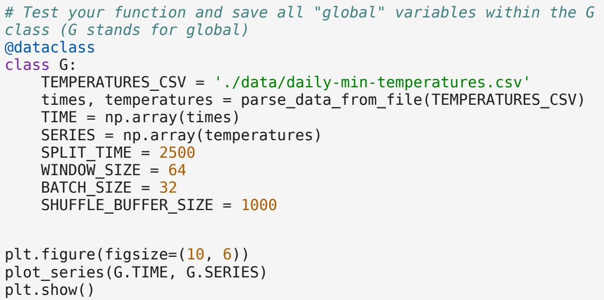
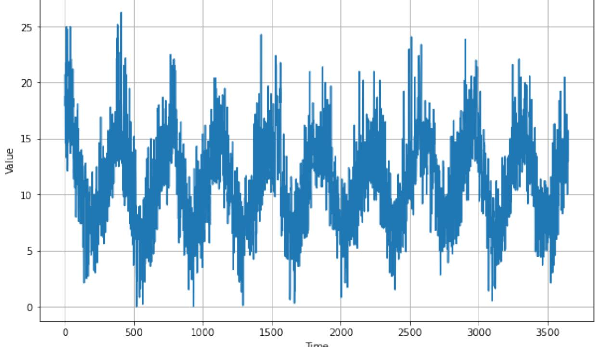
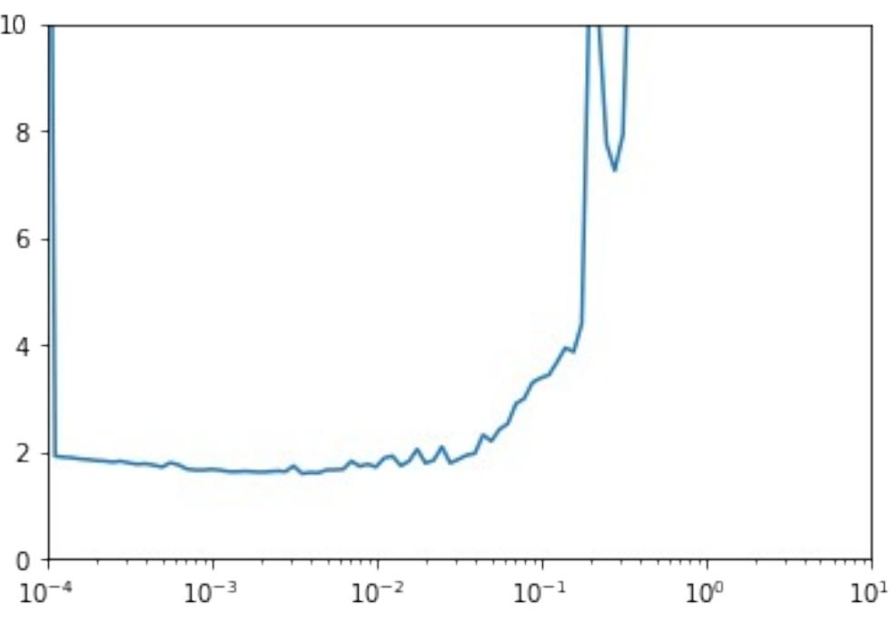
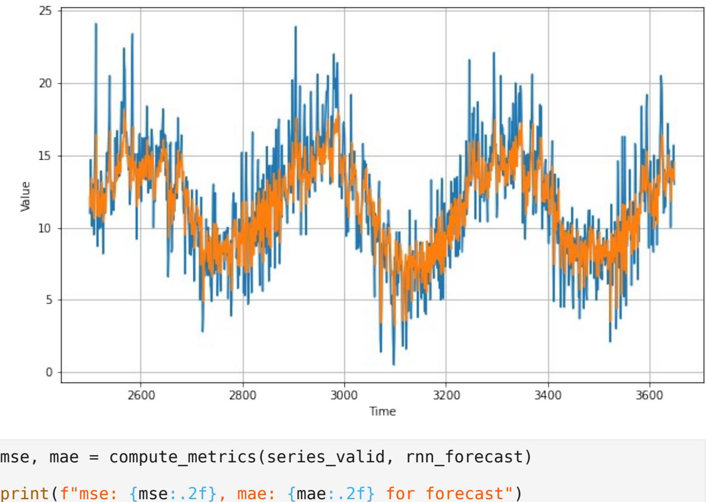

# Week 4: Using real world data

Welcome! So far you have worked exclusively with generated data. This time you will be using the Daily Minimum Temperatures in Melbourne dataset which contains data of the daily minimum temperatures recorded in Melbourne from 1981 to 1990. In addition to be using Tensorflow's layers for processing sequence data such as Recurrent layers or LSTMs you will also use Convolutional layers to improve the model's performance.

Let's get started!

**NOTE:** To prevent errors from the autograder, you are not allowed to edit or delete some of the cells in this notebook . Please only put your solutions in between the *### START CODE HERE* and *### END CODE HERE* code comments, and also refrain from adding any new cells. **Once you have passed this assignment** and want to experiment with any of the locked cells, you may follow the instructions at the bottom of this notebook.

import csv import pickle import numpy as np import tensorflow as tf import matplotlib.pyplot as plt from dataclasses import dataclass from absl import logging logging.set_verbosity(logging.ERROR)

Begin by looking at the structure of the csv that contains the data:

```
TEMPERATURES_CSV = './data/daily-min-temperatures.csv'
with open(TEMPERATURES_CSV, 'r') as csvfile:
 print(f"Header looks like this:\n\n{csvfile.readline()}") 
 print(f"First data point looks like this:\n\
n{csvfile.readline()}")
 print(f"Second data point looks like this:\n\
n{csvfile.readline()}")
Header looks like this:
"Date","Temp"
First data point looks like this:
"1981-01-01",20.7
Second data point looks like this:
"1981-01-02",17.9
```
As you can see, each data point is composed of the date and the recorded minimum temperature for that date.

In the first exercise you will code a function to read the data from the csv but for now run the next cell to load a helper function to plot the time series.

```
def plot_series(time, series, format="-", start=0, end=None):
 plt.plot(time[start:end], series[start:end], format)
 plt.xlabel("Time")
 plt.ylabel("Value")
 plt.grid(True)
```
# Parsing the raw data

Now you need to read the data from the csv file. To do so, complete the parse_data_from_file function.

A couple of things to note:

- You should omit the first line as the file contains headers.
- There is no need to save the data points as numpy arrays, regular lists is fine.
- To read from csv files use csv.reader by passing the appropriate arguments.
- csv.reader returns an iterable that returns each row in every iteration. So the temperature can be accessed via row[1] and the date can be discarded.
- The times list should contain every timestep (starting at zero), which is just a sequence of ordered numbers with the same length as the temperatures list.
- The values of the temperatures should be of float type. You can use Python's built-in float function to ensure this.

```
def parse_data_from_file(filename):
 
 times = []
 temperatures = []
 with open(filename) as csvfile:
 
 ### START CODE HERE
 
 reader = csv.reader(csvfile, delimiter=',')
 next(reader)
 for row in reader:
 temperatures.append(float(row[1]))
 
 times = [x for x in range(0, len(temperatures))]
 ### END CODE HERE
```
return times, temperatures

The next cell will use your function to compute the times and temperatures and will save these as numpy arrays within the G dataclass. This cell will also plot the time series:





### **Expected Output:**

### Processing the data

Since you already coded the train_val_split and windowed_dataset functions during past week's assignments, this time they are provided for you:

```
def train_val_split(time, series, time_step=G.SPLIT_TIME):
 time_train = time[:time_step]
 series_train = series[:time_step]
 time_valid = time[time_step:]
 series_valid = series[time_step:]
 return time_train, series_train, time_valid, series_valid
# Split the dataset
time_train, series_train, time_valid, series_valid =
train_val_split(G.TIME, G.SERIES)
def windowed_dataset(series, window_size=G.WINDOW_SIZE, 
batch_size=G.BATCH_SIZE, shuffle_buffer=G.SHUFFLE_BUFFER_SIZE):
 ds = tf.data.Dataset.from_tensor_slices(series)
 ds = ds.window(window_size + 1, shift=1, drop_remainder=True)
 ds = ds.flat_map(lambda w: w.batch(window_size + 1))
 ds = ds.shuffle(shuffle_buffer)
 ds = ds.map(lambda w: (w[:-1], w[-1]))
 ds = ds.batch(batch_size).prefetch(1)
 return ds
# Apply the transformation to the training set
train_set = windowed_dataset(series_train, window_size=G.WINDOW_SIZE, 
batch_size=G.BATCH_SIZE, shuffle_buffer=G.SHUFFLE_BUFFER_SIZE)
```
# Defining the model architecture

Now that you have a function that will process the data before it is fed into your neural network for training, it is time to define your layer architecture. Just as in last week's assignment you will do the layer definition and compilation in two separate steps. Begin by completing the create_uncompiled_model function below.

This is done so you can reuse your model's layers for the learning rate adjusting and the actual training.

Hint:

- Lambda layers are not required.
- Use a combination of Conv1D and LSTM layers followed by Dense layers

```
def create_uncompiled_model():
```
### *### START CODE HERE*

```
 model = tf.keras.models.Sequential([
 tf.keras.layers.Lambda(lambda x: tf.expand_dims(x, axis=-1),
```

```
input_shape=[None]),
 tf.keras.layers.Conv1D(filters=32, kernel_size=5, 
 strides=1, 
 padding="causal", 
 activation="relu", 
 input_shape=[None, 1]),
 tf.keras.layers.LSTM(32, return_sequences=True),
 tf.keras.layers.LSTM(32), 
 tf.keras.layers.Dense(10, activation="relu"),
 tf.keras.layers.Dense(10, activation="relu"),
 tf.keras.layers.Dense(1),
 tf.keras.layers.Lambda(lambda x: x * 400)
 ]) 
 ### END CODE HERE
 return model
```
You can test your model with the code below. If you get an error, it's likely that your model is returning a sequence. You can indeed use an LSTM with return_sequences=True but you have to feed it into another layer that generates a single prediction. You can review the lectures or the previous ungraded labs to see how that is done.

```
# Test your uncompiled model
# Create an instance of the model
uncompiled_model = create_uncompiled_model()
# Get one batch of the training set(X = input, y = label)
for X, y in train_set.take(1):
 
 # Generate a prediction
 print(f'Testing model prediction with input of shape 
{X.shape}...')
 y_pred = uncompiled_model.predict(X)
 
# Compare the shape of the prediction and the label y (remove 
dimensions of size 1)
y_pred_shape = y_pred.squeeze().shape
assert y_pred_shape == y.shape, (f'Squeezed predicted y shape = 
{y_pred_shape} '
 f'whereas actual y shape = 
{y.shape}.')
print("Your current architecture is compatible with the windowed 
dataset! :)")
Testing model prediction with input of shape (32, 64)...
Your current architecture is compatible with the windowed dataset! :)
```
# Adjusting the learning rate - (Optional Exercise)

As you saw in the lectures, you can leverage Tensorflow's callbacks to dynamically vary the learning rate before doing the actual training. This can be helpful in finding what value works best with your model. Note that this is only one way of finding the best learning rate. There are other techniques for hyperparameter optimization but it is outside the scope of this course.

For the optimizers you can try out:

- tf.keras.optimizers.Adam
- tf.keras.optimizers.SGD with a momentum of 0.9

```
def adjust_learning_rate(dataset):
 
 model = create_uncompiled_model()
 
 lr_schedule = tf.keras.callbacks.LearningRateScheduler(lambda
epoch: 1e-4 * 10**(epoch / 20))
 
 ### START CODE HERE
 
 # Select your optimizer
 optimizer = tf.keras.optimizers.Adam(learning_rate = 1e-8)
 
 # Compile the model passing in the appropriate loss
 model.compile(loss=tf.keras.losses.Huber(),
 optimizer=optimizer, 
 metrics=["mae"]) 
 
 ### END CODE HERE
 
 history = model.fit(dataset, epochs=100, callbacks=[lr_schedule])
 
 return history
# Run the training with dynamic LR
lr_history = adjust_learning_rate(train_set)
Epoch 1/100
77/77 [==============================] - 8s 66ms/step - loss: 24.4909 
- mae: 24.9705 - lr: 1.0000e-04
Epoch 2/100
77/77 [==============================] - 5s 59ms/step - loss: 1.9108 -
mae: 2.3641 - lr: 1.1220e-04
Epoch 3/100
77/77 [==============================] - 5s 58ms/step - loss: 1.8928 -
mae: 2.3447 - lr: 1.2589e-04
Epoch 4/100
77/77 [==============================] - 5s 58ms/step - loss: 1.8820 -
```

```
mae: 2.3358 - lr: 1.4125e-04
```

| Epoch 5/100 |
| --- |
| 77/77 [==============================] - 5s 60ms/step - loss: 1.8602 - |
| mae: 2.3121 - lr: 1.5849e-04 |
| Epoch 6/100 |
| 77/77 [==============================] - 5s 59ms/step - loss: 1.8464 - |
| mae: 2.2994 - lr: 1.7783e-04 |
| Epoch 7/100 |
| 77/77 [==============================] - 5s 59ms/step - loss: 1.8289 - |
| mae: 2.2800 - lr: 1.9953e-04 |
| Epoch 8/100 |
| 77/77 [==============================] - 4s 56ms/step - loss: 1.8200 - |
| mae: 2.2672 - lr: 2.2387e-04 |
| Epoch 9/100 |
| 77/77 [==============================] - 4s 56ms/step - loss: 1.8007 - |
| mae: 2.2519 - lr: 2.5119e-04 |
| Epoch 10/100 77/77 [==============================] - 4s 56ms/step - loss: 1.8182 - |
| mae: 2.2709 - lr: 2.8184e-04 |
| Epoch 11/100 |
| 77/77 [==============================] - 4s 56ms/step - loss: 1.7833 - |
| mae: 2.2346 - lr: 3.1623e-04 |
| Epoch 12/100 |
| 77/77 [==============================] - 4s 56ms/step - loss: 1.7598 - |
| mae: 2.2115 - lr: 3.5481e-04 |
| Epoch 13/100 |
| 77/77 [==============================] - 4s 55ms/step - loss: 1.7694 - |
| mae: 2.2244 - lr: 3.9811e-04 |
| Epoch 14/100 |
| 77/77 [==============================] - 4s 53ms/step - loss: 1.7435 - |
| mae: 2.1961 - lr: 4.4668e-04 |
| Epoch 15/100 |
| 77/77 [==============================] - 4s 54ms/step - loss: 1.7077 - |
| mae: 2.1571 - lr: 5.0119e-04 |
| Epoch 16/100 |
| 77/77 [==============================] - 4s 54ms/step - loss: 1.7871 - |
| mae: 2.2386 - lr: 5.6234e-04 |
| Epoch 17/100 |
| 77/77 [==============================] - 4s 54ms/step - loss: 1.7492 - |
| mae: 2.1998 - lr: 6.3096e-04 |
| Epoch 18/100 |
| 77/77 [==============================] - 4s 57ms/step - loss: 1.6697 - |
| mae: 2.1179 - lr: 7.0795e-04 |
| Epoch 19/100 |
| 77/77 [==============================] - 4s 56ms/step - loss: 1.6520 - |
| mae: 2.1005 - lr: 7.9433e-04 |
| Epoch 20/100 |
| 77/77 [==============================] - 4s 54ms/step - loss: 1.6510 - |
| mae: 2.0991 - lr: 8.9125e-04 |
| Epoch 21/100 |

| 77/77 [==============================] - 4s 55ms/step - loss: 1.6642 - |
| --- |
| mae: 2.1126 - lr: 0.0010 |
| Epoch 22/100 |
| 77/77 [==============================] - 4s 55ms/step - loss: 1.6507 - |
| mae: 2.0997 - lr: 0.0011 |
| Epoch 23/100 |
| 77/77 [==============================] - 4s 54ms/step - loss: 1.6235 - |
| mae: 2.0721 - lr: 0.0013 |
| Epoch 24/100 |
| 77/77 [==============================] - 4s 54ms/step - loss: 1.6190 - |
| mae: 2.0658 - lr: 0.0014 |
| Epoch 25/100 |
| 77/77 [==============================] - 4s 55ms/step - loss: 1.6305 - |
| mae: 2.0787 - lr: 0.0016 |
| Epoch 26/100 |
| 77/77 [==============================] - 4s 56ms/step - loss: 1.6213 - |
| mae: 2.0610 - lr: 0.0018 |
| Epoch 27/100 |
| 77/77 [==============================] - 5s 58ms/step - loss: 1.6108 - |
| mae: 2.0538 - lr: 0.0020 |
| Epoch 28/100 |
| 77/77 [==============================] - 5s 58ms/step - loss: 1.6213 - |
| mae: 2.0684 - lr: 0.0022 |
| Epoch 29/100 |
| 77/77 [==============================] - 4s 55ms/step - loss: 1.6343 - |
| mae: 2.0761 - lr: 0.0025 |
| Epoch 30/100 |
| 77/77 [==============================] - 4s 54ms/step - loss: 1.6225 - |
| mae: 2.0730 - lr: 0.0028 |
| Epoch 31/100 |
| 77/77 [==============================] - 5s 58ms/step - loss: 1.7294 - |
| mae: 2.1789 - lr: 0.0032 |
| Epoch 32/100 |
| 77/77 [==============================] - 5s 57ms/step - loss: 1.5843 - |
| mae: 2.0271 - lr: 0.0035 |
| Epoch 33/100 |
| 77/77 [==============================] - 4s 56ms/step - loss: 1.6065 - |
| mae: 2.0534 - lr: 0.0040 |
| Epoch 34/100 |
| 77/77 [==============================] - 4s 55ms/step - loss: 1.5993 - |
| mae: 2.0439 - lr: 0.0045 |
| Epoch 35/100 |
| 77/77 [==============================] - 4s 55ms/step - loss: 1.6541 - |
| mae: 2.1021 - lr: 0.0050 |
| Epoch 36/100 |
| 77/77 [==============================] - 4s 55ms/step - loss: 1.6550 - |
| mae: 2.1004 - lr: 0.0056 |
| Epoch 37/100 |
| 77/77 [==============================] - 4s 55ms/step - loss: 1.6655 - |

| mae: 2.1136 - lr: 0.0063 |
| --- |
| Epoch 38/100 |
| 77/77 [==============================] - 4s 54ms/step - loss: 1.8191 - |
| mae: 2.2691 - lr: 0.0071 |
| Epoch 39/100 |
| 77/77 [==============================] - 4s 57ms/step - loss: 1.7212 - |
| mae: 2.1705 - lr: 0.0079 |
| Epoch 40/100 |
| 77/77 [==============================] - 4s 57ms/step - loss: 1.7610 - |
| mae: 2.2099 - lr: 0.0089 |
| Epoch 41/100 |
| 77/77 [==============================] - 4s 54ms/step - loss: 1.7092 - |
| mae: 2.1579 - lr: 0.0100 |
| Epoch 42/100 |
| 77/77 [==============================] - 4s 54ms/step - loss: 1.8784 - |
| mae: 2.3294 - lr: 0.0112 |
| Epoch 43/100 |
| 77/77 [==============================] - 4s 54ms/step - loss: 1.9141 - |
| mae: 2.3684 - lr: 0.0126 |
| Epoch 44/100 |
| 77/77 [==============================] - 4s 54ms/step - loss: 1.7328 - |
| mae: 2.1815 - lr: 0.0141 |
| Epoch 45/100 |
| 77/77 [==============================] - 4s 55ms/step - loss: 1.8159 - |
| mae: 2.2680 - lr: 0.0158 |
| Epoch 46/100 |
| 77/77 [==============================] - 5s 58ms/step - loss: 2.0405 - |
| mae: 2.5011 - lr: 0.0178 |
| Epoch 47/100 |
| 77/77 [==============================] - 5s 59ms/step - loss: 1.7820 - |
| mae: 2.2370 - lr: 0.0200 |
| Epoch 48/100 |
| 77/77 [==============================] - 4s 56ms/step - loss: 1.8320 - |
| mae: 2.2854 - lr: 0.0224 |
| Epoch 49/100 |
| 77/77 [==============================] - 4s 57ms/step - loss: 2.0877 - |
| mae: 2.5460 - lr: 0.0251 |
| Epoch 50/100 |
| 77/77 [==============================] - 4s 55ms/step - loss: 1.7828 - |
| mae: 2.2334 - lr: 0.0282 |
| Epoch 51/100 77/77 [==============================] - 4s 53ms/step - loss: 1.8514 - |
| mae: 2.3041 - lr: 0.0316 |
| Epoch 52/100 |
| 77/77 [==============================] - 4s 54ms/step - loss: 1.9296 - |
| mae: 2.3819 - lr: 0.0355 |
| Epoch 53/100 |
| 77/77 [==============================] - 4s 55ms/step - loss: 1.9598 - |
| mae: 2.4168 - lr: 0.0398 |

| Epoch 54/100 |
| --- |
| 77/77 [==============================] - 4s 53ms/step - loss: 2.3089 - |
| mae: 2.7694 - lr: 0.0447 |
| Epoch 55/100 77/77 [==============================] - 4s 54ms/step - loss: 2.1926 - |
| mae: 2.6545 - lr: 0.0501 |
| Epoch 56/100 |
| 77/77 [==============================] - 4s 53ms/step - loss: 2.4130 - |
| mae: 2.8771 - lr: 0.0562 |
| Epoch 57/100 |
| 77/77 [==============================] - 4s 55ms/step - loss: 2.5168 - |
| mae: 2.9844 - lr: 0.0631 |
| Epoch 58/100 |
| 77/77 [==============================] - 4s 54ms/step - loss: 2.8935 - |
| mae: 3.3626 - lr: 0.0708 |
| Epoch 59/100 |
| 77/77 [==============================] - 4s 57ms/step - loss: 2.9867 - |
| mae: 3.4549 - lr: 0.0794 |
| Epoch 60/100 |
| 77/77 [==============================] - 5s 58ms/step - loss: 3.2878 - |
| mae: 3.7592 - lr: 0.0891 |
| Epoch 61/100 |
| 77/77 [==============================] - 5s 59ms/step - loss: 3.3710 - |
| mae: 3.8415 - lr: 0.1000 |
| Epoch 62/100 |
| 77/77 [==============================] - 4s 56ms/step - loss: 3.4278 - |
| mae: 3.8997 - lr: 0.1122 |
| Epoch 63/100 |
| 77/77 [==============================] - 4s 55ms/step - loss: 3.6739 - |
| mae: 4.1456 - lr: 0.1259 |
| Epoch 64/100 |
| 77/77 [==============================] - 4s 55ms/step - loss: 3.9371 - |
| mae: 4.4125 - lr: 0.1413 |
| Epoch 65/100 |
| 77/77 [==============================] - 4s 55ms/step - loss: 3.8587 - |
| mae: 4.3344 - lr: 0.1585 |
| Epoch 66/100 |
| 77/77 [==============================] - 4s 53ms/step - loss: 4.3896 - |
| mae: 4.8719 - lr: 0.1778 |
| Epoch 67/100 |
| 77/77 [==============================] - 4s 56ms/step - loss: 11.2042 |
| - mae: 11.6972 - lr: 0.1995 |
| Epoch 68/100 |
| 77/77 [==============================] - 4s 55ms/step - loss: 10.1942 |
| - mae: 10.6870 - lr: 0.2239 |
| Epoch 69/100 |
| 77/77 [==============================] - 4s 54ms/step - loss: 7.7540 - |
| mae: 8.2454 - lr: 0.2512 |
| Epoch 70/100 |

| 77/77 [==============================] - 4s 54ms/step - loss: 7.2467 - |
| --- |
| mae: 7.7331 - lr: 0.2818 |
| Epoch 71/100 77/77 [==============================] - 4s 55ms/step - loss: 7.9244 - |
| mae: 8.4136 - lr: 0.3162 |
| Epoch 72/100 |
| 77/77 [==============================] - 5s 59ms/step - loss: 12.6181 |
| - mae: 13.1108 - lr: 0.3548 |
| Epoch 73/100 |
| 77/77 [==============================] - 5s 59ms/step - loss: 11.2492 |
| - mae: 11.7464 - lr: 0.3981 |
| Epoch 74/100 |
| 77/77 [==============================] - 5s 59ms/step - loss: 23.1204 |
| - mae: 23.6200 - lr: 0.4467 |
| Epoch 75/100 |
| 77/77 [==============================] - 4s 55ms/step - loss: 25.9884 |
| - mae: 26.4884 - lr: 0.5012 |
| Epoch 76/100 |
| 77/77 [==============================] - 4s 53ms/step - loss: 28.2117 |
| - mae: 28.7116 - lr: 0.5623 |
| Epoch 77/100 |
| 77/77 [==============================] - 4s 56ms/step - loss: 30.4699 |
| - mae: 30.9699 - lr: 0.6310 |
| Epoch 78/100 |
| 77/77 [==============================] - 5s 60ms/step - loss: 33.4736 |
| - mae: 33.9736 - lr: 0.7079 |
| Epoch 79/100 |
| 77/77 [==============================] - 4s 56ms/step - loss: 37.2388 |
| - mae: 37.7388 - lr: 0.7943 |
| Epoch 80/100 |
| 77/77 [==============================] - 4s 54ms/step - loss: 40.6888 |
| - mae: 41.1888 - lr: 0.8913 |
| Epoch 81/100 |
| 77/77 [==============================] - 4s 55ms/step - loss: 44.9233 |
| - mae: 45.4233 - lr: 1.0000 |
| Epoch 82/100 |
| 77/77 [==============================] - 4s 54ms/step - loss: 50.1220 |
| - mae: 50.6220 - lr: 1.1220 |
| Epoch 83/100 |
| 77/77 [==============================] - 4s 55ms/step - loss: 54.9483 |
| - mae: 55.4483 - lr: 1.2589 |
| Epoch 84/100 |
| 77/77 [==============================] - 4s 54ms/step - loss: 60.9482 |
| - mae: 61.4482 - lr: 1.4125 |
| Epoch 85/100 |
| 77/77 [==============================] - 4s 54ms/step - loss: 68.3688 |
| - mae: 68.8688 - lr: 1.5849 |
| Epoch 86/100 |
| 77/77 [==============================] - 5s 58ms/step - loss: 75.2481 |

| - mae: 75.7481 - lr: 1.7783 |
| --- |
| Epoch 87/100 |
| 77/77 [==============================] - 4s 56ms/step - loss: 83.5534 |
| - mae: 84.0534 - lr: 1.9953 |
| Epoch 88/100 |
| 77/77 [==============================] - 4s 56ms/step - loss: 94.0494 |
| - mae: 94.5494 - lr: 2.2387 |
| Epoch 89/100 |
| 77/77 [==============================] - 4s 54ms/step - loss: 103.8241 |
| - mae: 104.3241 - lr: 2.5119 |
| Epoch 90/100 |
| 77/77 [==============================] - 4s 55ms/step - loss: 115.6366 |
| - mae: 116.1366 - lr: 2.8184 |
| Epoch 91/100 |
| 77/77 [==============================] - 4s 55ms/step - loss: 130.4063 |
| - mae: 130.9063 - lr: 3.1623 |
| Epoch 92/100 |
| 77/77 [==============================] - 4s 53ms/step - loss: 144.0415 |
| - mae: 144.5415 - lr: 3.5481 |
| Epoch 93/100 |
| 77/77 [==============================] - 4s 54ms/step - loss: 160.8431 |
| - mae: 161.3431 - lr: 3.9811 |
| Epoch 94/100 |
| 77/77 [==============================] - 4s 55ms/step - loss: 181.4554 |
| - mae: 181.9554 - lr: 4.4668 |
| Epoch 95/100 |
| 77/77 [==============================] - 4s 55ms/step - loss: 200.7534 |
| - mae: 201.2534 - lr: 5.0119 |
| Epoch 96/100 |
| 77/77 [==============================] - 4s 57ms/step - loss: 224.0900 |
| - mae: 224.5900 - lr: 5.6234 |
| Epoch 97/100 |
| 77/77 [==============================] - 4s 55ms/step - loss: 253.2646 |
| - mae: 253.7646 - lr: 6.3096 |
| Epoch 98/100 |
| 77/77 [==============================] - 4s 56ms/step - loss: 280.7455 |
| - mae: 281.2455 - lr: 7.0795 |
| Epoch 99/100 |
| 77/77 [==============================] - 4s 56ms/step - loss: 313.4913 |
| - mae: 313.9913 - lr: 7.9433 |
| Epoch 100/100 |
| 77/77 [==============================] - 4s 57ms/step - loss: 354.4048 |
| - mae: 354.9048 - lr: 8.9125 |
| plt.semilogx(lr_history.history["lr"], lr_history.history["loss"]) |
| plt.axis([1e-4, 10, 0, 10]) |
| (0.0001, 10.0, 0.0, 10.0) |



# Compiling the model

Now that you have trained the model while varying the learning rate, it is time to do the actual training that will be used to forecast the time series. For this complete the create_model function below.

Notice that you are reusing the architecture you defined in the create_uncompiled_model earlier. Now you only need to compile this model using the appropriate loss, optimizer (and learning rate).

Hints:

- The training should be really quick so if you notice that each epoch is taking more than a few seconds, consider trying a different architecture.
- If after the first epoch you get an output like this: loss: nan mae: nan it is very likely that your network is suffering from exploding gradients. This is a common problem if you used SGD as optimizer and set a learning rate that is too high. If you encounter this problem consider lowering the learning rate or using Adam with the default learning rate.

```
def create_model():
 
 model = create_uncompiled_model()
 ### START CODE HERE
```

```
 model.compile(loss=tf.keras.losses.Huber(),
```
 optimizer=tf.keras.optimizers.Adam(learning_rate = 1e-3), metrics=["mae"]) *###* END *CODE HERE* return model *# Save an instance of the model* model = create_model() *# Train it* history = model.fit(train_set, epochs=50) Epoch 1/50 77/77 [==============================] - 8s 63ms/step - loss: 3.2806 mae: 3.7431 Epoch 2/50 77/77 [==============================] - 5s 61ms/step - loss: 1.6829 mae: 2.1310 Epoch 3/50 77/77 [==============================] - 5s 61ms/step - loss: 1.8909 mae: 2.3455 Epoch 4/50 77/77 [==============================] - 5s 59ms/step - loss: 1.6764 mae: 2.1254 Epoch 5/50 77/77 [==============================] - 5s 58ms/step - loss: 1.6452 mae: 2.0956 Epoch 6/50 77/77 [==============================] - 5s 59ms/step - loss: 1.7430 mae: 2.1910 Epoch 7/50 77/77 [==============================] - 4s 57ms/step - loss: 1.6034 mae: 2.0492 Epoch 8/50 77/77 [==============================] - 5s 60ms/step - loss: 1.5793 mae: 2.0232 Epoch 9/50 77/77 [==============================] - 5s 59ms/step - loss: 1.6103 mae: 2.0586 Epoch 10/50 77/77 [==============================] - 5s 58ms/step - loss: 1.5209 mae: 1.9613 Epoch 11/50 77/77 [==============================] - 5s 58ms/step - loss: 1.5629 mae: 2.0075 Epoch 12/50 77/77 [==============================] - 5s 60ms/step - loss: 1.5622 -

| mae: 2.0062 |  |
| --- | --- |
| Epoch 13/50 |  |
|  | 77/77 [==============================] - 5s 58ms/step - loss: 1.5792 - |
| mae: 2.0250 |  |
| Epoch 14/50 |  |
|  | 77/77 [==============================] - 4s 56ms/step - loss: 1.6006 - |
| mae: 2.0456 |  |
| Epoch 15/50 |  |
|  | 77/77 [==============================] - 4s 56ms/step - loss: 1.5588 - |
| mae: 2.0065 |  |
| Epoch 16/50 |  |
|  | 77/77 [==============================] - 4s 57ms/step - loss: 1.5687 - |
| mae: 2.0108 |  |
| Epoch 17/50 |  |
|  | 77/77 [==============================] - 4s 54ms/step - loss: 1.5771 - |
| mae: 2.0194 |  |
| Epoch 18/50 |  |
|  | 77/77 [==============================] - 4s 56ms/step - loss: 1.5064 - |
| mae: 1.9488 |  |
| Epoch 19/50 |  |
|  | 77/77 [==============================] - 4s 56ms/step - loss: 1.5061 - |
| mae: 1.9447 |  |
| Epoch 20/50 |  |
|  | 77/77 [==============================] - 4s 55ms/step - loss: 1.6010 - |
| mae: 2.0450 |  |
| Epoch 21/50 |  |
|  | 77/77 [==============================] - 4s 55ms/step - loss: 1.5855 - |
| mae: 2.0319 |  |
| Epoch 22/50 |  |
|  | 77/77 [==============================] - 4s 54ms/step - loss: 1.5638 - |
| mae: 2.0057 |  |
| Epoch 23/50 |  |
|  | 77/77 [==============================] - 4s 55ms/step - loss: 1.5269 - |
| mae: 1.9716 |  |
| Epoch 24/50 |  |
|  | 77/77 [==============================] - 4s 55ms/step - loss: 1.5201 - |
| mae: 1.9610 |  |
| Epoch 25/50 |  |
|  | 77/77 [==============================] - 4s 57ms/step - loss: 1.5089 - |
| mae: 1.9517 |  |
| Epoch 26/50 |  |
|  | 77/77 [==============================] - 4s 57ms/step - loss: 1.4898 - |
| mae: 1.9319 |  |
| Epoch 27/50 |  |
|  | 77/77 [==============================] - 4s 53ms/step - loss: 1.5264 - |
| mae: 1.9672 |  |
| Epoch 28/50 |  |
|  | 77/77 [==============================] - 4s 54ms/step - loss: 1.5439 - |
| mae: 1.9882 |  |

| Epoch 29/50 |
| --- |
| 77/77 [==============================] - 4s 54ms/step - loss: 1.5233 - |
| mae: 1.9677 |
| Epoch 30/50 |
| 77/77 [==============================] - 4s 54ms/step - loss: 1.5439 - |
| mae: 1.9852 |
| Epoch 31/50 |
| 77/77 [==============================] - 4s 54ms/step - loss: 1.4895 - |
| mae: 1.9252 |
| Epoch 32/50 |
| 77/77 [==============================] - 4s 53ms/step - loss: 1.5368 - |
| mae: 1.9815 |
| Epoch 33/50 |
| 77/77 [==============================] - 4s 54ms/step - loss: 1.5042 - |
| mae: 1.9482 |
| Epoch 34/50 |
| 77/77 [==============================] - 4s 55ms/step - loss: 1.5621 - |
| mae: 2.0042 |
| Epoch 35/50 |
| 77/77 [==============================] - 4s 53ms/step - loss: 1.4968 - |
| mae: 1.9403 |
| Epoch 36/50 |
| 77/77 [==============================] - 4s 54ms/step - loss: 1.5423 - |
| mae: 1.9866 |
| Epoch 37/50 |
| 77/77 [==============================] - 4s 55ms/step - loss: 1.4822 - |
| mae: 1.9246 |
| Epoch 38/50 |
| 77/77 [==============================] - 4s 55ms/step - loss: 1.4828 - |
| mae: 1.9250 |
| Epoch 39/50 |
| 77/77 [==============================] - 4s 55ms/step - loss: 1.4966 - |
| mae: 1.9403 |
| Epoch 40/50 |
| 77/77 [==============================] - 4s 57ms/step - loss: 1.5255 - |
| mae: 1.9656 |
| Epoch 41/50 |
| 77/77 [==============================] - 4s 56ms/step - loss: 1.5274 - |
| mae: 1.9720 |
| Epoch 42/50 |
| 77/77 [==============================] - 4s 55ms/step - loss: 1.4801 - |
| mae: 1.9196 |
| Epoch 43/50 |
| 77/77 [==============================] - 4s 55ms/step - loss: 1.6149 - |
| mae: 2.0611 |
| Epoch 44/50 |
| 77/77 [==============================] - 4s 55ms/step - loss: 1.4919 - |
| mae: 1.9365 |
| Epoch 45/50 |

| 77/77 [==============================] - 4s 54ms/step - loss: 1.4782 - |
| --- |
| mae: 1.9183 |
| Epoch 46/50 |
| 77/77 [==============================] - 4s 53ms/step - loss: 1.4769 - |
| mae: 1.9152 |
| Epoch 47/50 |
| 77/77 [==============================] - 4s 55ms/step - loss: 1.5073 - |
| mae: 1.9496 |
| Epoch 48/50 |
| 77/77 [==============================] - 4s 53ms/step - loss: 1.4861 - |
| mae: 1.9256 |
| Epoch 49/50 |
| 77/77 [==============================] - 4s 54ms/step - loss: 1.4928 - |
| mae: 1.9327 |
| Epoch 50/50 |
| 77/77 [==============================] - 4s 54ms/step - loss: 1.4709 - |
| mae: 1.9142 |

### Evaluating the forecast

Now it is time to evaluate the performance of the forecast. For this you can use the compute_metrics function that you coded in a previous assignment:

```
def compute_metrics(true_series, forecast):
```

```
 mse = tf.keras.metrics.mean_squared_error(true_series,
```

```
forecast).numpy()
```

```
 mae = tf.keras.metrics.mean_absolute_error(true_series, 
forecast).numpy()
```
return mse, mae

At this point only the model that will perform the forecast is ready but you still need to compute the actual forecast.

## Faster model forecasts

In the previous week you saw a faster approach compared to using a for loop to compute the forecasts for every point in the sequence. Remember that this faster approach uses batches of data.

The code to implement this is provided in the model_forecast below. Notice that the code is very similar to the one in the windowed_dataset function with the differences that:

- The dataset is windowed using window_size rather than window_size + 1
- No shuffle should be used
- No need to split the data into features and labels
- A model is used to predict batches of the dataset

```
def model_forecast(model, series, window_size):
 ds = tf.data.Dataset.from_tensor_slices(series)
 ds = ds.window(window_size, shift=1, drop_remainder=True)
 ds = ds.flat_map(lambda w: w.batch(window_size))
 ds = ds.batch(32).prefetch(1)
 forecast = model.predict(ds)
 return forecast
```
Now compute the actual forecast:

**Note:** Don't modify the cell below.

The grader uses the same slicing to get the forecast so if you change the cell below you risk having issues when submitting your model for grading.

```
# Compute the forecast for all the series
rnn_forecast = model_forecast(model, G.SERIES, 
G.WINDOW_SIZE).squeeze()
# Slice the forecast to get only the predictions for the validation 
set
rnn_forecast = rnn_forecast[G.SPLIT_TIME - G.WINDOW_SIZE:-1]
# Plot the forecast
plt.figure(figsize=(10, 6))
plot_series(time_valid, series_valid)
plot_series(time_valid, rnn_forecast)
```


mse: 5.35, mae: 1.80 for forecast

#### **To pass this assignment your forecast should achieve a MSE of 6 or less and a MAE of 2 or less.**

- If your forecast didn't achieve this threshold try re-training your model with a different architecture (you will need to re-run both create_uncompiled_model and create_model functions) or tweaking the optimizer's parameters.
- If your forecast did achieve this threshold run the following cell to save the model in the SavedModel format which will be used for grading and after doing so, submit your assigment for grading.
- This environment includes a dummy SavedModel directory which contains a dummy model trained for one epoch. **To replace this file with your actual model you need to run the next cell before submitting for grading.**

```
# Save your model in the SavedModel format
model.save('saved_model/my_model')
# Compress the directory using tar
! tar -czvf saved_model.tar.gz saved_model/
```
INFO:tensorflow:Assets written to: saved_model/my_model/assets INFO:tensorflow:Assets written to: saved_model/my_model/assets saved_model/ saved_model/my_model/ saved_model/my_model/keras_metadata.pb saved_model/my_model/variables/ saved_model/my_model/variables/variables.data-00000-of-00001 saved_model/my_model/variables/variables.index saved_model/my_model/saved_model.pb saved_model/my_model/assets/

#### **Congratulations on finishing this week's assignment!**

You have successfully implemented a neural network capable of forecasting time series leveraging a combination of Tensorflow's layers such as Convolutional and LSTMs! This resulted in a forecast that surpasses all the ones you did previously.

**By finishing this assignment you have finished the specialization! Give yourself a pat on the back!!!**

