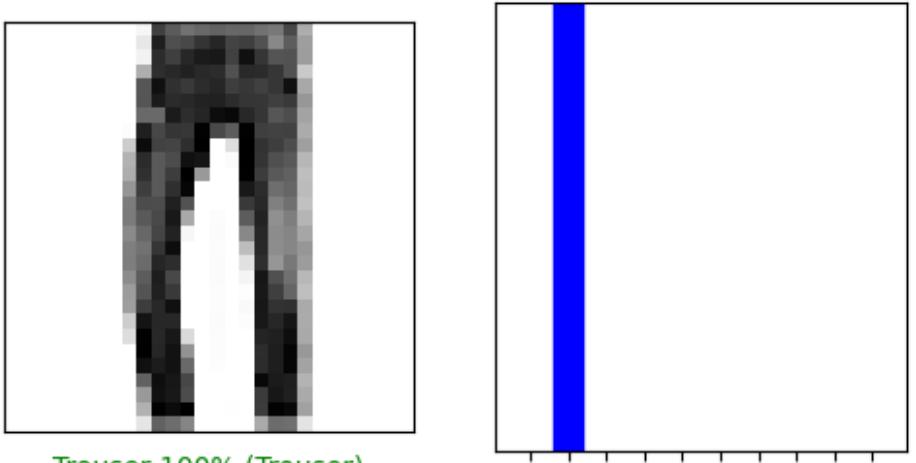

```
# ATTENTION: Please do not alter any of the provided code in the 
exercise. Only add your own code where indicated
# ATTENTION: Please do not add or remove any cells in the exercise. 
The grader will check specific cells based on the cell position.
# ATTENTION: Please use the provided epoch values when training.
# Licensed under the Apache License, Version 2.0 (the "License");
# you may not use this file except in compliance with the License.
# You may obtain a copy of the License at
#
# https://www.apache.org/licenses/LICENSE-2.0
#
# Unless required by applicable law or agreed to in writing, software
# distributed under the License is distributed on an "AS IS" BASIS,
# WITHOUT WARRANTIES OR CONDITIONS OF ANY KIND, either express or 
implied.
# See the License for the specific language governing permissions and
# limitations under the License.
```
## Train Your Own Model and Convert It to TFLite

This notebook uses the Fashion MNIST dataset which contains 70,000 grayscale images in 10 categories. The images show individual articles of clothing at low resolution (28 by 28 pixels), as seen here:

Fashion MNIST is intended as a drop-in replacement for the classic MNIST dataset—often used as the "Hello, World" of machine learning programs for computer vision. The MNIST dataset contains images of handwritten digits (0, 1, 2, etc.) in a format identical to that of the articles of clothing we'll use here.

This uses Fashion MNIST for variety, and because it's a slightly more challenging problem than regular MNIST. Both datasets are relatively small and are used to verify that an algorithm works as expected. They're good starting points to test and debug code.

We will use 60,000 images to train the network and 10,000 images to evaluate how accurately the network learned to classify images. You can access the Fashion MNIST directly from TensorFlow. Import and load the Fashion MNIST data directly from TensorFlow:

#### Setup

*# TensorFlow* import tensorflow as tf

*# TensorFlow Datsets* import tensorflow_datasets as tfds tfds.disable_progress_bar()

```
# Helper Libraries
import numpy as np
import matplotlib.pyplot as plt
import pathlib
from os import getcwd
from absl import logging
logging.set_verbosity(logging.ERROR)
print('\u2022 Using TensorFlow Version:', tf.__version__)
print('\u2022 GPU Device Found.' if
tf.config.list_physical_devices('GPU') else '\u2022 GPU Device Not 
Found. Running on CPU')
• Using TensorFlow Version: 2.9.1
```

```
• GPU Device Found.
```
## Download Fashion MNIST Dataset

We will use TensorFlow Datasets to load the Fashion MNIST dataset.

```
filePath = f"{getcwd()}/../tmp2/"
(train_examples, validation_examples, test_examples), info =
tfds.load('fashion_mnist', 
 
data_dir=filePath,
with_info=True, 
 
as_supervised=True, 
 
split=['train[:80%]',
 
'train[80%:90%]',
'train[90%:]'])
num_examples = info.splits['train'].num_examples
num_classes = info.features['label'].num_classes
```
The class names are not included with the dataset, so we will specify them here.

```
class_names = ['T-shirt_top', 'Trouser', 'Pullover', 'Dress', 'Coat',
 'Sandal', 'Shirt', 'Sneaker', 'Bag', 'Ankle boot']
```

```
# Create a labels.txt file with the class names
with open('labels.txt', 'w') as f:
 f.write('\n'.join(class_names))
```
*# The images in the dataset are 28 by 28 pixels.* IMG_SIZE = 28

# Preprocessing Data

#### Preprocess

```
# EXERCISE: Write a function to normalize the images.
# UNQ_C1
# GRADED FUNCTION: format_example
def format_example(image, label):
 # Cast image to float32
 image = tf.cast(x=image, dtype = tf.float32)
 
 # Normalize the image in the range [0, 1]
 image = image * 1.0/255.0
 
 return image, label
# Specify the batch size
BATCH_SIZE = 256
```
#### Create Datasets From Images and Labels

*# Create Datasets* train_batches = train_examples.cache().shuffle(num_examples//4).batch(BATCH_SIZE).map( format_example).prefetch(1) validation_batches = validation_examples.cache().batch(BATCH_SIZE).map(format_example) test_batches = test_examples.map(format_example).batch(1)

### Building the Model

| Model: "sequential" |  |  |
| --- | --- | --- |
| _________________________________________________________________ Layer (type) | Output Shape | Param # |
| ================================================================= |  |  |
| conv2d (Conv2D) | (None, 26, 26, 16) | 160 |
| _________________________________________________________________ |  |  |
| max_pooling2d (MaxPooling2D) (None, 13, 13, 16) |  | 0 |

| _________________________________________________________________ |  |
| --- | --- |
| conv2d_1 (Conv2D) (None, 11, 11, 32) 4640 |  |
| _________________________________________________________________ |  |
| flatten (Flatten) (None, 3872) | 0 |
| _________________________________________________________________ |  |
| dense (Dense) (None, 64) | 247872 |
| _________________________________________________________________ |  |
| dense_1 (Dense) (None, 10) 650 |  |
| ================================================================= |  |
| Total params: 253,322 |  |
| Trainable params: 253,322 |  |
| Non-trainable params: 0 |  |
| # EXERCISE: Build and compile the model shown in the previous cell. |  |
| # UNQ_C2 |  |
| # GRADED CODE: model |  |
| model = tf.keras.Sequential([ |  |
| # Set the input shape to (28, 28, 1), kernel size=3, filters=16 |  |
| and use ReLU activation, |  |
| tf.keras.layers.Conv2D(16,(3,3), activation='relu', |  |
| input_shape=(28,28,1)), |  |
| tf.keras.layers.MaxPooling2D(), |  |
| # Set the number of filters to 32, kernel size to 3 and use ReLU |  |
| activation |  |
| tf.keras.layers.Conv2D(32,(3,3), activation = 'relu'), |  |
| # Flatten the output layer to 1 dimension |  |
| tf.keras.layers.Flatten(), |  |
| # Add a fully connected layer with 64 hidden units and ReLU |  |
| activation |  |
| tf.keras.layers.Dense(units = 64, activation = 'relu'), |  |
| # Attach a final softmax classification head |  |
| tf.keras.layers.Dense(units=10, activation='softmax')]) |  |
| # Set the appropriate loss function and use accuracy as your metric |  |
| model.compile(optimizer='adam', |  |
| loss= 'sparse_categorical_crossentropy', |  |
| metrics= ['accuracy']) |  |

#### Train

*# UNQ_C3* history = model.fit(train_batches, epochs=10, validation_data=validation_batches)

```
Epoch 1/10
188/188 [==============================] - 26s 56ms/step - loss: 
0.6176 - accuracy: 0.7843 - val_loss: 0.4227 - val_accuracy: 0.8483
Epoch 2/10
188/188 [==============================] - 2s 11ms/step - loss: 0.3939
- accuracy: 0.8624 - val_loss: 0.3517 - val_accuracy: 0.8733
Epoch 3/10
188/188 [==============================] - 2s 10ms/step - loss: 0.3449
- accuracy: 0.8786 - val_loss: 0.3230 - val_accuracy: 0.8835
Epoch 4/10
188/188 [==============================] - 2s 10ms/step - loss: 0.3111
- accuracy: 0.8893 - val_loss: 0.3052 - val_accuracy: 0.8907
Epoch 5/10
188/188 [==============================] - 2s 11ms/step - loss: 0.2922
- accuracy: 0.8963 - val_loss: 0.2952 - val_accuracy: 0.8955
Epoch 6/10
188/188 [==============================] - 3s 14ms/step - loss: 0.2690
- accuracy: 0.9028 - val_loss: 0.2716 - val_accuracy: 0.9013
Epoch 7/10
188/188 [==============================] - 2s 12ms/step - loss: 0.2566
- accuracy: 0.9077 - val_loss: 0.2741 - val_accuracy: 0.8995
Epoch 8/10
188/188 [==============================] - 2s 12ms/step - loss: 0.2415
- accuracy: 0.9122 - val_loss: 0.2564 - val_accuracy: 0.9077
Epoch 9/10
188/188 [==============================] - 3s 13ms/step - loss: 0.2309
- accuracy: 0.9156 - val_loss: 0.2688 - val_accuracy: 0.8972
Epoch 10/10
188/188 [==============================] - 2s 11ms/step - loss: 0.2190
- accuracy: 0.9208 - val_loss: 0.2422 - val_accuracy: 0.9098
```
#### Exporting to TFLite

You will now save the model to TFLite. We should note, that you will probably see some warning messages when running the code below. These warnings have to do with software updates and should not cause any errors or prevent your code from running.

```
# EXERCISE: Use the tf.saved_model API to save your model in the 
SavedModel format. 
# UNQ_C4
# GRADED CODE: save_model
export_dir = 'saved_model/1'
tf.saved_model.save(model,export_dir=export_dir)
INFO:tensorflow:Assets written to: saved_model/1/assets
```
INFO:tensorflow:Assets written to: saved_model/1/assets *# Select mode of optimization* mode = "Speed" if mode == 'Storage': optimization = tf.lite.Optimize.OPTIMIZE_FOR_SIZE elif mode == 'Speed': optimization = tf.lite.Optimize.OPTIMIZE_FOR_LATENCY else: optimization = tf.lite.Optimize.DEFAULT *# EXERCISE: Use the TFLiteConverter SavedModel API to initialize the converter # UNQ_C5 # GRADED CODE: save_model* converter = tf.lite.TFLiteConverter.from_saved_model(export_dir) *# Set the optimzations* converter.optimizations = [optimization] *# Invoke the converter to finally generate the TFLite model* tflite_model = converter.convert(); tflite_model_file = pathlib.Path('./model.tflite') tflite_model_file.write_bytes(tflite_model) 259648

#### Test the Model with TFLite Interpreter

```
# Load TFLite model and allocate tensors.
interpreter = tf.lite.Interpreter(model_content=tflite_model)
interpreter.allocate_tensors()
input_index = interpreter.get_input_details()[0]["index"]
output_index = interpreter.get_output_details()[0]["index"]
# Gather results for the randomly sampled test images
predictions = []
test_labels = []
test_images = []
for img, label in test_batches.take(50):
 interpreter.set_tensor(input_index, img)
 interpreter.invoke()
 predictions.append(interpreter.get_tensor(output_index))
```

```
 test_labels.append(label[0])
 test_images.append(np.array(img))
# Utilities functions for plotting
def plot_image(i, predictions_array, true_label, img):
 predictions_array, true_label, img = predictions_array[i], 
true_label[i], img[i]
 plt.grid(False)
 plt.xticks([])
 plt.yticks([])
 
 img = np.squeeze(img)
 
 plt.imshow(img, cmap=plt.cm.binary)
 
 predicted_label = np.argmax(predictions_array)
 
 if predicted_label == true_label.numpy():
 color = 'green'
 else:
 color = 'red'
 
 plt.xlabel("{} {:2.0f}% ({})".format(class_names[predicted_label],
 
100*np.max(predictions_array),
 class_names[true_label]),
 color=color)
def plot_value_array(i, predictions_array, true_label):
 predictions_array, true_label = predictions_array[i], 
true_label[i]
 plt.grid(False)
 plt.xticks(list(range(10)))
 plt.yticks([])
 thisplot = plt.bar(range(10), predictions_array[0], 
color="#777777")
 plt.ylim([0, 1])
 predicted_label = np.argmax(predictions_array[0])
 
 thisplot[predicted_label].set_color('red')
 thisplot[true_label].set_color('blue')
# Visualize the outputs
# Select index of image to display. Minimum index value is 1 and max 
index value is 50. 
index = 49
plt.figure(figsize=(6,3))
```

```
plt.subplot(1,2,1)
plot_image(index, predictions, test_labels, test_images)
plt.subplot(1,2,2)
plot_value_array(index, predictions, test_labels)
plt.show()
```


# Click the Submit Assignment Button Above

You should now click the Submit Assignment button above to submit your notebook for grading. Once you have submitted your assignment, you can continue with the optinal section below.

If you are done, please **don't forget to run the last two cells of this notebook** to save your work and close the Notebook to free up resources for your fellow learners.

# Prepare the Test Images for Download (Optional)

!mkdir -p test_images from PIL import Image for index, (image, label) in enumerate(test_batches.take(50)): image = tf.cast(image * 255.0, tf.uint8) image = tf.squeeze(image).numpy() pil_image = Image.fromarray(image) 

```
pil_image.save('test_images/{}_{}.jpg'.format(class_names[label[0]].lo
wer(), index))
!ls test_images
'ankle boot_10.jpg' coat_40.jpg sandal_19.jpg sneaker_43.jpg 
'ankle boot_32.jpg' coat_46.jpg sandal_2.jpg t-
shirt_top_1.jpg 
'ankle boot_4.jpg' coat_48.jpg sandal_39.jpg t-
shirt_top_15.jpg 
 bag_16.jpg dress_12.jpg shirt_27.jpg t-
shirt_top_18.jpg 
 bag_17.jpg dress_29.jpg shirt_33.jpg t-
shirt_top_21.jpg 
 bag_23.jpg dress_37.jpg shirt_5.jpg t-
shirt_top_47.jpg 
 bag_3.jpg dress_45.jpg sneaker_13.jpg t-shirt_top_8.jpg 
 bag_34.jpg dress_6.jpg sneaker_24.jpg trouser_20.jpg 
 bag_36.jpg pullover_28.jpg sneaker_25.jpg trouser_22.jpg 
 bag_7.jpg pullover_44.jpg sneaker_26.jpg trouser_35.jpg 
 coat_11.jpg pullover_9.jpg sneaker_38.jpg trouser_49.jpg 
 coat_30.jpg sandal_0.jpg sneaker_41.jpg 
 coat_31.jpg sandal_14.jpg sneaker_42.jpg 
!tar --create --file=fmnist_test_images.tar test_images
!ls
Exercise_1_TF_Lite_Question-FINAL.ipynb labels.txt saved_model 
fmnist_test_images.tar model.tflite test_images
```
When you're done/would like to take a break, please run the two cells below to save your work and close the Notebook. This frees up resources for your fellow learners.

%%javascript <!-- Save the notebook --> IPython.notebook.save_checkpoint(); %%javascript <!-- Shutdown and close the notebook --> window.onbeforeunload = null window.close(); IPython.notebook.session.delete();

