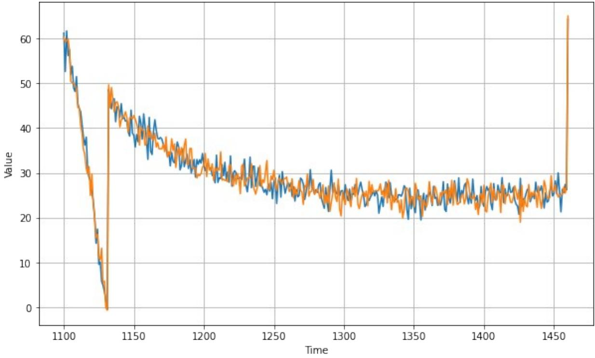
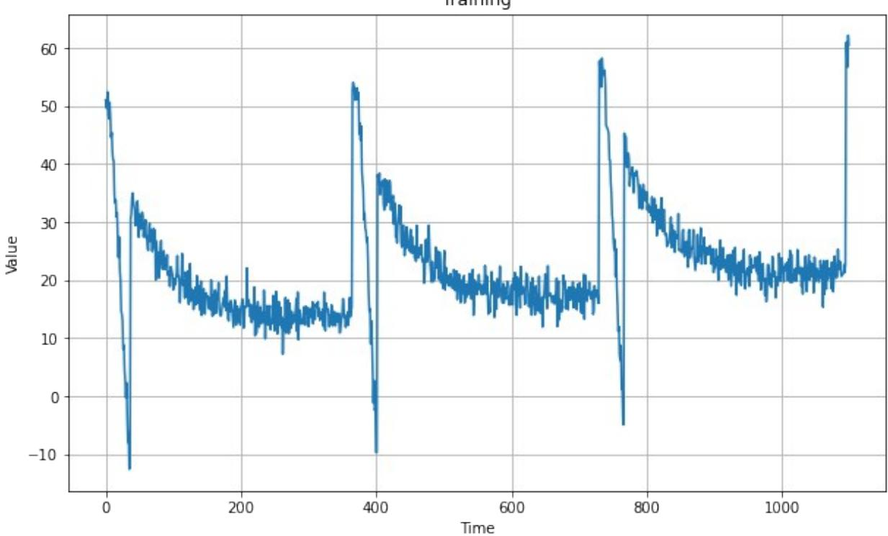
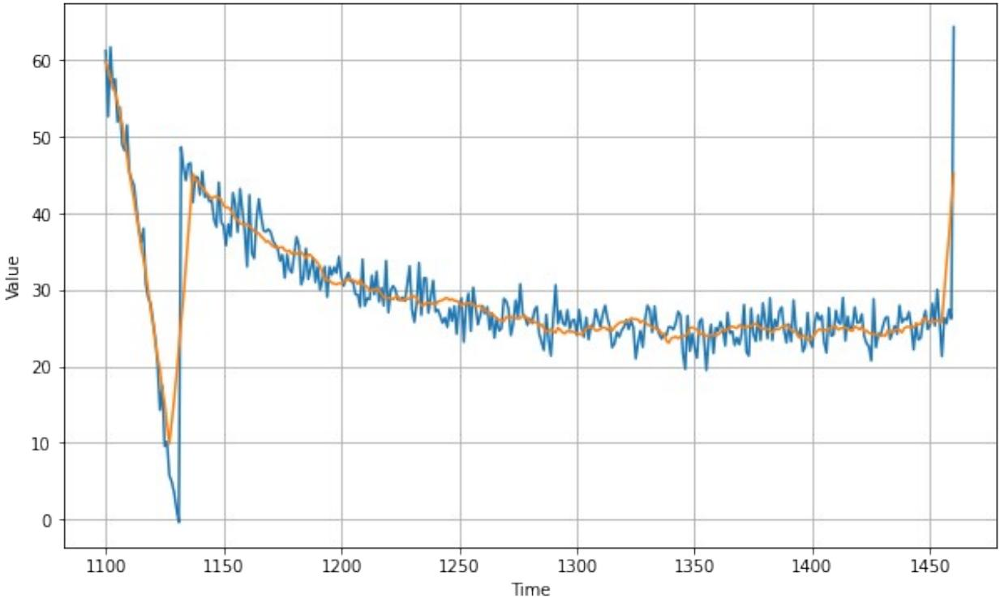
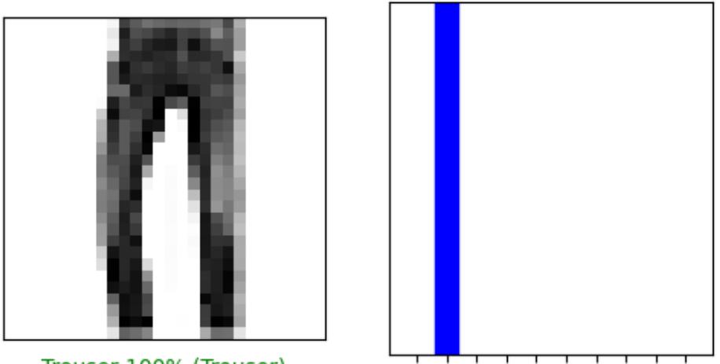
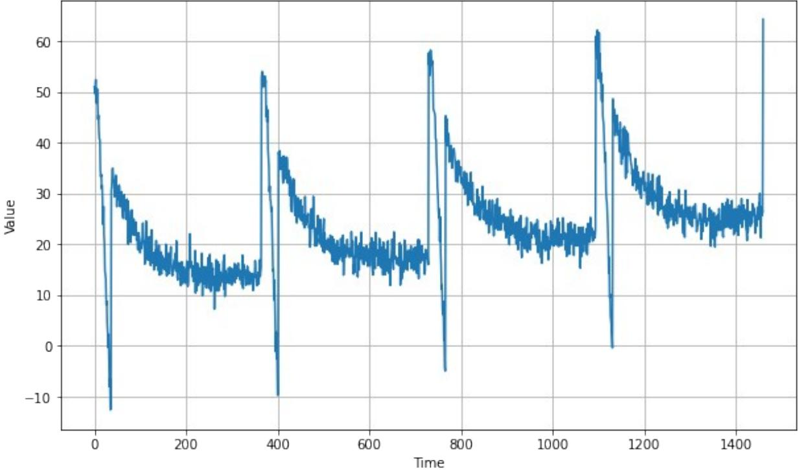
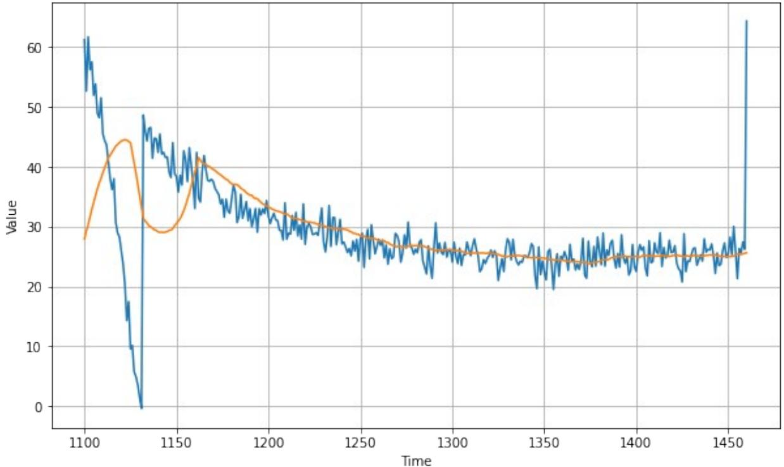
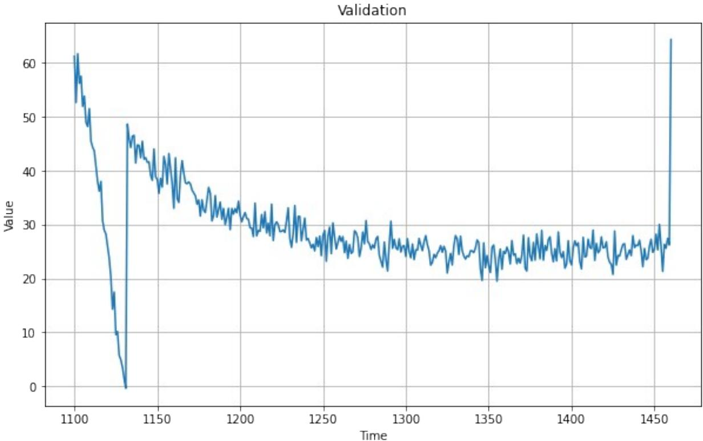

# Machine Learning and Data Science Portfolio
*Collection of projects and implementations from Bangkit Academy 2023*

## Repository Structure

### 1. Foundation Mathematics
Implementation of core mathematical concepts essential for machine learning:
- Linear Algebra: Vector spaces, transformations, eigenvalues
- Calculus: Gradient descent, backpropagation
- Probability & Statistics: Distributions, inference, hypothesis testing

### 2. Machine Learning Projects
#### Supervised Learning
- Housing Price Prediction (Linear Regression)
  
- University Admission Classification
- Additional classification projects

#### Unsupervised Learning
- Clustering Analysis
  
- Movie Recommender System (Collaborative Filtering)

#### Advanced Algorithms
- Neural Network Implementation
  
- Deep Learning Foundations

### 3. Deep Learning Projects
Practical implementations focusing on:
- Computer Vision Applications
  
- Natural Language Processing
  
- Time Series Analysis
  

### 4. Advanced TensorFlow
Production-ready implementations using:
- TensorFlow.js for browser deployment
- TensorFlow Lite for mobile applications
  
- Optimized data pipelines
- Advanced deployment scenarios

## Technical Stack
- **Core**: Python, TensorFlow, NumPy, Pandas
- **Visualization**: Matplotlib, Seaborn
- **Development**: Git, Unit Testing
- **Deployment**: TensorFlow Serving, TF.js, TF Lite

## Project Structure
Each implementation follows:
```
project/
├── src/
│   ├── core/       # Core algorithms
│   ├── data/       # Data handling
│   ├── training/   # Training loops
│   └── utils/      # Helper functions
├── tests/          # Unit tests
├── requirements.txt
└── README.md
```

## Links & Certificates
### 1. [Mathematics for ML and Data Science](https://www.coursera.org/specializations/mathematics-for-machine-learning-and-data-science)
- [Linear Algebra](https://coursera.org/share/48d8c2fa78e446e7b95f4b0c7dbc490d) 
- [Calculus](https://coursera.org/share/c3fcf27c5fe0a43da271e0919ce1dcc9)
- [Probability and Statistics](https://coursera.org/share/be92c381e5ad3a3f900ec25d8308ab7f)

### 2. [Google IT Automation with Python](https://www.coursera.org/professional-certificates/google-it-automation)
- [Crash Course on Python](https://www.coursera.org/account/accomplishments/verify/5NLSJ3LP64BJ?utm_source=link&utm_medium=certificate&utm_content=cert_image&utm_campaign=sharing_cta&utm_product=course)
- [Using Python to Interact with the Operating System](https://coursera.org/share/26631cb707cafb6013943fff26d24470)
- [Introduction to Git and GitHub](https://coursera.org/share/37bc5af5761c60b1507fbde466f2bfef)

### 3. [Google Data Analytics](https://www.coursera.org/specializations/google-data-analytics)
- [Ask Questions to Make Data-Driven Decisions](https://coursera.org/share/1bc734fd65a215694eec390ad5c990d0)
- [Prepare Data for Exploration](https://coursera.org/share/712d6522913b79a79cd34cf2936d8a79)
- [Process Data from Dirty to Clean](https://coursera.org/share/22c96b74fc0e88336a32726ac4973919)
- [Analyze Data to Answer Questions](https://coursera.org/share/072c2c442132923e0656df11ffe538c9)
- [Share Data Through the Art of Visualization](https://coursera.org/share/2163754b560efc6621240b8b3a4c1c31)
- [Data Analysis with R Programming](https://coursera.org/share/1d836bb4b1511744eeb6f383ebeed4c0)
- [Google Data Analytics Capstone](https://coursera.org/share/83e721f04d7770cb80bf71910bd4b316)

### 4. [Machine Learning Specialization](https://www.coursera.org/specializations/machine-learning-introduction)
- [Supervised Machine Learning: Regression & Classification](https://coursera.org/share/bf4f171a435a65967f210c70a1803575)
- [Advanced Learning Algorithms](https://coursera.org/share/f628df67e277143aa033b3d229c98e76)
- [Unsupervised Learning, Recommenders, Reinforcement Learning](https://coursera.org/share/ae3a3feb59960a9ba2d3ab880b1fb073)


### 5. [DeepLearning.AI TensorFlow Developer](https://www.coursera.org/specializations/tensorflow-in-practice)
- [Introduction to TensorFlow for Artificil Intelligence, Machine Learning, and Deep learning](https://coursera.org/share/950244b3d15319b4fec4928fa60fcb1a)
- [Convolutional Neural Networks in TensorFlow](https://coursera.org/share/1cfb5a35414f51f69f36db2362e4d3df)
- [Natural Language Processing in TensorFlow](https://coursera.org/share/f7f46b2299600ba003a4f34a1a51333a)
- [Sequences, Time Series and Prediction](https://coursera.org/share/910f296a706d92132be77ed11cfbd993)

### 6. [TensorFlow: Data and Deployment](https://www.coursera.org/specializations/tensorflow-data-and-deployment)
- [Browser-based Models with TensorFlow.js](https://www.coursera.org/account/accomplishments/certificate/6KHD5UP9V3GZ)
- [Device-based Models with TensorFlow Lite](https://www.coursera.org/account/accomplishments/certificate/9PP6ZX5NLB5A)
- [Data Pipelines with TensorFlow Data Services](https://www.coursera.org/account/accomplishments/certificate/P85F6WQVJSAX)
- [Advanced Deployment Scenarios with TensorFlow](https://www.coursera.org/account/accomplishments/certificate/T5A47V9G5MCX)